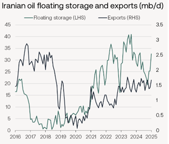
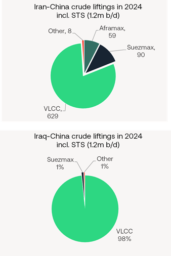
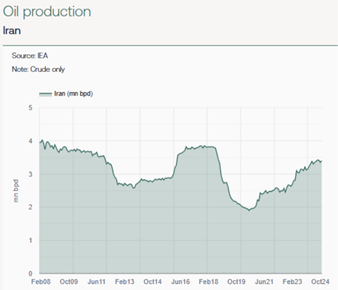

# The Big Picture: Maximum uncertainty

**Date:** February 10, 2025  
**Publisher:** Breakwave Advisors | **Category:** Market Insights  
**Original URL:** [https://www.breakwaveadvisors.com/insights/2025/2/10/the-big-picture-maximum-uncertainty](https://www.breakwaveadvisors.com/insights/2025/2/10/the-big-picture-maximum-uncertainty)  

---

### What Could Happen to Iran’s Exports?

Trump said this week that he wants to make a deal with Iran rather than return to his policy of ‘maximum pressure’. Maximum pressure aims to restrict Iran’s oil exports. Combined with the threat of tariffs on China, it could succeed. A deal, on the other hand, could boost Iran’s oil exports and deliver its massive shadow fleet to the scrap yard. Which scenario would be better for tanker demand?

> **Figure 1: F3f1 Image 0 1738949748957**  
> [Local Asset](file:///C:/Users/Dell/Github/Shipping/corpus/03-breakwave/insights/2025/assets/2025-02-10_the-big-picture-maximum-uncertainty_img_f3f1-image-0-1738949748957_902b3eb5dc2d.png)

### If Iran’s Crude Exports Drop to Zero…

A combination of lower Chinese crude imports in January, and a sharp fall in Chinese crude stocks suggest US sanctions on Iranian and Russian oil trade are having the intended effect. China’s crude imports from Russia dropped 200k b/d in January. Crude imports from Iran fell 400k b/d. Vortexa data suggests China drew heavily on its crude stocks in January, cutting them by half between late December 2024 and late January 2025 (they have since recovered slightly). This has left Iranian crude to build up in floating storage, mostly off Malaysia (see chart). Operating rates at Chinese teapot refineries, which were already battling weak domestic demand before sanctions lifted freight costs, have now dropped to levels last seen at the start of the pandemic, according to MySteel OilChem.

It is feasible, therefore, that Iran’s crude exports could, for a short while at least, drop to zero. The replacement of about 1.1m b/d (2024 average) of Chinese crude imports from Iran with compliant exports would shift demand back to the compliant fleet. Very few of the 126 VLCCs currently involved in Iran’s crude trade to China will be lifting the cargoes that China finds to substitute lost Iranian barrels. 57% of those vessels are already subject to OFAC sanctions - and the list is growing rapidly. Just yesterday OFAC added another two VLCCs and two Aframaxes that had been involved in transporting Iranian oil. All but one of remaining unsanctioned VLCCs are aged 17 or over.

Replacing all Iranian crude exports to China with barrels from elsewhere in the Middle East would make the trade more efficient – at a small cost to overall tanker demand. It would also take some demand away from the Aframaxes and Suezmaxes used in the last leg of the Iran’s crude movement, typically between Malaysia and China. To perform the multiple voyage legs required to get its crude into China in 2024, Iran employed 126 different VLCCs, 25 different Suezmaxes and 21 different Aframax/LRs. A similar volume of Iraqi crude - as an example of a compliant exporter - moving into China was shared between 169 different VLCCs but just 4 Suezmaxes. The average round voyage to move Iraqi crude to China was 32 days, compared to 38 days for Iranian crude. In 2024, Iranian crude exports to China provided 800 individual liftings (629 VLCC; 90 Suezmax; 59 Aframax/LR2), compared to 360 liftings (354 VLCC; 4 Suezmax) to move roughly the same volume of oil to China from Iraq. Around two-thirds of oil cargoes shipped from Iran to China involved one or more ship-to-ship transfers in the Mideast Gulf and/or offshore Singapore and Malaysia.

But the loss in utilisation for smaller ships would be a small price to pay for the additional demand for compliant VLCCs. Only a handful of the 126 different VLCCs 17 years old or older (14% of the VLCC fleet) used in last year’s Iranian crude trade would find employment doing anything but floating storage if Iran’s exports were to dry up. This would reduce their useful capacity to move oil. They would be joined by a further 27 VLCCs that turn 17 this year, 37 VLCCs next year and 51 VLCCs in 2026 . This scenario would be strongly bullish for VLCCs. But of course, the longer the loss of Iranian exports is sustained, the tighter oil supply would become, leading to oil price volatility, and potentially slowing oil demand growth.

> **Figure 2: 86bc Image 1 1738949811416**  
> [Local Asset](file:///C:/Users/Dell/Github/Shipping/corpus/03-breakwave/insights/2025/assets/2025-02-10_the-big-picture-maximum-uncertainty_img_86bc-image-1-1738949811416_06d9c769162c.png)

### If No Change in Iran’s Crude Exports…

It is possible that a return to maximum pressure fails to reduce Iran’s crude exports as more workarounds are found. If China continues to welcome sanctioned tankers into their ports, Iranian oil will continue to flow. China is under pressure to bar sanctioned tankers in return for concessions on Trump’s tariffs, but it is by no means certain China will acquiesce to US demands – especially if Iran offers larger discounts to China’s teapot refiners. While the Chinese government would perhaps not mourn the loss of its heavily polluting independent refining sector, the teapots have shown uncanny ability to survive against the odds.

If Iranian flows revert to 2024 levels, the trade will continue to allow the massive shadow tanker fleet to compete with the compliant fleet. It is also likely to continue providing a home for vessels that are getting too old for compliant trades. Last year, despite a fall in Iranian floating storage and broadly flat exports, Iran absorbed an additional 30 VLCCs that would otherwise have been destined for the beach at over 17 years old. This is clearly not in the best interest of compliant VLCC owners.

### If Iran Increases Crude Exports…

Trump will drop his policy of maximum pressure once he feels Iran has been, or has committed to become, de-fanged. Trump is targeting not just Iran’s nuclear ambitions, but also its ballistic and conventional weaponry. His goal is a new deal to replace the one he pulled the US out of during his first term. Iranian politicians, humbled perhaps by the recent collapse of the country’s ‘axis of resistance’, have signalled some willingness to talk. If a deal can be struck soon, VLCCs would benefit from a shift away from the shadow fleet as Iran emerges from the shadows. Furthermore, they would gain from planned increases in exports as Iran slowly ramps up its crude production. Iran pumped roughly 3.2 m b/d of crude and condensates in November. It aims to raise that by 200k b/d in March this year, and another 400k b/d next year, assuming of course it can find the buyers.

> **Figure 3: A44b Image 2 1738949896413**  
> [Local Asset](file:///C:/Users/Dell/Github/Shipping/corpus/03-breakwave/insights/2025/assets/2025-02-10_the-big-picture-maximum-uncertainty_img_a44b-image-2-1738949896413_ff20581299de.png)

---

**Tags:** Crude, Shipping, Markets  
