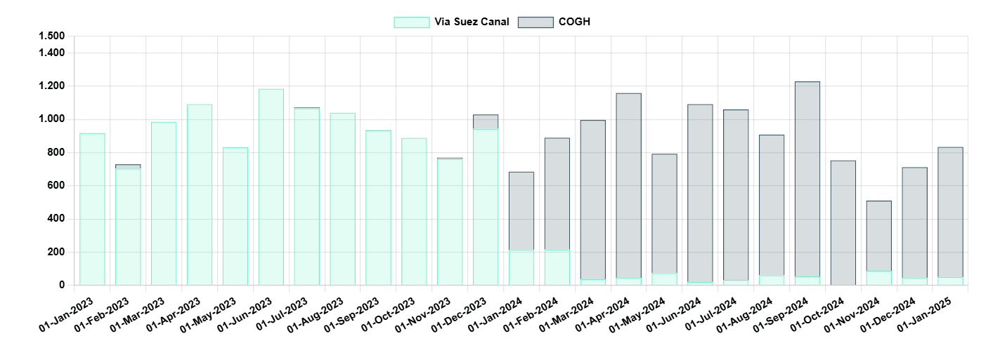

# White House in Spotlight… Again

**Date:** February 10, 2025  
**Publisher:** Breakwave Advisors | **Category:** Market Insights  
**Original URL:** [https://www.breakwaveadvisors.com/insights/2025/2/10/white-house-in-spotlight-again](https://www.breakwaveadvisors.com/insights/2025/2/10/white-house-in-spotlight-again)  

---

> **Figure 1: Tankers Secondary**  
> **Interactive Data & Source:** [Gibsons Co](https://www.gibsons.co.uk/market-reports) | [Local Asset](file:///C:/Users/Dell/Github/Shipping/corpus/03-breakwave/insights/2025/assets/2025-02-10_white-house-in-spotlight-again_img_tankers-secondary_0d029e248e3f.jpg)

It has been another turbulent week in the oil and tanker markets. Whilst U.S. tariffs on Canada and Mexico were postponed for a month, the 10% tariff on all Chinese products took effect on February 4, with Beijing swiftly retaliating, imposing a 10% tariff on U.S. crude exports and a 15% duty on LNG and coal exports starting February 10, whilst some other measures were also implemented. Later in the week, the market saw another executive order in which President Trump directed the imposition of “maximum economic pressure” on Iran, with the OFAC promptly releasing fresh sanctions, containing a list of individuals, companies and five tankers.

It remains to be seen whether a final deal with Canada and Mexico will be reached, but there is a lot at stake for the tanker markets. Canada exported over 4mbd of crude and 0.55 mbd of clean products to the US in 2024, while Mexico’s exports averaged 580 kbd of crude and 130 kbd of dirty products. If tariffs go ahead, with potential retaliatory actions likely in this scenario, tanker tonne mile demand growth and the potential drop in landlocked US refining runs are to be expected. For now, however, the uncertainty could prompt Mexico and Canada to diversify their crude exports, targeting Asian and European importers, with the Trans Mountain pipeline already looking at further expansion projects in the short and long term that could add up to 300 kbd of capacity to the TMX line.

The current standoff between the U.S. and China will have a limited direct impact on crude trade. China imported just 200 kbd from the U.S. last year and may seek to replace U.S. barrels with similar grades from West Africa, facilitated by the upcoming European maintenance season and the scheduled permanent closure of refining capacity. Yet, the bigger picture here is an extended trade war, with notable negative economic consequences both for the US and China.

While Trump’s directive to apply maximum pressure on Iran is likely still a work-in-progress, if actions succeed in reducing Iran’s crude exports to levels seen during his first presidency (estimated at around 400 kbd in 2020 compared to 1.6 mbd in 2024), it could provide another boost to the mainstream VLCC market, if China plays ball. A substantial portion of the dark/sanctioned fleet is at risk of being left unemployed, while China will also need to replace Iranian barrels from the non-sanctioned market.

President Trump’s latest declaration that the U.S. could “take over” the Gaza Strip and permanently displace its Palestinian population was immediately criticized in the Middle East. At this stage, the implications are unclear, with the impact on the Israel-Gaza ceasefire being the most critical factor. For tankers nothing has changed though, at least for now. Some companies are keen to resume transits, but firms remain cautious, monitoring shipping conditions and competitors. The potential resumption of Red Sea transits would only have a marginal impact on the crude tanker market. The biggest decline would likely be seen in Middle East VLCC trade to Europe, with more barrels being shipped on Suezmaxes via the Suez Canal. However, the anticipated decline in VLCC trade out of the Middle East could be more than offset by corresponding increases in crude trade to Asia. Suezmaxes could actually benefit modestly from a rising share of AG/Europe trade despite routing via the Suez. An element of support here could also come, if we see a substantial rebound in CPC shipments to Asia.

The impact on clean tankers is different. LR2 demand is the most vulnerable to the resumption of Red Sea transit, as approximately 62% of all barrels shipped in 2024 from the Midddle East Gulf/WCI to Europe were carried by this asset class and another 18% by cleaned-up Suezmaxes and VLCCs. The anticipated growth in Middle Eastern clean trade to Asia will aid the market; yet even assuming a net gain of around 200 kbd in AG-East trade this year, net LR2 demand could still decline by approximately 12% on an annualized basis if Red Sea traffic resumes.

With all this in mind, uncertainty remains the key factor in the tanker market, with a lot in the making that can significantly alter market dynamics. For now, though, the unclear path ahead is still offering a short-term upside risk to freight.

### Mideast Gulf/india to Europe Clean Trade (Kbd)

> **Figure 2: Στιγμιότυπο Οθόνης 2025 02 09 175632**  
> **Interactive Data & Source:** [Gibsons Co](https://www.gibsons.co.uk/market-reports) | [Local Asset](file:///C:/Users/Dell/Github/Shipping/corpus/03-breakwave/insights/2025/assets/2025-02-10_white-house-in-spotlight-again_img_cea3cf84ceb9ceb3cebcceb9cf8ccf84cf85_a82fbde6df48.png)

Data source:[Gibson Shipbrokers](https://www.gibsons.co.uk/market-reports)

---

**Tags:** Tankers, Shipping, Crude  
