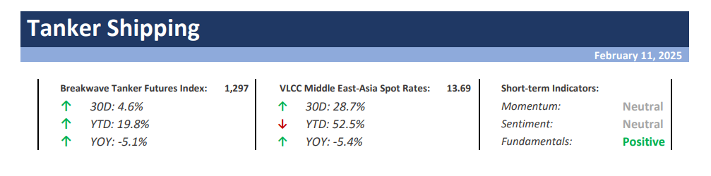
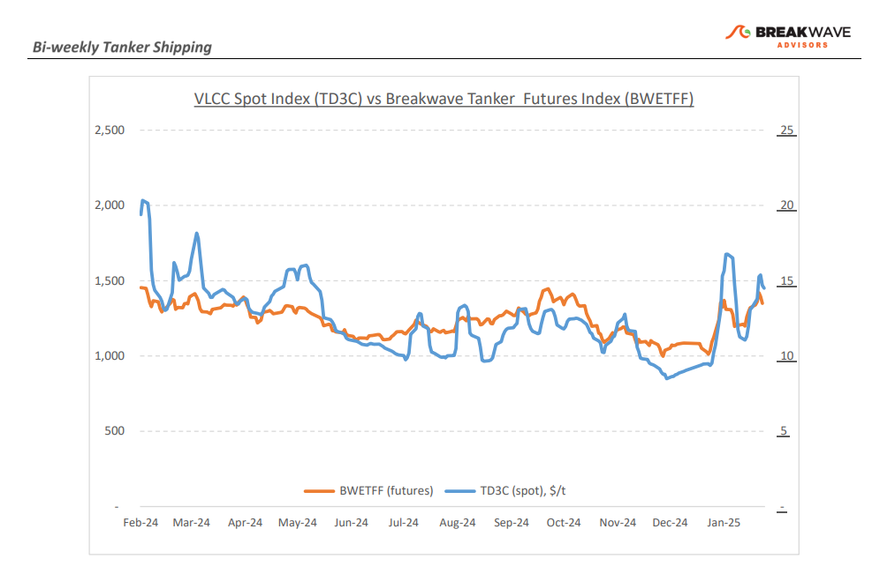
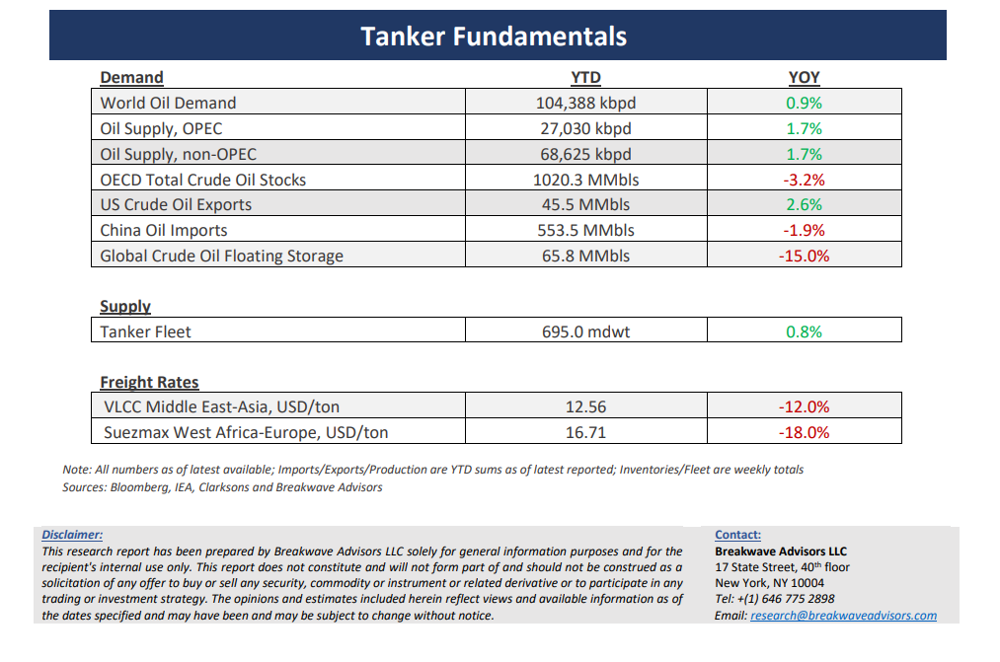

# Breakwave Bi-Weekly Tanker Report - February 11, 2025

**Date:** February 11, 2025  
**Publisher:** Breakwave Advisors | **Category:** Market Insights  
**Original URL:** [https://www.breakwaveadvisors.com/insights/2025211wet-kjij788](https://www.breakwaveadvisors.com/insights/2025211wet-kjij788)  

---

> **Figure 1: Cea3cf84ceb9ceb3cebcceb9cf8ccf84cf85**  
> [Local Asset](file:///C:/Users/Dell/Github/Shipping/corpus/03-breakwave/insights/2025/assets/2025-02-11_2025211wet-kjij788_img_cea3cf84ceb9ceb3cebcceb9cf8ccf84cf85_55beaa8ed9cf.png)

**·****VLCC Market Faces Pressure as Rates Soften Amid Limited Activity and Shifting Trade Flows**– The Very Large Crude Carrier (VLCC) market in the Arabian Gulf (AG) experienced a subdued second week of February, resulting in a softening of rates. With the arrival of the Year of the Snake and the return of Asian charterers to their desks, market expectations for a surge in activity failed to materialize, placing renewed downward pressure on rates. Uncertainty surrounding cargo volumes persists, and the sustainability of current rate levels in the coming weeks will largely depend on the emergence of fresh demand. In the Atlantic, a similar downward trend is unfolding amid limited fixture activity: The commencement of the March program has increased tonnage availability, providing charterers with greater options and further exerting pressure on rates. Market participants are closely monitoring U.S. crude exports and West African loadings to assess whether potential shifts in trade flows could offer support. Yet, a key development in recent weeks has been the impact of U.S. trade policies. The implementation of tariffs on Chinese goods, coupled with China’s retaliatory tariffs on U.S. oil, has greatly influenced market sentiment. However, the extent to which these measures are currently affecting U.S. crude oil exports to China remains debatable. Overall, evolving trade patterns driven by the increasingly assertive U.S. trade policies, combined with sanctions imposed on two major oil-exporting nations—Russia and Iran—have the potential to significantly influence tanker rates. Still, the magnitude and pace of these adjustments within the energy markets remain uncertain, especially given the significant volatility in trade policies so far by the new US administration.

**· Trade Wars Reshape the Oil Market while New Sanctions Will Reshape Trade Routes**– The tanker market is once again contending with a dual challenge on the demand front. First, the introduction of tariffs on various goods from multiple countries has raised concerns over crude flows, as global refineries are optimized for processing specific crude grades, making substitution more complex than initially anticipated. Second, any potential crude substitution is reshaping existing trade routes, creating uncertainty regarding tonne-mile demand, as the volume and destination of crude shipments remain unclear. Additionally, OPEC+ production targets add another layer of uncertainty, particularly as Chinese demand remains subdued while supply disruption risks are at an all-time high. With headlines surrounding tariffs and sanctions evolving rapidly, uncertainty remains the defining characteristic of the broader oil market. While traditional supply and demand models continue to play a crucial role in long-term market rebalancing, in the near term, it is the fluid and dynamic nature of government policies that will dictate prices, spreads, and relative energy costs worldwide.

**· Our Long-term View –**The tanker market is recovering from a long period of staggered rates as the growth in new vessel supply shrinks while oil demand remains elevated in line with the global economy. A historically low orderbook combined with favorable shifting trade patterns should continue to support increased spot rate volatility, which combined with the ongoing geopolitical turmoil, should sustain freight rates in the medium to long term.

> **Figure 2: Cea3cf84ceb9ceb3cebcceb9cf8ccf84cf85**  
> [Local Asset](file:///C:/Users/Dell/Github/Shipping/corpus/03-breakwave/insights/2025/assets/2025-02-11_2025211wet-kjij788_img_cea3cf84ceb9ceb3cebcceb9cf8ccf84cf85_44c257f522c9.png)

> **Figure 3: Cea3cf84ceb9ceb3cebcceb9cf8ccf84cf85**  
> [Local Asset](file:///C:/Users/Dell/Github/Shipping/corpus/03-breakwave/insights/2025/assets/2025-02-11_2025211wet-kjij788_img_cea3cf84ceb9ceb3cebcceb9cf8ccf84cf85_a7aac55b94eb.png)

### Subscribe:
