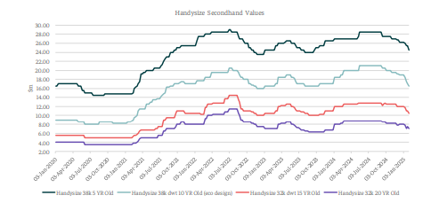
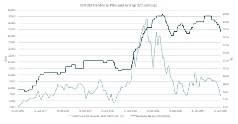

# Geopolitical Uncertainty

**Date:** February 12, 2025  
**Publisher:** Breakwave Advisors | **Category:** Market Insights  
**Original URL:** [https://www.breakwaveadvisors.com/insights/2025/2/12/geopolitical-uncertainty](https://www.breakwaveadvisors.com/insights/2025/2/12/geopolitical-uncertainty)  

---

*By*[*Yiannis Parganas*](https://www.linkedin.com/in/yiannis-p-36a2141a7/)

In recent years, geopolitical uncertainty has been a defining characteristic of the global landscape. The recent election of the U.S. President has been followed by numerous announcements regarding tariffs, including the latest imposition of a 25% tax on all steel and aluminum imports into the country, further exacerbating this uncertainty. Historically, geopolitical tensions have had a positive impact on the dry bulk market; however, the current freight market environment remains lackluster, reminiscent of the conditions observed during the 2016-2017 period. Nevertheless, in terms of asset values, there remains a notable discrepancy between these periods, as the current secondhand bulk carrier asset values are at higher levels compared to those recorded in 2016- 2017.

Analyzing the Handysize sector, vessel prices have experienced a consistent decline since the beginning of the year, with a similarly pronounced year-on-year (y-o-y) decrease. Specifically, year-todate (YTD) declines for 5-year, 10-year, 15-year, and 20-year-old Handysize vessels stand at -2.9%, -10.5%, -8.3%, and -6.3%, respectively. The y-o-y reductions are also notable, recorded at - 5.5%, -8.1%, -8.3%, and -6.2%, respectively.

The prevailing freight market conditions are driving further downward price adjustments, creating opportunities for investors seeking to capitalize on the declining asset values. However, despite this downward momentum, secondhand prices remain significantly higher compared to previous periods with similar freight market conditions.

For instance, the average price of a 5-year-old Handysize vessel currently stands at $24.5 million (indicative value), as illustrated in the chart below. This price remains notably higher than its historical levels in 2016 and 2017. To better understand this discrepancy, comparing current valuations with past periods when the HS7TC index was at similar levels suggests that there is still room for further price corrections. However, our estimates indicate that prices are unlikely to return to the levels observed in 2016 and 2017.

Specifically, in late November 2016, the HS7TC index was approximately $7,000 per day, while a 5-year-old Handysize vessel was valued at $11.5 million. In comparison, today's price of $24.5 million reflects a +113% premium over the 2016 price. A similar trend was observed in mid-2017 when HS7TC earnings hovered around $7,000 per day, yet the price of a 5-year-old vessel was $13.5 million, meaning that today’s price is at an +88.8% premium compared to the 2017 price. More recently, at the end of July 2023, when the HS7TC index was at $7,167 per day, the price of a 5- year-old Handysize vessel was $24.5 million, which is in line with the current valuation.

> **Figure 1: Στιγμιότυπο Οθόνης 2025 02 12 113546**  
> **Interactive Data & Source:** [Intermodal](https://www.intermodal.gr/) | [Local Asset](file:///C:/Users/Dell/Github/Shipping/corpus/03-breakwave/insights/2025/assets/2025-02-12_geopolitical-uncertainty_img_cea3cf84ceb9ceb3cebcceb9cf8ccf84cf85_8ca92e71cfa5.png)

> **Figure 2: Στιγμιότυπο Οθόνης 2025 02 12 113558**  
> **Interactive Data & Source:** [Intermodal](https://www.intermodal.gr/) | [Local Asset](file:///C:/Users/Dell/Github/Shipping/corpus/03-breakwave/insights/2025/assets/2025-02-12_geopolitical-uncertainty_img_cea3cf84ceb9ceb3cebcceb9cf8ccf84cf85_9fb1674dd597.png)

The extent of the correction remains debatable, with a 20-25% decline being a more common scenario, given the liquidity that previous years provided to shipowners and the uncertain environment that could lead to both negative and also positive outcomes. What is certain, however, is that 2025 could prove to be a year of increased buyer interest, particularly for those looking to capitalize on the declining prices.

Data Source:[Intermodal](https://www.intermodal.gr/)

---

**Tags:** Shipping, Markets, Economy  
