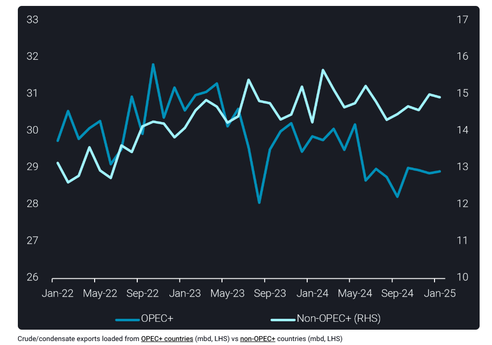
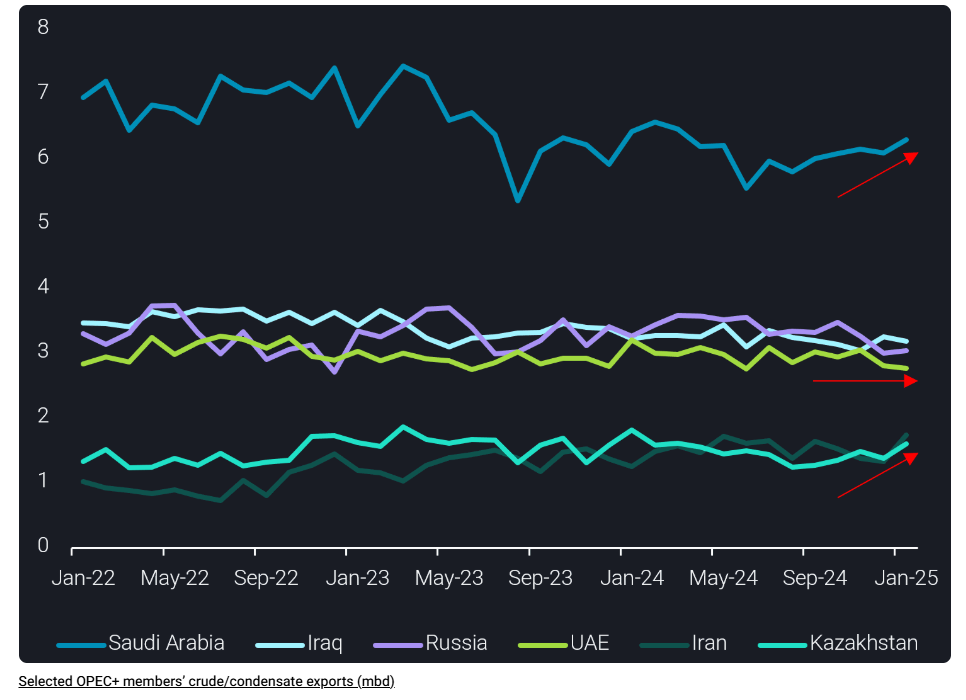

# OPEC+ crude exports rise in January while non-OPEC+ dips

**Date:** February 12, 2025  
**Publisher:** Breakwave Advisors | **Category:** Market Insights  
**Original URL:** [https://www.breakwaveadvisors.com/insights/2025/2/12/opec-crude-exports-rise-in-january-while-non-opec-dips](https://www.breakwaveadvisors.com/insights/2025/2/12/opec-crude-exports-rise-in-january-while-non-opec-dips)  

---

Global crude/condensate exports rose m-o-m in January as increases from OPEC+ more than offsetting those from nations outside the producer group. Within OPEC+, Saudi Arabia, Kazakhstan and Iran posted the largest increase in exports, the latter being a potentially a short-lived boost.

*By*[*Jay Maroo*](https://www.linkedin.com/in/jay-m-336a3633/)

Global crude/condensate exports started 2025 continuing the trend seen at the end of last year and ended January at 40.6mbd, the highest monthly level since May 2024. Unlike previous months, where non-OPEC+ producers added rising volumes to global supplies (see chart below), January saw combined OPEC+ exports rise m-o-m for the first time since October 2024.

> **Figure 1: Στιγμιότυπο Οθόνης 2025 02 12 115917**  
> **Interactive Data & Source:** [Vortexa](https://www.vortexa.com//oil-gas-data-traders-analysts-data-scientists?gclid=Cj0KCQjw8_qRBhCXARIsAE2AtRZKOvMnbilZ_6_91d7huSFFy71pWLrnPwGwOHVzXsmsG-1a1mZnQw8aAt89EALw_wcB&hsa_acc=1782073842&hsa_ad=548425387665&hsa_cam=14746637662&hsa_grp=125038601902&hsa_kw=&hsa_mt=&hsa_net=adwords&hsa_src=g&hsa_tgt=dsa-1431852288425&hsa_ver=3&utm_campaign=%5BCD%5D%20-%20DSA%20-%20EMEA&utm_medium=cpc&utm_medium=ppc&utm_source=google&utm_source=adwords&utm_term=) | [Local Asset](file:///C:/Users/Dell/Github/Shipping/corpus/03-breakwave/insights/2025/assets/2025-02-12_opec-crude-exports-rise-in-january-while-non-opec-dips_img_cea3cf84ceb9ceb3cebcceb9cf8ccf84cf85_1075d64d4d26.png)

The uptick in OPEC+ exports comes at a time where oil prices have shown higher volatility, both rising sharply and falling, with string of supply related uncertainties going forwards:

- Russia’s ability to continue exports at previous levels in the face of a wave of sanctions applied to the fleet transporting much of its oil
- Possibility of US tariffs on Canadian and Mexican crude, and any retaliatory tariffs from those nations
- Growing trade tensions with China and the potential for wider/deeper tariffs on the energy sector
- Announcements by the US Administration, underlining a strategy of “maximum pressure” to drive Iranian oil exports lower

Amidst these factors, at least in the short term, we have already seen some changes to normal export patterns, but there are also other more “normal” factors driving higher OPEC+ exports.

Total OPEC+ crude/condensate rose by 380kbd m-o-m in January with Iran adding a surprising 400kbd extra in exports. The push for higher Iranian exports is likely a pre-emptive move by Iran to increase waterborne supplies (where possible) to maximise short term sales. The rise in Iran’s exports is also consistent with builds in floating storage volumes seen near the end of January.

The other big contributors to higher OPEC+ exports in January are Saudi Arabia and Kazakhstan, each adding around 200kbd more vs December 2024. Saudi Arabia’s increase in exports follows the pattern of rising exports seen in previous months (see chart below). This steady rise is supported by scheduled refinery maintenance first at Yanbu towards late 2024, and then more recently Jizan. Meanwhile, growth in Kazakhstan’s crude exports is more structural, with a crude production expansion project at the flagship Tengiz field recently completed (Argus Media).

On the downside, lower m-o-m exports were posted by UAE, Iraq and Oman. Russian (excluding Kazakh origin) crude exports ended January with little change m-o-m, still holding at historically low on a seasonal basis. A material impact of the recent OFAC sanctions on tankers active in Russian trade was not seen in January, but this may become more prevalent in the coming weeks.

> **Figure 2: Στιγμιότυπο Οθόνης 2025 02 12 120015**  
> **Interactive Data & Source:** [Vortexa](https://www.vortexa.com//oil-gas-data-traders-analysts-data-scientists?gclid=Cj0KCQjw8_qRBhCXARIsAE2AtRZKOvMnbilZ_6_91d7huSFFy71pWLrnPwGwOHVzXsmsG-1a1mZnQw8aAt89EALw_wcB&hsa_acc=1782073842&hsa_ad=548425387665&hsa_cam=14746637662&hsa_grp=125038601902&hsa_kw=&hsa_mt=&hsa_net=adwords&hsa_src=g&hsa_tgt=dsa-1431852288425&hsa_ver=3&utm_campaign=%5BCD%5D%20-%20DSA%20-%20EMEA&utm_medium=cpc&utm_medium=ppc&utm_source=google&utm_source=adwords&utm_term=) | [Local Asset](file:///C:/Users/Dell/Github/Shipping/corpus/03-breakwave/insights/2025/assets/2025-02-12_opec-crude-exports-rise-in-january-while-non-opec-dips_img_cea3cf84ceb9ceb3cebcceb9cf8ccf84cf85_81296e61710e.png)

Away from OPEC+, the US and Guyana, each raised exports in January by around 120-140kbd. But sharper declines from Latin America producers (Brazil, Mexico) dragged the wider total lower. Though technically not part of OPEC+, January saw a very sharp rise in exports of (mostly Saudi) crude from Egypt, via the Sumed pipeline. Egypt’s exports grew by 340kbd m-o-m, the highest total since Feb 2024. These exports from Sumed storage were largely for the European market but may come under threat in March, from steep increases in Saudi OSPs.

Looking ahead, sour crude prices, be it from OPEC+ or non-OPEC+ are elevated in ways that would previously have been deemed unlikely. For example, recent strength in Norway’s Johan Sverdrup prices, means the grade is at a premium to WTI-delivered prices in Europe, this is despite the later crude being considerably lighter and sweeter. One way this could revert back is any ramp-up in US trade tensions with Canada/Mexico – this could stifle foreign crude imports by the US, restrict US exports and tighten light-sweet supplies.

Data Source:[Vortexa](https://www.vortexa.com//oil-gas-data-traders-analysts-data-scientists?gclid=Cj0KCQjw8_qRBhCXARIsAE2AtRZKOvMnbilZ_6_91d7huSFFy71pWLrnPwGwOHVzXsmsG-1a1mZnQw8aAt89EALw_wcB&hsa_acc=1782073842&hsa_ad=548425387665&hsa_cam=14746637662&hsa_grp=125038601902&hsa_kw=&hsa_mt=&hsa_net=adwords&hsa_src=g&hsa_tgt=dsa-1431852288425&hsa_ver=3&utm_campaign=%5BCD%5D%20-%20DSA%20-%20EMEA&utm_medium=cpc&utm_medium=ppc&utm_source=google&utm_source=adwords&utm_term=)

---

**Tags:** Crudeoil, Markets, Shipping  
