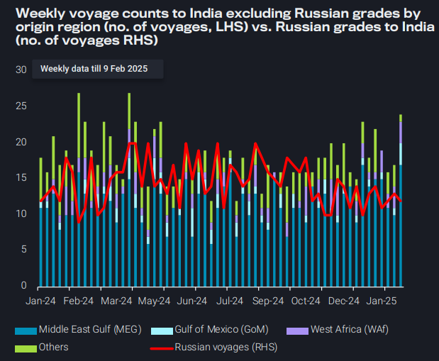
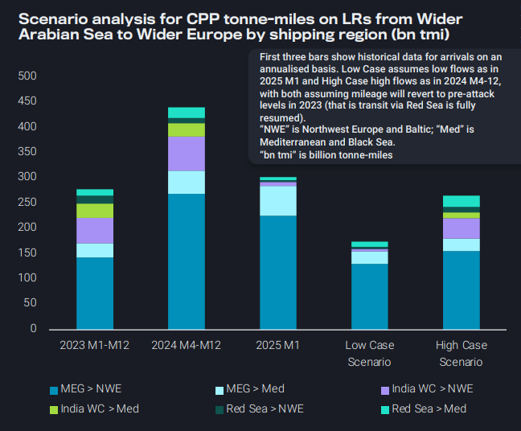
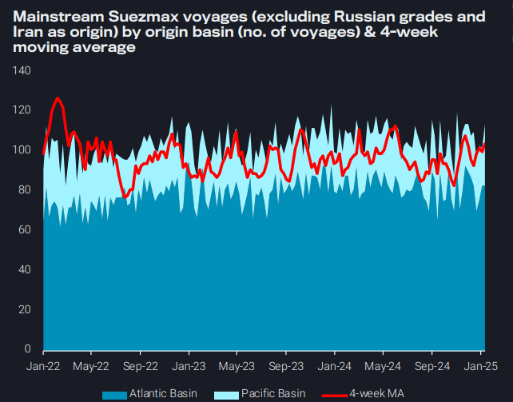
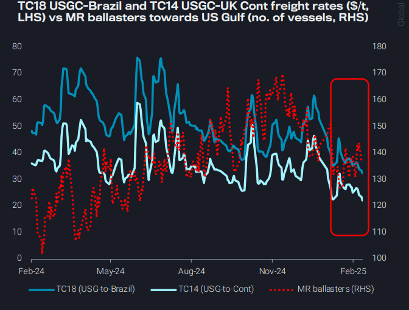

# East/West LR tonne-miles fall, further damage from Red Sea opening

**Date:** February 13, 2025  
**Publisher:** Breakwave Advisors | **Category:** Market Insights  
**Original URL:** [https://www.breakwaveadvisors.com/insights/2025/2/13/eastwest-lr-tonne-miles-fall-further-damage-from-red-sea-opening](https://www.breakwaveadvisors.com/insights/2025/2/13/eastwest-lr-tonne-miles-fall-further-damage-from-red-sea-opening)  

---

### Key Takeaways From This Report:

- **Dirty – East of Suez:**India diversifying its crude purchase to replace Russian barrels
- **Clean – East of Suez:**East/West LR tonne-miles fall to 2023 levels as Europe demand slows, further damage from Red Sea opening
- **Dirty – West of Suez:**Suezmax voyages remain strong on the aftermath of sanctions
- **Clean – West of Suez:**Ample MR availability in the US Gulf drives freight to lowest levels over the past 24-months

*By*[*Ioannis Papadimitriou*](https://www.linkedin.com/in/ipapadimitriou/)

## Dirty – East of Suez: India Diversifying Its Crude Purchase to Replace Russian Barrels

India is reducing Russian crude purchases in response to the latest OFAC sanctions

Weekly data shows a notable increase in crude import volumes from the Middle East, fueling firmer VLCC rates on Arabian Gulf–India routes. This spike could be driven by spot purchases following a recent announcement, reflecting responsive buying behavior

➔ The demand continues to support short-haul regional voyages, maintaining pressure on vessel availability

Indian refiners have increased crude purchases from the Gulf of Mexico, strengthening long-haul demand for Suezmax and VLCCs

➔ The rising volume of these longer-distance trades is contributing to tonne-mile growth

Market speculation suggests a shift towards higher crude purchases from West Africa. While not yet fully reflected in current data, early signs of a slight uptick in activity have emerged

➔ Although the increase is modest for now, it could lead to higher Suezmax demand, tightening vessel availability in the Atlantic Basin and placing upward pressure on regional freight rates

> **Figure 1: Στιγμιότυπο Οθόνης 2025 02 13 134545**  
> **Interactive Data & Source:** [Vortexa](https://www.vortexa.com//oil-gas-data-traders-analysts-data-scientists?gclid=Cj0KCQjw8_qRBhCXARIsAE2AtRZKOvMnbilZ_6_91d7huSFFy71pWLrnPwGwOHVzXsmsG-1a1mZnQw8aAt89EALw_wcB&hsa_acc=1782073842&hsa_ad=548425387665&hsa_cam=14746637662&hsa_grp=125038601902&hsa_kw=&hsa_mt=&hsa_net=adwords&hsa_src=g&hsa_tgt=dsa-1431852288425&hsa_ver=3&utm_campaign=%5BCD%5D%20-%20DSA%20-%20EMEA&utm_medium=cpc&utm_medium=ppc&utm_source=google&utm_source=adwords&utm_term=) | [Local Asset](file:///C:/Users/Dell/Github/Shipping/corpus/03-breakwave/insights/2025/assets/2025-02-13_eastwest-lr-tonne-miles-fall-further-damage-from-red-sea-opening_img_cea3cf84ceb9ceb3cebcceb9cf8ccf84cf85_24e9a3d8e0e7.png)

## Clean – East of Suez: East/west Lr Tonne-Miles Fall to 2023 Levels As Europe Demand Slows, Further Damage From Red Sea Opening

Loss in Europe-destined middle distillate flows from Wider Arabian Sea have started to pressurise East-to-West LR transits and tonne-mileage

➔ The loss in flows comes from supply constraints in the Red Sea, and India West Coast exports remaining in Pacific Basin as European CPP demand flatlines

East/West LR tonne-miles in Jan-25 have fallen close to 2023 levels, despite rerouting around the CoGH, due to materialised loss in tonnage

Greater loss in global LR tonne-miles would inevitably come with a full reopening of Red Sea transits, but offsetting partial damage requires rejuvenated European demand for middle distillates

➔ In Low Case, assuming sustained low East-West flows, expect a net loss of 266bn tmi (18% of global LR tmi based on annualised 2024 Q2-Q4 figure)

➔ In High Case, if flows recover to 2024 Q2-Q4 volumes, net loss softened to 175bn tmi (12% of global LR tmi)

As LR earnings are under mounting pressure, and with high LR2 deliveries this year, expect LRs to be incentivised to dirty up and enter crude/DPP trade for more profitable employment

> **Figure 2: Στιγμιότυπο Οθόνης 2025 02 13 135613**  
> **Interactive Data & Source:** [Vortexa](https://www.vortexa.com//oil-gas-data-traders-analysts-data-scientists?gclid=Cj0KCQjw8_qRBhCXARIsAE2AtRZKOvMnbilZ_6_91d7huSFFy71pWLrnPwGwOHVzXsmsG-1a1mZnQw8aAt89EALw_wcB&hsa_acc=1782073842&hsa_ad=548425387665&hsa_cam=14746637662&hsa_grp=125038601902&hsa_kw=&hsa_mt=&hsa_net=adwords&hsa_src=g&hsa_tgt=dsa-1431852288425&hsa_ver=3&utm_campaign=%5BCD%5D%20-%20DSA%20-%20EMEA&utm_medium=cpc&utm_medium=ppc&utm_source=google&utm_source=adwords&utm_term=) | [Local Asset](file:///C:/Users/Dell/Github/Shipping/corpus/03-breakwave/insights/2025/assets/2025-02-13_eastwest-lr-tonne-miles-fall-further-damage-from-red-sea-opening_img_cea3cf84ceb9ceb3cebcceb9cf8ccf84cf85_7ccbb24c867d.png)

## Dirty – West of Suez: Suezmax Voyages Remain Strong on the Aftermath of Sanctions

Suezmax global voyages remain robust on the back of developments in both the Atlantic and the Pacific Basin:

➔ Healthy exports from West Africa, predominantly to Europe, could be further supported by flows towards India as the nation seeks to procure non-Russian grades

➔ This has also triggered a ramp-up of Middle Eastern cargoes to India, onboard Suezmaxes, supporting further the demand of the vessel classes

➔ Strong STS activity offshore Brazil could hint at an increase in Brazilian exports in the near-term

The recent geopolitical developments (US sanctions on Russian-traded tankers and a prospective stop of Red Sea attacks) could result in bringing higher Suezmax utilisation from East of Suez-origins

➔ This will likely be predominantly flows from Middle East Gulf to India and Europe

➔ This could result in softer competition with Aframax tankers in the Atlantic

> **Figure 3: Στιγμιότυπο Οθόνης 2025 02 13 135905**  
> **Interactive Data & Source:** [Vortexa](https://www.vortexa.com//oil-gas-data-traders-analysts-data-scientists?gclid=Cj0KCQjw8_qRBhCXARIsAE2AtRZKOvMnbilZ_6_91d7huSFFy71pWLrnPwGwOHVzXsmsG-1a1mZnQw8aAt89EALw_wcB&hsa_acc=1782073842&hsa_ad=548425387665&hsa_cam=14746637662&hsa_grp=125038601902&hsa_kw=&hsa_mt=&hsa_net=adwords&hsa_src=g&hsa_tgt=dsa-1431852288425&hsa_ver=3&utm_campaign=%5BCD%5D%20-%20DSA%20-%20EMEA&utm_medium=cpc&utm_medium=ppc&utm_source=google&utm_source=adwords&utm_term=) | [Local Asset](file:///C:/Users/Dell/Github/Shipping/corpus/03-breakwave/insights/2025/assets/2025-02-13_eastwest-lr-tonne-miles-fall-further-damage-from-red-sea-opening_img_cea3cf84ceb9ceb3cebcceb9cf8ccf84cf85_cc6a8fad4323.png)

## Clean – West of Suez: Ample MR Availability in the Us Gulf Drives Freight to Lowest Levels Over the Past 24-Months

Relatively high MR availability out of the US Gulf Coast, has kept freight rates under pressure

➔ Especially TC18 (US Gulf to Brazil) and TC14 (US Gulf to Continent) rates have moved downwards since mid Dec-24

➔ These levels are the lowest seen over the past 24-months

➔ Ample ballast MR availability since August last year and remaining well above year-ago levels have kept rates suppressed

Preliminary Feb (days 1-8) data for US Gulf Coast Motor fuel exports indicate flows falling off sharply after reaching record highs in Dec-24

➔ Falling refinery utilisation driven by PADD 3 refinery turnarounds has pulled barrels away from export markets, especially curtailing flows to LatAm and Europe

➔ Sharp declines in European diesel imports from the USGC is another factor contributing to rising MR availability

Freight price rally which started early Dec-24 could not be sustained due to fall in exports; meanwhile as refineries gear up for spring maintenance, a rebound in freight prices could wait until the summer driving season

> **Figure 4: Στιγμιότυπο Οθόνης 2025 02 13 140059**  
> **Interactive Data & Source:** [Vortexa](https://www.vortexa.com//oil-gas-data-traders-analysts-data-scientists?gclid=Cj0KCQjw8_qRBhCXARIsAE2AtRZKOvMnbilZ_6_91d7huSFFy71pWLrnPwGwOHVzXsmsG-1a1mZnQw8aAt89EALw_wcB&hsa_acc=1782073842&hsa_ad=548425387665&hsa_cam=14746637662&hsa_grp=125038601902&hsa_kw=&hsa_mt=&hsa_net=adwords&hsa_src=g&hsa_tgt=dsa-1431852288425&hsa_ver=3&utm_campaign=%5BCD%5D%20-%20DSA%20-%20EMEA&utm_medium=cpc&utm_medium=ppc&utm_source=google&utm_source=adwords&utm_term=) | [Local Asset](file:///C:/Users/Dell/Github/Shipping/corpus/03-breakwave/insights/2025/assets/2025-02-13_eastwest-lr-tonne-miles-fall-further-damage-from-red-sea-opening_img_cea3cf84ceb9ceb3cebcceb9cf8ccf84cf85_84ccfcebef09.png)

Data Source:[Vortexa](https://www.vortexa.com//oil-gas-data-traders-analysts-data-scientists?gclid=Cj0KCQjw8_qRBhCXARIsAE2AtRZKOvMnbilZ_6_91d7huSFFy71pWLrnPwGwOHVzXsmsG-1a1mZnQw8aAt89EALw_wcB&hsa_acc=1782073842&hsa_ad=548425387665&hsa_cam=14746637662&hsa_grp=125038601902&hsa_kw=&hsa_mt=&hsa_net=adwords&hsa_src=g&hsa_tgt=dsa-1431852288425&hsa_ver=3&utm_campaign=%5BCD%5D%20-%20DSA%20-%20EMEA&utm_medium=cpc&utm_medium=ppc&utm_source=google&utm_source=adwords&utm_term=)

---

**Tags:** Crude, Markets, Shipping  
