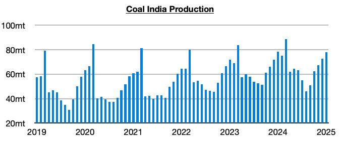
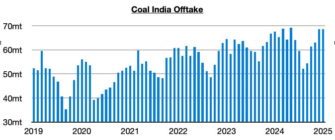
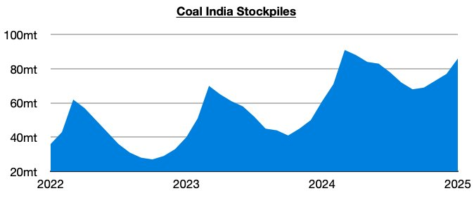

# Ongoing Growth in Coal India’s Stockpiles

**Date:** February 13, 2025  
**Publisher:** Breakwave Advisors | **Category:** Market Insights  
**Original URL:** [https://www.breakwaveadvisors.com/insights/2025/2/13/ongoing-growth-in-coal-indias-stockpiles](https://www.breakwaveadvisors.com/insights/2025/2/13/ongoing-growth-in-coal-indias-stockpiles)  

---

*By*[*Jeffrey Landsberg*](https://www.linkedin.com/in/jeffrey-landsberg-70ab957/)

As we discussed in Commodore Research's most recent Weekly Executive Report, Coal India produced approximately 77.8 million tons of coal last month. This marks a month-on-month increase of 5.4 million tons (8%) but a year-on-year decrease of 600,000 tons (-1%).

> **Figure 1: Chart 1**  
> [Local Asset](file:///C:/Users/Dell/Github/Shipping/corpus/03-breakwave/insights/2025/assets/2025-02-13_ongoing-growth-in-coal-indias-stockpiles_img_chart1_6af21904ffde.jpg)

Offtake (the amount sent to customers) totaled 68.6 million tons, which is unchanged from December and up year-on-year by 1 million tons (2%). Offtake has now come in less than production during each of the last four months. Prior to this period, offtake had exceeded production for six straight months.

> **Figure 2: Chart 2**  
> [Local Asset](file:///C:/Users/Dell/Github/Shipping/corpus/03-breakwave/insights/2025/assets/2025-02-13_ongoing-growth-in-coal-indias-stockpiles_img_chart2_118842e620df.jpg)

With offtake again coming in under production, Coal India’s stockpiles have climbed further. The stockpiles now stand at approximately 86 million tons, which marks the highest level seen since April.

> **Figure 3: Chart 3**  
> [Local Asset](file:///C:/Users/Dell/Github/Shipping/corpus/03-breakwave/insights/2025/assets/2025-02-13_ongoing-growth-in-coal-indias-stockpiles_img_chart3_6fba81e31d12.jpg)

---

**Tags:** Economy, Markets, Coal  
