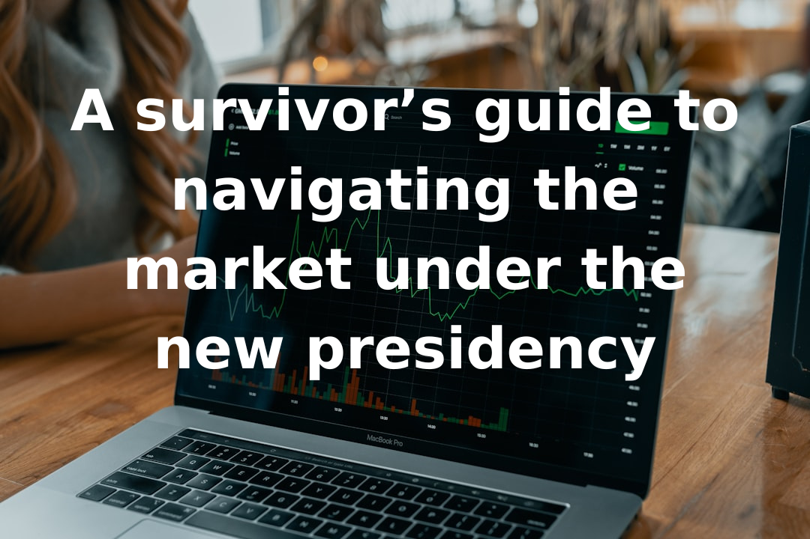

# Breakwave Weekend Read

**Date:** February 14, 2025  
**Publisher:** Breakwave Advisors | **Category:** Market Insights  
**Original URL:** [https://www.breakwaveadvisors.com/insights/2024/10/25/breakwave-weekend-read-4cn8n-wg9gj-jk5sb-4ckhh-cagw9-r4yzg-j3ggn-6nk48-jjh4c](https://www.breakwaveadvisors.com/insights/2024/10/25/breakwave-weekend-read-4cn8n-wg9gj-jk5sb-4ckhh-cagw9-r4yzg-j3ggn-6nk48-jjh4c)  

---

## Welcome Tobreakwave Advisorsweekend Read

As the week comes to a close, take a moment to review the key insights from the past few days. Missed something? We've gathered all the top insights for you to catch up at your convenience.

## Breakwave Shipping Report

**VLCC Market Faces Pressure as Rates Soften Amid Limited Activity and Shifting Trade Flows**– The Very Large Crude Carrier (VLCC) market in the Arabian Gulf (AG) experienced a subdued second week of February, resulting in a softening of rates.

[Read More](https://www.breakwaveadvisors.com/insights/2025211wet-kjij788)

> **Figure 1: Στιγμιότυπο Οθόνης 2025 02 11 132539**  
> **Interactive Data & Source:** [Breakwave Advisors Market Insights](https://www.breakwaveadvisors.com/insights/2025/2/10/white-house-in-spotlight-again) | [Local Asset](file:///C:/Users/Dell/Github/Shipping/corpus/03-breakwave/insights/2025/assets/2025-02-14_breakwave-weekend-read-4cn8n-wg9gj-jk5sb-4ckhh-cagw9-r4yzg-j3ggn-6nk48-jjh4c_img_cea3cf84ceb9ceb3cebcceb9cf8ccf84cf85_55beaa8ed9cf.png)

## White House in Spotlight… Again

> **Figure 2: Ανώνυμο Σχέδιο**  
> **Interactive Data & Source:** [Breakwave Advisors Market Insights](https://www.breakwaveadvisors.com/insights/2025/2/10/white-house-in-spotlight-again) | [Local Asset](file:///C:/Users/Dell/Github/Shipping/corpus/03-breakwave/insights/2025/assets/2025-02-14_breakwave-weekend-read-4cn8n-wg9gj-jk5sb-4ckhh-cagw9-r4yzg-j3ggn-6nk48-jjh4c_img_ce91cebdcf8ecebdcf85cebccebfcf83cf87_378384504c55.png)

It has been another turbulent week in the oil and tanker markets. Whilst U.S. tariffs on Canada and Mexico were postponed for a month...

[Read More](https://www.breakwaveadvisors.com/insights/2025/2/10/white-house-in-spotlight-again)

Gibson Tanker Market Report

## India’s Growing Role in International Trade

> **Figure 3: India’s Growing Role in International Trade**  
> **Interactive Data & Source:** [Breakwave Advisors Market Insights](https://www.breakwaveadvisors.com/insights/2025/2/10/indias-growing-role-in-international-trade) | [Local Asset](file:///C:/Users/Dell/Github/Shipping/corpus/03-breakwave/insights/2025/assets/2025-02-14_breakwave-weekend-read-4cn8n-wg9gj-jk5sb-4ckhh-cagw9-r4yzg-j3ggn-6nk48-jjh4c_img_indiae28099sgrowingroleininternation_ee3bd371f38b.png)

India’s growing role in international trade, combined with the resurgence of its manufacturing sector and steady export growth..

[Read More](https://www.breakwaveadvisors.com/insights/2025/2/10/indias-growing-role-in-international-trade)

Doric Weekly Market Insights

## The Big Picture: Maximum Uncertainty

> **Figure 4: Προσθέστε Επικεφαλίδα**  
> **Interactive Data & Source:** [Breakwave Advisors Market Insights](https://www.breakwaveadvisors.com/insights/2025/2/10/the-big-picture-maximum-uncertainty) | [Local Asset](file:///C:/Users/Dell/Github/Shipping/corpus/03-breakwave/insights/2025/assets/2025-02-14_breakwave-weekend-read-4cn8n-wg9gj-jk5sb-4ckhh-cagw9-r4yzg-j3ggn-6nk48-jjh4c_img_cea0cf81cebfcf83ceb8ceadcf83cf84ceb5_5ab760515561.png)

Trump said this week that he wants to make a deal with Iran rather than return to his policy of ‘maximum pressure’.

[Read More](https://www.breakwaveadvisors.com/insights/2025/2/10/the-big-picture-maximum-uncertainty)

Braemar Tankers Research Update

## A Survivor’s Guide to Navigating the Market Under the New Presidency

> **Figure 5: Ανώνυμο Σχέδιο (1)**  
> **Interactive Data & Source:** [Breakwave Advisors Market Insights](https://www.breakwaveadvisors.com/insights/2025/2/10/a-survivors-guide-to-navigating-the-market-under-the-new-presidency) | [Local Asset](file:///C:/Users/Dell/Github/Shipping/corpus/03-breakwave/insights/2025/assets/2025-02-14_breakwave-weekend-read-4cn8n-wg9gj-jk5sb-4ckhh-cagw9-r4yzg-j3ggn-6nk48-jjh4c_img_ce91cebdcf8ecebdcf85cebccebfcf83cf87_a426b1eecf7f.png)

The US president has certainly kept financial markets and business leaders on their toes in the past few weeks.

[Read More](https://www.breakwaveadvisors.com/insights/2025/2/10/a-survivors-guide-to-navigating-the-market-under-the-new-presidency)

Forvis Mazars Weekly Note

## Geopolitical Uncertainty

> **Figure 6: Προσθέστε Επικεφαλίδα (1)**  
> **Interactive Data & Source:** [Breakwave Advisors Market Insights](https://www.breakwaveadvisors.com/insights/2025/2/12/geopolitical-uncertainty) | [Local Asset](file:///C:/Users/Dell/Github/Shipping/corpus/03-breakwave/insights/2025/assets/2025-02-14_breakwave-weekend-read-4cn8n-wg9gj-jk5sb-4ckhh-cagw9-r4yzg-j3ggn-6nk48-jjh4c_img_cea0cf81cebfcf83ceb8ceadcf83cf84ceb5_5ea20575ee58.png)

In recent years, geopolitical uncertainty has been a defining characteristic of the global landscape.

[Read More](https://www.breakwaveadvisors.com/insights/2025/2/12/geopolitical-uncertainty)

Intermodal Weekly Market Report

## OPEC+ Crude Exports Rise in January While Non-Opec+ Dips

> **Figure 7: Ανώνυμο Σχέδιο (3)**  
> **Interactive Data & Source:** [Breakwave Advisors Market Insights](https://www.breakwaveadvisors.com/insights/2025/2/12/opec-crude-exports-rise-in-january-while-non-opec-dips) | [Local Asset](file:///C:/Users/Dell/Github/Shipping/corpus/03-breakwave/insights/2025/assets/2025-02-14_breakwave-weekend-read-4cn8n-wg9gj-jk5sb-4ckhh-cagw9-r4yzg-j3ggn-6nk48-jjh4c_img_ce91cebdcf8ecebdcf85cebccebfcf83cf87_7a38737cada1.png)

Global crude/condensate exports rose m-o-m in January as increases from OPEC+ more than offsetting those from nations outside the producer group.

Vortexa Freight Weekly

## Ongoing Growth in Coal India’s Stockpiles

> **Figure 8: Ongoing Growth in Coal India’s Stockpiles**  
> **Interactive Data & Source:** [Breakwave Advisors Market Insights](https://www.breakwaveadvisors.com/insights/2025/2/13/ongoing-growth-in-coal-indias-stockpiles) | [Local Asset](file:///C:/Users/Dell/Github/Shipping/corpus/03-breakwave/insights/2025/assets/2025-02-14_breakwave-weekend-read-4cn8n-wg9gj-jk5sb-4ckhh-cagw9-r4yzg-j3ggn-6nk48-jjh4c_img_ongoinggrowthincoalindiae28099sstock_a654f62a8195.png)

As we discussed in Commodore Research's most recent Weekly Executive Report, Coal India produced approximately 77.8 million tons of coal last month.

[Read More](https://www.breakwaveadvisors.com/insights/2025/2/13/ongoing-growth-in-coal-indias-stockpiles)

From Commodore's Weekly Dry Bulk Reports

## East/west Lr Tonne-Miles Fall, Further Damage From Red Sea Opening

> **Figure 9: Eastwest Lr Tonne Miles Fall, Further Damage From Red Sea Opening**  
> **Interactive Data & Source:** [Breakwave Advisors Market Insights](https://www.breakwaveadvisors.com/insights/2025/2/13/eastwest-lr-tonne-miles-fall-further-damage-from-red-sea-opening) | [Local Asset](file:///C:/Users/Dell/Github/Shipping/corpus/03-breakwave/insights/2025/assets/2025-02-14_breakwave-weekend-read-4cn8n-wg9gj-jk5sb-4ckhh-cagw9-r4yzg-j3ggn-6nk48-jjh4c_img_eastwestlrtonne-milesfall2cfurtherda_63183d50a85a.png)

India diversifying its crude purchase to replace Russian barrels

[Read More](https://www.breakwaveadvisors.com/insights/2025/2/13/eastwest-lr-tonne-miles-fall-further-damage-from-red-sea-opening)

Vortexa Global Freight Snapshot

## Post-Cny Seaborne Market Overview

> **Figure 10: Προσθέστε Επικεφαλίδα (2)**  
> **Interactive Data & Source:** [Breakwave Advisors Market Insights](https://www.breakwaveadvisors.com/insights/2025/2/14/post-cny-seaborne-market-overview) | [Local Asset](file:///C:/Users/Dell/Github/Shipping/corpus/03-breakwave/insights/2025/assets/2025-02-14_breakwave-weekend-read-4cn8n-wg9gj-jk5sb-4ckhh-cagw9-r4yzg-j3ggn-6nk48-jjh4c_img_cea0cf81cebfcf83ceb8ceadcf83cf84ceb5_d3d6102278fe.png)

In recent years, as Chinese players have become increasingly involved in both the shipping market and its downstream sectors, the impact of the Chinese New Year holiday on the shipping market has also grown in importance.

BRS Weekly Dry Bulk Newsletter

## Us Tariff Threat Looms Over Crude and Refined Product Flows

> **Figure 11: Ανώνυμο Σχέδιο (4)**  
> **Interactive Data & Source:** [Breakwave Advisors Market Insights](https://www.breakwaveadvisors.com/insights/2025/2/14/us-tariff-threat-looms-over-crude-and-refined-product-flows) | [Local Asset](file:///C:/Users/Dell/Github/Shipping/corpus/03-breakwave/insights/2025/assets/2025-02-14_breakwave-weekend-read-4cn8n-wg9gj-jk5sb-4ckhh-cagw9-r4yzg-j3ggn-6nk48-jjh4c_img_ce91cebdcf8ecebdcf85cebccebfcf83cf87_15ba4efaf585.png)

A change of administration in the US earlier this year has led to uncertainty around crude and product flows between the US and its neighbors Canada and Mexico along with China which we take a look at in this blog

[Read More](https://www.breakwaveadvisors.com/insights/2025/2/14/us-tariff-threat-looms-over-crude-and-refined-product-flows)

Vortexa Freight Weekly

## Dirty Oil Supply

> **Figure 12: Ανώνυμο Σχέδιο (5)**  
> **Interactive Data & Source:** [Breakwave Advisors Market Insights](https://www.breakwaveadvisors.com/insights/2025/2/14/dirty-oil-supply) | [Local Asset](file:///C:/Users/Dell/Github/Shipping/corpus/03-breakwave/insights/2025/assets/2025-02-14_breakwave-weekend-read-4cn8n-wg9gj-jk5sb-4ckhh-cagw9-r4yzg-j3ggn-6nk48-jjh4c_img_ce91cebdcf8ecebdcf85cebccebfcf83cf87_bc3f0f8049dd.png)

By early 2025, net supply has declined significantly from the peaks seen in 2023 and early 2024, reinforcing the inverse correlation between supply levels and TD3 rates.

[Read More](https://www.breakwaveadvisors.com/insights/2025/2/14/dirty-oil-supply)

Signal Ocean Tanker Weekly Market Monitor

---

**Tags:** Shipping, Tankers, Drybulk  
