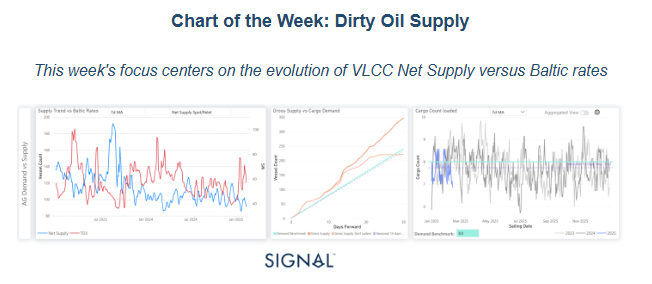
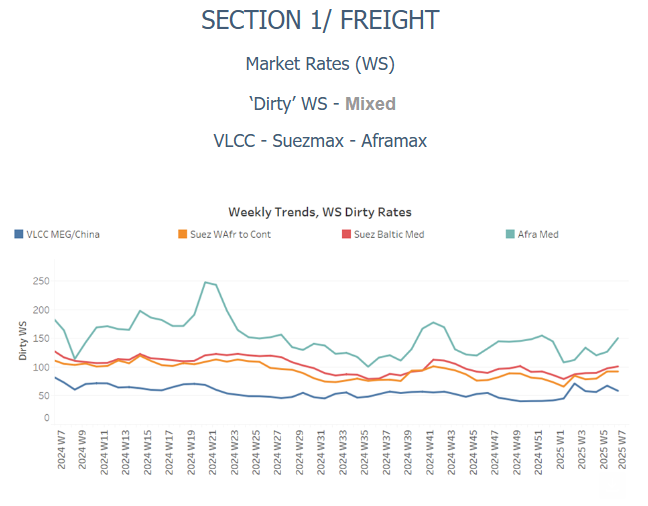
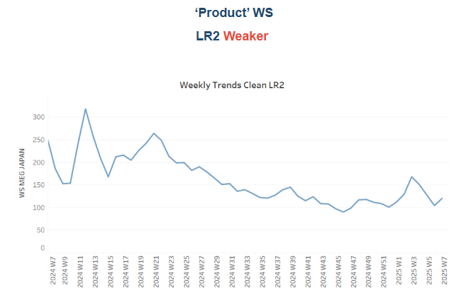
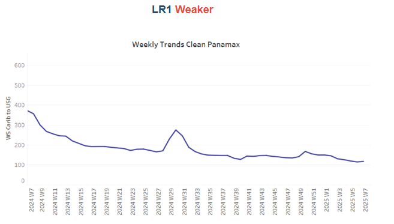
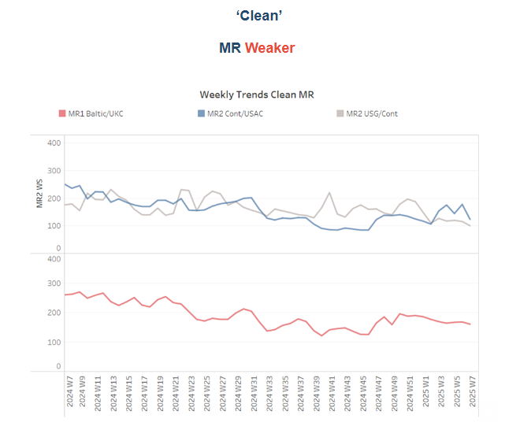
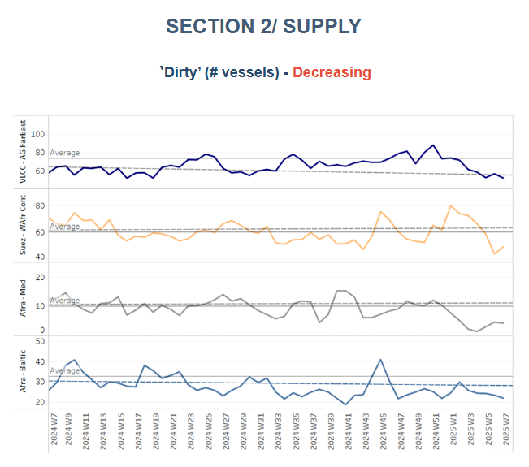
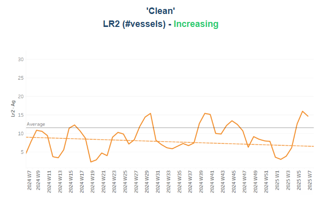
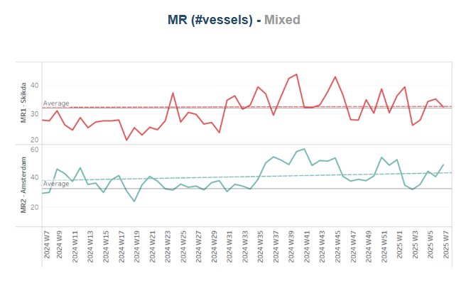
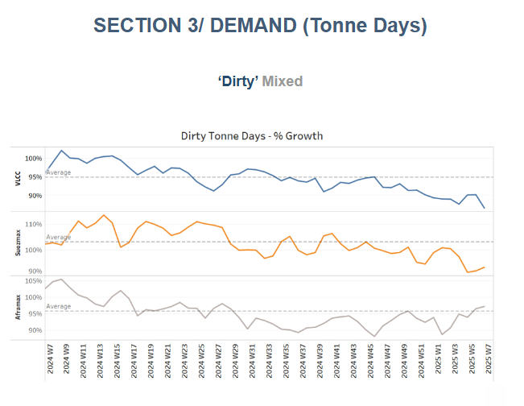
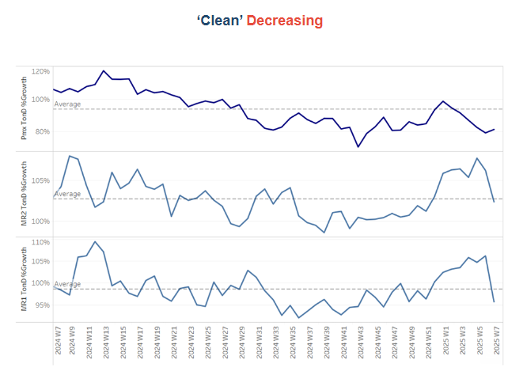

# Dirty Oil Supply

**Date:** February 14, 2025  
**Publisher:** Breakwave Advisors | **Category:** Market Insights  
**Original URL:** [https://www.breakwaveadvisors.com/insights/2025/2/14/dirty-oil-supply](https://www.breakwaveadvisors.com/insights/2025/2/14/dirty-oil-supply)  

---

### Tanker - Weekly Market Monitor

Snapshot of Crude and Product Freight Rates, Supply-Demand

Week 07, February 14, 2025

> **Figure 1: Στιγμιότυπο Οθόνης 2025 02 14 162722**  
> **Interactive Data & Source:** [Signal Ocean Platform](https://www.thesignalgroup.com/signal-ocean-platform) | [Local Asset](file:///C:/Users/Dell/Github/Shipping/corpus/03-breakwave/insights/2025/assets/2025-02-14_dirty-oil-supply_img_cea3cf84ceb9ceb3cebcceb9cf8ccf84cf85_9c204625f305.png)

By early 2025, net supply has declined significantly from the peaks seen in 2023 and early 2024, reinforcing the inverse correlation between supply levels and TD3 rates. The sharp drop in net supply has driven a notable spike in TD3 rates, validating the fundamental supply-demand pricing mechanism in the VLCC market. A major supply peak in mid-2023 (~180 vessels) led to subdued TD3 rates, but recent volatility in Baltic TD3 rates suggests a strengthening trend, particularly if crude oil demand remains resilient. With net supply tightening, demand-side factors—such as refinery restocking and increased Chinese crude imports—could further support rates through Q1 2025.

The macroeconomic landscape remains mixed, with the US energy market influenced by OPEC policy, Federal Reserve rate decisions, and China’s economic trajectory. If the Fed maintains high interest rates, weaker refinery margins and lower discretionary fuel consumption could limit oil demand, capping the tanker market upside. However, a softening inflation environment would support crude demand, bolstering VLCC rates and increasing cargo volumes. China remains a critical demand driver in 2025, with crude import growth influenced by strategic stockpiling, industrial expansion, and refinery throughput. The IEA forecasts global oil demand growth at 1.1 mb/d in 2025, up from 870 kb/d in 2024, with China leading the way—albeit at a slower pace—while India and other emerging Asian markets gain influence. With net supply approaching multi-year lows and TD3 rates showing positive momentum, the VLCC market is entering a pivotal phase. If supply constraints persist and demand remains strong, freight rates could continue rising through Q1 2025. However, macroeconomic uncertainties—including shifts in Federal Reserve policy and geopolitical risks—will play a key role in shaping the long-term rate outlook.
​​​​​​

> **Figure 2: Στιγμιότυπο Οθόνης 2025 02 14 162834**  
> **Interactive Data & Source:** [Signal Ocean Platform](https://www.thesignalgroup.com/signal-ocean-platform) | [Local Asset](file:///C:/Users/Dell/Github/Shipping/corpus/03-breakwave/insights/2025/assets/2025-02-14_dirty-oil-supply_img_cea3cf84ceb9ceb3cebcceb9cf8ccf84cf85_4e954e8aa0a0.png)

​​​​​Sentiment in the**dirty freight market**remains**mixed**, with**VLCC MEG/China routes attempting to establish firmer momentum**, driven by tightening vessel supply and fluctuating demand.

- VLCC freight rates for**MEG-China**routes stood at WS60, marking a 13% weekly decrease. Suezmax rates for**West Africa to continental Europe**reached WS88, reflecting a 9% monthly gain. Meanwhile, Suezmax rates on the Baltic-Mediterranean route have remained slightly above WS90 for the past three weeks, up 12% month-over-month.
- **Aframax**freight rates in the**Mediterranean**continue to maintain their bullish momentum, with rates at WS150, marking a 46% increase month-over-month.

> **Figure 3: Στιγμιότυπο Οθόνης 2025 02 14 162921**  
> **Interactive Data & Source:** [Signal Ocean Platform](https://www.thesignalgroup.com/signal-ocean-platform) | [Local Asset](file:///C:/Users/Dell/Github/Shipping/corpus/03-breakwave/insights/2025/assets/2025-02-14_dirty-oil-supply_img_cea3cf84ceb9ceb3cebcceb9cf8ccf84cf85_0a43af95d2b4.png)

- **LR2**AG freight rates continued to decrease with rates around WS 120, which corresponds to a drop of 50% compared with the same period last year.

> **Figure 4: Στιγμιότυπο Οθόνης 2025 02 14 163039**  
> **Interactive Data & Source:** [Signal Ocean Platform](https://www.thesignalgroup.com/signal-ocean-platform) | [Local Asset](file:///C:/Users/Dell/Github/Shipping/corpus/03-breakwave/insights/2025/assets/2025-02-14_dirty-oil-supply_img_cea3cf84ceb9ceb3cebcceb9cf8ccf84cf85_d989943aaf4b.png)

- **Panamax**Carib-to-USG rates have found a bottom at WS120. This marks a decline of over 60% compared to the same period last year.

> **Figure 5: Στιγμιότυπο Οθόνης 2025 02 14 163150**  
> **Interactive Data & Source:** [Signal Ocean Platform](https://www.thesignalgroup.com/signal-ocean-platform) | [Local Asset](file:///C:/Users/Dell/Github/Shipping/corpus/03-breakwave/insights/2025/assets/2025-02-14_dirty-oil-supply_img_cea3cf84ceb9ceb3cebcceb9cf8ccf84cf85_346a036c9636.png)

- **MR1**freight rates for Baltic-to-Continent shipments remained hovering around WS180—a decrease of 35% compared to the same week last year.

- Meanwhile,**MR2**rates for shipments from the Continent to the US Atlantic Coast (USAC) stood at WS115, marking a 30% weekly decrease.**MR2**rates on the US Gulf-to-Continent route remained weak, falling below WS 100 — 40% decline compared to the same period last year.

> **Figure 6: Στιγμιότυπο Οθόνης 2025 02 14 163246**  
> **Interactive Data & Source:** [Signal Ocean Platform](https://www.thesignalgroup.com/signal-ocean-platform) | [Local Asset](file:///C:/Users/Dell/Github/Shipping/corpus/03-breakwave/insights/2025/assets/2025-02-14_dirty-oil-supply_img_cea3cf84ceb9ceb3cebcceb9cf8ccf84cf85_076e37494c47.png)

​​​​​​The supply of crude tankers recorded a downward trend, with recent estimates below the annual average on key routes.

- **VLCC Ras Tanura**: The ship count fell to 50, reflecting a decline of 20 compared to the annual average and more than 30 fewer than the levels recorded before the end of December.
- **Suezmax Wafr**: The current ship count stands at 49, 20 below the annual trend, which indicates a further downward correction at the beginning of February.
- **Aframax Med**: The vessel count has consistently remained below the annual average since early January, with recent activity still indicating a current count of four vessels.
- **Aframax Baltic**: In the last five weeks, the number of ships has remained below the annual average of 30 and most recently stood at around 22 — almost four fewer than in the previous week.

> **Figure 7: Στιγμιότυπο Οθόνης 2025 02 14 163342**  
> **Interactive Data & Source:** [Signal Ocean Platform](https://www.thesignalgroup.com/signal-ocean-platform) | [Local Asset](file:///C:/Users/Dell/Github/Shipping/corpus/03-breakwave/insights/2025/assets/2025-02-14_dirty-oil-supply_img_cea3cf84ceb9ceb3cebcceb9cf8ccf84cf85_1f0873f1e2dc.png)

> **Figure 8: Στιγμιότυπο Οθόνης 2025 02 14 163351**  
> **Interactive Data & Source:** [Signal Ocean Platform](https://www.thesignalgroup.com/signal-ocean-platform) | [Local Asset](file:///C:/Users/Dell/Github/Shipping/corpus/03-breakwave/insights/2025/assets/2025-02-14_dirty-oil-supply_img_cea3cf84ceb9ceb3cebcceb9cf8ccf84cf85_fe5cea639903.png)

- **Clean LR2 AG Jubail**: The mid-February trend has confirmed the upward trend of the last few days, with the values now exceeding the annual average of 11 by three instead of six as in the previous week, indicating a possible downward correction in the coming days.

- **Clean MR**: In the Algerian port of Skikda, the number of ships has fallen to almost the annual average of 30, and there are signs of a downward trend in the coming days. Meanwhile, MR2 activity in Amsterdam showed an upward trend, remaining above the annual average of 30, with indications for a same trend till the end of the month.

> **Figure 9: Στιγμιότυπο Οθόνης 2025 02 14 163450**  
> **Interactive Data & Source:** [Signal Ocean Platform](https://www.thesignalgroup.com/signal-ocean-platform) | [Local Asset](file:///C:/Users/Dell/Github/Shipping/corpus/03-breakwave/insights/2025/assets/2025-02-14_dirty-oil-supply_img_cea3cf84ceb9ceb3cebcceb9cf8ccf84cf85_c0eefbb58e1a.png)

- **Dirty**tonne days: The growth rate of dirty tonne-days remains well below the annual trend for the VLCC and Suezmax markets, which can create downward pressure in the coming days, while tonne-days show signs of a mild recovery from the previous week, now surpassing the annual average for the first time since the beginning of this year.

> **Figure 10: Στιγμιότυπο Οθόνης 2025 02 14 163547**  
> **Interactive Data & Source:** [Signal Ocean Platform](https://www.thesignalgroup.com/signal-ocean-platform) | [Local Asset](file:///C:/Users/Dell/Github/Shipping/corpus/03-breakwave/insights/2025/assets/2025-02-14_dirty-oil-supply_img_cea3cf84ceb9ceb3cebcceb9cf8ccf84cf85_d4c51b2b2f69.png)

- **Panamax**tonne days: The growth rate remained well below the recent weekly annual average, showing no definitive signs of a rebound at this stage.

- **MR**tonne-days: The growth rate for the MR segment has continued to fall, although there have been signs of recovery in the last two weeks.

Data Source:[Signal Ocean Platform](https://www.thesignalgroup.com/signal-ocean-platform)

---

**Tags:** Tankers, Markets, Crude  
