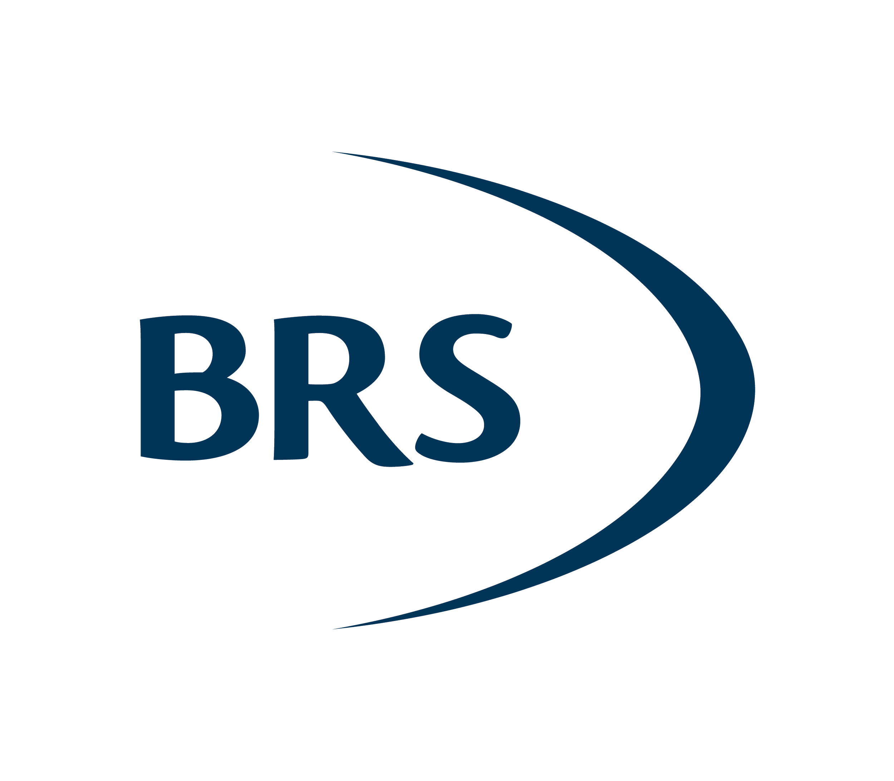
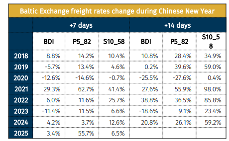
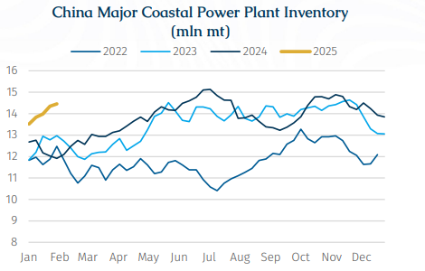

# Post-CNY Seaborne Market Overview

**Date:** February 14, 2025  
**Publisher:** Breakwave Advisors | **Category:** Market Insights  
**Original URL:** [https://www.breakwaveadvisors.com/insights/2025/2/14/post-cny-seaborne-market-overview](https://www.breakwaveadvisors.com/insights/2025/2/14/post-cny-seaborne-market-overview)  

---

> **Figure 1: Rgb Color Brs Shipbrokers Monogram Logo**  
> [Local Asset](file:///C:/Users/Dell/Github/Shipping/corpus/03-breakwave/insights/2025/assets/2025-02-14_post-cny-seaborne-market-overview_img_rgb-color-brs-shipbrokers-monogram-l_ee79606c8e74.png)

In recent years, as Chinese players have become increasingly involved in both the shipping market and its downstream sectors, the impact of the Chinese New Year holiday on the shipping market has also grown in importance.

Similar to the impact of Christmas, the shipping market tends to quieten down before Chinese New Year as Chinese players enter holiday mode. However, unlike Christmas, the Baltic Exchange continues to publish indices during the Chinese New Year period. Following the holiday, the market typically experiences a notable rebound as activity resumes.

Based on historical Baltic Exchange data, across the past seven years (2018-24), most short-haul shipping routes tend to experience an increase in freight rates following the Chinese New Year, thereby implying that Chinese players slowly return to the shipping market with more bids and tenders. However, long-haul Capesize routes, such as C10 (the Capesize Australia-China iron ore voyage), combined with the inherent high volatility of Capesize freight, do not exhibit a significant rise after the Chinese New Year. Rather, such as post-holiday tends to be experienced by shorter-haul routes, thus we will focus on these in the following discussion.
By comparing freight rates 7 days and 14 days after the Chinese New Year with the prices on the day of the festival, it is particularly evident that China-focused routes, such as P5_82 (the Panamax Indonesia-South China coal voyage) and S10_58 (the Supramax Indonesia-South China coal voyage), have posted significant gains in most years. For instance, in 2021, the S10_58 index surged by 41.4% after 7 days and 98.0% after 14 days, while P5_82 rose by 62.7% and 55.9%, respectively, indicating a strong post-holiday rebound driven by China-related demand. In contrast, the Baltic Dry Index (BDI), as a comprehensive market indicator, exhibits more moderate movements and does not appear to capture the impact of China-specific factors as clearly as P5_82 and S10_58. In 2023 for example, the BDI suffered a loss of 11.4% after 7 days and 18.6% after 14 days, marking a sharp contrast to the growth observed on P5_82 and S10_58. This suggests that despite the impact of the return of Chinese players in the shipping market, its effect is more pronounced in China-linked routes rather than in the wider market represented by BDI.

> **Figure 2: Στιγμιότυπο Οθόνης 2025 02 14 121616**  
> [Local Asset](file:///C:/Users/Dell/Github/Shipping/corpus/03-breakwave/insights/2025/assets/2025-02-14_post-cny-seaborne-market-overview_img_cea3cf84ceb9ceb3cebcceb9cf8ccf84cf85_1223410c1d9e.png)

Looking at this year, although the P5_82 index saw a significant increase of 55.7% within a week of the Chinese New Year, this was largely due to the previously low Panamax freight rate baseline. As of last Friday, even after some recovery, at $5,689/day, the P5 index is barely covering its operating costs of $5,231/day.

Breaking down downstream demand, we expect seaborne demand for coal to recover after the holiday. During the Chinese New Year holiday, as a traditionally low season for electricity consumption, industrial power demand remained low, causing daily coal consumption at power plants to decline. While power plants saw some slight destocking, procurement activities remained stagnant and are expected to resume after the holiday.

According to weather forecasts, cold air will continue to affect parts of China over the next two weeks, with temperatures in most parts of central and eastern China expected to be lower than the seasonal average. Additionally, as industries resume operations after the holiday, both industrial and residential electricity demand should drive an increase in daily coal consumption at power plants. This is expected to stimulate restocking demand, with stronger seaborne procurement activity anticipated in the post-holiday period.

> **Figure 3: Στιγμιότυπο Οθόνης 2025 02 14 121627**  
> [Local Asset](file:///C:/Users/Dell/Github/Shipping/corpus/03-breakwave/insights/2025/assets/2025-02-14_post-cny-seaborne-market-overview_img_cea3cf84ceb9ceb3cebcceb9cf8ccf84cf85_c54f8c773d6c.png)

On the iron ore side, although a rebound in steel production margins occurred in January, the market remained characterised by both weak supply and demand before the Chinese New Year.

Looking ahead to the coming weeks, it is usually the traditional off-season for demand and with the Chinese New Year holiday which could see some factories not resuming normal production until mid-February, many construction sites are expected to remain idle, leading to a noticeable contraction in steel demand. While post-holiday restocking by steel mills could provide some short-term support, low-grade cargoes sold at discounted prices in the seaborne market (such as Indian iron ore) are expected to remain in favour. Meanwhile, demand for high-grade resources (such as Brazilian iron ore) are likely to remain under pressure until demand comes back.

Overall, in the short term, we believe that the post-holiday shipping market is entering a gradual recovery. On the one hand, we do not expect a significant rebound in downstream demand, as the recovery is likely to follow a slow and steady growth trajectory, making it difficult to deliver a strong boost to the shipping market. At the same time, the resumption of domestic essential procurement will continue to drive seaborne demand upward, providing some support and helping to improve the currently depressed freight levels. However, it is still too early to draw conclusions. As temperatures rise and downstream sectors, especially construction, resume operations, we will gain a clearer view of how the government’s recent stimulus policies are impacting not only the troubled construction and real estate sectors but the wider Chinese economy and in turn the shipping market.

---

**Tags:** China, Shipping, Markets  
