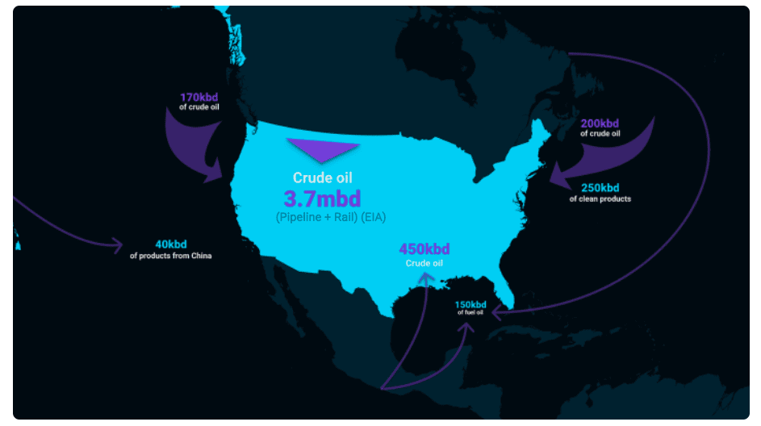
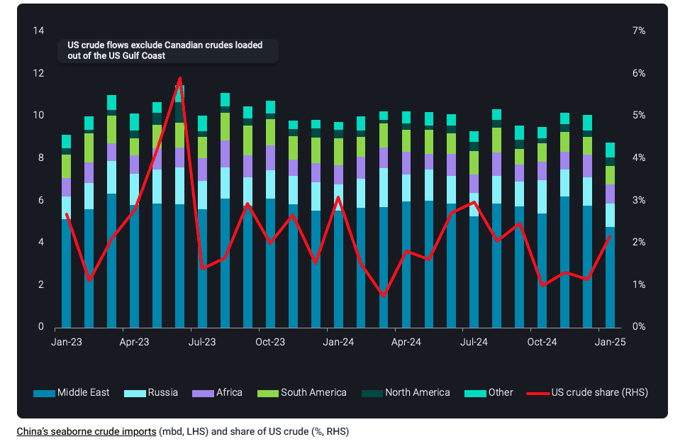
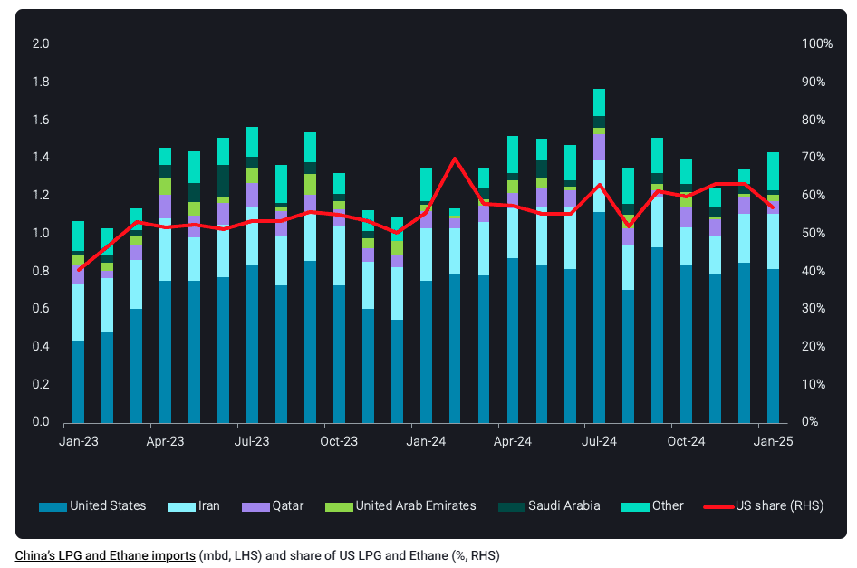

# US tariff threat looms over crude and refined product flows

**Date:** February 14, 2025  
**Publisher:** Breakwave Advisors | **Category:** Market Insights  
**Original URL:** [https://www.breakwaveadvisors.com/insights/2025/2/14/us-tariff-threat-looms-over-crude-and-refined-product-flows](https://www.breakwaveadvisors.com/insights/2025/2/14/us-tariff-threat-looms-over-crude-and-refined-product-flows)  

---

A change of administration in the US earlier this year has led to uncertainty around crude and product flows between the US and its neighbors Canada and Mexico along with China which we take a look at in this blog

*By*[*Rohit Rathod*](https://www.linkedin.com/in/rathodrohit/)

President Trump’s proposed tariffs on Mexican and Canadian energy imports have been delayed for now until early March​, but the uncertainty around their eventual implementation still persists in the markets.

The story so far is that these potential tariffs on Canada and Mexico could severely limit the choices for US refiners​ forcing them to look for alternatives and some might find it difficult to run their refineries optimally​.

US Midwest refiners, who rely mainly on Canadian crude via pipeline, might see a reduction in run rates and challenging economics if tariffs are imposed​. Tariffs on Mexican crude imports could also deprive several USGC refiners of heavy grades that may not be easily replaced. The recent announcement of 25% steel and aluminium tariffs beginning March 12 has only heightened ongoing uncertainty​.

> **Figure 1: Στιγμιότυπο Οθόνης 2025 02 14 140752**  
> **Interactive Data & Source:** [Analytics Vortexa](https://analytics.vortexa.com/Map?page=Map&tabId=a1a7cd39-18c1-4aa2-97de-ff3058dd83d7&v=3&vessels=%5B%2285cc49cf5fc104dbeaf17d78d03e9d44ef93827053eb1ecdeafe349a5599c594%22%2C%22cf21e8375fef10889566d0f83ca80a67be353fa4a54cec8b71cdfea5889f438b%22%2C%22d08afbeaa096c304fba97d88b085355cb7be9dbd71aec3893b38fe722623c873%22%2C%22257f9982dec68075cc168e7be05bf0519a3b5655fddd14e8c353aede745c256a%22%5D) | [Local Asset](file:///C:/Users/Dell/Github/Shipping/corpus/03-breakwave/insights/2025/assets/2025-02-14_us-tariff-threat-looms-over-crude-and-refined-product-flows_img_cea3cf84ceb9ceb3cebcceb9cf8ccf84cf85_b8738bdaa2a7.png)

## What Is at Stake?

The largest flow that could be impacted is the ~4mbd (Jan-Nov 2024 avg. from EIA data) of crude oil imports from Canada to the US. Of these 3.7mbd are land based, mainly pipeline and some rail volumes with the remaining volumes being seaborne.

According to Vortexa data for Q4 2024, around 170kbd of Canadian crude made its way into the US West Coast from Vancouver via water, these being the TMX pipeline barrels which could be redirected to Northeast Asia in face of tariffs. There are also some 200kbd of crude flows from East Coast Canada which could also be impacted. Similarly there are also 250kbd of clean product imports into US PADD 1/Atlantic Coast from EC Canada which would require redirection elsewhere.

The next biggest flow is 450kbd of seaborne imports of Mexican crude, mainly into the US Gulf Coast which would be of utmost concern to USGC refiners and will have them scrambling for replacement barrels if tariffs are put in. The US also imports some ~100kbd of residual fuel from Mexico and another 50kbd from EC Canada which will potentially be impacted. Finally there are small volumes of around ~40kbd of clean products that are imported from China which could be impacted. We shall discuss more about US-China energy flows in the next section.​

## Chinese Tariffs Already in Effect

> **Figure 2: Στιγμιότυπο Οθόνης 2025 02 14 141853**  
> **Interactive Data & Source:** [Analytics Vortexa](https://analytics.vortexa.com/Map?page=Map&tabId=a1a7cd39-18c1-4aa2-97de-ff3058dd83d7&v=3&vessels=%5B%2285cc49cf5fc104dbeaf17d78d03e9d44ef93827053eb1ecdeafe349a5599c594%22%2C%22cf21e8375fef10889566d0f83ca80a67be353fa4a54cec8b71cdfea5889f438b%22%2C%22d08afbeaa096c304fba97d88b085355cb7be9dbd71aec3893b38fe722623c873%22%2C%22257f9982dec68075cc168e7be05bf0519a3b5655fddd14e8c353aede745c256a%22%5D) | [Local Asset](file:///C:/Users/Dell/Github/Shipping/corpus/03-breakwave/insights/2025/assets/2025-02-14_us-tariff-threat-looms-over-crude-and-refined-product-flows_img_cea3cf84ceb9ceb3cebcceb9cf8ccf84cf85_5f4350ef7b48.png)

As US applied tariffs on Chinese imports came into effect on February 4, China announced its own counter-tariffs on US energy imports including crude, LNG, and thermal/coking coal which took effect on February 10. The retaliatory tariffs on US energy imports include 10% and 15% import tariffs on US crude and LNG respectively; however we maintain that the impacts will be minimal given flows constitute 5% or less of China’s total imports and the US originated cargoes can be easily redirected to other destinations in Asia​. China chose not to put tariffs on US LPG and ethane imports, which constitute the main energy flow between the two countries​.

As of February 12th, there are[four cargoes of US crude](https://analytics.vortexa.com/Map?page=Map&tabId=a1a7cd39-18c1-4aa2-97de-ff3058dd83d7&v=3&vessels=%5B%2285cc49cf5fc104dbeaf17d78d03e9d44ef93827053eb1ecdeafe349a5599c594%22%2C%22cf21e8375fef10889566d0f83ca80a67be353fa4a54cec8b71cdfea5889f438b%22%2C%22d08afbeaa096c304fba97d88b085355cb7be9dbd71aec3893b38fe722623c873%22%2C%22257f9982dec68075cc168e7be05bf0519a3b5655fddd14e8c353aede745c256a%22%5D)which are signalling arrival into China shortly between mid February to the end of March. We understand that buyers will likely look to swap these cargoes with buyers in neighbouring countries since tariff exemptions seem unlikely. In the meantime, the barrels could be stored in bonded tanks for future delivery.

> **Figure 3: Στιγμιότυπο Οθόνης 2025 02 14 141940**  
> **Interactive Data & Source:** [Vortexa](https://www.vortexa.com//oil-gas-data-traders-analysts-data-scientists?gclid=Cj0KCQjw8_qRBhCXARIsAE2AtRZKOvMnbilZ_6_91d7huSFFy71pWLrnPwGwOHVzXsmsG-1a1mZnQw8aAt89EALw_wcB&hsa_acc=1782073842&hsa_ad=548425387665&hsa_cam=14746637662&hsa_grp=125038601902&hsa_kw=&hsa_mt=&hsa_net=adwords&hsa_src=g&hsa_tgt=dsa-1431852288425&hsa_ver=3&utm_campaign=%5BCD%5D%20-%20DSA%20-%20EMEA&utm_medium=cpc&utm_medium=ppc&utm_source=google&utm_source=adwords&utm_term=) | [Local Asset](file:///C:/Users/Dell/Github/Shipping/corpus/03-breakwave/insights/2025/assets/2025-02-14_us-tariff-threat-looms-over-crude-and-refined-product-flows_img_cea3cf84ceb9ceb3cebcceb9cf8ccf84cf85_fb156bc0b9ab.png)

Despite the recent bilateral tariffs, it is relevant to note that there have been no tariffs placed on US ethane and LPG exports to China. These products make up around 60 percent (2024 avg.) of the total LPG and ethane imports into China. If China does decide to impose tariffs on these US imports, it would negatively impact Chinese steam crackers and PDH plants, which are already operating at weak margins.

That said, we certainly have quite some uncertain weeks ahead of us and it is difficult to comment on anything with utmost certainty. President Trump is considering reciprocal tariffs on imports from the European Union with an announcement expected this week. Any tariffs on the European Union could initiate retaliatory tariffs​, with EU leaders holding their own talks to decide the extent of retaliation. All these developments are only fuelling the uncertainty around US energy flows.

Data Source:[Vortexa](https://www.vortexa.com//oil-gas-data-traders-analysts-data-scientists?gclid=Cj0KCQjw8_qRBhCXARIsAE2AtRZKOvMnbilZ_6_91d7huSFFy71pWLrnPwGwOHVzXsmsG-1a1mZnQw8aAt89EALw_wcB&hsa_acc=1782073842&hsa_ad=548425387665&hsa_cam=14746637662&hsa_grp=125038601902&hsa_kw=&hsa_mt=&hsa_net=adwords&hsa_src=g&hsa_tgt=dsa-1431852288425&hsa_ver=3&utm_campaign=%5BCD%5D%20-%20DSA%20-%20EMEA&utm_medium=cpc&utm_medium=ppc&utm_source=google&utm_source=adwords&utm_term=)

---

**Tags:** Crudeoil, Markets, Shipping  
