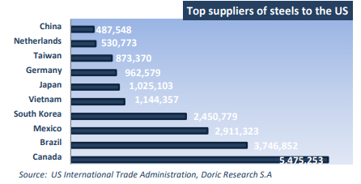
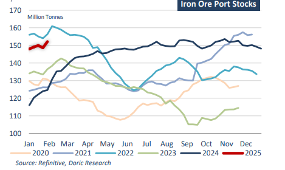
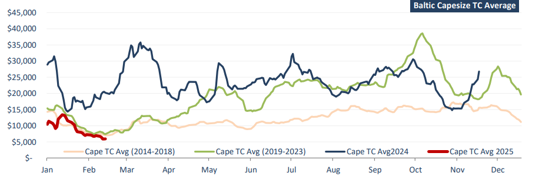

# A picture of the dry bulk market

**Date:** February 17, 2025  
**Publisher:** Breakwave Advisors | **Category:** Market Insights  
**Original URL:** [https://www.breakwaveadvisors.com/insights/2025/2/17/a-picture-of-the-dry-bulk-market](https://www.breakwaveadvisors.com/insights/2025/2/17/a-picture-of-the-dry-bulk-market)  

---

*By*[*Michalis Voutsinas*](https://www.linkedin.com/in/michalis-voutsinas-587544163/)

A year ago, Doric’s Weekly Insight painted an upbeat picture of the dry bulk market, with the leading Capesize index surging past $20,000 daily and the Panamax sector nearly doubling its value from the prior year. The geared segments had also maintained strength, with Supramax and Handysize indices firmly in five-digit territory. One year later, the landscape has shifted dramatically, with the second week of February 2025 marked by a stark divergence between segments. A combination of adverse weather conditions, shifting trade policies, and fundamental market headwinds created a challenging environment, particularly for the gearless sectors, while the geared sub-markets managed to recover some ground. The Capesize segment faced considerable pressure, closing the week at $5,939 daily. Panamax rates also faltered, dropping to $8,819 daily after a brief rally the previous week. In contrast, both Supramax and Handysize sectors recorded gains, with the former balancing at $7,634 and the latter at $8,498 on Friday’s close. This marked a partial recovery from recent losses.

On the international trade front, U.S. President Donald Trump announced plans to impose a sweeping 25 percent tariff on steel and aluminum imports, affecting an estimated $50 billion in trade. The tariffs, set to take effect on March 12, are expected to impact a wide range of suppliers. Canada, Brazil, and Mexico—the top three steel exporters to the United States—accounted for nearly half of U.S. steel imports in 2024. Meanwhile, South Korea, Vietnam, Japan, Germany, Taiwan, the Netherlands, and China collectively supplied an additional 30 percent. In the aluminum market, Canada remains by far the largest supplier, providing nearly 40 percent of U.S. imports last year. The United Arab Emirates, China, South Korea, and Bahrain round out the top five. The tariff announcement has already sparked backlash from key trading partners, with European Commission President Ursula von der Leyen vowing “firm and proportionate countermeasures” and Canadian Prime Minister Justin Trudeau pledging to defend domestic businesses and workers.

> **Figure 1: Στιγμιότυπο Οθόνης 2025 02 17 164840**  
> **Interactive Data & Source:** [Doric](https://www.doric.gr/) | [Local Asset](file:///C:/Users/Dell/Github/Shipping/corpus/03-breakwave/insights/2025/assets/2025-02-17_a-picture-of-the-dry-bulk-market_img_cea3cf84ceb9ceb3cebcceb9cf8ccf84cf85_6fd64fdfb79e.png)

The escalation in trade frictions raises concerns about potential retaliatory measures that could disrupt global commodity flows and weigh on dry bulk demand. China’s Iron and Steel Association warned that the tariff hike would not only impact Chinese steel exports but could also lead to broader market dislocations. While China’s direct steel exports to the U.S. amounted to only 508,000 tonnes last year—just 1.8 percent of total American imports—the longer-term risk lies in the potential for a broader protectionist wave. If other nations mirror Washington’s stance, China’s competitive position in global steel trade could erode. Despite these uncertainties, China’s steel exports surged to 110.72 million tonnes in 2024, the highest level since 2015. However, this rise in outbound shipments has fueled tensions, as producers in Japan, India, and other major steelproducing nations voiced concerns over the influx of competitively priced Chinese steel. On the production front, China’s crude steel output declined by 1.7 percent year-on-year to 1.005 billion tonnes. Analysts widely expect this to mark the final year of crude steel output exceeding 1 billion tonnes in the world’s second-largest economy, with a further decline anticipated in 2025. Nevertheless, steel exports are projected to remain strong, as Beijing has strategically stockpiled iron ore in anticipation of evolving demand dynamics.

> **Figure 2: Στιγμιότυπο Οθόνης 2025 02 17 164852**  
> **Interactive Data & Source:** [Doric](https://www.doric.gr/) | [Local Asset](file:///C:/Users/Dell/Github/Shipping/corpus/03-breakwave/insights/2025/assets/2025-02-17_a-picture-of-the-dry-bulk-market_img_cea3cf84ceb9ceb3cebcceb9cf8ccf84cf85_fc8e94b4e258.png)

Compounding the market’s woes, Cyclone Zelia made landfall along the Australian coast, forcing the temporary closure of major iron ore export hubs. The timing of the disruption could not be more unfavorable, as the dry bulk market was already grappling with heightened uncertainty, elevated inventories at Chinese ports, and mounting trade barriers. The Baltic Capesize Index, which had been under sustained pressure in recent weeks, registered further declines during the seventh week, reflecting the combination of weaker fundamentals and logistical challenges. With geopolitical tensions, adverse weather conditions, and shifting economic policies shaping the current market landscape, the coming weeks will be pivotal in determining whether a recovery can gain traction or if further downside risks will weigh on sentiment.

> **Figure 3: Στιγμιότυπο Οθόνης 2025 02 17 164916**  
> **Interactive Data & Source:** [Doric](https://www.doric.gr/) | [Local Asset](file:///C:/Users/Dell/Github/Shipping/corpus/03-breakwave/insights/2025/assets/2025-02-17_a-picture-of-the-dry-bulk-market_img_cea3cf84ceb9ceb3cebcceb9cf8ccf84cf85_549bf79e901e.png)

Data source:[Doric](https://www.doric.gr/)

---

**Tags:** Shipping, Markets, Drybulk  
