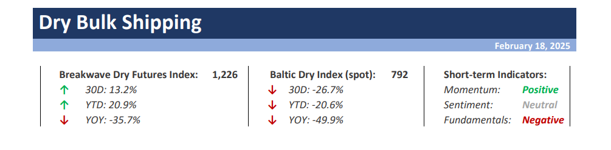
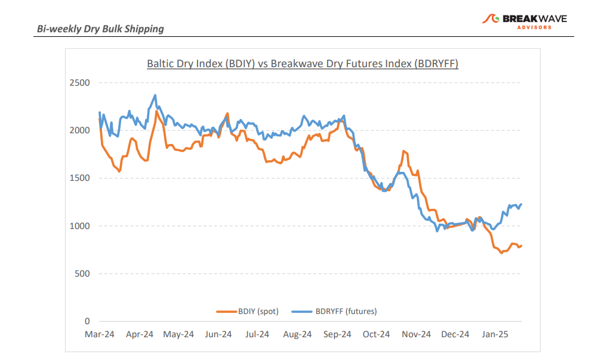
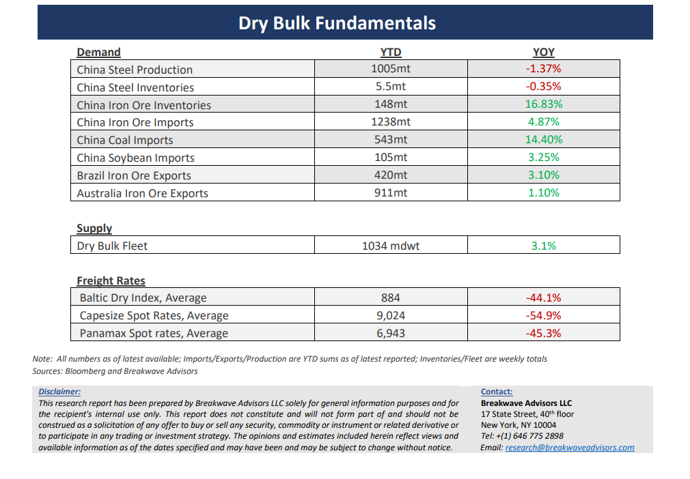

# Breakwave Bi-Weekly Dry Bulk Report - February 18, 2025

**Date:** February 18, 2025  
**Publisher:** Breakwave Advisors | **Category:** Market Insights  
**Original URL:** [https://www.breakwaveadvisors.com/insights/2025218dry-87w52k845](https://www.breakwaveadvisors.com/insights/2025218dry-87w52k845)  

---

> **Figure 1: Cea3cf84ceb9ceb3cebcceb9cf8ccf84cf85**  
> [Local Asset](file:///C:/Users/Dell/Github/Shipping/corpus/03-breakwave/insights/2025/assets/2025-02-18_2025218dry-87w52k845_img_cea3cf84ceb9ceb3cebcceb9cf8ccf84cf85_306ce96846f0.png)

•**Futures Curve in Steep Contango as Expectations Remain High**– With the Capesize spot market reaching**multiyear lows**due to limited cargo flow and a significant oversupply of vessels, the**futures market**remains the sole source of**optimism**in an otherwise subdued environment. Freight futures are once again pricing a**substantial increase**in spot rates within less than a month. While this scenario is attainable, it requires**strong validation**in the near term; otherwise, the curve is likely to experience further declines as the current optimism fades. Several factors suggest a potential recovery in spot rates. The Pacific market, particularly West Australia, has been significantly impacted by multiple storms, leading to slower iron ore exports. As a result,**pent-up demand**could drive increased activity in the region. In the Atlantic, cargo flow has improved, but the**high number of open vessels**has contributed to the recent decline in spot rates. Looking ahead to late March, we anticipate a better supply-demand balance, which should support a recovery in rates. However, the increasing contango in the futures market presents a growing challenge. The**coming days**will be**critical for optimists**seeking validation of the steep futures curve. Additionally, the relatively strong secondhand vessel market hinges on the assumption of a robust recovery in spot rates—an outcome that remains highly uncertain when considering historical precedents in dry bulk shipping.**Our view**is that the probability of a**spike**in spot Capesize rates is real, but the curve is**overly optimistic**about the extend and sustainability of such potential higher rates.

•**Iron Ore Pushes Higher On the Back of Australian Storms, but Oversupply Continues to Weigh on Prices –**Iron ore price volatility has significantly decreased over the past several months. However, a**major storm**last week that resulted in the closure of multiple ports in West Australia provided a brief opportunity for**bullish sentiment**to push prices higher. This optimism was short-lived, as the storms subsided and limited infrastructure damage was reported, leading prices to correct**back****to the mid/low $100/ton range**, which has been the prevailing level in recent months. High port inventories, ample product supply, and steady demand from Chinese steel mills are expected to continue exerting downward pressure on prices, which we anticipate will likely fall into the single digits again soon. There is little basis for optimism in the iron ore market at present, and a**structural shift**—either on the demand or supply side—will be**required**for sustainable support. Recent announcements regarding increased investment in iron ore mining by Vale do little to improve the market balance, although the longer distances involved in new production may offer some hope that it could displace short-haul routes. On the other hand,**bauxite trading**continues to**grow**, contributing to increased ton-miles, which is helping to absorb excess tonnage, particularly during the seasonally weak first quarter of the year

•**Our Long-term View**– The last few years have been characterized by increased geopolitical uncertainty. Going forward, we expect such events to continue to affect global trade and have a meaningful impact on effective vessel supply. Combined with the potential for a multi-year cyclical rebound in China’s economic activity following the recent economic turmoil, dry bulk shipping should experience higher volatility on top of a secular tightness driven by stable bulk commodity demand and a slower fleet growth owing to a relatively low orderbook.

> **Figure 2: Cea3cf84ceb9ceb3cebcceb9cf8ccf84cf85**  
> [Local Asset](file:///C:/Users/Dell/Github/Shipping/corpus/03-breakwave/insights/2025/assets/2025-02-18_2025218dry-87w52k845_img_cea3cf84ceb9ceb3cebcceb9cf8ccf84cf85_60e124fc7a33.png)

> **Figure 3: Cea3cf84ceb9ceb3cebcceb9cf8ccf84cf85**  
> [Local Asset](file:///C:/Users/Dell/Github/Shipping/corpus/03-breakwave/insights/2025/assets/2025-02-18_2025218dry-87w52k845_img_cea3cf84ceb9ceb3cebcceb9cf8ccf84cf85_a6fb7fbf79b6.png)

### Subscribe:
