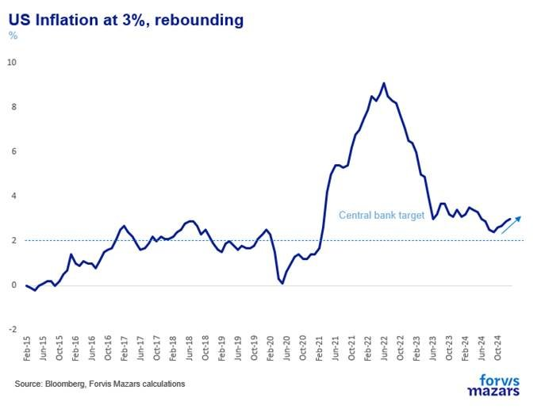
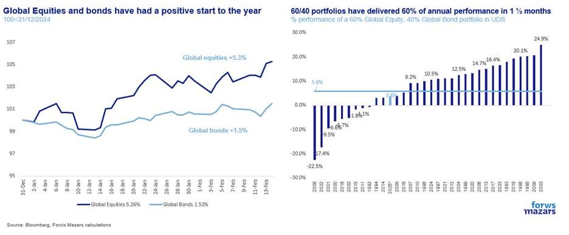
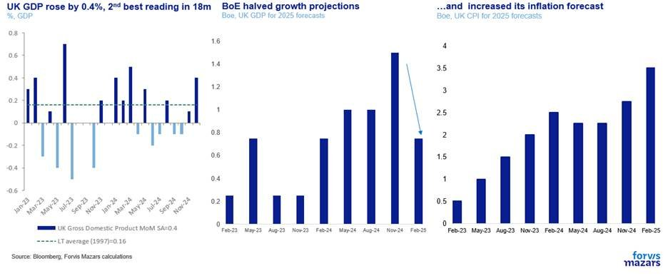
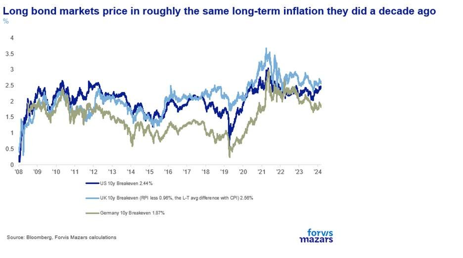
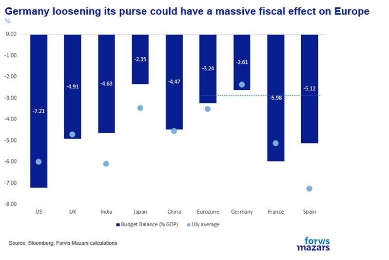

# The signal and the noise

**Date:** February 18, 2025  
**Publisher:** Breakwave Advisors | **Category:** Market Insights  
**Original URL:** [https://www.breakwaveadvisors.com/insights/2025/2/17/the-signal-and-the-noise](https://www.breakwaveadvisors.com/insights/2025/2/17/the-signal-and-the-noise)  

---

The three things investors should know this week – and which risk markets seem to ignore, for now:

1. **Europe has a big decision to make in the next few months: will it pull together, address its inefficiencies and make a productivity push, or will it become less relevant in a very quickly changing world?**
2. **American inflation is pulling up, even before any trade disruptions begin to be counted in the data.**
3. **The US has taken another step towards imposing global tariffs. Markets may have cheered on the temporary reprieve, but the US and the world are inexorably moving towards remaking the global trade map.**

-------------------------------

### Summary

As US inflation rose to 3% and the US administration announced another milestone towards imposing global reciprocal tariffs, while at the same time ignoring Europeans in Ukraine peace negotiations, risk markets remained unperturbed. Meanwhile, UK growth rebounded unexpectedly, but forward-looking data suggests that the BoE should remain on a rate-cutting path. The world is changing fast, perhaps too fast and profoundly for risk markets to price everything in.**The one thing we know for sure is that taking the present status quo and projecting it into the future in perpetuity will almost certainly lead us to wrong conclusions.**

### Week Ahead

The most important piece of news will be Germany’s election on Sunday, which will likely lead to a new government coalition. UK inflation numbers on Wednesday are expected to show that British Prices rose by 2.8% for the year to January, accelerating from 2.5% in December. On Wednesday, also, minutes from the FOMC, the Fed’s rate-setting body, will reveal more about the US central bank’s intentions on interest rates. Finally, on Friday, preliminary (Flash) PMI data should show whether global services continue to slow down.

-------------------

*By*[*George Lagarias*](https://www.linkedin.com/in/george-lagarias-mba-3baa769/)

“What an hour brings, a year may not”, an old Greek saying goes. Some weeks go uneventful. And some do not. The foundation of the post-WWII Euro-Atlantic partnership, America exchanging growth for influence is now under review, as the Trump foreign policy doctrine takes hold. Whether it is dead, on hiatus or just under review is a question for a future historian. But for all intents and purposes, this world is different, and it feels like systemic risks are piling up as geoeconomic fragmentation momentum accelerates.

But is it so?

“Alliances[win](https://en.wikipedia.org/wiki/Battle_of_Waterloo)wars”, the Duke of Wellington would argue. Without Prussia, Waterloo would have been a loss and Napoleon[could have become](https://www.youtube.com/watch?v=2vAvoaOaJNM)Emperor of Europe. “Shattering alliances may win the peace” Pericles (495-429 BCE) would counter. After all, his (universally condemned) move to turn the[Delian League](https://en.wikipedia.org/wiki/Delian_League)(a confederacy of 150-330 city-states) into the[Athenian Hegemony](assets/2025-02-18_the-signal-and-the-noise_212athenian-hegemony_3c4ece333370.html), by stealing the alliance’s common Treasury, built the Parthenon, brought money to Athens and, at the peak of the first “[Golden Age](https://www.studentsofhistory.com/the-golden-age-of-athens)”, established the foundation of Western civilisation. The same could be said about the positive effects of the Bubonic plague (1353) and the fall of Constantinople (1453), both horrible, end-of-times events, without which the Renaissance might not have happened.

For those who remember the elation after the Fall of the Berlin Wall, under the “[Wind of Change](https://www.youtube.com/watch?v=n4RjJKxsamQ)” by the Scorpions, last week seems like somewhat the opposite. It does feel like the weight of history is crashing down on us.

Last week wasn’t all about statesmanship, however. A lot was about a negative inflation printout of the US, where prices rose for the fourth consecutive month, by 3% for the year to December.

> **Figure 1: Market Chart 1**  
> **Interactive Data & Source:** [Bloomberg News](https://www.bloomberg.com/news/articles/2025-02-13/trump-moves-to-impose-reciprocal-tariffs-but-not-right-away) | [Local Asset](file:///C:/Users/Dell/Github/Shipping/corpus/03-breakwave/insights/2025/assets/2025-02-18_the-signal-and-the-noise_img_image006_f75b9e612c68.jpg)

Geoeconomic fragmentation, which is accelerating, could accentuate inflation pressures going forward. And equity and bond markets may have been relieved that the US President’s[reciprocal](https://www.bloomberg.com/news/articles/2025-02-13/trump-moves-to-impose-reciprocal-tariffs-but-not-right-away)tariffs will not be imposed at least until April, this is somewhat of a short-term view, as inflation risks are to the upside.

> **Figure 2: Market Chart 2**  
> **Interactive Data & Source:** [Politico](https://www.politico.eu/article/von-der-leyen-proposes-triggering-clause-to-massively-boost-defense-spending/) | [Local Asset](file:///C:/Users/Dell/Github/Shipping/corpus/03-breakwave/insights/2025/assets/2025-02-18_the-signal-and-the-noise_img_image007_d52bbe2f59e7.jpg)

And as action unequivocally begets reaction, Ursula Von Dee Layen, the German CDU politician serving as President of the European Commission, suggested that[defence expenditures](https://www.politico.eu/article/von-der-leyen-proposes-triggering-clause-to-massively-boost-defense-spending/)be excluded from the stability pact, which requires a deficit of 3% or less from EU countries. Coupled with Friedrich Merz’s (the presumed next Chancellor of Germany) openness to[removing](https://www.euronews.com/business/2025/02/10/chancellor-hopeful-merz-open-to-reform-of-germanys-debt-brake)the debt brake in Germany, we could see a meaningful increase in EU spending in the near future, which could help push growth upwards. The Eurozone alone would have to increase spending by about 210bn Euros to match the US’s military spending. The number is big, so common borrowing, like during the pandemic, might be required. Apart from the obvious benefits to growth, the move could bring European nations together. Pete Hesgeth’s[warning](https://www.youtube.com/watch?v=gLWtxrU0NeE)that American troops can’t stay in Europe forever, may also help the union move closer militarily.

Meanwhile, the UK unexpectedly returned to growth in December (+0.4% for December, +0.1% for the three months to December). However, we wouldn’t pop the champagne just yet. Growth significantly surprising on the upside may be good news, however, the spectre of stagflation is very much alive.

> **Figure 3: Market Chart 3**  
> [Local Asset](file:///C:/Users/Dell/Github/Shipping/corpus/03-breakwave/insights/2025/assets/2025-02-18_the-signal-and-the-noise_img_image008_fd9e646024cc.jpg)

Upside came mainly from the service sector, and in particular professional services. However, the more forward-looking January PMI data on British services suggest that orders remain soft, corporate risk aversion is high and employment conditions are deteriorating. While we can’t totally dismiss a good growth number, we don’t think that it alone will move the needle for the Bank of England which is on a dovish path. The four things we didn’t know last week are:

1. Baseline inflation ahead of tariff implementation is already 1% north of the Fed’s target. This is not very helpful for risk assets which may not be ready for an inflation wave.

> **Figure 4: Market Chart 4**  
> [Local Asset](file:///C:/Users/Dell/Github/Shipping/corpus/03-breakwave/insights/2025/assets/2025-02-18_the-signal-and-the-noise_img_image009_303aab7a895c.jpg)

2.Tariffs will come, but later than originally expected. Some investors feel vindicated ignoring the subject altogether. As a result, however, markets may be underpricing an event that has a high probability of happening – significant tariffs towards Europe, and, potentially a pushback from EU allies.

3.Europe is being quickly brought to a fork in the road. Very quickly, possibly after Germany’s election, European leaders will have to decide: will they pull together, which means adopting Draghi’s memo on how to improve growth, i.e. mutualising debt, reducing regulation, increasing defence spending, or will they rather deal with the US individually? The former choice could unlock a lot of value from unloved European risk assets.

> **Figure 5: Market Chart 5**  
> [Local Asset](file:///C:/Users/Dell/Github/Shipping/corpus/03-breakwave/insights/2025/assets/2025-02-18_the-signal-and-the-noise_img_image010_66b0453ac16d.jpg)

4. UK growth slowing down may be a less straightforward business than we might have thought.

Irrespective of how it feels, history’s judgment is reserved for an era beyond ours. As such, it is good to be reminded that we are but fund managers, tasked with the humble task of navigating client assets through good or tumultuous times. A broad study of history suggests that, when chips are in the air, no one knows where they will land, so high-confidence forecasts are off the table.**The one thing we know for sure is that taking the present status quo and projecting it into the future in perpetuity will almost certainly lead us to wrong conclusions.**

---

**Tags:** Macro, Economy, Markets  
