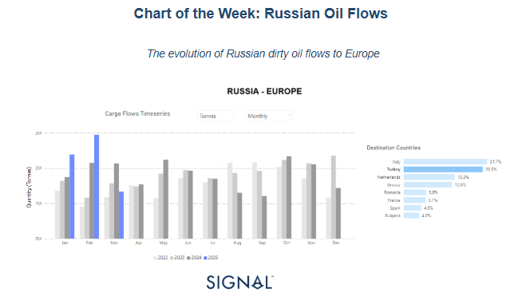
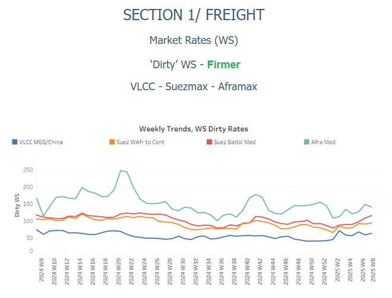
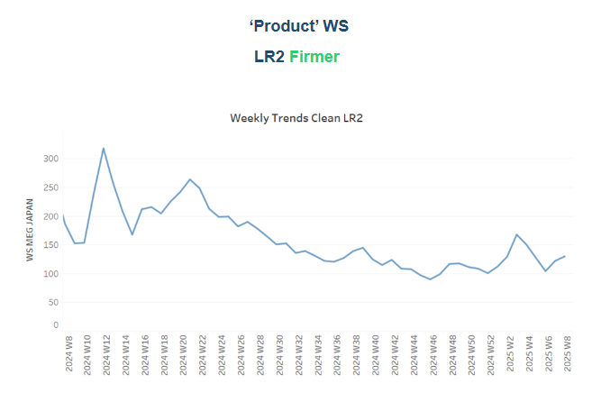
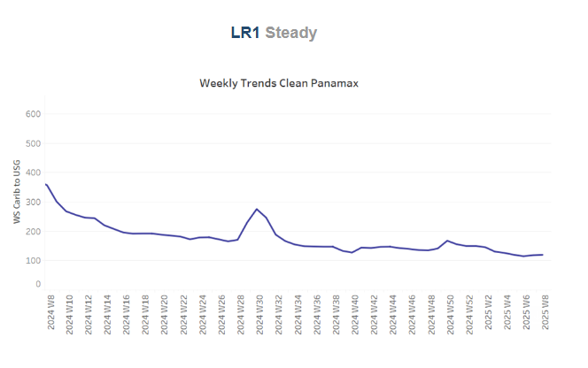
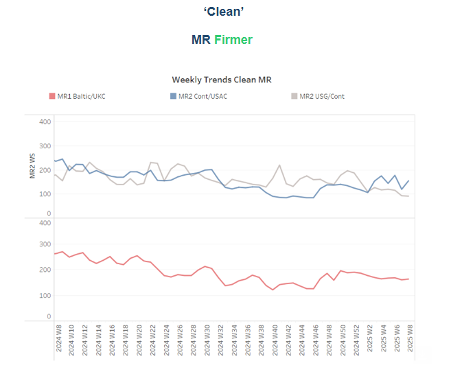
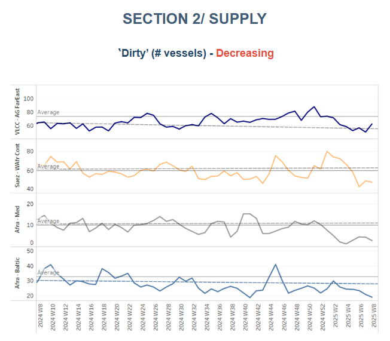
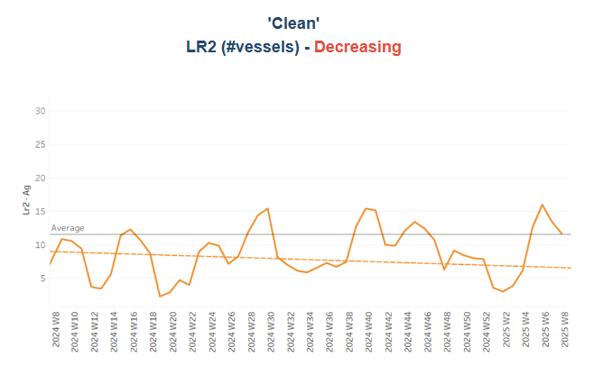
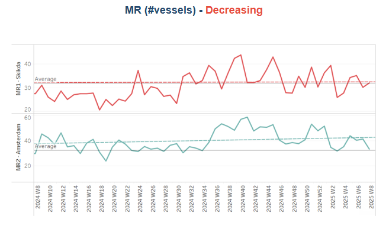
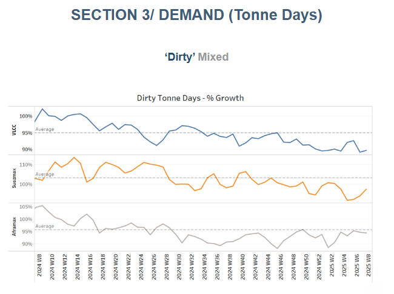
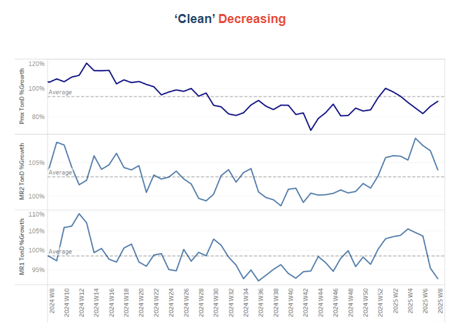

# The evolution of Russian dirty oil flows to Europe

**Date:** February 20, 2025  
**Publisher:** Breakwave Advisors | **Category:** Market Insights  
**Original URL:** [https://www.breakwaveadvisors.com/insights/2025/2/20/the-evolution-of-russian-dirty-oil-flows-to-europe](https://www.breakwaveadvisors.com/insights/2025/2/20/the-evolution-of-russian-dirty-oil-flows-to-europe)  

---

### Tanker - Weekly Market Monitor

Snapshot of Crude and Product Freight Rates, Supply-Demand

Week 08, February 20, 2025

> **Figure 1: Στιγμιότυπο Οθόνης 2025 02 20 162853**  
> **Interactive Data & Source:** [Signal Ocean Platform](https://www.thesignalgroup.com/signal-ocean-platform) | [Local Asset](file:///C:/Users/Dell/Github/Shipping/corpus/03-breakwave/insights/2025/assets/2025-02-20_the-evolution-of-russian-dirty-oil-flows-to-europe_img_cea3cf84ceb9ceb3cebcceb9cf8ccf84cf85_d400821fa0cf.png)

The evolving geopolitical landscape surrounding the Russia-Ukraine war and global energy markets presents critical implications for crude oil supply and trade dynamics. As diplomatic efforts emerge to end the conflict, the oil market is closely monitoring potential changes in supply, demand, and pricing.

### Impact on Russian Crude Oil Exports

Since the European Union's embargo on Russian crude oil in December 2022, Russia has been forced to redirect its oil exports to alternative markets, notably China, India, and Turkey. These shifts have fundamentally altered global trade flows, increasing transportation distances and logistical costs. The emergence of a "shadow fleet" of tankers—operating with limited transparency—has further complicated regulatory enforcement and raised concerns over maritime risks.

Turkey has played a pivotal role in this transition. Taking advantage of discounted Russian crude, Turkey has significantly increased its imports from 2023. Turkish refineries convert this crude into refined products, which are then re-exported, including to Europe markets. This effectively circumvents EU sanctions, allowing Russian energy to remain a crucial part of Europe’s energy mix, albeit indirectly. However, following U.S. sanctions imposed on Russian energy entities and tankers on January 10, 2025, Turkey's largest oil refiner, Tupras, announced the cessation of Russian crude purchases, with final shipments concluding in February 2025. This remains to be seen as January and February for this year already recorded significant volumes. Examining the Signal Ocean Cargo Flows historical time-series (monthly from 2022 to 2025), January and February 2025 show the highest recorded cargo flows compared to previous years, especially February, which has the highest peak in blue.

### Potential Market Effects If the War Ends

The potential resolution of the Russia-Ukraine war could have significant ramifications for global oil markets. If sanctions on Russian oil are lifted or eased as part of a peace agreement, Russia may regain direct access to European markets, reversing the trade shifts observed over the past two years. This would likely increase global crude supply, exerting downward pressure on oil prices. In response, major oil producers such as OPEC, the U.S., and Saudi Arabia may need to adjust production strategies to maintain market balance. Additionally, a redirection of Russian oil exports back to Europe could reduce Asia’s dependence on Russian crude, prompting a reshuffling of supply chains in China and India. The resolution could also improve efficiency in oil transportation by reducing reliance on costly alternative routes and shadow fleets, leading to lower logistics costs and enhanced market stability.

### Uncertainties and Risks

Despite these potential effects, uncertainties remain. The terms of a peace agreement, the stance of Western nations on sanctions, and broader economic factors such as global demand fluctuations and interest rate policies will all influence how the market responds. Additionally, geopolitical risks persist, as lingering tensions or unresolved territorial disputes could continue to impact Russia’s trade relationships.

### Looking Ahead

The ongoing shifts in crude oil trade, driven by sanctions and geopolitical strategies, have reshaped global energy markets. While an end to the Russia-Ukraine conflict could alleviate some disruptions and increase oil availability, the overall impact will depend on policy decisions regarding sanctions, energy security strategies, and how major producers respond to new supply dynamics. In this complex environment, market participants must remain vigilant as political developments unfold.

> **Figure 2: Στιγμιότυπο Οθόνης 2025 02 20 163010**  
> **Interactive Data & Source:** [Signal Ocean Platform](https://www.thesignalgroup.com/signal-ocean-platform) | [Local Asset](file:///C:/Users/Dell/Github/Shipping/corpus/03-breakwave/insights/2025/assets/2025-02-20_the-evolution-of-russian-dirty-oil-flows-to-europe_img_cea3cf84ceb9ceb3cebcceb9cf8ccf84cf85_4a974868fa27.png)

​​​​​Sentiment in the**dirty freight market**confirmed a firmer picture for this week, with**VLCC MEG/China routes**establishing a**firmer momentum**, driven by tightening vessel supply.

- **VLCC**freight rates for**MEG-China**routes stood at WS67, marking a 17% weekly increase. Suezmax rates for**West Africa to continental Europe**reached WS92, reflecting a 5% monthly gain. Meanwhile, Suezmax rates on the Baltic-Mediterranean route stood above WS100, up 24% month-over-month.
- **Aframax**freight rates in the**Mediterranean**continue to exhibit bullish momentum despite a slight downward correction, currently standing at WS135—up 13% month-over-month.

> **Figure 3: Στιγμιότυπο Οθόνης 2025 02 20 163104**  
> **Interactive Data & Source:** [Signal Ocean Platform](https://www.thesignalgroup.com/signal-ocean-platform) | [Local Asset](file:///C:/Users/Dell/Github/Shipping/corpus/03-breakwave/insights/2025/assets/2025-02-20_the-evolution-of-russian-dirty-oil-flows-to-europe_img_cea3cf84ceb9ceb3cebcceb9cf8ccf84cf85_0b965c9e7a14.png)

- **LR2**AG freight rates showed stronger momentum than the previous week, reaching approximately WS130, reflecting a 26% increase month-over-month.

> **Figure 4: Στιγμιότυπο Οθόνης 2025 02 20 164111**  
> **Interactive Data & Source:** [Signal Ocean Platform](https://www.thesignalgroup.com/signal-ocean-platform) | [Local Asset](file:///C:/Users/Dell/Github/Shipping/corpus/03-breakwave/insights/2025/assets/2025-02-20_the-evolution-of-russian-dirty-oil-flows-to-europe_img_cea3cf84ceb9ceb3cebcceb9cf8ccf84cf85_13ca901bdeb8.png)

- **Panamax**Carib-to-USG rates maintained steady momentum at WS120, marking an 8% decline compared to the same period last year.

> **Figure 5: Στιγμιότυπο Οθόνης 2025 02 20 164311**  
> **Interactive Data & Source:** [Signal Ocean Platform](https://www.thesignalgroup.com/signal-ocean-platform) | [Local Asset](file:///C:/Users/Dell/Github/Shipping/corpus/03-breakwave/insights/2025/assets/2025-02-20_the-evolution-of-russian-dirty-oil-flows-to-europe_img_cea3cf84ceb9ceb3cebcceb9cf8ccf84cf85_092f1ed19434.png)

- **MR1**freight rates for Baltic-to-Continent shipments stood firmer at around WS195 —an increase of 35% quarterly.

- Meanwhile,**MR2**rates for shipments from the Continent to the US Atlantic Coast (USAC) recorded a significant weekly spike and rose at WS170, marking a 50% weekly increase. MR2 rates on the US Gulf-to-Continent route stood nearly above WS 100 — 10% weekly increase.

> **Figure 6: Στιγμιότυπο Οθόνης 2025 02 20 164452**  
> **Interactive Data & Source:** [Signal Ocean Platform](https://www.thesignalgroup.com/signal-ocean-platform) | [Local Asset](file:///C:/Users/Dell/Github/Shipping/corpus/03-breakwave/insights/2025/assets/2025-02-20_the-evolution-of-russian-dirty-oil-flows-to-europe_img_cea3cf84ceb9ceb3cebcceb9cf8ccf84cf85_567c63ea4e51.png)

​​​​​​The supply of crude tankers maintained its downward trend from earlier in February, with recent estimates suggesting levels remaining below the annual average on key routes in the month's final days.

- **VLCC Ras Tanura**: The ship count is now around 60, reflecting a decline of 10 compared to the annual average and 26 fewer than the levels recorded before the end of December.
- **Suezmax Wafr**: The current ship count stands at 48, closely mirroring last week's trend but remaining 20 below the annual average, signaling a further downward correction at the start of February.
- **Aframax Med**: The vessel count has remained consistently below the annual average since early January, with recent activity declining further as the month draws close.
- **Aframax Baltic**: The number of ships has remained below the annual average of 30 and stood at around 19 — almost four fewer than two weeks ago.

> **Figure 7: Στιγμιότυπο Οθόνης 2025 02 20 164541**  
> **Interactive Data & Source:** [Signal Ocean Platform](https://www.thesignalgroup.com/signal-ocean-platform) | [Local Asset](file:///C:/Users/Dell/Github/Shipping/corpus/03-breakwave/insights/2025/assets/2025-02-20_the-evolution-of-russian-dirty-oil-flows-to-europe_img_cea3cf84ceb9ceb3cebcceb9cf8ccf84cf85_3a28b07984ed.png)

> **Figure 8: Στιγμιότυπο Οθόνης 2025 02 20 164552**  
> **Interactive Data & Source:** [Signal Ocean Platform](https://www.thesignalgroup.com/signal-ocean-platform) | [Local Asset](file:///C:/Users/Dell/Github/Shipping/corpus/03-breakwave/insights/2025/assets/2025-02-20_the-evolution-of-russian-dirty-oil-flows-to-europe_img_cea3cf84ceb9ceb3cebcceb9cf8ccf84cf85_7436604893b2.png)

- **Clean LR2 AG Jubail**: We observed a downward trend, with the number of vessels declining to the annual average of 11, followed by a significant spike two weeks ago.

- **Clean MR:**Since the end of last week, the number of ships at the Algerian port of Skikda has remained around the annual average of 30. However, the latest trend indicates a possible increase in activity before the month's end. Meanwhile, MR2 activity in Amsterdam trended downward, defying last week's expectations of an increase and ultimately settling below the annual average.

> **Figure 9: Στιγμιότυπο Οθόνης 2025 02 20 164711**  
> **Interactive Data & Source:** [Signal Ocean Platform](https://www.thesignalgroup.com/signal-ocean-platform) | [Local Asset](file:///C:/Users/Dell/Github/Shipping/corpus/03-breakwave/insights/2025/assets/2025-02-20_the-evolution-of-russian-dirty-oil-flows-to-europe_img_cea3cf84ceb9ceb3cebcceb9cf8ccf84cf85_28744bb9b3b6.png)

- **Dirty**tonne days: The growth rate of dirty tonne-days for VLCCs remained weak, with only a slight upward correction, still trailing well below the annual trend. In the Suezmax segment, a stronger recovery has been observed, while the Aframax segment has been moving at a pace nearly in line with the annual trend over the past three weeks.

> **Figure 10: Στιγμιότυπο Οθόνης 2025 02 20 164808**  
> **Interactive Data & Source:** [Signal Ocean Platform](https://www.thesignalgroup.com/signal-ocean-platform) | [Local Asset](file:///C:/Users/Dell/Github/Shipping/corpus/03-breakwave/insights/2025/assets/2025-02-20_the-evolution-of-russian-dirty-oil-flows-to-europe_img_cea3cf84ceb9ceb3cebcceb9cf8ccf84cf85_5d38d245e152.png)

- **Panamax**tonne days: The growth rate remained well below the recent weekly annual average, though early signs of a rebound have emerged, requiring further confirmation in the coming days of February.

- **MR**tonne-days: The growth rate for the MR segment has continued to decline, with MR1 exhibiting significantly weak growth, falling well below the annual trend and reaching its lowest level in a year. Meanwhile, MR2 has managed to stay above the annual trend, with its most recent peak recorded at the end of Week 4.

Data Source:[Signal Ocean Platform](https://www.thesignalgroup.com/signal-ocean-platform)

---

**Tags:** Shipping, Crude, Tankers  
