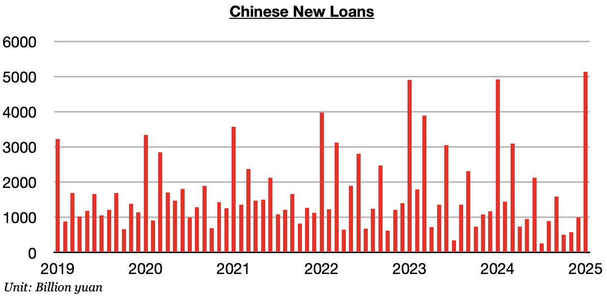
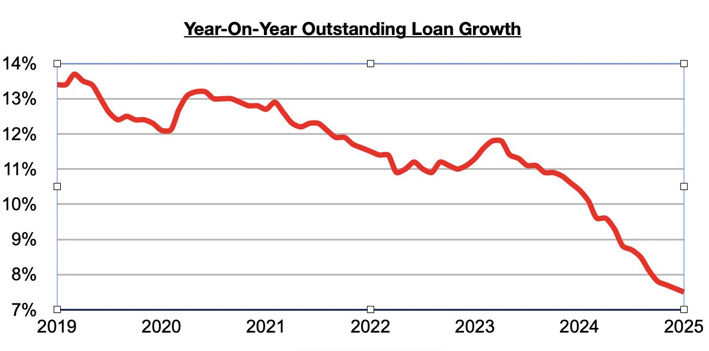

# Chinese Lending Set A Record Last Month

**Date:** February 21, 2025  
**Publisher:** Breakwave Advisors | **Category:** Market Insights  
**Original URL:** [https://www.breakwaveadvisors.com/insights/2025/2/21/chinese-lending-set-a-record-last-month](https://www.breakwaveadvisors.com/insights/2025/2/21/chinese-lending-set-a-record-last-month)  

---

*By*[*Jeffrey Landsberg*](https://www.linkedin.com/in/jeffrey-landsberg-70ab957/)

As we discussed in Commodore Research's Weekly China Report, and worthy of much more attention in the media and from major research providers, is that Chinese banks issued a record 5.13 trillion yuan in new loans in January. This has marked a month-on-month increase of 4.14 trillion yuan (418%) and is up year-on-year by 210 billion yuan (4%). While it is normal for lending to set a record every January, the year-on-year growth is particularly noteworthy. In January 2024, new loans grew year-on-year by only 0.4%.

> **Figure 1: Chart 1**  
> [Local Asset](file:///C:/Users/Dell/Github/Shipping/corpus/03-breakwave/insights/2025/assets/2025-02-21_chinese-lending-set-a-record-last-month_img_chart1_962fdb15f83b.jpg)

January’s 4% year-on-year growth is also particularly significant considering that during all of 2024, China's new loans contracted year-on-year by 20%. That contraction marked an unfortunate shift as in 2023, China's new loans had increased year-on-year by 7%. Overall, it is a positive development that growth in China's new lending has so far returned. Outstanding loan growth has fallen to 7.5%, which again marks China’s lowest outstanding loan growth seen since tracking began in 1998 — but if new loans are able to continue to maintain their newfound growth, then outstanding loan growth will finally recover as well.

> **Figure 2: Chart 2**  
> [Local Asset](file:///C:/Users/Dell/Github/Shipping/corpus/03-breakwave/insights/2025/assets/2025-02-21_chinese-lending-set-a-record-last-month_img_chart2_2eef02bd04be.jpg)

---

**Tags:** China, Shipping, Economy  
