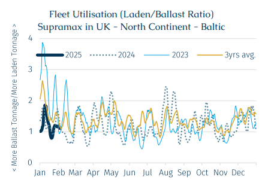
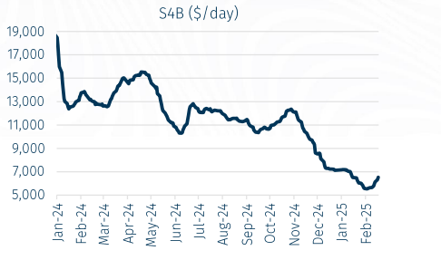

# Trump’s Full Metal Jacket

**Date:** February 21, 2025  
**Publisher:** Breakwave Advisors | **Category:** Market Insights  
**Original URL:** [https://www.breakwaveadvisors.com/insights/2025/2/21/trumps-full-metal-jacket](https://www.breakwaveadvisors.com/insights/2025/2/21/trumps-full-metal-jacket)  

---

> **Figure 1: Early Days of Donald Trump’s Presidency Has Been Characterised**  
> *The early days of Donald Trump’s Presidency has been characterised by tariffs, taxes, and more restrictions, in essence; The United States against the world. On 12 February, the US released an executive order mandating a 25% tariff on allsteel and aluminium imports starting from 12 March, despite warnings from Europe and China. The European bloc stands together in its response with the EU President Ursula von der Leyen stating, “Unjustified tariffs on the EU will not go unanswered”. Meanwhile, China has been the initial target, with the US imposing tariffs onall importscompared with a designated list under the previous Trump administration. Indeed, countries such as Mexico have been accused of helping China to transit its goods to the US via its borders. However, it is hardly China’s first rodeo, and it has already retaliated with tariffs on amongst others, coal and liquified natural gas.*  
> [Local Asset](file:///C:/Users/Dell/Github/Shipping/corpus/03-breakwave/insights/2025/assets/2025-02-21_trumps-full-metal-jacket_img_rgb-color-brs-shipbrokers-monogram-l_ee79606c8e74.png)

Whereas the EU shows a united front and China plays old tricks, the UK appears particularly exposed without its block bargaining power with the EU. At first, the UK government decided to tone down the effect of the tariff on UK’s steel and aluminium exports, because its steel exports to the US represented barely 5% of the UK’s steel exports in 2023. Although AXSMarine data reveal those figures dropped below 3% last year, across 2012-16 it averaged 10%. Furthermore, and despite a market share of 4% in 2024, when excluding shipments to Europeans countries, UK Steel and aluminium exports to the US accounted for 10% of the total volumes exported over the past decade, and 7% over the past five years. Therefore, the US’ relevance for the UK steel industry is not as marginal as it first appears. Indeed, industry body, UK Steel, has stated that the steel trades between the two economies are worth over £400 mln a year – thus there is a rub.

After facing British steel workers’ discontent, the British Department for Business and Trade announced a strategy to somehow offset the potential consequences of the tariffs on Uk’s steel industry. The strategy consists in injecting £2.5 bln into the domestic steel industry, including in the expansion of Heathrow airport which could absorb 400,000 mt of steel. Last year, UK steel and aluminium shipments to the US totalled 89,000 mt according to AXSMarine, down from 131,000 mt in 2023.

Whereas Trump’s tariffs could hurt the trade between the two economies, it could also badly affect the already struggling Supramax market in the Atlantic. The counteroffensive suggested by the British government will rub out demand for vessels in the basin as the strategy is to encourage the use of British-made steel in domestic infrastructure projects. Although this concerns long-term exports, the immediate effect of the tariffs will probably result in less steel cargo out of UK and is expected to weigh on Supramax demand. The geared bulk vessels from 25,000 - 60,000 Dwt (Handysize to Supramax) carried slightly more than half of global steel shipments last year, with Supramaxes (50-60,000 dwt) alone accounting for 21.7%.

> **Figure 2: Στιγμιότυπο Οθόνης 2025 02 21 120824**  
> [Local Asset](file:///C:/Users/Dell/Github/Shipping/corpus/03-breakwave/insights/2025/assets/2025-02-21_trumps-full-metal-jacket_img_cea3cf84ceb9ceb3cebcceb9cf8ccf84cf85_c508f0deaaf0.png)

Data suggests that the Atlantic market has already been under pressure, especially in the UK-Northwest Europe region where excess tonnage exacerbated by the number of Supramax ballasters has already collided with weak demand. As a result, the Baltic route S4B (Skaw-Passero - US Gulf) averaged barely above $6,500 /day in January, a significant correction from $13,880/day witnessed over the same month in 2024. Although it is worth noting that the overall dry bulk market, and specifically geared vessels, benefited from rerouting around the Cape of Good Hope one year ago, the oversupply of vessels in the region continues to maintain downward pressure on Supramax rates. Accordingly, so far in February, S4B has averaged $5,832/day.

> **Figure 3: Στιγμιότυπο Οθόνης 2025 02 21 120835**  
> [Local Asset](file:///C:/Users/Dell/Github/Shipping/corpus/03-breakwave/insights/2025/assets/2025-02-21_trumps-full-metal-jacket_img_cea3cf84ceb9ceb3cebcceb9cf8ccf84cf85_6b72fc88122b.png)

Historically, the second quarter of the year is usually slow in that segment and the oversupply in the Atlantic has been a drag on Supramax rates. However, this week has seen rates surprisingly strengthen after on the back of improved activity. After all, the beginning of the tariff era is expected to commence in March, which has seen some US importers front load, especially from origins in the Atlantic Basin which should arrive before tariffs take effect. Furthermore, the second quarter also marks the beginning of the grain export season from East Coast South America (ECSA). With Donald Trump openly targeting China, the Asian country is expected to boost demand for Brazilian grain, which usually supports the Panamax market. Ultimately, in the coming weeks the Panamax market could drive a positive spillover demand on the Supramax market which acts as a counter since a rising tide lift all ‘boats’.

---

**Tags:** Shipping, Markets, Drybulk  
