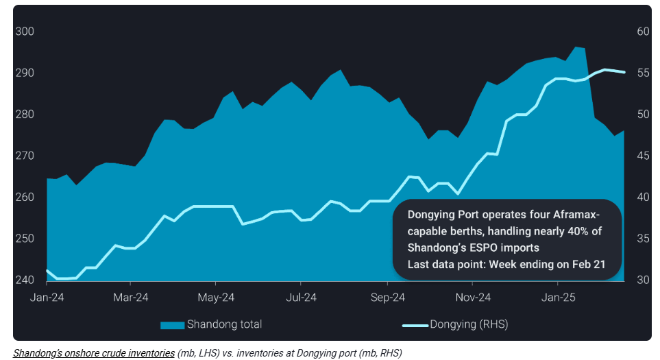
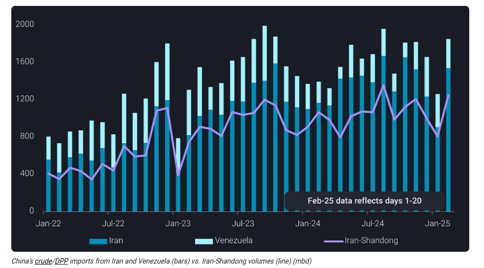
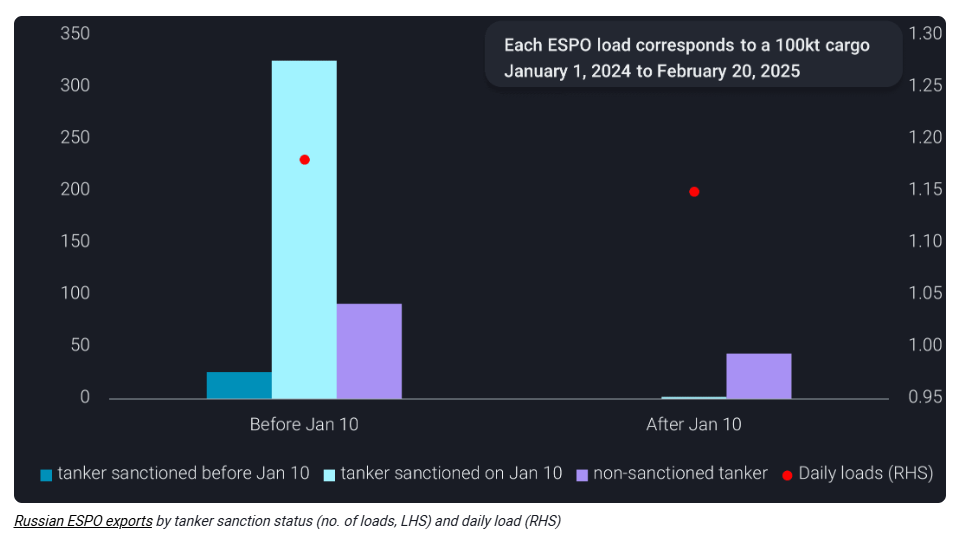
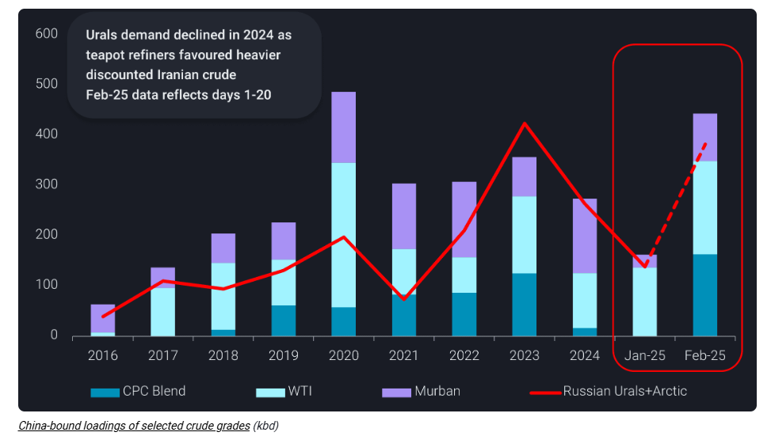

# China’s swift workarounds stabilise sanctioned oil flows

**Date:** February 24, 2025  
**Publisher:** Breakwave Advisors | **Category:** Market Insights  
**Original URL:** [https://www.breakwaveadvisors.com/insights/2025/2/23/chinas-swift-workarounds-stabilise-sanctioned-oil-flows](https://www.breakwaveadvisors.com/insights/2025/2/23/chinas-swift-workarounds-stabilise-sanctioned-oil-flows)  

---

China’s sanctioned oil imports are rebounding as supply chain adaptations take hold

*By*[*Emma Li*](https://www.linkedin.com/in/emma-li-73003443/)

In the weeks immediately following[Shandong’s shipping ban and the new OFAC sanctions](https://www.vortexa.com/insights/crude/shandongs-ban-on-ofac-sanctioned-tankers-put-teapots-crude-arrivals-at-risk/)on tankers involved in Russian and Iranian trade, Shandong teapot refiners—the main buyers of discounted sanctioned oil—reduced refinery runs even during the Spring Festival travel rush prep season. Meanwhile, Shandong’s onshore crude inventories rapidly declined, as teapots largely stuck to sanctioned oil despite port discharge slowdowns at state-run Shandong Port Group (SPG) terminals.

> **Figure 1: Στιγμιότυπο Οθόνης 2025 02 23 212408**  
> **Interactive Data & Source:** [Analytics Vortexa](https://analytics.vortexa.com/Historical?dateRange=2025-01-01T00%3A00%3A00.000Z__2025-02-28T23%3A59%3A59.999Z&metric=t&page=Historical&products=%5B%2254af755a090118dcf9b0724c9a4e9f14745c26165385ffa7f1445bc768f06f11%22%2C%225de0b00094e0fd7542c10f9f8a71b4008d55750f21dc905cda9b0f7f5f76bc08%22%5D&tabId=0bbf96e8-e0ac-4e55-abb9-b77745cb51ab&v=3&vessels=%5B%225f898da6ead4d4933397ffdaaae7441f767facdc44b108b5b06a338409202a03%22%5D) | [Local Asset](file:///C:/Users/Dell/Github/Shipping/corpus/03-breakwave/insights/2025/assets/2025-02-24_chinas-swift-workarounds-stabilise-sanctioned-oil-flows_img_cea3cf84ceb9ceb3cebcceb9cf8ccf84cf85_8325f73b1f48.png)

## Sanctioned-Tanker-Friendly Ports Emerge Within and Outside Shandong

To circumvent the restrictions, independent oil terminals at key ports outside Shandong—such as Dalian, Shanghai, Zhoushan, and Huizhou—began accepting sanctioned oil, including cargoes delivered by sanctioned tankers.

However, their impact remains limited due to relatively smaller storage capacities and additional freight costs associated with transferring barrels across provinces. As a result, these ports have been unable to fully alleviate the backlog of tankers waiting offshore.

In late January, key terminals under Dongying Port—the main ESPO receiving hub in northern Shandong—exited the Shandong Port Group by transferring SPG’s stake to private entities. This strategic shift helped sustain cargo discharges, including at least two sanctioned tankers, enabling crude inventories at Dongying Port to rise even as other Shandong terminals experienced operational slowdowns.

## Stranded Iranian Cargos Offloaded Into Shandong Via Sts

Despite Dongying’s swift adaptation, it has limited capacity to handle Iran’s VLCC-dominant cargos, as its berths are designed for 100kt-size tankers. In addition, the main Iranian oil receiving ports adhered to SPG’s ban. These constraints contributed to a slowdown in Iranian crude imports into Shandong, which fell below 800kbd in January—the lowest since February 2023—with significant discharge gaps mid-month.

In response, calls were made for non-sanctioned VLCCs to assist in offloading stranded cargoes. Since late January, at least eight VLCCs—either recently added to the dark fleet or idle since early 2024—have surfaced to facilitate Malaysia-to-China STS transfers.
As a result, China’s Iranian crude discharge rebounded to 1.3mbd between February 1-20, with Shandong-bound volumes surpassing 1mbd, slightly exceeding the 2024 average.

Market sources indicate that suppliers and traders absorbed additional demurrage and STS costs for January arrivals. Meanwhile, February/March-arrival Iranian crude discounts remained steady at $1/b below ICE Brent, suggesting that suppliers adjusted profit-sharing strategies to mitigate rising logistics expenses.

> **Figure 2: Στιγμιότυπο Οθόνης 2025 02 23 212554**  
> **Interactive Data & Source:** [Analytics Vortexa](https://analytics.vortexa.com/Historical?dateRange=2025-01-01T00%3A00%3A00.000Z__2025-02-28T23%3A59%3A59.999Z&metric=t&page=Historical&products=%5B%2254af755a090118dcf9b0724c9a4e9f14745c26165385ffa7f1445bc768f06f11%22%2C%225de0b00094e0fd7542c10f9f8a71b4008d55750f21dc905cda9b0f7f5f76bc08%22%5D&tabId=0bbf96e8-e0ac-4e55-abb9-b77745cb51ab&v=3&vessels=%5B%225f898da6ead4d4933397ffdaaae7441f767facdc44b108b5b06a338409202a03%22%5D) | [Local Asset](file:///C:/Users/Dell/Github/Shipping/corpus/03-breakwave/insights/2025/assets/2025-02-24_chinas-swift-workarounds-stabilise-sanctioned-oil-flows_img_cea3cf84ceb9ceb3cebcceb9cf8ccf84cf85_171398036419.png)

## Russia Shifts Non-Sanctioned Tankers to Prioritise Far East Espo Trade

Similarly, Russia has swiftly rebuilt a non-sanctioned fleet for its flagship Far East ESPO crude, enabling loadings at Kozmino Port to fully recover in February.

At least 17 non-sanctioned Aframax/LR2 or Suezmax tankers entered the ESPO trade between January 11 and February 20—either diverting from other sanctioned crude routes (especially Russia Baltics) or shifting from clean product transport. This influx of vessels has enabled a swift recovery in ESPO exports, with February loadings set to rebound to the 2024 average of 920kbd, up from 860kbd in January.

As Russia prioritises ESPO trade for its easier access to loyal Chinese buyers, more non-sanctioned vessels are ballasting towards Kozmino, reinforcing a fully non-sanctioned supply route and ensuring continued stability in Russia’s Far East crude exports.

Due to the quick response of new entrants, the Kozmino-to-Shandong freight rate has eased to around $6.50/b this week, down from January’s peak of over $9/b. Meanwhile, ESPO-delivered premiums have increased by $0.8-1/b m-o-m, signalling a rebound in ESPO FOB prices.

> **Figure 3: Στιγμιότυπο Οθόνης 2025 02 23 212716**  
> **Interactive Data & Source:** [Analytics Vortexa](https://analytics.vortexa.com/Historical?dateRange=2025-01-01T00%3A00%3A00.000Z__2025-02-28T23%3A59%3A59.999Z&metric=t&page=Historical&products=%5B%2254af755a090118dcf9b0724c9a4e9f14745c26165385ffa7f1445bc768f06f11%22%2C%225de0b00094e0fd7542c10f9f8a71b4008d55750f21dc905cda9b0f7f5f76bc08%22%5D&tabId=0bbf96e8-e0ac-4e55-abb9-b77745cb51ab&v=3&vessels=%5B%225f898da6ead4d4933397ffdaaae7441f767facdc44b108b5b06a338409202a03%22%5D) | [Local Asset](file:///C:/Users/Dell/Github/Shipping/corpus/03-breakwave/insights/2025/assets/2025-02-24_chinas-swift-workarounds-stabilise-sanctioned-oil-flows_img_cea3cf84ceb9ceb3cebcceb9cf8ccf84cf85_e2be0e11bdcf.png)

However, this focus on ESPO has significantly tightened non-sanctioned Aframax availability on other Russian routes, leading to a surge in stranded volumes on sanctioned tankers. This impact is particularly pronounced near ports facing Western scrutiny, where sanctioned tankers are now holding record-high volumes of crude with limited prospects of being accepted by Asian buyers.

While some Far East Sokol cargoes on sanctioned tankers have discharged at non-Shandong ports,[one non-sanctioned VLCC](https://analytics.vortexa.com/Historical?dateRange=2025-01-01T00%3A00%3A00.000Z__2025-02-28T23%3A59%3A59.999Z&metric=t&page=Historical&products=%5B%2254af755a090118dcf9b0724c9a4e9f14745c26165385ffa7f1445bc768f06f11%22%2C%225de0b00094e0fd7542c10f9f8a71b4008d55750f21dc905cda9b0f7f5f76bc08%22%5D&tabId=0bbf96e8-e0ac-4e55-abb9-b77745cb51ab&v=3&vessels=%5B%225f898da6ead4d4933397ffdaaae7441f767facdc44b108b5b06a338409202a03%22%5D)was deployed to transfer cargos from three sanctioned Aframaxes originally bound for India to Shandong refiners. This development also signals a potential uptick in Shandong’s demand for Russian Far East barrels, provided pricing becomes more favourable.

VLCCs may also step in to ease Aframax tightness in Russia’s Baltic and Black Sea routes. At least[three non-sanctioned VLCCs](https://analytics.vortexa.com/Map?page=Map&tabId=9ad2e045-fa1a-485e-92b4-e6b1bd5da3f4&v=3&vessels=%5B%22ff3411ca76c050a3813608d2f32f27679f0d8d079aca5599f01d3d3504b88c37%22%2C%227233d2849bf0137298fcac95eb2c24fb854d36b4956e8bf81e43692d3ae8191c%22%2C%2267e8d02861b71be607e2c09f8c8294f0c58571f1b914361ee8cab922248db0c7%22%5D)are currently ballasting toward Baltics, after delivering Russian Urals or Arctic crude to Asian buyers last year. This suggests a likely resumption of STS-to-VLCC transfers for long-haul Russian deliveries, as non-sanctioned Aframax and Suezmax availability continues to tighten.

## China to Revert to Russian Urals Amid Retaliatory Tariffs and Narrowing Brent-Dubai Spread

China’s oil majors, though relatively minor buyers of Russian Urals and Arctic crude—averaging 270kbd in 2024 compared to Indian refiners—moved swiftly to secure alternative supplies following the OFAC sanction decision to hedge against shipping risks.

These purchases include late Jan/Early Feb-loading US WTI, February-loading Kazakhstan CPC Blend and UAE Murban crude, with the combined volume set to fully offset any potential losses from long-haul Russia barrels in the coming months.

However, China is likely to pivot back to these Russian barrels soon, due to Beijing’s 10% retaliatory tariff on US crude imposed in early February. In addition, the narrowing Brent-Dubai spread since mid-January and Middle Eastern OSP hikes are keeping Russian long-haul barrels cost-competitive.

Preliminary flow data suggests that Russian Urals and Arctic crude arrivals could rebound to over 350kbd in March and April.

> **Figure 4: Στιγμιότυπο Οθόνης 2025 02 23 212815**  
> **Interactive Data & Source:** [Vortexa](https://www.vortexa.com//oil-gas-data-traders-analysts-data-scientists?gclid=Cj0KCQjw8_qRBhCXARIsAE2AtRZKOvMnbilZ_6_91d7huSFFy71pWLrnPwGwOHVzXsmsG-1a1mZnQw8aAt89EALw_wcB&hsa_acc=1782073842&hsa_ad=548425387665&hsa_cam=14746637662&hsa_grp=125038601902&hsa_kw=&hsa_mt=&hsa_net=adwords&hsa_src=g&hsa_tgt=dsa-1431852288425&hsa_ver=3&utm_campaign=%5BCD%5D%20-%20DSA%20-%20EMEA&utm_medium=cpc&utm_medium=ppc&utm_source=google&utm_source=adwords&utm_term=) | [Local Asset](file:///C:/Users/Dell/Github/Shipping/corpus/03-breakwave/insights/2025/assets/2025-02-24_chinas-swift-workarounds-stabilise-sanctioned-oil-flows_img_cea3cf84ceb9ceb3cebcceb9cf8ccf84cf85_6b449bdf3cfa.png)

## China’s Sanctioned Oil Demand Will Remain Capped in the Near Term

While China continues to dominate Russian Far East crude imports, refiners are expected to uphold strict non-sanctioned tanker requirements despite initial US-Russia dialogue. Demand for Russian long-haul barrels is likely to remain subdued, as teapot refiners still favour deeper discounted Iranian crude.

At the same time, concerns over a potential renewal of maximum pressure on Iran have not significantly altered market sentiment, especially after flows resumed. However, the likelihood of a further rise in Iranian exports remains low, as current purchase costs are already testing the affordability threshold for key buyers.

Data Source:[Vortexa](https://www.vortexa.com//oil-gas-data-traders-analysts-data-scientists?gclid=Cj0KCQjw8_qRBhCXARIsAE2AtRZKOvMnbilZ_6_91d7huSFFy71pWLrnPwGwOHVzXsmsG-1a1mZnQw8aAt89EALw_wcB&hsa_acc=1782073842&hsa_ad=548425387665&hsa_cam=14746637662&hsa_grp=125038601902&hsa_kw=&hsa_mt=&hsa_net=adwords&hsa_src=g&hsa_tgt=dsa-1431852288425&hsa_ver=3&utm_campaign=%5BCD%5D%20-%20DSA%20-%20EMEA&utm_medium=cpc&utm_medium=ppc&utm_source=google&utm_source=adwords&utm_term=)

---

**Tags:** Crudeoil, Markets, Shipping  
