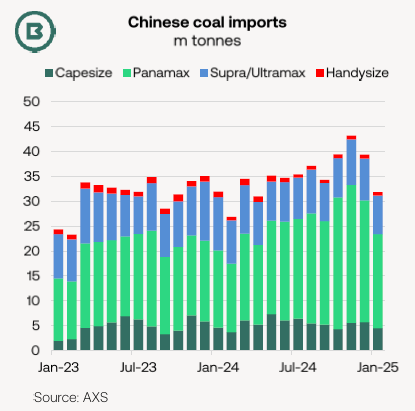
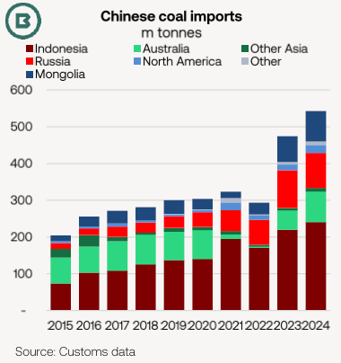
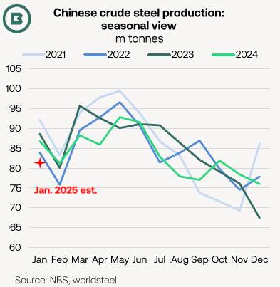
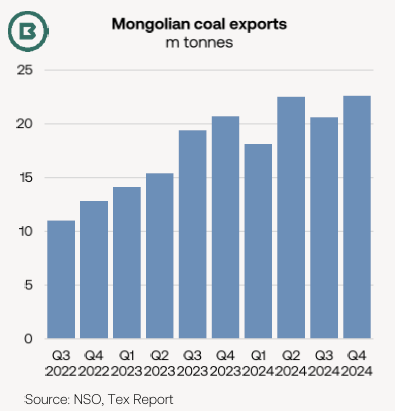

# China’s coal imports in 2025

**Date:** February 26, 2025  
**Publisher:** Breakwave Advisors | **Category:** Market Insights  
**Original URL:** [https://www.breakwaveadvisors.com/insights/2025/2/26/chinas-coal-imports-in-2025](https://www.breakwaveadvisors.com/insights/2025/2/26/chinas-coal-imports-in-2025)  

---

· Echoing the quarterly trends in both the Q1 2023 and 2024, the current quarter has seen a slowing in China’s coal import pace from the Q4.

· Panamaxes have benefitted the most from the massive coal import gains into China in 2023-24.

· Reports of suspended purchases of imported thermal coal into China refocused attention on the country’s underlying import demand.

The practice in China of producing combined customs data for January and February (to offset changes in New Year holidays) means shipment data takes the spotlight.

The chart, below, indicates that**China’s coal imports in January**experienced a seasonal monthly drop, typical of recent years. At 31.9m tonnes, the AXS estimate for seaborne imports is**in line with the same month of 2024**and some**7m tonnes above January 2023**.

Incomplete shipment data for**February**suggest a**year-on-year shortfall**, however.

> **Figure 1: Declining Domestic Thermal Coal Prices in China Have Helped**  
> *Declining domestic thermal coal prices in China have helped narrow the spread with Australian and Indonesian FOB prices, two of the main suppliers to China (see chart, below).*  
> [Local Asset](file:///C:/Users/Dell/Github/Shipping/corpus/03-breakwave/insights/2025/assets/2025-02-26_chinas-coal-imports-in-2025_img_46df-image-0-1740500920119_a6a4688b189a.png)

Although no official figures for electricity generation in China have been released for January 2025, it could be expected that a comparatively mild winter would have reduced energy consumption, so maintaining producer inventories of thermal coal near the high levels recorded by producers in the Q4 2024.

Near-term domestic coal availability at the country’s load ports in the north is greater than last year. According to McCloskey, coal inventories at nine main load ports on 20 February were up 8.4m tonnes YoY to 29.5m tonnes.

Against this background, it was reported on 21 February that China Energy had suspended import tenders for various power plants to prioritise domestic coal sales. It should be mentioned that term contracts still run as before.

Last year China Energy imported 40m tonnes of coal through its coal energy arm Shenhua, using 28m tonnes in its power stations and trading the rest.

> **Figure 2: 273e Image 1 1740500938410**  
> [Local Asset](file:///C:/Users/Dell/Github/Shipping/corpus/03-breakwave/insights/2025/assets/2025-02-26_chinas-coal-imports-in-2025_img_273e-image-1-1740500938410_4a5b3bc71617.png)

The spread between the Chinese domestic price of 5,500kc NAR thermal coal and the equivalent FOB for Australian coal has declined to $25-26/t from $34-35/t at the same point last year. Meanwhile, the corresponding spread with Indonesian coal has reduced from $16-17/t a year ago to $14-15/t at present.

A desire to minimise costs has also been attributed to import interest in “ultra low-rank” coal. Indonesia has been a leading source of low-cv coal. Heavy rainfall has limited supply from Indonesia this quarter.

**Domestic coking coal prices**in China have also suffered falls since October.

In the absence of January data from the National Bureau of Statistics, the World Steel Association (worldsteel) has estimated Chinese crude steel output at 81.9m tonnes, up 7.8% on the previous month, but down -5.6% YoY.

The chart, below, puts worldsteel’s January estimate in seasonal context.

> **Figure 3: 1c43 Image 2 1740500956948**  
> [Local Asset](file:///C:/Users/Dell/Github/Shipping/corpus/03-breakwave/insights/2025/assets/2025-02-26_chinas-coal-imports-in-2025_img_1c43-image-2-1740500956948_5c295ff1b601.png)

### Mongolian Coal Export Expansion

Mongolia has been a growing source of overland supply into China, particular for coking coal.

Mongolian coal exports reached 83.8m tonnes in 2024, the National Statistic Office (NSO) confirmed, a yearly gain of 14.1m tonnes. An export target of 100m tonnes has been set for 2025, according to McCloskey.

In the longer term, another cross-border rail line from Mongolia into China (between Ganqmod and Gashuun Sukhait), with a targeted commissioning date of 2026 and 30m tonnes/year capacity, was announced this month.

Also under construction are rail links from the Nariin Sukhait and Tavan Tolgoi mining areas into China.

> **Figure 4: E352 Image 3 1740500973587**  
> [Local Asset](file:///C:/Users/Dell/Github/Shipping/corpus/03-breakwave/insights/2025/assets/2025-02-26_chinas-coal-imports-in-2025_img_e352-image-3-1740500973587_30ab6d5523dc.png)

---

**Tags:** Drybulk, Shipping, Markets  
