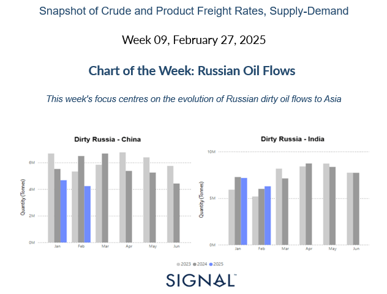
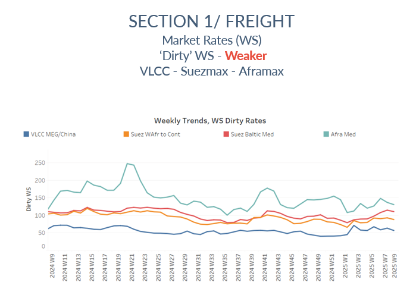
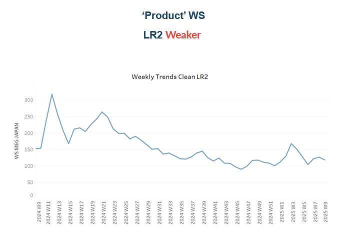
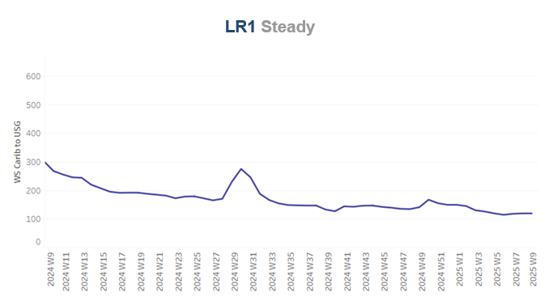
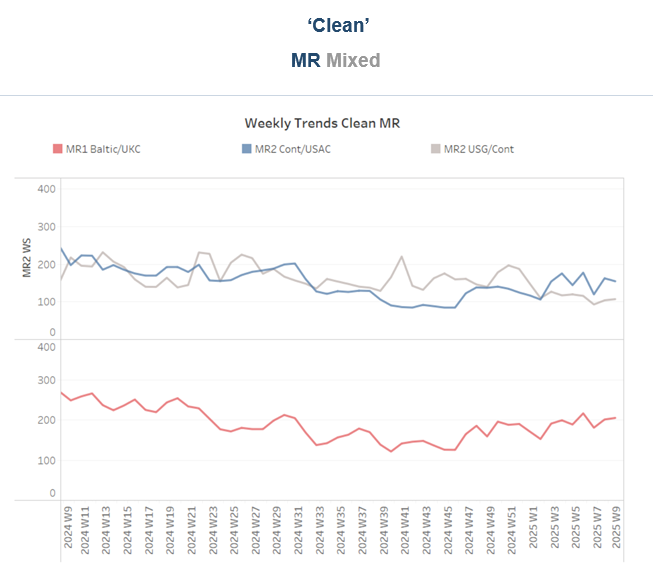
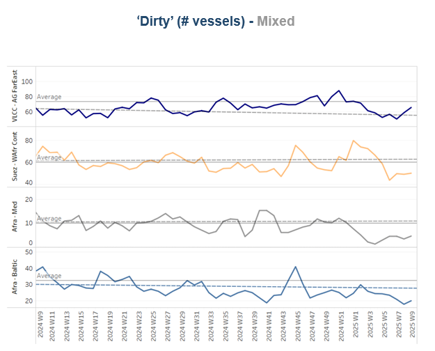
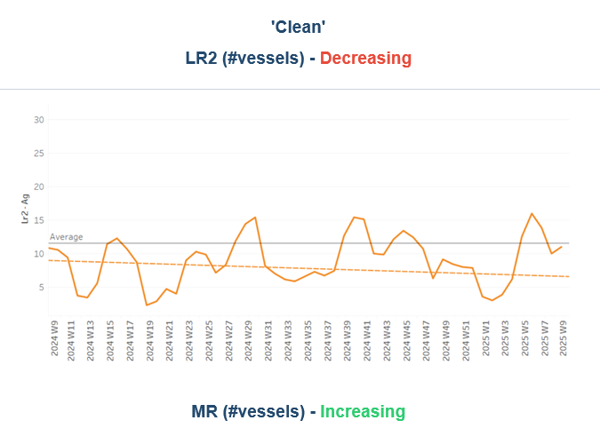
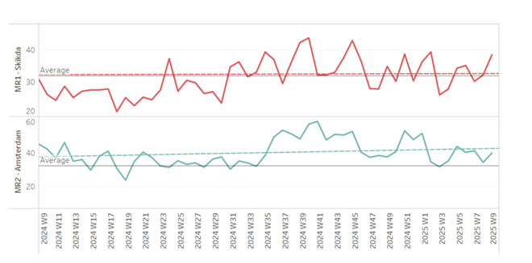
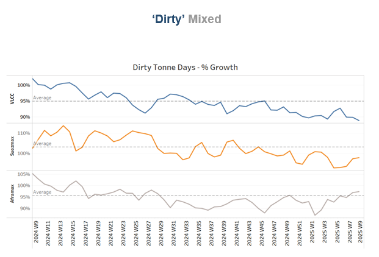
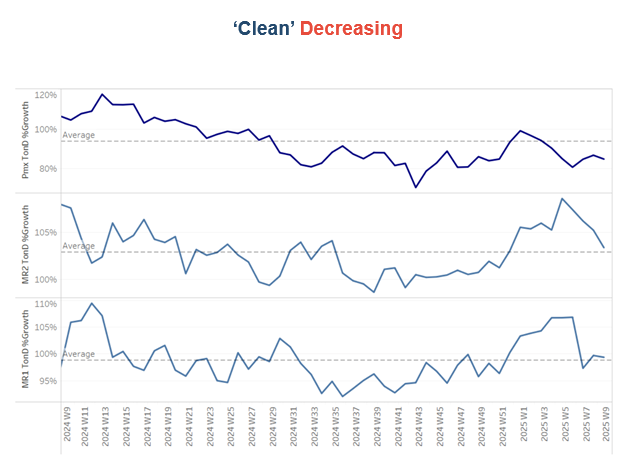

# Russian Oil Flows

**Date:** February 27, 2025  
**Publisher:** Breakwave Advisors | **Category:** Market Insights  
**Original URL:** [https://www.breakwaveadvisors.com/insights/2025/2/27/russian-oil-flows](https://www.breakwaveadvisors.com/insights/2025/2/27/russian-oil-flows)  

---

## Tanker - Weekly Market Monitor

### ​

> **Figure 1: Screenshot 2025 02 27 10.49.36**  
> **Interactive Data & Source:** [Signal Ocean Platform](https://www.thesignalgroup.com/signal-ocean-platform) | [Local Asset](file:///C:/Users/Dell/Github/Shipping/corpus/03-breakwave/insights/2025/assets/2025-02-27_russian-oil-flows_img_screenshot2025-02-27104936_a69994670687.png)

### Reckoning the Past: Russian Oil’s Journey to Asia

Before the Ukraine war, Russia had a diverse oil export market, supplying crude to Europe, China, and other regions without major restrictions. However, Western sanctions in response to Russia’s invasion of Ukraine in 2022 reshaped global oil trade dynamics. The December 5, 2022, introduction of the $60 per barrel price cap by the G7 and the European Union marked a pivotal shift. European refiners, once key buyers, turned away from Russian crude, forcing Moscow to pivot towards alternative buyers—primarily China and India—who were eager to take advantage of discounted oil.

During 2023 and much of 2024, China and India absorbed large volumes of Russian crude, benefiting from discounts that at times ranged from $15 to $30 per barrel below Brent crude prices. India emerged as a major player, refining Russian crude and even re-exporting some refined products to Western markets. Russia also used a "shadow fleet" of aging tankers operating under obscure registries, helping circumvent sanctions and transport crude without relying on Western insurance and financial services.

### The Impact of Tightened U.s. Sanctions on Current Trade

The latest round of U.S. sanctions, particularly those imposed on January 10, 2025, have significantly disrupted this trade. Targeting 183 vessels linked to Russian oil shipments, as well as key Russian companies like Gazprom Neft and Surgutneftegas, the restrictions have raised transportation costs and risks associated with moving Russian oil to China and India. For India, these new sanctions have introduced uncertainty. While pre-contracted shipments are allowed until March 12, 2025, traders are now struggling with increased freight costs and a shrinking pool of vessels willing to handle Russian oil. The sanctions have also impacted payment mechanisms, with Indian refiners facing difficulties settling transactions outside the U.S. financial system. As a result, some Indian refineries are considering diversifying their crude sources, turning to Middle Eastern and African suppliers to mitigate risks.

China, with its strong economic and political ties to Russia, has been somewhat more resilient. However, even Chinese refiners are facing logistical hurdles, as shipping costs for Russian crude have surged due to the risk premium associated with sanctioned vessels. Additionally, secondary sanctions threaten to deter Chinese financial institutions from facilitating Russian oil payments, adding another layer of complexity.

### The Future of Russian Oil Trade with Asia

While Russia’s oil trade with China and India remains intact, the tightening sanctions regime is eroding the cost advantages that made Russian crude attractive. Higher transportation costs, regulatory scrutiny, and payment challenges are forcing Asian buyers to rethink their reliance on Russian oil. This could accelerate diversification efforts, with alternative suppliers from the Middle East, Africa, and even Latin America stepping in to fill the gap.

In response, Russia is likely to continue employing shadow fleet tactics and offer deeper discounts to retain market share. However, if sanctions further tighten—especially with stronger enforcement mechanisms—Moscow may struggle to sustain its oil exports at current levels.

Based on the Signal Ocean Platform Dirty Flows Oil Time Series and the latest downward revisions in monthly oil flows from Russia to China and India, the impact of U.S. sanctions is becoming evident.

### Impact on China: Declining Monthly Oil Imports

The left-hand chart in the image, "Dirty Russia - China," shows that Russian crude shipments to China in early 2025 have dropped compared to 2023 and 2024 levels. The most significant decline occurs in February 2025, with volumes projected to end 26% lower than the previous two years. This downward trend has also led to revised projections for March, April, and May 2025, indicating a continued decline.

### Impact on India: More Resilient But Facing Pressure

The right-hand chart, "Dirty Russia - India," shows a less pronounced decline compared to China, but there is still a notable downward revision for February 2025. January 2025 volumes remain comparable to 2023 and 2024, likely reflecting pre-contracted shipments before the January 10 sanctions came into effect. By February 2025, a decline is evident, indicating that tighter enforcement of sanctions is beginning to restrict India's ability to secure Russian crude. From March to June, India seems to continuously try to adjust its oil sourcing strategies, possibly securing alternative supply chains or negotiating new payment arrangements.

> **Figure 2: Screenshot 2025 02 27 10.50.04**  
> **Interactive Data & Source:** [Signal Ocean Platform](https://www.thesignalgroup.com/signal-ocean-platform) | [Local Asset](file:///C:/Users/Dell/Github/Shipping/corpus/03-breakwave/insights/2025/assets/2025-02-27_russian-oil-flows_img_screenshot2025-02-27105004_b08af4a76df8.png)

Sentiment in the**dirty freight market**weakened toward the end of the month, with VLCC MEG/China routes struggling to maintain the momentum of the previous week.

- **VLCC**freight rates for**MEG-China**routes stood below WS60, marking a 14% weekly decrease. Suezmax rates for**West Africa to continental Europe**reached WS88, reflecting a 13% monthly decrease Meanwhile, Suezmax rates on the Baltic-Mediterranean route held levels above WS100, up 20% month-over-month.
- **Aframax**freight rates in the**Mediterranean**have struggled to sustain the bullish momentum seen in previous days, currently standing at WS130, marking a 4% decline from the past week.

> **Figure 3: Screenshot 2025 02 27 10.50.16**  
> **Interactive Data & Source:** [Signal Ocean Platform](https://www.thesignalgroup.com/signal-ocean-platform) | [Local Asset](file:///C:/Users/Dell/Github/Shipping/corpus/03-breakwave/insights/2025/assets/2025-02-27_russian-oil-flows_img_screenshot2025-02-27105016_b2f607a60926.png)

**LR2**AG freight rates have dropped to approximately WS120, reflecting a 7% decline compared to the previous week.

> **Figure 4: Screenshot 2025 02 27 10.50.24**  
> **Interactive Data & Source:** [Signal Ocean Platform](https://www.thesignalgroup.com/signal-ocean-platform) | [Local Asset](file:///C:/Users/Dell/Github/Shipping/corpus/03-breakwave/insights/2025/assets/2025-02-27_russian-oil-flows_img_screenshot2025-02-27105024_6c99acd57c06.png)

**Panamax**Carib-to-USG rates held steady at WS120 for another week, though they remain 65% lower than the same period last year.

> **Figure 5: Screenshot 2025 02 27 10.50.51**  
> **Interactive Data & Source:** [Signal Ocean Platform](https://www.thesignalgroup.com/signal-ocean-platform) | [Local Asset](file:///C:/Users/Dell/Github/Shipping/corpus/03-breakwave/insights/2025/assets/2025-02-27_russian-oil-flows_img_screenshot2025-02-27105051_124eb91ac6b5.png)

**MR1**freight rates for Baltic-to-Continent shipments remained firm above WS200, maintaining similar momentum to that of a month ago.

Meanwhile,**MR2**rates for shipments from the Continent to the US Atlantic Coast (USAC) recorded a weekly downward revision and stood at WS155, marking a 9% weekly monthly decrease.**MR2**rates on the US Gulf-to-Continent route remained steady above WS100, showing signs of resilience as February approaches its end.

### Section 2/ Supply

> **Figure 6: Screenshot 2025 02 27 10.51.12**  
> **Interactive Data & Source:** [Signal Ocean Platform](https://www.thesignalgroup.com/signal-ocean-platform) | [Local Asset](file:///C:/Users/Dell/Github/Shipping/corpus/03-breakwave/insights/2025/assets/2025-02-27_russian-oil-flows_img_screenshot2025-02-27105112_f2cc5ebfc45f.png)

The availability of crude tankers continued to decline, with recent estimates indicating that levels remained below the yearly average on major routes as the month drew to a close.

- **VLCC Ras Tanura**: The ship count is now around 66, reflecting a decline of 7 compared to the annual average and 20 fewer than the levels recorded before the end of December.
- **Suezmax Wafr**: The current ship count stands at 50, aligning with the trend of the past two weeks but remaining 20 below the annual average, indicating a further downward correction at the start of February.
- **Aframax Med**: The vessel count has remained consistently below the annual average since early January, with recent activity indicating a soft rise, but still lower than the highs of the end year.
- **Aframax Baltic**: The number of ships has remained below the annual average of 30 and stood at around 20 — almost nine fewer than six weeks ago.

> **Figure 7: Screenshot 2025 02 27 10.51.19**  
> **Interactive Data & Source:** [Signal Ocean Platform](https://www.thesignalgroup.com/signal-ocean-platform) | [Local Asset](file:///C:/Users/Dell/Github/Shipping/corpus/03-breakwave/insights/2025/assets/2025-02-27_russian-oil-flows_img_screenshot2025-02-27105119_3204a1458fcd.png)

> **Figure 8: Screenshot 2025 02 27 10.51.24**  
> **Interactive Data & Source:** [Signal Ocean Platform](https://www.thesignalgroup.com/signal-ocean-platform) | [Local Asset](file:///C:/Users/Dell/Github/Shipping/corpus/03-breakwave/insights/2025/assets/2025-02-27_russian-oil-flows_img_screenshot2025-02-27105124_015cd77e4d55.png)

- **Clean LR2 AG Jubail**: We continue to observe a downward trend, with the number of vessels hovering slightly below the annual average of 11, followed by a significant spike three weeks ago.
- **Clean MR**: The number of ships at the Algerian port of Skikda spiked above the annual average and stood at 39, 8 higher than the annual average of 30. Meanwhile, MR2 activity in Amsterdam continued its downward trend but remained slightly above the annual average.

### Section 3/ Demand (Tonne Days)

> **Figure 9: Screenshot 2025 02 27 10.51.30**  
> **Interactive Data & Source:** [Signal Ocean Platform](https://www.thesignalgroup.com/signal-ocean-platform) | [Local Asset](file:///C:/Users/Dell/Github/Shipping/corpus/03-breakwave/insights/2025/assets/2025-02-27_russian-oil-flows_img_screenshot2025-02-27105130_141e37e736b0.png)

**Dirty**tonne days: The growth rate of dirty tonne-days for VLCCs remained weak, continuing to lag well below the annual trend. In contrast, the Suezmax segment has shown a stronger recovery since the end of the previous week, while Aframax activity has picked up pace, surpassing the annual trend for the first time since late last year.

> **Figure 10: Screenshot 2025 02 27 10.51.35**  
> **Interactive Data & Source:** [Signal Ocean Platform](https://www.thesignalgroup.com/signal-ocean-platform) | [Local Asset](file:///C:/Users/Dell/Github/Shipping/corpus/03-breakwave/insights/2025/assets/2025-02-27_russian-oil-flows_img_screenshot2025-02-27105135_9a1c6bf1d254.png)

**Panamax**tonne days: The growth rate remained well below the recent weekly annual average, with not yet signs of a rebound.

**MR**tonne-days: The growth rate for the MR segment has continued to decline, with levels struggling to maintain a sentiment above the annual average for the end of the month.

Data Source:[Signal Ocean Platform](https://www.thesignalgroup.com/signal-ocean-platform)
