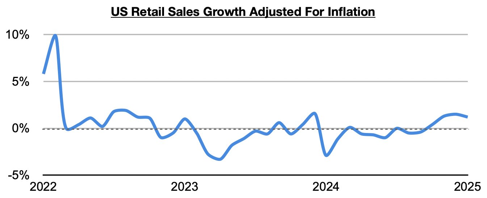
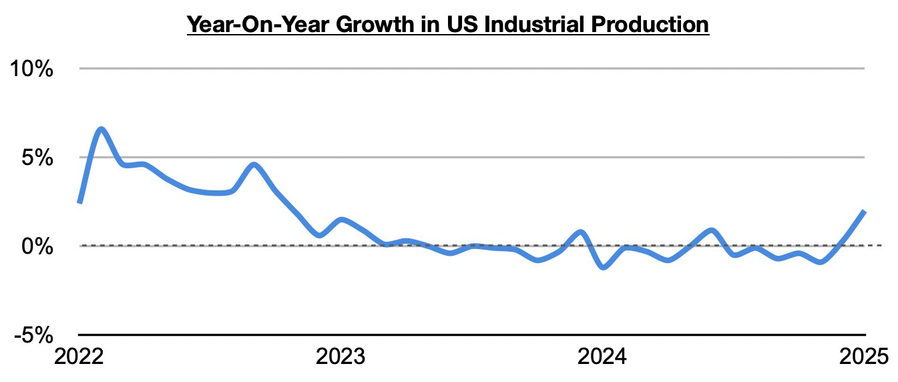

# US Turnaround Began Last Year

**Date:** February 27, 2025  
**Publisher:** Breakwave Advisors | **Category:** Market Insights  
**Original URL:** [https://www.breakwaveadvisors.com/insights/2025/2/27/us-turnaround-began-last-year](https://www.breakwaveadvisors.com/insights/2025/2/27/us-turnaround-began-last-year)  

---

*By*[*Jeffrey Landsberg*](https://www.linkedin.com/in/jeffrey-landsberg-70ab957/)

As we have been highlighting in Commodore Research's Weekly Executive Reports and Weekly China Report, conditions in the global economy have been mixed at best, and overall China has continued to fare better than most major economies. One new significant change in recent months, though, is that conditions in the United States have drastically improved (the changes are independent of politics and unrelated to the new administration). With the United States being an engine of growth and leader for the overall global economy, it is significant and helpful that a drastic improvement here has finally occurred.

Particularly noteworthy is that each of the last four months have seen retail spending growth in the United States exceed inflation. Before this period, retail spending growth had come in under inflation during seventeen of the prior twenty-three months — showing that during that time, Americans were purchasing less goods than they did one year prior, which to us is a telltale sign of recession. Now, though, the last four months have seen a dramatic change..

> **Figure 1: 242**  
> [Local Asset](file:///C:/Users/Dell/Github/Shipping/corpus/03-breakwave/insights/2025/assets/2025-02-27_us-turnaround-began-last-year_img_242_db0898c79110.jpg)

Also experiencing a turnaround has been US industrial production, including manufacturing production (which accounts for approximately 75% of industrial production). US industrial production has now grown on a year-on-year basis for two straight months, including most recently by 2%. Before these last two months, US industrial production had contracted on a year-on-year basis during ten of the prior thirteen months.

> **Figure 2: 241**  
> [Local Asset](file:///C:/Users/Dell/Github/Shipping/corpus/03-breakwave/insights/2025/assets/2025-02-27_us-turnaround-began-last-year_img_241_8d2ed8b72ee8.jpg)

Important is that excluding years when coronavirus restrictions were in place, the 2% year-on-year growth most recently seen in US industrial production has marked the strongest growth seen since 2018.

---

**Tags:** Economy, Usa, Shipping  
