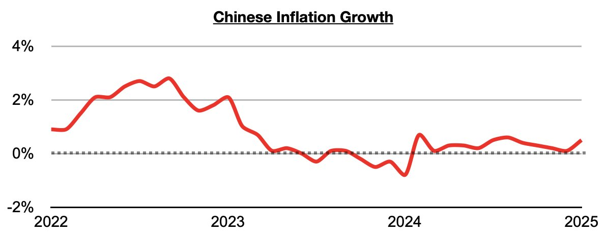
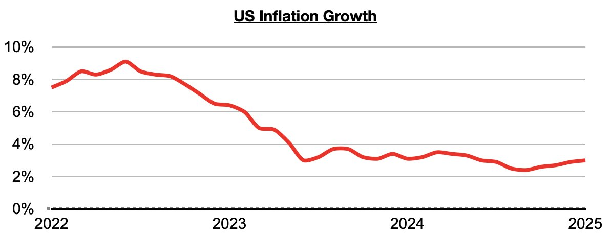
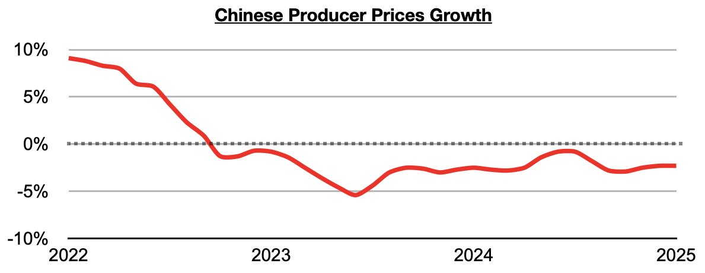

# China Remains Uniquely Positioned to Carry Out Stimulus

**Date:** February 28, 2025  
**Publisher:** Breakwave Advisors | **Category:** Market Insights  
**Original URL:** [https://www.breakwaveadvisors.com/insights/2025/2/28/china-remains-uniquely-positioned-to-carry-out-stimulus](https://www.breakwaveadvisors.com/insights/2025/2/28/china-remains-uniquely-positioned-to-carry-out-stimulus)  

---

*By*[*Jeffrey Landsberg*](https://www.linkedin.com/in/jeffrey-landsberg-70ab957/)

As we discussed in Commodore Research's most recent Weekly China Report, inflation in China most recently came in at 0.5% in January. This is the highest inflation seen in China since January, but it is still relatively low compared to other major economies.

> **Figure 1: 241**  
> [Local Asset](file:///C:/Users/Dell/Github/Shipping/corpus/03-breakwave/insights/2025/assets/2025-02-28_china-remains-uniquely-positioned-to-carry-out-stimulus_img_241_51d63808a3af.jpg)

Inflation in the United States, for example, came in at 3% in January.

> **Figure 2: 242**  
> [Local Asset](file:///C:/Users/Dell/Github/Shipping/corpus/03-breakwave/insights/2025/assets/2025-02-28_china-remains-uniquely-positioned-to-carry-out-stimulus_img_242_a83b77643adc.jpg)

Also significant in China is that producer prices also remain in a year-on-year contraction.

> **Figure 3: 243**  
> [Local Asset](file:///C:/Users/Dell/Github/Shipping/corpus/03-breakwave/insights/2025/assets/2025-02-28_china-remains-uniquely-positioned-to-carry-out-stimulus_img_243_a75b8852d02b.jpg)

Overall, with inflation long remaining relatively low in China, its government is continuing to be afforded a luxury of more safely being able to carry out inflationary measures compared to much of the rest of the world including the United States. We continue to expect that more significant stimulus measures will be rolled out in China this year.

---

**Tags:** China, Economy, Markets  
