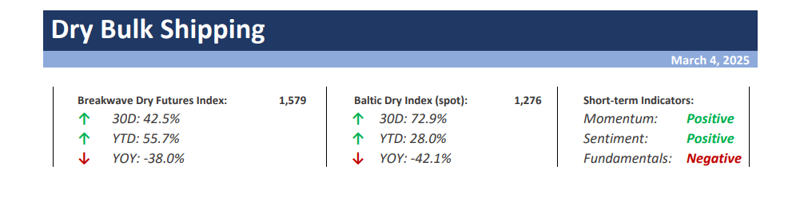
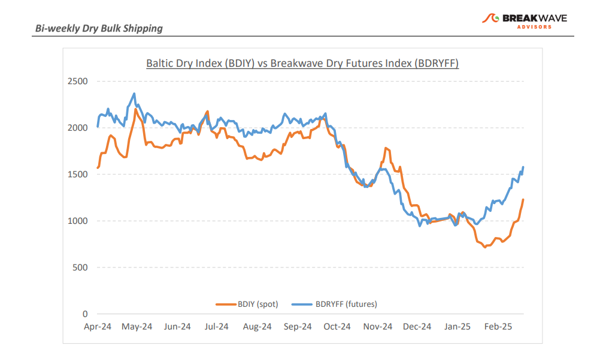
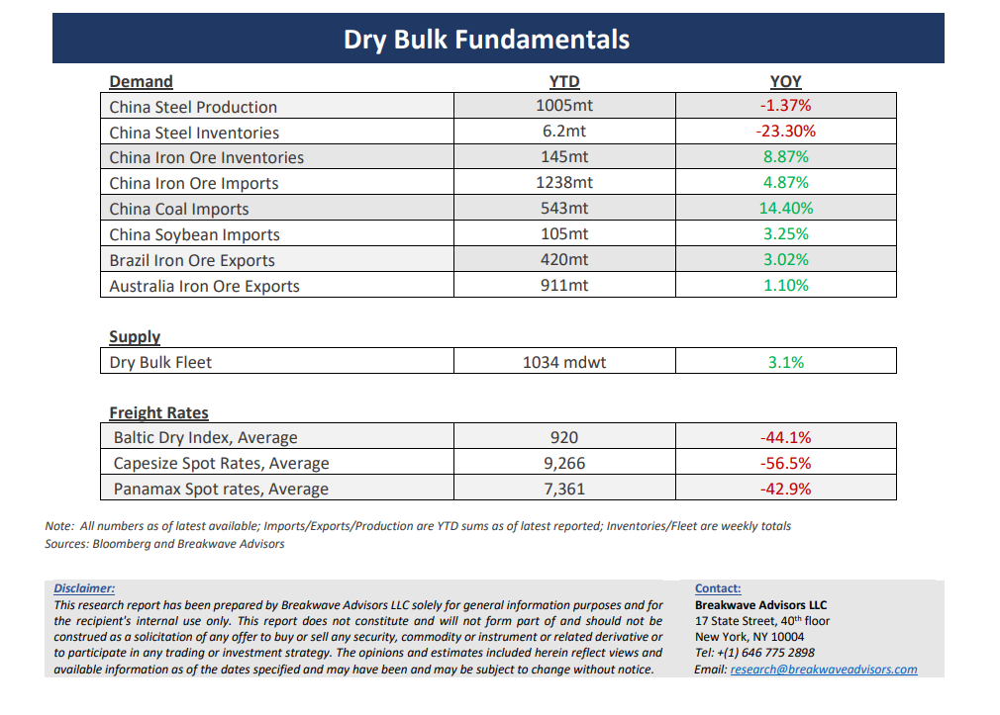

# Breakwave Bi-Weekly Dry Bulk Report - March 4, 2025

**Date:** March 04, 2025  
**Publisher:** Breakwave Advisors | **Category:** Market Insights  
**Original URL:** [https://www.breakwaveadvisors.com/insights/202534dry-87w52kk487](https://www.breakwaveadvisors.com/insights/202534dry-87w52kk487)  

---

> **Figure 1: Cea3cf84ceb9ceb3cebcceb9cf8ccf84cf85**  
> [Local Asset](file:///C:/Users/Dell/Github/Shipping/corpus/03-breakwave/insights/2025/assets/2025-03-04_202534dry-87w52kk487_img_cea3cf84ceb9ceb3cebcceb9cf8ccf84cf85_7082baa8cb2d.png)

•**Contango Vanishes as Capesize Rates Surge on the Back of Demand for March Vessels**– The volatility of dry bulk spot rates has once again reaffirmed the principle that no contango is too steep to overcome. Within days, Capesize spot rates surged to nearly match an exceptionally steep futures curve.**Concurrent strong demand waves**for ships in Brazil (iron ore) and in West Africa (bauxite) created a scramble for mid-to-late March vessels, despite the continued availability of spot ships. In**Australia**, iron ore cargo**demand rebounded**sharply following significant weather-related disruptions during most of February, resulting in a remarkable increase in spot rates within the region. Overall, the market has stabilized in line with seasonal trends, with the futures curve indicating further gains ahead. However, we believe that the next leg higher will**require strength in the sub-Cape sectors**, which are currently lacking. Grain shipments into China remain sluggish, as trade tariffs and ongoing uncertainty continue to weigh on sentiment. Additionally, the**expected seasonal uptick in Panamax**spot rates has**yet to materialize**. We anticipate a**brief pause in the upward movement**in spot rates in the near term, with macroeconomic developments over the coming weeks playing a critical role in shaping market direction. Key**upcoming events**(detailed below) could drive**significant volatility**in the shipping market, potentially reshaping trade routes, demand forecasts, and long-term global shipping trends.

•**US Pushes for Tariffs and Fees for Chinese-related Ships, while China Decides on Economic Stimulus**– Once again, trade—and consequently, shipping—takes center stage amid economic uncertainty. While the U.S. accounts for only a small portion of global dry bulk trade, it remains a**crucial component of sub-Cape demand,**particularly in the grain sector. In recent years,**China has been diversifying**its grain imports away from the U.S., negatively impacting Panamax rates. It remains to be seen whether**U.S. tariff-related negotiations**could prompt a reversal of this trend. Additionally, discussions surrounding**potential charges**on**Chinese-built or Chinese-controlled ships**calling at U.S. ports could lead to significant shifts in trading patterns. Such measures could**drive up freight costs**in the Atlantic and cause disruptions in tonnage availability during certain periods. As these policies are relatively new with little historical precedent, their full impact remains uncertain. However, restrictions on port access generally result in**higher costs for end consumers.**Complicating this landscape further,**China’s National People’s Congress**(NPC) is expected to**announce major policy initiatives**aimed at achieving ~5% GDP growth in 2025 and reversing disinflation, with a potential inflation target of ~2%. Such efforts will likely involve substantial**government stimulus,**but it remains unclear whether such measures will benefit the steel-driven construction sector, as recent signals suggest a stronger focus on boosting consumer demand.

•**Our Long-term View**– The last few years have been characterized by increased geopolitical uncertainty. Going forward, we expect such events to continue to affect global trade and have a meaningful impact on effective vessel supply. Combined with the potential for a multi-year cyclical rebound in China’s economic activity following the recent economic turmoil, dry bulk shipping should experience higher volatility on top of a secular tightness driven by stable bulk commodity demand and a slower fleet growth owing to a relatively low orderbook.

> **Figure 2: Cea3cf84ceb9ceb3cebcceb9cf8ccf84cf85**  
> [Local Asset](file:///C:/Users/Dell/Github/Shipping/corpus/03-breakwave/insights/2025/assets/2025-03-04_202534dry-87w52kk487_img_cea3cf84ceb9ceb3cebcceb9cf8ccf84cf85_b282eea55c74.png)

> **Figure 3: Cea3cf84ceb9ceb3cebcceb9cf8ccf84cf85**  
> [Local Asset](file:///C:/Users/Dell/Github/Shipping/corpus/03-breakwave/insights/2025/assets/2025-03-04_202534dry-87w52kk487_img_cea3cf84ceb9ceb3cebcceb9cf8ccf84cf85_8e43f8f38aed.png)

### Subscribe:
