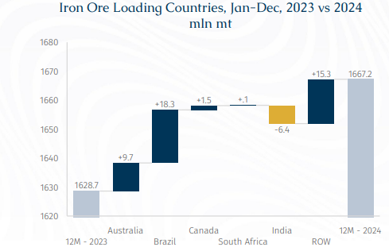
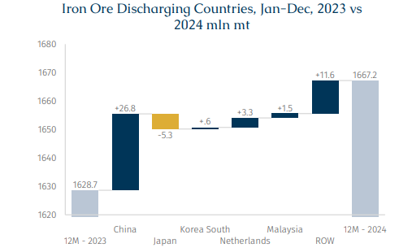
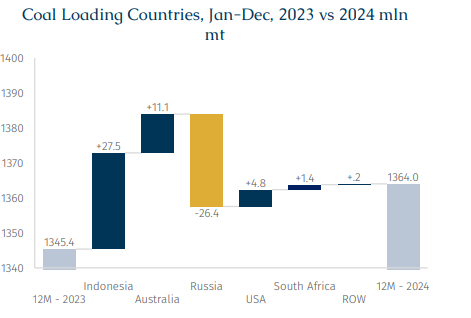
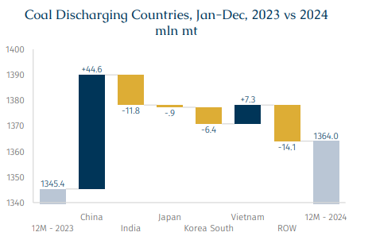
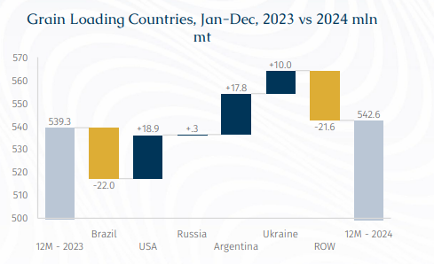
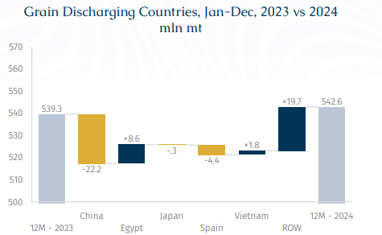
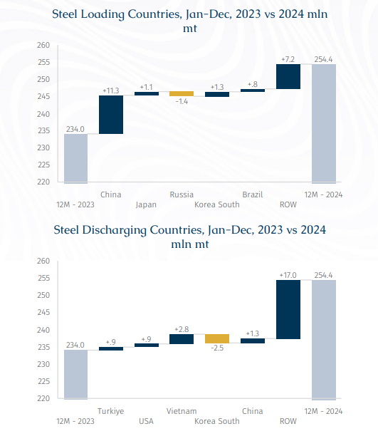

# The Commodities Jigsaw Puzzle: Recap & Outlook

**Date:** March 04, 2025  
**Publisher:** Breakwave Advisors | **Category:** Market Insights  
**Original URL:** [https://www.breakwaveadvisors.com/insights/2025/3/4/the-commodities-jigsaw-puzzle-recap-amp-outlook](https://www.breakwaveadvisors.com/insights/2025/3/4/the-commodities-jigsaw-puzzle-recap-amp-outlook)  

---

> **Figure 1: Rgb Color Brs Shipbrokers Monogram Logo**  
> [Local Asset](file:///C:/Users/Dell/Github/Shipping/corpus/03-breakwave/insights/2025/assets/2025-03-04_the-commodities-jigsaw-puzzle-recap-amp-outlook_img_rgb-color-brs-shipbrokers-monogram-l_ee79606c8e74.png)

### Seaborne Iron Ore Changes Breakdown

> **Figure 2: Στιγμιότυπο Οθόνης 2025 03 04 121525**  
> [Local Asset](file:///C:/Users/Dell/Github/Shipping/corpus/03-breakwave/insights/2025/assets/2025-03-04_the-commodities-jigsaw-puzzle-recap-amp-outlook_img_cea3cf84ceb9ceb3cebcceb9cf8ccf84cf85_5e09da83ab50.png)

> **Figure 3: Στιγμιότυπο Οθόνης 2025 03 04 121539**  
> [Local Asset](file:///C:/Users/Dell/Github/Shipping/corpus/03-breakwave/insights/2025/assets/2025-03-04_the-commodities-jigsaw-puzzle-recap-amp-outlook_img_cea3cf84ceb9ceb3cebcceb9cf8ccf84cf85_2f8b8fc94d44.png)

In 2024, seaborne iron ore volumes experienced a year-on-year (y-o-y) increase of 2.4%, while ton-days expanded at a higher rate of 3.4%. This disproportionate growth in ton-days was primarily driven by an increase in longer-haul shipments from Brazil (+18.3 mln mt) and non-Pacific countries such as Peru (+13.3%), Ukraine (+330%), Mozambique (+17.4%) which saw non-pacific flows rise by 15.3 mln mt. Meanwhile, shorter-haul shipments from Australia to the Far East rose by 9.7 mln mt. This trend contributed to improved market prospects for Capesize and VLOCs, particularly in the first quarter of 2024.

Meanwhile, iron ore exports from India declined by 6.4 mln mt, largely due to reduced demand from China which accounts for 90% of India's iron ore shipments and a rise in domestic steel production.

In terms of demand, most of the increase was absorbed by China (+26.8 mln mt), while Japan recorded a decline of 5.3 mln mt. While traditionally a net importer, China's outbound shipments of iron ore rose from 17.6 mln mt to 20.7 mln mt (+17.6%) in 2024, with the primary destinations being Japan, Taiwan and South Korea. Due to geographical proximity, approximately 70% of these shipments were handled by sub-Capesize vessels, according to AXSMarine data.

Amidst the wider backdrop of plateauing Chinese steel production, aside from rising steel exports, China accumulated substantial iron ore inventories throughout 2024 to accommodate these surplus arrivals. In turn, modest amounts of these port inventories at locations such as Yantai and Dalian were redirected to neighboring countries. If iron ore imports among economies in the Far East, excluding China, remains stagnant, this could effectively shift minimal, trans-Pacific Capesize demand toward smaller vessel segments in the region over time.

Overall, the high Chinese iron ore inventories could be a moderate headwind for bulker demand in 1H25 if they do not soon start to draw. This could be further compounded by the persistent challenges facing the real estate sector if that does not support robust steel production and therefore iron ore demand. Nonetheless, the upcoming Simandou project due to be commissioned at end-2025 or early 2026 could provide an extra tailwind effect by late 4Q25. Indeed, this may be reflected by the 4Q25 C5TC FFA contract being priced at a slight premium to 2Q and 3Q 2025 contracts as of writing.

### Seaborne Coal Changes Breakdown

> **Figure 4: Στιγμιότυπο Οθόνης 2025 03 04 121655**  
> [Local Asset](file:///C:/Users/Dell/Github/Shipping/corpus/03-breakwave/insights/2025/assets/2025-03-04_the-commodities-jigsaw-puzzle-recap-amp-outlook_img_cea3cf84ceb9ceb3cebcceb9cf8ccf84cf85_bd620844ae8a.png)

> **Figure 5: Στιγμιότυπο Οθόνης 2025 03 04 121707**  
> [Local Asset](file:///C:/Users/Dell/Github/Shipping/corpus/03-breakwave/insights/2025/assets/2025-03-04_the-commodities-jigsaw-puzzle-recap-amp-outlook_img_cea3cf84ceb9ceb3cebcceb9cf8ccf84cf85_255f244cfa02.png)

In 2024, seaborne coal volumes recorded a slight 1.4% annual y-o-y increase. Meanwhile, ton-days slipped by 0.7%, as port congestion in China remained at low levels. The growth in volumes was primarily driven by an increase in shorter-haul shipments from Indonesia (+27.5 mln mt) and Australia (+11.1 mln mt), which offset a decline in Russian exports (-26.4 mln mt). The latter drop reflected a combination of significant logistical challenges within the Russian Railways network, the impact of international sanctions and subdued global coal prices which restricted market opportunities.

Once again, China stepped in to absorb the gap in international demand, as it increased its coal imports by 44.6 mln mt, compensating for declines from India (-11.8 mln mt), South Korea (-6.4 mln mt), and the ROW (-14.1 mln mt). Netherlands, as a proxy of European coal demand, received 7.2 mln mt less coal shipments y-o-y. This reinforces our long-held stance that, while China plays a crucial role in driving global coal shipments, the absence of sufficient demand from other regions could result in an overall stagnating market.

Additionally, Vietnam managed to offset the decline in South Korean volumes with an increase of 7.3 mln mt, albeit at the cost of reduced voyage distances.

Notably, struggling to find support from grain shipments, mid-sized vessels which include Overpanamax (+5.9%), Kamsarmax (+15.7%), and Panamax (+9.5%) have gained market share, cannibalizing volumes from other vessel sizes such as Capesize (-8.1%), Ultramax (-10.7%), Supramax (-5.6%), Handymax (-14.9%), Handysize (-11.9%).

As we move into 2025 and beyond, several critical factors will shape global coal demand and trade patterns. One key question is the timeline for the resolution of the Ukraine-Russia conflict and, with a potential shift in US attitude, much will depend on how swiftly Russian commodity exports will be reintegrated into global markets. Russian high-quality coal remains an attractive option, if procurement conditions become more favorable.

Additionally, with China playing a dominant role in coal imports despite facing economic challenges, the question remains as to when other coal-consuming nations will increase their imports. By the time of writing, China Shenhua Energy, the state-controlled coal producer, had suspended new purchases of thermal coal (excluding long-term contracts), citing ample stockpiles. It was reported this decision (a first) will affect purchases for delivery starting from late March/April with no definite deadline. This year’s unexpectedly warm winter has led to a decline in coal consumption.

In Europe, the long-term outlook remains uncertain. Germany, the region’s largest coal consumer, is struggling to stimulate its economy, and its coal-fired capacity has declined compared to previous years. This reduction in capacity and coal consumption has prompted buyers to shorten supply contract durations and prioritize spot market purchases. Could a potential withdrawal from the Paris Agreement and cold shoulder of US towards its European allies be the trigger that pushes Europe to reexamine its energy policies? This comes just after the German elections, in which Friedrich Merz, leader of the CDU/CSU conservative coalition that supports a pragmatic energy transition, including the continued use of fossil fuels, was elected to office.

Meanwhile, India’s coal import demand may remain subdued until Q2/Q3 2025 as industrial users blend more domestic coal amid lower steel margins. However, rising petcoke prices have improved imported coal economics for the cement sector, and the government has extended some import mandates through February.

### Seaborne Grain Changes Breakdown

> **Figure 6: Στιγμιότυπο Οθόνης 2025 03 04 121815**  
> [Local Asset](file:///C:/Users/Dell/Github/Shipping/corpus/03-breakwave/insights/2025/assets/2025-03-04_the-commodities-jigsaw-puzzle-recap-amp-outlook_img_cea3cf84ceb9ceb3cebcceb9cf8ccf84cf85_2cb34c5dcef0.png)

> **Figure 7: Στιγμιότυπο Οθόνης 2025 03 04 121826**  
> [Local Asset](file:///C:/Users/Dell/Github/Shipping/corpus/03-breakwave/insights/2025/assets/2025-03-04_the-commodities-jigsaw-puzzle-recap-amp-outlook_img_cea3cf84ceb9ceb3cebcceb9cf8ccf84cf85_1b6110d91edd.png)

In 2024, seaborne grain volumes rose marginally by 0.7% Y-o-y, with ton-days growth at 0.4%. This lack of significant growth (be it cargo intake or voyage duration) partly explains the mid-sized vessel segment’s increased focus on coal. A decline in long-haul Brazilian grain shipments (-22.0 mln mt) was offset by higher US exports (+18.9%). Meanwhile, Ukraine's grain exports rose by 10.0 mln mt as Black Sea tensions eased while Argentinian crops rebounded by 17.8 mln mt. However, gains from the world’s fourth and fifth largest suppliers were somewhat offset by lower exports from ROW (-21.6 mln mt).

On the demand side, China’s grain imports declined by 22.2 mln mt. It is suggested that China’s record-high corn and wheat harvests in 2024, low soybean crusher margins and ample grain inventories has led to this collective loss. Volumes instead have shifted to Egypt (+8.6 mln mt) and other regions (+19.7 mln mt), signaling increased trade fragmentation. This trend has benefited geared vessels, with Handysize and Handymax grain volumes rising by 6.1% and 1.0%, while ton-days grew by 10.2% and 11.2%, respectively.

If China fails to regain its grain purchase momentum in 2025, notwithstanding whether Chinese buyers will continue to lean towards Brazil in lieu of US due to trade tensions, this could induce a further headache for mid-size vessel segments and incentivize them to look for other parcel-sized stems. Indeed, further competition will come from the high number of Kamsarmax deliveries this year which could exceed 120, a potential 5-year high. Additionally, with Panama Canal transits largely normalized and there being the potential for Suez transits to rebound in 2H25, ton-days could be further reduced.

### Seaborne Steels Breakdown

> **Figure 8: Στιγμιότυπο Οθόνης 2025 03 04 122020**  
> [Local Asset](file:///C:/Users/Dell/Github/Shipping/corpus/03-breakwave/insights/2025/assets/2025-03-04_the-commodities-jigsaw-puzzle-recap-amp-outlook_img_cea3cf84ceb9ceb3cebcceb9cf8ccf84cf85_0b009478aa81.png)

An analysis of AXSMarine data on steel trade flows reveals some interesting realities. In terms of US seaborne steel arrivals, Brazil remains the top supplier due to its geographic closeness. However, South Korea and Vietnam are also significant overseas suppliers, coming from the Pacific basin.

Conversely, when examining steel shipments from China (increase by 11.3 mln mt y-o-y), the top two destinations are also Vietnam and South Korea. This dynamic may help explain why tariffs, from the perspective of the US administration, may need to be applied more broadly, targeting not only specific entities but also allies, to address what is seen as "leakage in the bucket."

Furthermore, considering the recent change in attitude to global trade by the US administration, it may be that the US is unlikely to offer unconditional trade access to its partners, especially if it does not align with its "America First" agenda. Instead, trade relationships will be increasingly defined by a transactional approach, where benefits to the US are emphasized, often with a direct connection to its broader foreign policy and economic goals.

---

**Tags:** Shipping, Markets, Drybulk  
