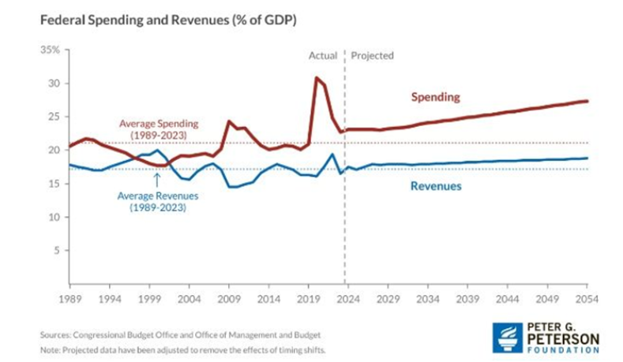
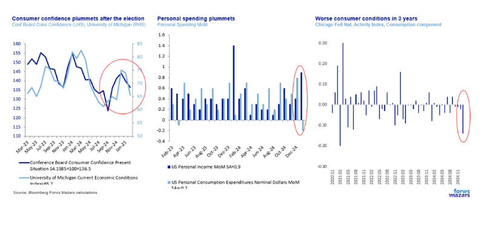
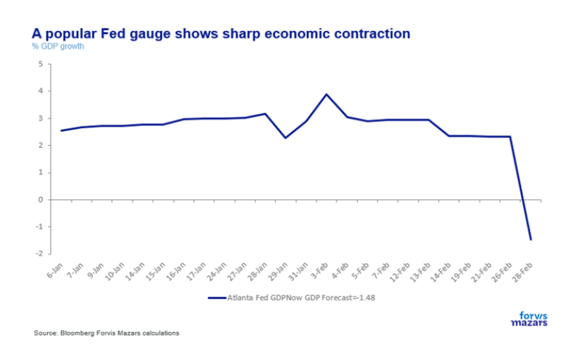
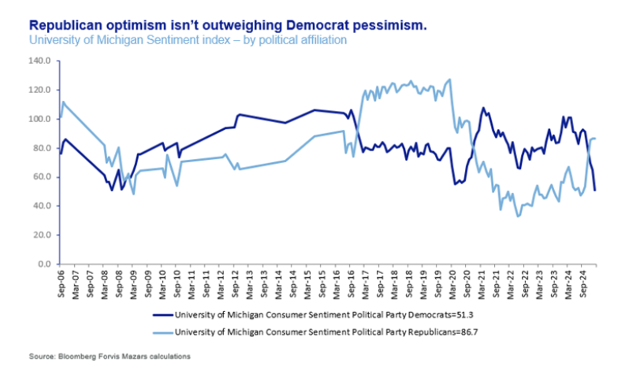
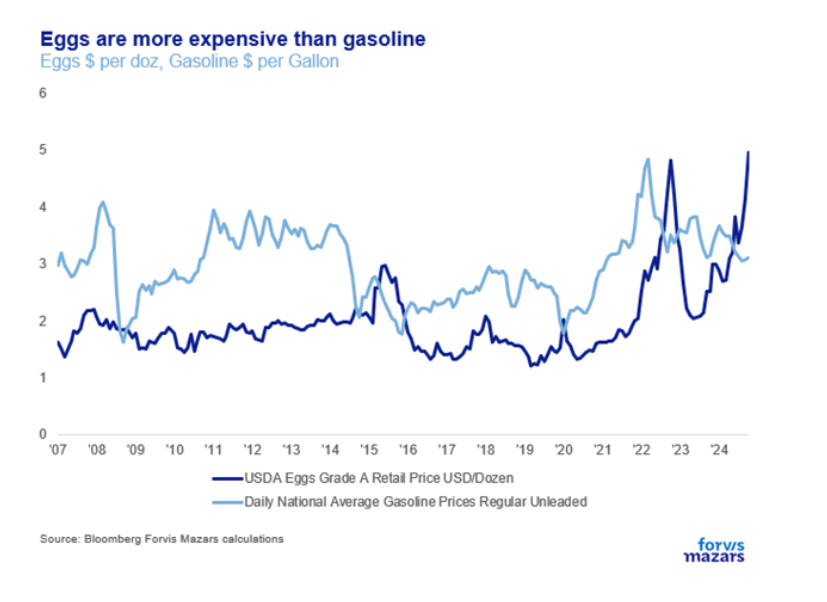
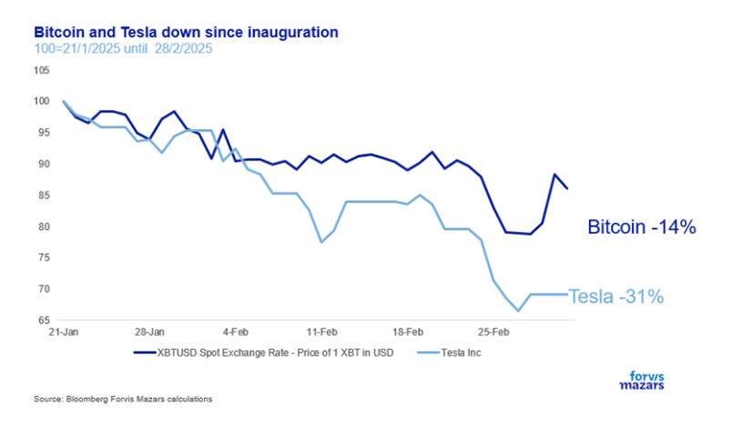
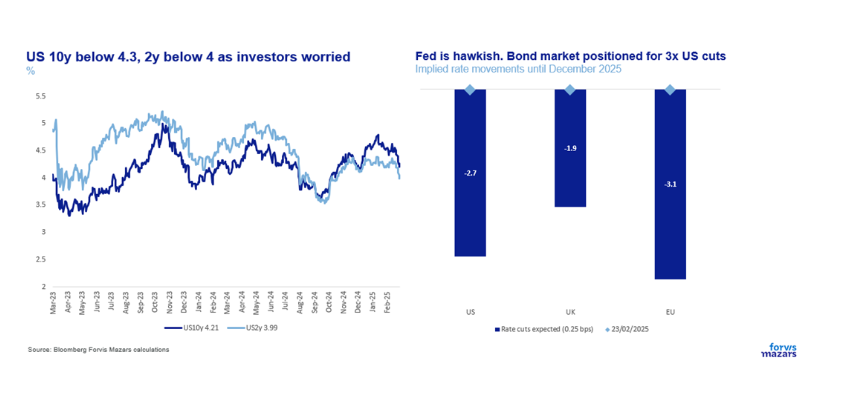

# US demand shock? Possibly. Recession? Too early to tell

**Date:** March 04, 2025  
**Publisher:** Breakwave Advisors | **Category:** Market Insights  
**Original URL:** [https://www.breakwaveadvisors.com/insights/2025/3/4/us-demand-shock-possibly-recession-too-early-to-tell](https://www.breakwaveadvisors.com/insights/2025/3/4/us-demand-shock-possibly-recession-too-early-to-tell)  

---

### The Three Things Investors Need to Know This Week

**1. Financial markets are now worried about a possible demand shock in the US as various economic measures have suddenly turned sharply down.**

**2. Yields fell sharply, and some “Trump trades” have been underperforming since the inauguration. =**

**3. It’s too early to speak of a recession. It is to be expected that persistent inflation, trade wars and government layoffs will weigh on consumer sentiment. On the back end of this, however, there may eventually be tax cuts, which will balance it out.**

*By*[*George Lagarias*](https://www.linkedin.com/in/george-lagarias-mba-3baa769/)

### Summary

Moving beyond the acrimonious politics, markets are now worried about a possible demand shock in the US. Various economic measures have suddenly turned sharply down, suggesting that consumers have become a lot more reticent. Yields fell, not because investors trust US debt more now, but because the 10y US Treasury is still the default safe haven for global investors. The problem with traders piling onis that now yields are pricing in around 3x rate cuts by the end of the year, against a Fed that is becoming increasingly cautious, and somewhat hawkish. The new government’s swift moves towards big outcomes are likely to generate a lot of noise, and worries, a lot of which will find their way onto the financial press, and even analysis. Investors need a clear eye as to what they are currently looking at.**It’s too early to call a recession**. We need to wait 3-6 months before we see a trend forming. It is to be expected that persistent inflation, trade wars and government layoffs will weigh on consumer sentiment. On the back end of this, however, there may eventually be tax cuts, which will balance it out. Consumer sentiment is fickle and can change. So we can speak of “shock”, but not of “trend” just yet.**Bond markets are indeed pricing in more rate cuts than the Fed anticipates**(and is likely) to deliver. That means that there are some risks on the long end, especially if (quoting Richmond Fed’s President Tom Barkin) the Fed is forced to increase rates. But still, the bond market running ahead of itself in its search for shelter is nothing new.

### Week Ahead

Next week, markets will look to the US monthly jobs report and final PMI reports to gauge present economic conditions. Although markets tend to react to job news, we think that the measure doesn’t necessarily convey the economic realities of a jobs market that seems somewhat frozen and would focus more on comments from purchasing managers. In Europe, we are keen to hear comments from the ECB, which is nevertheless expected to keep interest rates stable. More clarity on tariffs and DOGE developments, as well as comments from Fed Chair Powell and BoE Governor Andrew Bailey will be closely watched.

One of the most powerful myths in world history is that of Alexander the Great and the Gordian knot. When the great conqueror arrived in the city of Gordium, he came across a chariot roped to a temple. A prophecy said that anyone who could untie its unbelievably difficult knot would rule over Asia. Alexander was perplexed. He tried and tried. Ultimately, the legend goes, he took his sword and cut the knot altogether. The story serves as inspiration for anyone who faces complex problems:**what intelligence can’t or won’t do, brute force will.**Modern-day change management is largely built around swift action, as is the Silicon Valley modus operandi of “**move fast and break things**”.

That sort of decisive action is popular. In the corporate world, it is often lauded. Operations theory persists that chances for successful change are maximised when the agent of change is an empowered outsider. i.e. a CEO as an outside hire rather than a corporate insider.

In that light, the new US government’s economic strategy is now clear. Mr Trump aims to consolidate CEO-like powers to facilitate big changes. Mr Musk has been empowered as the ultimate outsider disruptor, with the task of bringing costs down and reversing a long-term trend of increased government spending, which can only be met by increasing the national debt, eventually stretching it beyond sustainability. Cost cuts should finance the government to make changes in other areas of the economy, such as “balancing” trade relations with other governments, without having to ask financial markets for the money, as bond investors keep wanting an increasing yield, which would further limit the government’s fiscal space. Mr Bessent, the Secretary of the Treasury, with respected financial credentials and structured thinking, believes that lower energy prices will counteract the effects of trade wars, bringing overall borrowing yields down. And if all attempts fail, the US has openly floated the idea of devaluing its currency, similar to what Ronald Reagan did in 1985.

> **Figure 1: Στιγμιότυπο Οθόνης 2025 03 04 131037**  
> **Interactive Data & Source:** [Politico](https://www.politico.com/news/2025/02/27/trump-fired-bird-flu-hires-00206334) | [Local Asset](file:///C:/Users/Dell/Github/Shipping/corpus/03-breakwave/insights/2025/assets/2025-03-04_us-demand-shock-possibly-recession-too-early-to-tell_img_cea3cf84ceb9ceb3cebcceb9cf8ccf84cf85_9dba57e48a5d.png)

In theory, a lot of this makes sense. Even in the most erudite of forums, the need for decisive action on government expenditure and debt is often raised. “If only the political will existed…” many lament. Well. This is what it looks like.

However, change theory was written for corporations, not democratic governments. The latest data suggests that US consumers are initially apprehensive about all that change.

Voters are not employees, but rather “stakeholders”. And while corporations usually survive a moral drop from employee cuts, worried consumers are an entirely different ball game.

US consumer confidence has plummeted since the election. And while “confidence” indicators are fickle and don’t necessarily lead to actual retail sales figures, far more reliable economic tools, like the Chicago Fed National Activity Index or monthly personal spending data, suggest the worse consumption conditions in three years. The Atlanta Fed’s GDP “nowcast” (a forecast of present economic performance) suggests a sharp economic contraction.

> **Figure 2: Στιγμιότυπο Οθόνης 2025 03 04 131046**  
> **Interactive Data & Source:** [Politico](https://www.politico.com/news/2025/02/27/trump-fired-bird-flu-hires-00206334) | [Local Asset](file:///C:/Users/Dell/Github/Shipping/corpus/03-breakwave/insights/2025/assets/2025-03-04_us-demand-shock-possibly-recession-too-early-to-tell_img_cea3cf84ceb9ceb3cebcceb9cf8ccf84cf85_e60ec0d9dbc4.png)

> **Figure 3: Στιγμιότυπο Οθόνης 2025 03 04 131053**  
> **Interactive Data & Source:** [Politico](https://www.politico.com/news/2025/02/27/trump-fired-bird-flu-hires-00206334) | [Local Asset](file:///C:/Users/Dell/Github/Shipping/corpus/03-breakwave/insights/2025/assets/2025-03-04_us-demand-shock-possibly-recession-too-early-to-tell_img_cea3cf84ceb9ceb3cebcceb9cf8ccf84cf85_9a8484ec326f.png)

Of course, there is a partisan element to the calculation. Democrat confidence has plunged, as expected, but Republican confidence hasn’t compensated, recovering about half the losses from the “Biden Era”. In other words, Democratic voters are scared and Republican voters aren’t all-in. They are about as confident as they were during the Obama years.

> **Figure 4: Στιγμιότυπο Οθόνης 2025 03 04 131102**  
> **Interactive Data & Source:** [Politico](https://www.politico.com/news/2025/02/27/trump-fired-bird-flu-hires-00206334) | [Local Asset](file:///C:/Users/Dell/Github/Shipping/corpus/03-breakwave/insights/2025/assets/2025-03-04_us-demand-shock-possibly-recession-too-early-to-tell_img_cea3cf84ceb9ceb3cebcceb9cf8ccf84cf85_baea6331a5e2.png)

Exacerbating the issue is “eggflation” (egg inflation) the result of bird flu limiting production. A carton of eggs now costs more than a gallon of gasoline.

> **Figure 5: Στιγμιότυπο Οθόνης 2025 03 04 131109**  
> **Interactive Data & Source:** [Politico](https://www.politico.com/news/2025/02/27/trump-fired-bird-flu-hires-00206334) | [Local Asset](file:///C:/Users/Dell/Github/Shipping/corpus/03-breakwave/insights/2025/assets/2025-03-04_us-demand-shock-possibly-recession-too-early-to-tell_img_cea3cf84ceb9ceb3cebcceb9cf8ccf84cf85_b7bffc594d77.png)

Consumers will likely not feel more empowered after news broke out that the US Department of Agriculture is[**struggling**](https://www.politico.com/news/2025/02/27/trump-fired-bird-flu-hires-00206334)to re-hire testing employees who recently lost their jobs. But we will get back to that.

Aggravating the situation, US large-cap equities have remained stagnant since the beginning of the year, while some popular Trump trades (Bitcoin, Tesla) have lost ground, giving the impression of an overall lack of confidence.

> **Figure 6: Στιγμιότυπο Οθόνης 2025 03 04 131116**  
> **Interactive Data & Source:** [Allthatsinteresting](https://allthatsinteresting.com/gordian-knot) | [Local Asset](file:///C:/Users/Dell/Github/Shipping/corpus/03-breakwave/insights/2025/assets/2025-03-04_us-demand-shock-possibly-recession-too-early-to-tell_img_cea3cf84ceb9ceb3cebcceb9cf8ccf84cf85_de948834dbd0.png)

As a result of those worries, markets are now concerned about a potential hit to growth. Yields fell, not because investors trust US debt more now, but because the 10y US Treasury is still the default safe haven for global investors. The problem with traders piling on, is that now yields are pricing in around 3x rate cuts by the end of the year, against a Fed that is becoming increasingly cautious, and somewhat hawkish.

> **Figure 7: Στιγμιότυπο Οθόνης 2025 03 04 131123**  
> **Interactive Data & Source:** [Allthatsinteresting](https://allthatsinteresting.com/gordian-knot) | [Local Asset](file:///C:/Users/Dell/Github/Shipping/corpus/03-breakwave/insights/2025/assets/2025-03-04_us-demand-shock-possibly-recession-too-early-to-tell_img_cea3cf84ceb9ceb3cebcceb9cf8ccf84cf85_44ac5cb00976.png)

### How Investors Should See This

Unfortunately, politics don’t stop after the election. If anything, the new government’s swift moves towards big outcomes are likely to generate a lot of noise, and worries, a lot of which will find their way onto the financial press, and even analysis. Investors need a clear eye as to what they are currently looking at.

a)**It’s too early to call a recession**. We need to wait 3-6 months before we see a trend forming. It is to be expected that persistent inflation, trade wars and government layoffs will weigh on consumer sentiment. On the back end of this, however, there may eventually be tax cuts which will balance it out. Consumer sentiment is fickle and can change. So we can speak of “shock”, but not of “trend” just yet.

b)**Trump trades losing steam**, especially Bitcoin and Tesla, is also to be expected if market sentiment is not overly bullish.

c)**Bond markets are indeed pricing in more rate cuts than the Fed anticipates**(and is likely) to deliver. That means that there are some risks on the long end, especially if (quoting Richmond Fed’s President Tom Barkin) the Fed is forced to increase rates. But still, the bond market running ahead of itself in its search for shelter is nothing new.

The item that should worry investors more is the one we mentioned above: employees who were overseeing an active bird flu epidemic were fired to save costs. While they will likely be rehired or replaced, this incident exemplifies how**systemic risks increase**. Bureaucracy is often seen as evil, but it is often a necessary one. To cut costs, the new US government challenges that necessity. When critical agencies are defanged or empowered, public servants lose their oversight capabilities, we allow excesses or systemic risks to build up in parts of the economy (not just the financial sector) that we cannot foresee at this point. Some of these will be innocuous or even easy to fix. It only takes one to turn into a Black Swan, however. And it is the job of professional investors to assess those risks as well and incorporate them into their portfolios.

**The interesting bit is that Alexander, a student of Aristotle, may not have cut the Gordian knot at all. Sources suggest he may have simply**[**removed**](https://allthatsinteresting.com/gordian-knot)**the chariot’s lynchpin. A thought for those who consider chainsaws as the only economic policy that works.**

---

**Tags:** Macro, Economy, Markets  
