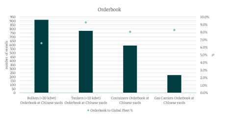

# The impact of proposed tariffs

**Date:** March 05, 2025  
**Publisher:** Breakwave Advisors | **Category:** Market Insights  
**Original URL:** [https://www.breakwaveadvisors.com/insights/2025/3/5/the-impact-of-proposed-tariffs](https://www.breakwaveadvisors.com/insights/2025/3/5/the-impact-of-proposed-tariffs)  

---

*By*[*Yiannis Parganas*](https://www.linkedin.com/in/yiannis-p-36a2141a7/)

Following the announcement of proposed tariffs on Chinese-built and operated vessels, the immediate impact remains zero, as the measures are still under discussion. However, if implemented, the number of affected vessels would be massive, potentially disrupting global shipping, increasing costs, and reshaping trade routes on a significant scale. To give a full picture, 41.5% of the total inservice fleet was built in Chinese shipyards, including 22.2% of the global tanker fleet, 32.2% of the container fleet, and 11.6% of the gas fleet. Additionally, the Chinese shipyard orderbook consists of 3,759 vessels, including 913 bulkers (6.5% of the global fleet), 776 tankers (9.3%), 591 containers (8%), and 222 gas carriers (8.3%) according to preliminary data.

These numbers translate into more than 36,500 port calls in the U.S. in 2024 that could be affected by the proposed measures, with container ships bearing the largest cost impact, accounting for almost 82% of total port calls. Given the U.S. trade sector's deep integration into global shipping, these costs would likely be passed on to U.S. consumers, further fueling inflationary pressures and affecting both U.S. imports and exports. The energy sector is particularly exposed, with U.S. LPG trade and significant shares of LNG and crude oil shipments at risk.

With this in mind, such a discussion could serve as a negotiation tool against China, given the potential negative impact these measures could have on U.S. businesses and consumers. That said, the feasibility of implementing these tariffs remains highly uncertain due to the deep interdependence between the U.S. and global shipping industries. A significant portion of U.S. trade relies on vessels built in China, and restricting their access could disrupt critical supply chains, increasing transportation costs and further straining an already fragile global logistics network. The U.S. has not prioritized building oceangoing vessels for the global market, focusing instead on domestic needs. Consequently, the current U.S.-built fleet is minimal with its limited capacity underscoring the U.S.'s reliance on foreign-built ships, particularly those from China, to sustain its maritime trade. Moreover, alternatives to Chinese shipbuilding are limited, as other major shipbuilding nations, such as South Korea and Japan, lack the capacity to immediately fill the gap. Additionally, many non-Chinese shipping companies operate Chinese-built vessels, meaning these measures would penalize global trade partners beyond China, leading to potential diplomatic and economic retaliation. The maritime industry functions on long-term planning and contracts, and abruptly imposing such tariffs could create legal and financial uncertainties for shipping companies worldwide.

Ultimately, while the proposed measures could serve as a bargaining chip in U.S.-China negotiations, their practical implementation remains complex, with potentially far-reaching consequences for both the U.S. economy and global trade stability.

> **Figure 1: Στιγμιότυπο Οθόνης 2025 03 05 145357**  
> **Interactive Data & Source:** [Intermodal](https://www.intermodal.gr/) | [Local Asset](file:///C:/Users/Dell/Github/Shipping/corpus/03-breakwave/insights/2025/assets/2025-03-05_the-impact-of-proposed-tariffs_img_cea3cf84ceb9ceb3cebcceb9cf8ccf84cf85_6d3ea291a732.png)

Data Source:[Intermodal](https://www.intermodal.gr/)

---

**Tags:** Shipping, Markets, China  
