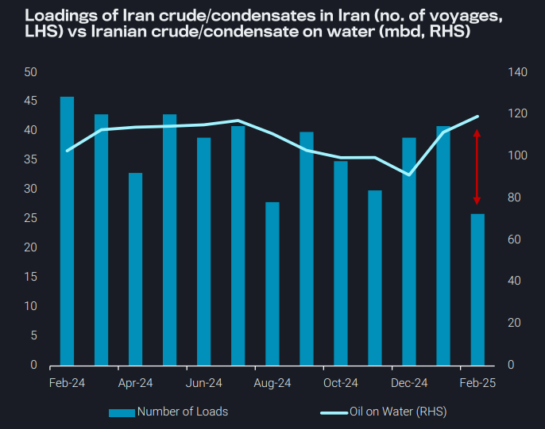
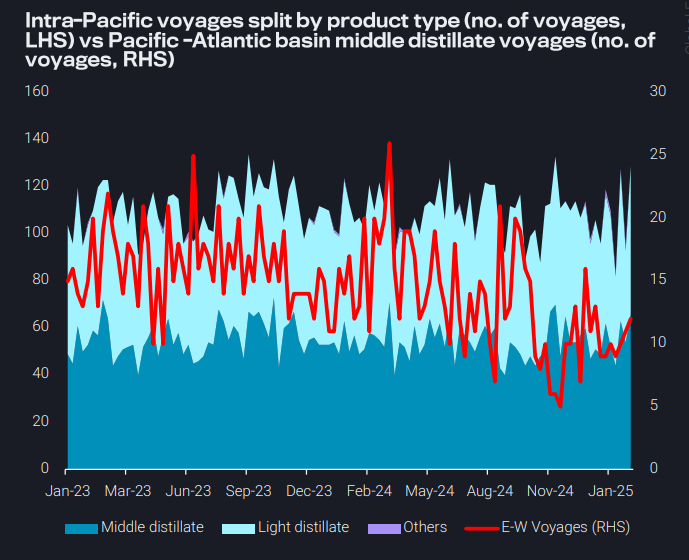
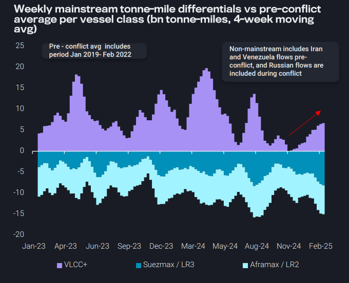
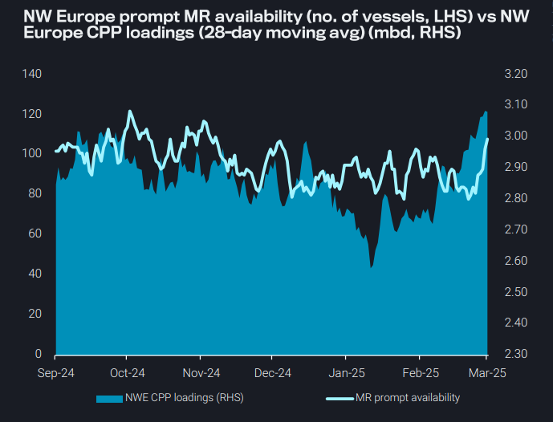

# The geopolitical turbulence seen so far in 2025 benefits VLCCs most

**Date:** March 06, 2025  
**Publisher:** Breakwave Advisors | **Category:** Market Insights  
**Original URL:** [https://www.breakwaveadvisors.com/insights/2025/3/6/the-geopolitical-turbulence-seen-so-far-in-2025-benefits-vlccs-most](https://www.breakwaveadvisors.com/insights/2025/3/6/the-geopolitical-turbulence-seen-so-far-in-2025-benefits-vlccs-most)  

---

### Key Takeaways From This Report:

- **Dirty – East of Suez:**Tight dark fleet availability limits Iran crude loadings as vessels compete for “clean” STS vessels in East
- **Clean – East of Suez:**Light distillates could become the driving force of LRs in the Pacific Basin
- **Dirty – West of Suez:**The geopolitical turbulence seen so far in 2025 benefits mainstream VLCCs most
- **Clean – West of Suez:**Vessel supply-side pressure limits TC2 gains despite rising CPP loadings in NW Europe

*By*[*Mary Melton*](https://www.linkedin.com/in/maryemelton/)

## Dirty – East of Suez: Tight Dark Fleet Availability Limits Iran Crude Loadings As Vessels Compete for “Clean” Sts Vessels in East

A lack of vessel availability in the dark fleet in Feb led to a 37% m-o-m fall in Iranian crude loaded directly in Iran, as delays in discharging into China in January reduced the number of vessels ballasting back to Iran

The Shandong Port Group ban on OFAC-sanctioned vessels has caused significant logistical disruptions

➔ Laden sanctioned dark fleet vessels offshore Asia idled as they awaited STS operations to “clean”, non-sanctioned vessels

➔ As sanctions enforcement tightens, the pool of “clean” vessels available to service discharges into Chinese ports is shrinking, with only 69% of Iranian dark fleet VLCCs active (defined as loading via port call or STS within the last 6 months)

Competition for dark fleet vessels to service Russia’s ESPO trade would further limit vessel availability for the Iranian trade. We’ve already seen the beginnings of this when an Aframaxleft the Iran trade to load Russia Sokol post 10-Jan OFAC sanctions

➔ Moving forward, VLCC-sized dark fleet vessels may be utilised for STS operations in the Middle East for Russia Baltics-to-China loads or offshore Yeosu to facilitate the Kozmino-to-China trade

> **Figure 1: Στιγμιότυπο Οθόνης 2025 03 06 143355**  
> **Interactive Data & Source:** [Vortexa](https://www.vortexa.com//oil-gas-data-traders-analysts-data-scientists?gclid=Cj0KCQjw8_qRBhCXARIsAE2AtRZKOvMnbilZ_6_91d7huSFFy71pWLrnPwGwOHVzXsmsG-1a1mZnQw8aAt89EALw_wcB&hsa_acc=1782073842&hsa_ad=548425387665&hsa_cam=14746637662&hsa_grp=125038601902&hsa_kw=&hsa_mt=&hsa_net=adwords&hsa_src=g&hsa_tgt=dsa-1431852288425&hsa_ver=3&utm_campaign=%5BCD%5D%20-%20DSA%20-%20EMEA&utm_medium=cpc&utm_medium=ppc&utm_source=google&utm_source=adwords&utm_term=) | [Local Asset](file:///C:/Users/Dell/Github/Shipping/corpus/03-breakwave/insights/2025/assets/2025-03-06_the-geopolitical-turbulence-seen-so-far-in-2025-benefits-vlccs-most_img_cea3cf84ceb9ceb3cebcceb9cf8ccf84cf85_1dc9a31f67bd.png)

## Clean – East of Suez: Light Distillates Could Become the Driving Force of Lrs in the Pacific Basin

Intra-Pacific voyages remained firm in recent weeks, supported by resilient demand for diesel and jet, despite lower naphtha exports from the Middle East Gulf

➔ The East-to-West middle distillates trade has seen a slight uptick in recent weeks, driven by a briefly open arbitrage (Argus)

Looking ahead, demand for intra-Pacific LR voyages could be supported by lighter distillates

➔ Asian refinery turnaround season is expected to drive an increase in naphtha imports, as naphtha is required for petchem feedstock to compensate for reduced domestic production

➔ The upcoming gasoline blending season is likely to provide support for naphtha demand as a key blending component for gasoline

LR availability in the Middle East Gulf is rising, with many engaged in short-haul trades

➔ This supply-side pressure will likely cap upside on freight rates out of the Middle East

> **Figure 2: Στιγμιότυπο Οθόνης 2025 03 06 143608**  
> **Interactive Data & Source:** [Vortexa](https://www.vortexa.com//oil-gas-data-traders-analysts-data-scientists?gclid=Cj0KCQjw8_qRBhCXARIsAE2AtRZKOvMnbilZ_6_91d7huSFFy71pWLrnPwGwOHVzXsmsG-1a1mZnQw8aAt89EALw_wcB&hsa_acc=1782073842&hsa_ad=548425387665&hsa_cam=14746637662&hsa_grp=125038601902&hsa_kw=&hsa_mt=&hsa_net=adwords&hsa_src=g&hsa_tgt=dsa-1431852288425&hsa_ver=3&utm_campaign=%5BCD%5D%20-%20DSA%20-%20EMEA&utm_medium=cpc&utm_medium=ppc&utm_source=google&utm_source=adwords&utm_term=) | [Local Asset](file:///C:/Users/Dell/Github/Shipping/corpus/03-breakwave/insights/2025/assets/2025-03-06_the-geopolitical-turbulence-seen-so-far-in-2025-benefits-vlccs-most_img_cea3cf84ceb9ceb3cebcceb9cf8ccf84cf85_599d223e7f48.png)

## Dirty – West of Suez: The Geopolitical Turbulence Seen So Far in 2025 Benefits Mainstream Vlccs Most

Geopolitical turbulence is pervasive so far this year. A possible end to the Russia-Ukraine war, Russia sanctions by the EU/UK, more OFAC sanctions on Iran, and talk of a tougher line on Venezuela all dominated the headlines last week

Looking at the impact of this turbulence on crude tankers (tonne-mile differentials pre- and during the Russia war) we can draw the following conclusions in the opening months of 2025:

➔ VLCCs benefitted as China and India bought Atlantic Basin and MEG crudes to replace Russian barrels after OFAC sanctions

➔ Demand for non-mainstream freight (from Iran, Venezuela, and Russia) has stagnated/slightly declined in recent months, which points to both the effectiveness of vessel-specific sanctions and flagging Shandong teapot demand

More sanctions make acquiring discounted barrels more challenging

➔ However, China’s demand for discounted crude remains, and logistical challenges are usually surmounted

➔ For now, VLCCs are enjoying a boost which would continue if the war ends and Russian crude flowing East lessens

> **Figure 3: Στιγμιότυπο Οθόνης 2025 03 06 144028**  
> **Interactive Data & Source:** [Vortexa](https://www.vortexa.com//oil-gas-data-traders-analysts-data-scientists?gclid=Cj0KCQjw8_qRBhCXARIsAE2AtRZKOvMnbilZ_6_91d7huSFFy71pWLrnPwGwOHVzXsmsG-1a1mZnQw8aAt89EALw_wcB&hsa_acc=1782073842&hsa_ad=548425387665&hsa_cam=14746637662&hsa_grp=125038601902&hsa_kw=&hsa_mt=&hsa_net=adwords&hsa_src=g&hsa_tgt=dsa-1431852288425&hsa_ver=3&utm_campaign=%5BCD%5D%20-%20DSA%20-%20EMEA&utm_medium=cpc&utm_medium=ppc&utm_source=google&utm_source=adwords&utm_term=) | [Local Asset](file:///C:/Users/Dell/Github/Shipping/corpus/03-breakwave/insights/2025/assets/2025-03-06_the-geopolitical-turbulence-seen-so-far-in-2025-benefits-vlccs-most_img_cea3cf84ceb9ceb3cebcceb9cf8ccf84cf85_bd80095f212d.png)

## Clean – West of Suez: Vessel Supply-Side Pressure Limits Tc2 Gains Despite Rising Cpp Loadings in Nw Europe

Northwest Europe CPP loadings rose in the last week, supporting TC2 rates, which has attracted MR ballasters, leading to an increase in MR prompt availability

Lack of demand in the US Gulf is likely driving this trend, along with increased demand out of NW Europe

➔ A closed diesel arb from PADD 3-to-Europe is encouraging ballasters to return to Europe after discharge into PADD 1

➔ CPP imports to WAf from Europe increased 13% in January (mo-m) due to an RFCC outage at Dangote, but have since fallen

➔ Russian diesel loadings on MRs have fell 9% in February which is likely also contributing to rising vessel supply in Europe

Looking forward, PADD 1 could be looking toward Europe for more gasoline this summer, after the US implemented 10% tariffs on Canadian energy imports yesterday (4 Mar)

➔ Demand in the US Gulf will likely remain muted. PADD 3 loadings remain low, and with low PADD 1 diesel stocks (EIA), it is likely that PADD 3 diesel seaborne exports could remain somewhat limited in the near term

> **Figure 4: Στιγμιότυπο Οθόνης 2025 03 06 144155**  
> **Interactive Data & Source:** [Vortexa](https://www.vortexa.com//oil-gas-data-traders-analysts-data-scientists?gclid=Cj0KCQjw8_qRBhCXARIsAE2AtRZKOvMnbilZ_6_91d7huSFFy71pWLrnPwGwOHVzXsmsG-1a1mZnQw8aAt89EALw_wcB&hsa_acc=1782073842&hsa_ad=548425387665&hsa_cam=14746637662&hsa_grp=125038601902&hsa_kw=&hsa_mt=&hsa_net=adwords&hsa_src=g&hsa_tgt=dsa-1431852288425&hsa_ver=3&utm_campaign=%5BCD%5D%20-%20DSA%20-%20EMEA&utm_medium=cpc&utm_medium=ppc&utm_source=google&utm_source=adwords&utm_term=) | [Local Asset](file:///C:/Users/Dell/Github/Shipping/corpus/03-breakwave/insights/2025/assets/2025-03-06_the-geopolitical-turbulence-seen-so-far-in-2025-benefits-vlccs-most_img_cea3cf84ceb9ceb3cebcceb9cf8ccf84cf85_f133cd873a14.png)

Data Source:[Vortexa](https://www.vortexa.com//oil-gas-data-traders-analysts-data-scientists?gclid=Cj0KCQjw8_qRBhCXARIsAE2AtRZKOvMnbilZ_6_91d7huSFFy71pWLrnPwGwOHVzXsmsG-1a1mZnQw8aAt89EALw_wcB&hsa_acc=1782073842&hsa_ad=548425387665&hsa_cam=14746637662&hsa_grp=125038601902&hsa_kw=&hsa_mt=&hsa_net=adwords&hsa_src=g&hsa_tgt=dsa-1431852288425&hsa_ver=3&utm_campaign=%5BCD%5D%20-%20DSA%20-%20EMEA&utm_medium=cpc&utm_medium=ppc&utm_source=google&utm_source=adwords&utm_term=)

---

**Tags:** Crude, Markets, Shipping  
