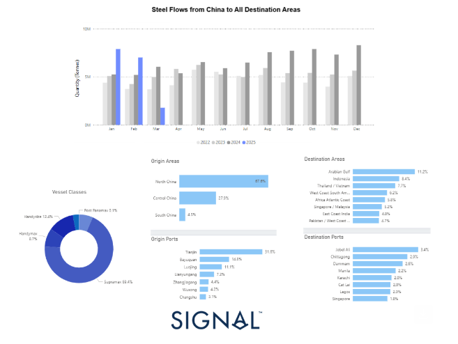
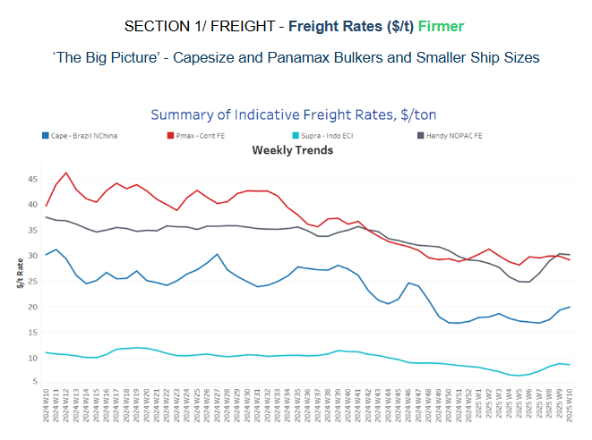
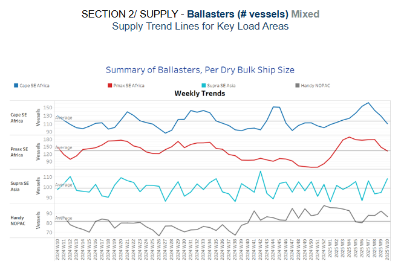
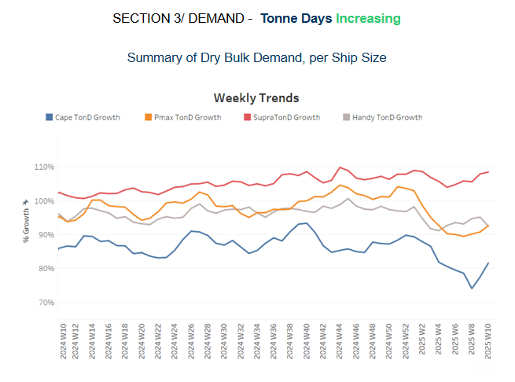
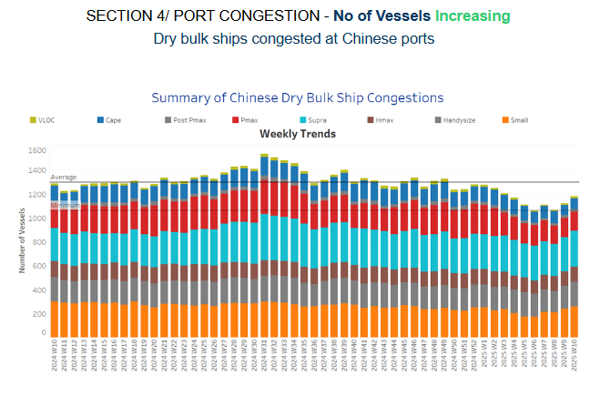

# U.S. Steel Tariffs on Chinese Steel Exports

**Date:** March 06, 2025  
**Publisher:** Breakwave Advisors | **Category:** Market Insights  
**Original URL:** [https://www.breakwaveadvisors.com/insights/2025/3/6/us-steel-tariffs-on-chinese-steel-exports](https://www.breakwaveadvisors.com/insights/2025/3/6/us-steel-tariffs-on-chinese-steel-exports)  

---

**Dry Weekly Market Monitor - Week 10, 2025**
Snapshot of Spot Freight Rates, Supply-Demand Trends, Port Congestions
March 05, 2025

> **Figure 1: Στιγμιότυπο Οθόνης 2025 03 06 133350**  
> **Interactive Data & Source:** [Signal Ocean Platform](https://www.thesignalgroup.com/signal-ocean-platform) | [Local Asset](file:///C:/Users/Dell/Github/Shipping/corpus/03-breakwave/insights/2025/assets/2025-03-06_us-steel-tariffs-on-chinese-steel-exports_img_cea3cf84ceb9ceb3cebcceb9cf8ccf84cf85_d3921b91598a.png)

The recent reinstatement of a 25% tariff on steel imports by the United States, effective March 12, 2025, aims to protect domestic manufacturing but has significant implications for global trade dynamics, particularly concerning China's steel exports and the freight vessel industry.

### Impact on China's Steel Exports:

China, accounting for more than 50% of the world's steel production, has seen its exports surge, with projections indicating they will reach 109 million metric tons this year, an eight-year high. However, the newly imposed U.S. tariffs are expected to curb this growth. The tariffs not only affect direct exports to the U.S. but also disrupt China's practice of transshipping steel through third countries to circumvent trade barriers, impacting about 10% of its steel exports valued at approximately $7 billion. ​ In response to these tariffs, China faces increased trade barriers globally, with a surge in anti-dumping cases filed against its steel products. Between early 2024 and February 2025, approximately 29 major steel trade cases were initiated against China, significantly higher than the 15 cases during 2020-2023.

### China's Steel Export Trends and Monthly Fluctuations

Analysis of monthly steel export fluctuations from the Signal Ocean Platform indicates that China accounts for 33.5% of total steel exports, with primary origin areas in North China at 67.6% and Central China at 27.9%. The top exporting ports, including Tianjin, Bayuquan, and Luojing, handle over 50% of total shipments. Monthly export volumes fluctuate, peaking in January and August due to pre-holiday stockpiling and seasonal demand cycles. The primary destinations for Chinese steel include the Arabian Gulf, Indonesia, and Vietnam, representing 11.2%, 8.4%, and 7.7% of total exports, respectively. With the U.S. reimposing a 25% tariff on steel imports effective March 2025, a notable decline in steel exports is expected, with estimates suggesting a drop from 109 million metric tons to 96 million metric tons by 2025.

### Implications for Freight Vessel Size Categories

The shift in China's steel export patterns due to tariffs and trade barriers has significant consequences for the maritime industry, particularly vessel size categories. Traditionally, Capesize and Panamax vessels were favored for steel shipments due to economies of scale. However, recent industry shifts indicate a move toward smaller, more versatile vessels due to uncertain global trade conditions, rising environmental regulations, and geopolitical disruptions affecting supply chains.

Suprama​​​x vessels, accounting for 69.4% of steel shipments, dominate Chinese steel exports due to their port accessibility and adaptability. Handysize and Handymax vessels, at 12.4% and 8.7% respectively, cater to regional trades and smaller emerging markets.

### Freight Vessel Market Shifts

The combination of tariff-induced trade shifts, monthly export fluctuations, and the predominance of mid-size vessel classes (Supramax, Handymax) suggests a strategic industry transition. The freight market will likely see increased demand for flexible and fuel-efficient vessel categories, rather than large-scale bulk carriers, as Chinese steel exporters diversify their shipping strategies in response to trade barriers.

> **Figure 2: Στιγμιότυπο Οθόνης 2025 03 06 133514**  
> **Interactive Data & Source:** [Signal Ocean Platform](https://www.thesignalgroup.com/signal-ocean-platform) | [Local Asset](file:///C:/Users/Dell/Github/Shipping/corpus/03-breakwave/insights/2025/assets/2025-03-06_us-steel-tariffs-on-chinese-steel-exports_img_cea3cf84ceb9ceb3cebcceb9cf8ccf84cf85_293550bdd2d9.png)

​​​​The upward trend in Capesize rates from Brazil to North China gained momentum in early March, driven by a decline in the number of ballasters, which is now supporting firmer market conditions.

- **Capesize**vessel freight rates for shipments from Brazil to North China exceeded $20 per tonne, boosting market sentiment after dipping to around $16 per tonne in mid-February.
- **Panamax**vessel freight rates from the Continent to the Far East stood at $29 per ton, representing a slight downward trend from the end of the previous week.
- **Supramax**vessel freight rates on the Indo-ECI route held firm levels around $9 per tonne, with an upward trend in early March.
- **Handysize**freight rates for the NOPAC Far East route continued above nearly $30 per tonne from the end of February, marking a 25% monthly increase. ​​​​​​

> **Figure 3: Στιγμιότυπο Οθόνης 2025 03 06 133600**  
> **Interactive Data & Source:** [Signal Ocean Platform](https://www.thesignalgroup.com/signal-ocean-platform) | [Local Asset](file:///C:/Users/Dell/Github/Shipping/corpus/03-breakwave/insights/2025/assets/2025-03-06_us-steel-tariffs-on-chinese-steel-exports_img_cea3cf84ceb9ceb3cebcceb9cf8ccf84cf85_958a80608e47.png)

The latest indicators from the ballasters' perspective suggest a mixed outlook, with a notable downward revision in the Capesize SE Africa.

- **Capesize, SE Africa:**The vessels hovered around 110, nearly 20 fewer than the previous week. There are indications of a decreasing trend below the annual trend for the first time since the beginning of the year.
- **Panamax SE Africa:**The vessel count continued to decline with levels nearly at the annual average of 130 — almost 17 fewer than the previous week.
- **Supramax SE Asia:**In the first days of March, levels increased above the annual average of 98, and early March showed signs of an upward trend.
- **Handysize NOPAC:**The Handy NOPAC segment confirmed one week further the downward revision from the end of February, while still 5 above the annual trend of 82.

> **Figure 4: Στιγμιότυπο Οθόνης 2025 03 06 133644**  
> **Interactive Data & Source:** [Signal Ocean Platform](https://www.thesignalgroup.com/signal-ocean-platform) | [Local Asset](file:///C:/Users/Dell/Github/Shipping/corpus/03-breakwave/insights/2025/assets/2025-03-06_us-steel-tariffs-on-chinese-steel-exports_img_cea3cf84ceb9ceb3cebcceb9cf8ccf84cf85_872974c5a2c4.png)

The first days of March show a reversal in sentiment within the Capesize segment. Following weeks of a consistent decline in tonne-day growth, early signs of an upward correction emerge.

- **Capesize**: The growth rate showed an upward trend after hitting one of its lowest annual levels two weeks ago.
- **Panamax**: Tonne-day growth also emerged with an upward trend, with signals of leaving a weakening picture of February.
- **Supramax**: The growth rate remains the strongest among vessel size categories, maintaining a steady upward trajectory since early February.
- **Handysize**: Its growth rate has begun to align with that of the Panamax segment, which experienced a downward trend in the first week of the month.

> **Figure 5: Στιγμιότυπο Οθόνης 2025 03 06 133731**  
> **Interactive Data & Source:** [Signal Ocean Platform](https://www.thesignalgroup.com/signal-ocean-platform) | [Local Asset](file:///C:/Users/Dell/Github/Shipping/corpus/03-breakwave/insights/2025/assets/2025-03-06_us-steel-tariffs-on-chinese-steel-exports_img_cea3cf84ceb9ceb3cebcceb9cf8ccf84cf85_b5dc22910d4b.png)

**Congestion**at Chinese dry bulk ports trended upward, with an increasing number of vessels in the Capesize, Supramax and Handysize segments.

- **Capesize**: Capesize vessel congestion rose 90, marking an increase of 6 compared to the end of the previous week.
- **Panamax**: Panamax vessel congestion fell below 160, defying expectations of higher congestion levels by early March, initially projected for late February.
- **Supramax**: Congestion levels surpassed the 300 mark, nearly 20 more than the figures recorded at the end of February.
- **Handysize**: Congestion levels rose to more than 200, registering an increase of over 10 compared to the end of the previous week.

Data Source:[Signal Ocean Platform](https://www.thesignalgroup.com/signal-ocean-platform)

---

**Tags:** Shipping, Drybulk, Markets  
