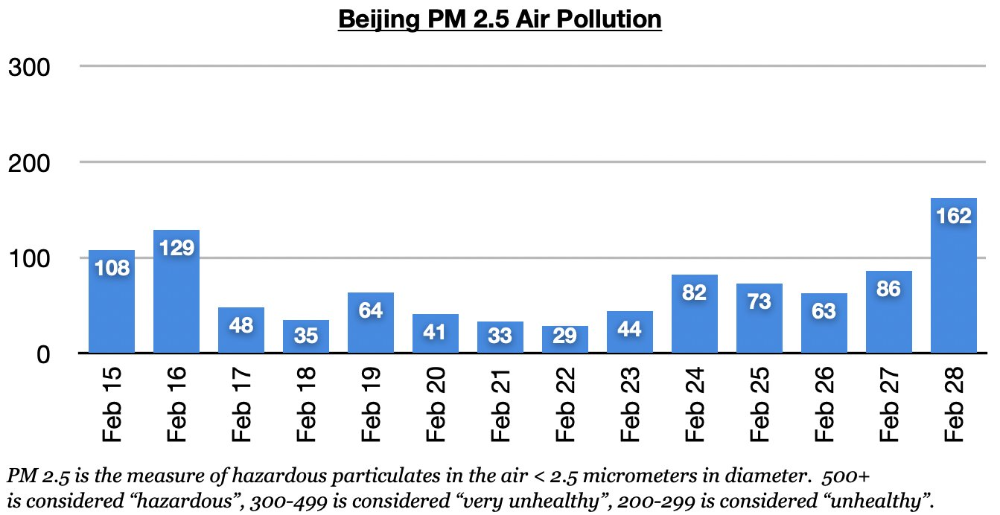
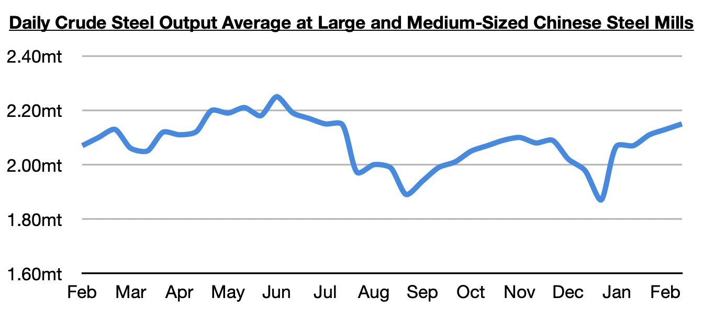
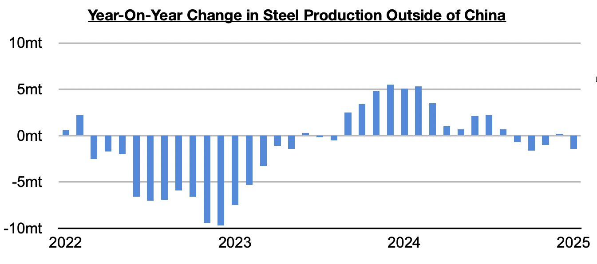

# China's Steel Production Continues to Grow, Air Pollution Recently Up Too

**Date:** March 07, 2025  
**Publisher:** Breakwave Advisors | **Category:** Market Insights  
**Original URL:** [https://www.breakwaveadvisors.com/insights/2025/3/7/chinas-steel-production-continues-to-grow-air-pollution-recently-up-too](https://www.breakwaveadvisors.com/insights/2025/3/7/chinas-steel-production-continues-to-grow-air-pollution-recently-up-too)  

---

*By*[*Jeffrey Landsberg*](https://www.linkedin.com/in/jeffrey-landsberg-70ab957/)

As we discussed in Commodore Research's most recent Weekly Executive Report and Weekly China Report, air pollution levels in Beijing (which is where air pollution is usually the highest due to its close proximity to China’s major steel hub) increased last week. Friday saw the highest air pollution level, with PM 2.5 averaging 162.

> **Figure 1: Chart 1**  
> [Local Asset](file:///C:/Users/Dell/Github/Shipping/corpus/03-breakwave/insights/2025/assets/2025-03-07_chinas-steel-production-continues-to-grow-air-pollution-recently-up-too_img_chart1_a0d67d045670.jpg)

Also of note is that the most recent data shows China’s steel output at large and medium-sized mills averaged 2.15 million tons during February 11 - February 20. This is up by 1% from early February and is up year-on-year by 2%.

> **Figure 2: Chart 2**  
> [Local Asset](file:///C:/Users/Dell/Github/Shipping/corpus/03-breakwave/insights/2025/assets/2025-03-07_chinas-steel-production-continues-to-grow-air-pollution-recently-up-too_img_chart2_2e431e01873f.jpg)

Overall, China continues to fare better than many other economies (particularly on the industrial side). The most recently released data shows that steel production outside of China totaled 69.5 million tons in January, which was down year-on-year by 1.4 million tons (-2%). Steel production outside of China has now contracted on a year-on-year basis during four of the last five months. Prior to this period, it had grown on a year-on-year basis for twelve straight months.

> **Figure 3: Chart 3**  
> [Local Asset](file:///C:/Users/Dell/Github/Shipping/corpus/03-breakwave/insights/2025/assets/2025-03-07_chinas-steel-production-continues-to-grow-air-pollution-recently-up-too_img_chart3_03c9d6dc4038.jpg)

---

**Tags:** China, Economy, Markets  
