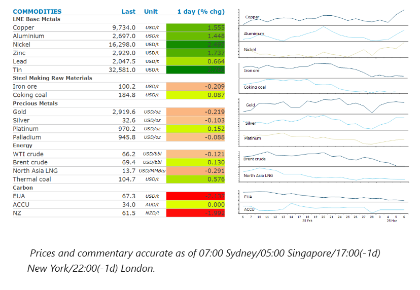
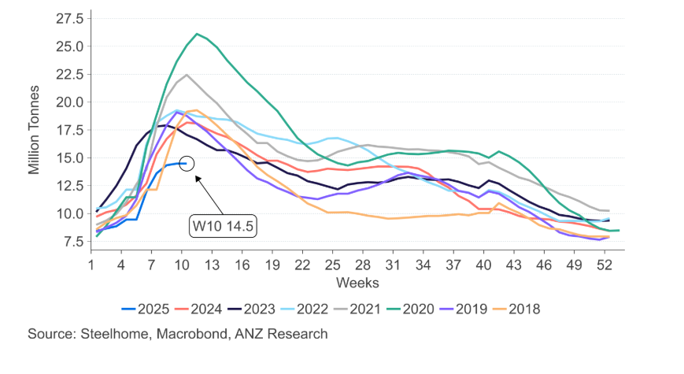

# Metals rally amid improving outlook in China

**Date:** March 07, 2025  
**Publisher:** Breakwave Advisors | **Category:** Market Insights  
**Original URL:** [https://www.breakwaveadvisors.com/insights/2025/3/7/metals-rally-amid-improving-outlook-in-china](https://www.breakwaveadvisors.com/insights/2025/3/7/metals-rally-amid-improving-outlook-in-china)  

---

Sentiment was buoyed by Beijing’s efforts to support economic growth. However, uncertainty around US trade policy kept the gains limited.

*By*[*Daniel Hynes*](https://www.linkedin.com/in/dahynes/)

> **Figure 1: Στιγμιότυπο Οθόνης 2025 03 07 112201**  
> [Local Asset](file:///C:/Users/Dell/Github/Shipping/corpus/03-breakwave/insights/2025/assets/2025-03-07_metals-rally-amid-improving-outlook-in-china_img_cea3cf84ceb9ceb3cebcceb9cf8ccf84cf85_ada95c62b037.png)

### Market Commentary

**Copper**led the base metals sector higher as expectations of further stimulus measures in China boosted sentiment. China leaders continued their top legislative meetings on Thursday, with the market looking for more specifics around efforts to reduce overcapacity in heavy industries. The market is also pricing in the impact of tariffs on US imports. Despite the Commerce Department starting an investigation into the dumping of copper, Trump’s speech to Congress suggested he’d already made the decision to enact a levy on copper. US production of base metals has waned for years, so much so that it is now heavily reliant on offshore suppliers. In the case of aluminium, the US imports 67% of its primary consumption. Its reliance on copper is not far behind. This has led to a rush to secure supplies ahead of any rise in costs. Copper and aluminium premiums in the US have risen sharply and waiting times to secure supply on global exchanges have surged. The short-term impact will be further upside in premiums, as the US struggles to adjust to the dislocation in physical markets. Given relatively low global inventories, we expect tariffs will put[**upward pressure on spot prices**](../pdfs/2025-03-07_metals-rally-amid-improving-outlook-in-china_commodity-call-duty-calls_eaf9bfb3e10f.pdf).

**Iron ore**futures were steady around USD100/t following yesterday’s announcement that China’s economic planning agency would mandate steel production cuts. There were no specifics given on the volume of cuts in the sector, which has been impacted by the downturn in the property sector. However, there were reports in state media that steel mills in Shandong have been instructed to cut production by around 4mt this year. The weak domestic market has also seen Chinese steel mills target the export market, which has weighed on international prices.

**Crude oil**swung between gains and losses as the market weighed up the impact of Trump’s move to delay tariffs on imports from Mexico. He said in a social media post that he’ll defer levies on Mexico for all good covered by the North American trade agreement known as USMCA. Sentiment in Asian trading wasn’t helped by reports that China’s top economic planner is pushing oil refiners to reduce fuel output and increase production of chemicals. Early selling was reversed after Treasury Secretary Bessent said the US is willing to go “all in” on sanctions against Russia to achieve a ceasefire in Ukraine. He also threatened Iran’s oil flows, adding that the US will shut down the nation’s oil sector.

**European gas**futures slumped after EU officials delayed plans to limit and eventually phase out Russia fuel imports this week. They also put forward a call to restore gas transit through Ukraine to appease Slovakia, a Russia-friendly nation that lost its pipeline gas flows.

**Gold**was largely unchanged amid the mounting uncertainty around the macro backdrop. The move to delay tariffs on Mexico saw yields on USTs push toward their lowest levels this year in the face of a mounting conviction that a trade-induced growth slowdown will lead the Fed to cut interest rates several times in 2025. The impact of tariffs was also evident in trade data. The US imported a record USD329.5bn of goods in January, driven by a surge in gold imports. Inbound shipments of finished metal shapes, which includes precious metals, accounted for 60% of the monthly increase.

### Chart of the Day

Chinese steel inventories are at their lowest level on a seasonal basis in more than 10 years. This suggests demand is not as dire as sentiment would suggest. Any mandated cuts to production in China will only tighten the market.

> **Figure 2: Στιγμιότυπο Οθόνης 2025 03 07 112305**  
> **Interactive Data & Source:** [Linkedin](https://www.linkedin.com/newsletters/commodities-wrap-6692196755876012032/?fbclid=IwAR3kiXJqZdxmp9ZcRwBNI7FsBySI-XSC0pfPur1qzjt7OZp7PTE59Tsl1QI) | [Local Asset](file:///C:/Users/Dell/Github/Shipping/corpus/03-breakwave/insights/2025/assets/2025-03-07_metals-rally-amid-improving-outlook-in-china_img_cea3cf84ceb9ceb3cebcceb9cf8ccf84cf85_05028beb66b3.png)

Data source:[Commodities Wrap](https://www.linkedin.com/newsletters/commodities-wrap-6692196755876012032/?fbclid=IwAR3kiXJqZdxmp9ZcRwBNI7FsBySI-XSC0pfPur1qzjt7OZp7PTE59Tsl1QI)

---

**Tags:** China, Commodities, Markets  
