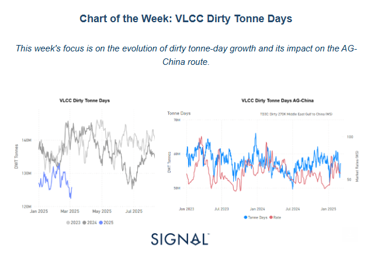
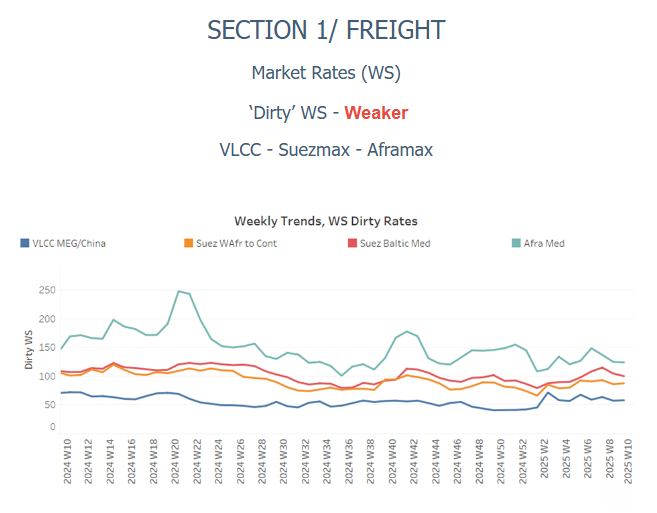
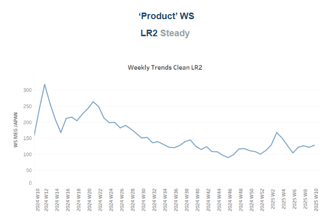
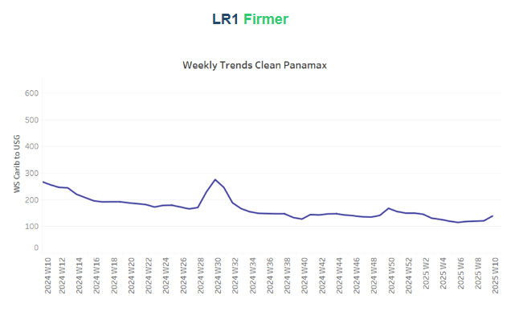
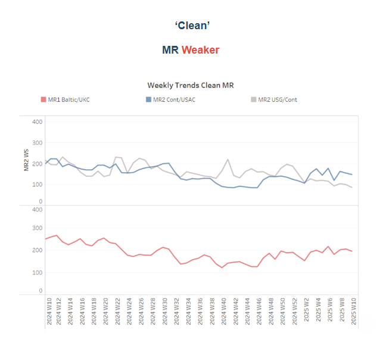
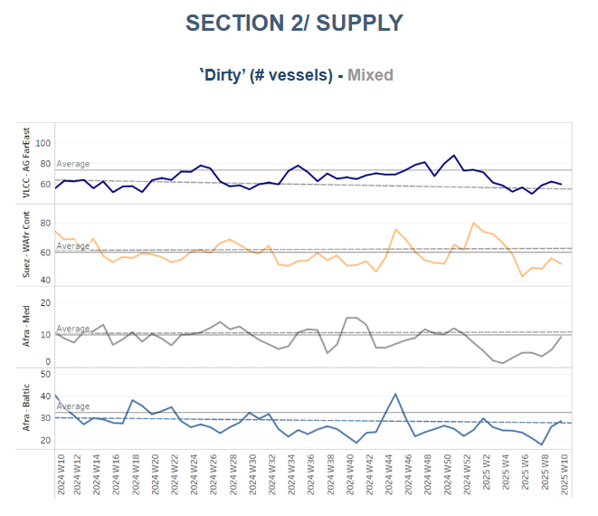
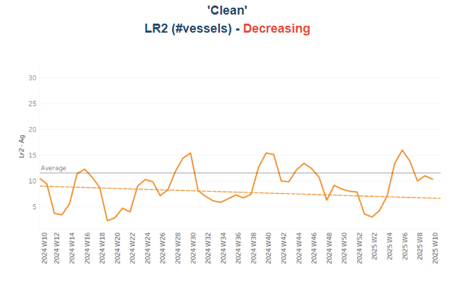
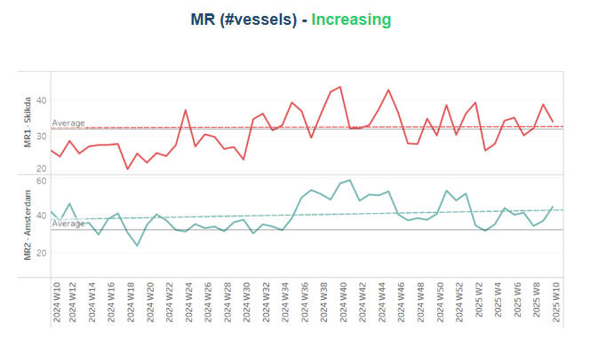
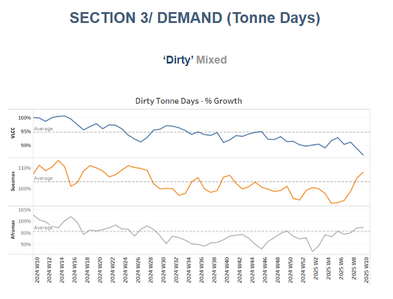
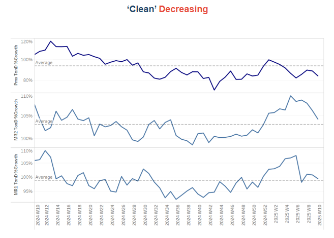

# VLCC Dirty Tonne Days

**Date:** March 07, 2025  
**Publisher:** Breakwave Advisors | **Category:** Market Insights  
**Original URL:** [https://www.breakwaveadvisors.com/insights/2025/3/7/vlcc-dirty-tonne-days](https://www.breakwaveadvisors.com/insights/2025/3/7/vlcc-dirty-tonne-days)  

---

### Tanker - Weekly Market Monitor

Snapshot of Crude and Product Freight Rates, Supply-Demand

Week 10, 6 March, 2025

> **Figure 1: Στιγμιότυπο Οθόνης 2025 03 07 162952**  
> **Interactive Data & Source:** [Signal Ocean Platform](https://www.thesignalgroup.com/signal-ocean-platform) | [Local Asset](file:///C:/Users/Dell/Github/Shipping/corpus/03-breakwave/insights/2025/assets/2025-03-07_vlcc-dirty-tonne-days_img_cea3cf84ceb9ceb3cebcceb9cf8ccf84cf85_b62eaa4a71e9.png)

### Sluggish VLCC Growth Amid Geopolitical Uncertainty

The VLCC dirty tonne-days segment has experienced a significant decline since the beginning of 2025, marking one of the weakest growth phases in recent years. As shown in the left chart, 2025's trajectory (blue line) is well below 2023 and 2024 levels, with tonne-days consistently trending downward. This decline aligns with the evolving energy landscape, particularly in response to recent Trump administration decisions, which have reshaped global crude oil trade patterns. Policy shifts affecting U.S.-China relations, potential restrictions on crude exports, and increased tensions in the Middle East have created uncertainties in tanker demand. Additionally, recent sanctions on Russian crude oil exports to China have contributed to a market realignment.

### AG-China Route: Signs of Recovery Despite Broader Weakness

Despite the overall weak performance in VLCC tonne-days, the AG-China route (right chart) has shown signs of stabilization and improvement. While overall dirty tonne-day growth remains under pressure, the Middle East Gulf-to-China corridor has started to recover from previous lows. This could be attributed to China’s rebalancing efforts, particularly in response to the restrictions on Russian crude imports. The Chinese market is likely seeking alternative supply sources, supporting VLCC demand in this key route.

Interestingly, freight rates (red line) for TD3C (Middle East Gulf to China) remain subdued, indicating that vessel availability remains high, despite increasing tonne-days. This suggests that while demand has shown some improvement, it has yet to translate into stronger market rates, possibly due to an oversupplied VLCC segment or hesitant chartering activity amid geopolitical uncertainties.

### Looking Ahead

The overall decline in VLCC dirty tonne-days is concerning, signaling a weak demand outlook for large crude carriers. However, the AG-China route presents a silver lining, with demand showing signs of recovery as China adjusts to Russian sanctions. Geopolitical factors remain a critical risk, with Trump’s energy policies and rising Middle East tensions shaping market sentiment. Given these uncertainties, VLCC freight rates may take longer to recover unless supply tightens or crude flows increase significantly.

> **Figure 2: Στιγμιότυπο Οθόνης 2025 03 07 163133**  
> **Interactive Data & Source:** [Signal Ocean Platform](https://www.thesignalgroup.com/signal-ocean-platform) | [Local Asset](file:///C:/Users/Dell/Github/Shipping/corpus/03-breakwave/insights/2025/assets/2025-03-07_vlcc-dirty-tonne-days_img_cea3cf84ceb9ceb3cebcceb9cf8ccf84cf85_5a6211b14692.png)

Sentiment in the**dirty freight market**appears fragile, with VLCC MEG/China routes still having difficulty finding stronger momentum.

- VLCC freight rates for**MEG-China**routes continued hovering below WS60, marking a 16% monthly decrease. Suezmax rates for**West Africa to continental Europe**held levels of WS88, reflecting an 8% monthly decrease. Meanwhile, Suezmax rates on the Baltic-Mediterranean route also held a sentiment similar to the previous week at above WS100, up 14% month over month.
- **Aframax**freight rates in the**Mediterranean**dropped below WS130, extending their downward trend from late February

> **Figure 3: Στιγμιότυπο Οθόνης 2025 03 07 163229**  
> **Interactive Data & Source:** [Signal Ocean Platform](https://www.thesignalgroup.com/signal-ocean-platform) | [Local Asset](file:///C:/Users/Dell/Github/Shipping/corpus/03-breakwave/insights/2025/assets/2025-03-07_vlcc-dirty-tonne-days_img_cea3cf84ceb9ceb3cebcceb9cf8ccf84cf85_ea364ba97c2f.png)

- **LR2**AG freight rates held almost at similar levels of the previous week at around WS120, reflecting a 25% monthly increase.

> **Figure 4: Στιγμιότυπο Οθόνης 2025 03 07 163438**  
> **Interactive Data & Source:** [Signal Ocean Platform](https://www.thesignalgroup.com/signal-ocean-platform) | [Local Asset](file:///C:/Users/Dell/Github/Shipping/corpus/03-breakwave/insights/2025/assets/2025-03-07_vlcc-dirty-tonne-days_img_cea3cf84ceb9ceb3cebcceb9cf8ccf84cf85_5929385647a6.png)

- **Panamax**Carib-to-USG rates gained firmer momentum in the last few days, rising to just below WS150, marking a 23% increase compared to the previous week.

> **Figure 5: Στιγμιότυπο Οθόνης 2025 03 07 163711**  
> **Interactive Data & Source:** [Signal Ocean Platform](https://www.thesignalgroup.com/signal-ocean-platform) | [Local Asset](file:///C:/Users/Dell/Github/Shipping/corpus/03-breakwave/insights/2025/assets/2025-03-07_vlcc-dirty-tonne-days_img_cea3cf84ceb9ceb3cebcceb9cf8ccf84cf85_5f95c82ba6f8.png)

- **MR1**freight rates for Baltic-to-Continent shipments declined below WS200, reflecting a 9% monthly drop, with a weaker trend anticipated for March.​​​​

- Meanwhile,**MR2**rates for shipments from the**Continent**to the**US Atlantic Coast**(USAC) saw a weekly decline, settling at WS145—a 24% drop month-over-month. On the**US Gulf-to-Continent**route, MR2 rates fell below WS90, reflecting a sharp 19% weekly decrease.

> **Figure 6: Στιγμιότυπο Οθόνης 2025 03 07 163807**  
> **Interactive Data & Source:** [Signal Ocean Platform](https://www.thesignalgroup.com/signal-ocean-platform) | [Local Asset](file:///C:/Users/Dell/Github/Shipping/corpus/03-breakwave/insights/2025/assets/2025-03-07_vlcc-dirty-tonne-days_img_cea3cf84ceb9ceb3cebcceb9cf8ccf84cf85_d9f202cc8120.png)

​​​​​The availability of crude tankers continued to tighten for the VLCC and Suezmax segments, while recent estimates suggest an upward revision for Aframax vessels.

- **VLCC Ras Tanura:**The ship count is now below 60, reflecting a decline of more than 10 compared to the annual average and 30 fewer than the levels recorded before the end of December.
- **Suezmax Wafr:**The current ship count stands at 50, consistent with the weakening trend from the previous week and nearly nine below the annual average, signaling a further downward correction for March.
- **Aframax Med:**The vessel count has begun to trend upward after a prolonged dip below the annual average last month, with recent activity approaching the annual benchmark of 10.
- **Aframax Baltic**: The number of ships although remained below the annual average of 30 has started to increase from the end of February and stood at around 28 — almost eleven more than a week ago.

> **Figure 7: Στιγμιότυπο Οθόνης 2025 03 07 164035**  
> **Interactive Data & Source:** [Signal Ocean Platform](https://www.thesignalgroup.com/signal-ocean-platform) | [Local Asset](file:///C:/Users/Dell/Github/Shipping/corpus/03-breakwave/insights/2025/assets/2025-03-07_vlcc-dirty-tonne-days_img_cea3cf84ceb9ceb3cebcceb9cf8ccf84cf85_87fcbe887b95.png)

> **Figure 8: Στιγμιότυπο Οθόνης 2025 03 07 164044**  
> **Interactive Data & Source:** [Signal Ocean Platform](https://www.thesignalgroup.com/signal-ocean-platform) | [Local Asset](file:///C:/Users/Dell/Github/Shipping/corpus/03-breakwave/insights/2025/assets/2025-03-07_vlcc-dirty-tonne-days_img_cea3cf84ceb9ceb3cebcceb9cf8ccf84cf85_f51e09a5fa56.png)

- **Clean LR2 AG Jubail:**The downward trend persists, with the vessel count remaining slightly below the annual average of 11, following the spike observed at the end of week 6.

- **Clean MR:**The number of ships at Algeria's Skikda port showed signs of a downward trend after a recent weekly spike above the annual average, settling at 34—five fewer than the previous week. Meanwhile, MR2 activity in Amsterdam maintained its upward trend over the past two weeks, hovering 13 above the annual average.

> **Figure 9: Στιγμιότυπο Οθόνης 2025 03 07 164144**  
> **Interactive Data & Source:** [Signal Ocean Platform](https://www.thesignalgroup.com/signal-ocean-platform) | [Local Asset](file:///C:/Users/Dell/Github/Shipping/corpus/03-breakwave/insights/2025/assets/2025-03-07_vlcc-dirty-tonne-days_img_cea3cf84ceb9ceb3cebcceb9cf8ccf84cf85_77a28bccacc9.png)

- **Dirty**tonne days: The growth rate of dirty tonne-days for VLCCs remained weak, reaching its lowest level in the past year. In contrast, the Suezmax segment showed a stronger recovery in early March, while Aframax activity gained momentum since late February, maintaining a slight trend above the annual average.

> **Figure 10: Στιγμιότυπο Οθόνης 2025 03 07 164230**  
> **Interactive Data & Source:** [Signal Ocean Platform](https://www.thesignalgroup.com/signal-ocean-platform) | [Local Asset](file:///C:/Users/Dell/Github/Shipping/corpus/03-breakwave/insights/2025/assets/2025-03-07_vlcc-dirty-tonne-days_img_cea3cf84ceb9ceb3cebcceb9cf8ccf84cf85_7ee59f993eda.png)

- **Panamax**tonne days: The growth rate remained below the weekly annual average, with not yet signs of a rebound.

- **MR**tonne-days: The MR segment's growth rate has continued to decline, with levels struggling to stay above the annual average in early March.

Data Source:[Signal Ocean Platform](https://www.thesignalgroup.com/signal-ocean-platform)

---

**Tags:** Tankers, Crude, Markets  
