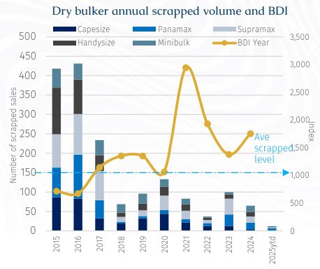
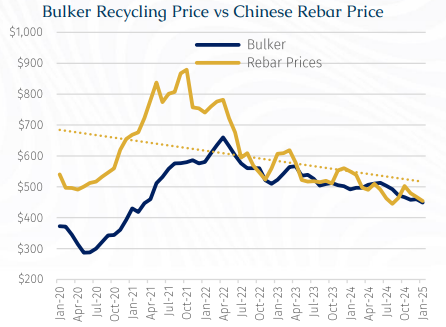
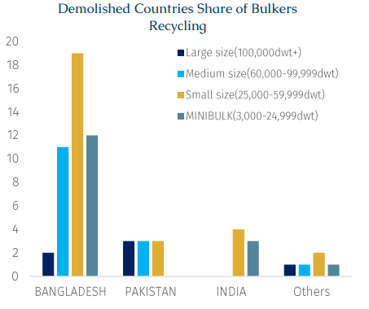
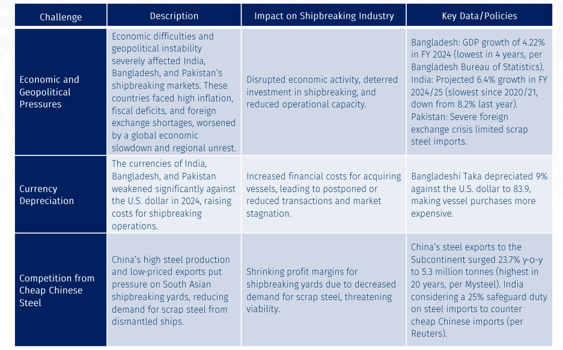

# The Dry Bulker Shipbreaking Market: A Bleak Year

**Date:** March 10, 2025  
**Publisher:** Breakwave Advisors | **Category:** Market Insights  
**Original URL:** [https://www.breakwaveadvisors.com/insights/2025/3/10/the-dry-bulker-shipbreaking-market-a-bleak-year](https://www.breakwaveadvisors.com/insights/2025/3/10/the-dry-bulker-shipbreaking-market-a-bleak-year)  

---

> **Figure 1: Rgb Color Brs Shipbrokers Monogram Logo**  
> [Local Asset](file:///C:/Users/Dell/Github/Shipping/corpus/03-breakwave/insights/2025/assets/2025-03-10_the-dry-bulker-shipbreaking-market-a-bleak-year_img_rgb-color-brs-shipbrokers-monogram-l_ee79606c8e74.png)

> **Figure 2: Στιγμιότυπο Οθόνης 2025 03 10 125152**  
> [Local Asset](file:///C:/Users/Dell/Github/Shipping/corpus/03-breakwave/insights/2025/assets/2025-03-10_the-dry-bulker-shipbreaking-market-a-bleak-year_img_cea3cf84ceb9ceb3cebcceb9cf8ccf84cf85_a20dd8b38f85.png)

The dry bulker shipbreaking market was nothing short of bleak last year as a total of 65 bulk carriers were scrapped, amounting to 3.3 million Dwt. Accordingly, last year’s saw 4 Capesizes, 17 Panamaxes, 16 Handymaxes, 12 Handysizes, and 16 Minibulkers scrapped. All told, this was significantly below the past 10-year average of 151 vessels and the lowest since 1990. What’s intriguing is that a range of global and regional environmental regulations – namely EEXI, CII, and EU-ETS - have been introduced in succession. The mainstream consensus is that, in due time, shipowners would inevitably scrap older vessels to avoid penalties. Yet, current reality conveys a different story. The primary reasons for this phenomenon are as follows:

### 1.buoyant Freight Markets and High Shipping Market

In 2024, the dry bulk segment enjoyed a relatively benign freight market with most ships’ earnings remaining above operating expenses. This seems unlikely to change this year and thus it appears unlikely that we will see strong demolition activity for the ore-carrying fleet in 2025. According to current FFA curves C5TC rates this year should average around $19,000/day, well above 2022 and 2023 levels when demolition was higher. Indeed, for as long ships are turning a profit, this will encourage shipowners to extend the operational life of older vessels and delay scrapping plans. We thought the fleet growth continued to slow in 2024, hitting a nearly 20-year low of 3.4%. This year, the fleet growth rate for 2025 is projected to average 3.3%. Additionally, the average age of bulk carriers hit 12.4 years by end-2024, and is projected to reach 13.3 years in 2025. With many vessels still in their prime, scrapping remains a low priority.

### 2. Declining Scrap Prices

Global rebar steel average prices weakened by 8% y-o-y to $488.9/ton in 2024, driven by Chinese real estate turmoil. Scrap steel prices, closely tied to rebar prices, followed suit. The average scrap price for bulk carriers was $500/Ldt in 2024, the lowest level since Covid. Monthly trends showed a modest uptick in the first half of 2024, only to plummet to $445/Ldt by early March. Capesize Recycling Value (CDISRA) data showed that demolition prices for Capesize vessels peaked at $11.4 million in mid-June 2024, then declined by 3.6% to $10.3 million by year-end and prices have continued to weaken further in 2025 so thatthe latest CDISRA price stands at $9.8 million.

> **Figure 3: Στιγμιότυπο Οθόνης 2025 03 10 125215**  
> [Local Asset](file:///C:/Users/Dell/Github/Shipping/corpus/03-breakwave/insights/2025/assets/2025-03-10_the-dry-bulker-shipbreaking-market-a-bleak-year_img_cea3cf84ceb9ceb3cebcceb9cf8ccf84cf85_dc4b7e9294c3.png)

### 3. Subcontinent Market Share

Together India, Bangladesh, and Pakistan account for 92% of the global shipbreaking market. Currently Bangladesh is the dominant player, dismantling a diverse range of dry bulker vessel types.

In number of vessels terms, Supramaxes saw the most units demolished while Panamaxes saw the most demolition in terms of Dwt. This trend aligns with the current fleet composition, where Supramaxes and Panamaxes make up 32.2% and 23.1% of the active dry bulker fleet, respectively.

In 2024, the average scrapping age for bulk carriers decreased from 32.7 years old in 2023 to 28.5 years old. Panamaxes had an average scrapping age of 28.3 years old, while Supramaxes averaged 31 years old.

> **Figure 4: Στιγμιότυπο Οθόνης 2025 03 10 125225**  
> [Local Asset](file:///C:/Users/Dell/Github/Shipping/corpus/03-breakwave/insights/2025/assets/2025-03-10_the-dry-bulker-shipbreaking-market-a-bleak-year_img_cea3cf84ceb9ceb3cebcceb9cf8ccf84cf85_1285d6817bb7.png)

### Challenges Facing the South Asian Shipbreaking Industry in 2024

> **Figure 5: Στιγμιότυπο Οθόνης 2025 03 10 125257**  
> [Local Asset](file:///C:/Users/Dell/Github/Shipping/corpus/03-breakwave/insights/2025/assets/2025-03-10_the-dry-bulker-shipbreaking-market-a-bleak-year_img_cea3cf84ceb9ceb3cebcceb9cf8ccf84cf85_41f6fd6b78eb.png)

### The Hong Kong Convention and Its Impact

The tightening of environmental regulations is another challenge for the shipbreaking market and owners looking to dispose of their elderly tonnage. The NGO Shipbreaking Platform reported that 80% of the world’s scrapped tonnage in 2023 was dismantled under substandard conditions on the beaches of South Asia. According to GMS, the world’s largest cash buyer of ships, as of now, there are 117 shipbreaking yards in South Asia that comply with the Hong Kong International Convention for the Safe and Environmentally Sound Recycling of Ships (HKC). Among them, Bangladesh, the leading destination for shipbreaking, has only seven HKC-compliant yards.

The HKC will come into effect in end-June 2025, requiring shipbreaking yards to meet stricter environmental and safety standards. Local governments are pushing for compliance upgrades, and industry sources suggest that the number of compliant shipbreaking yards may reach 133 before the convention’s enforcement.

So far this year, the current pace of dry bulkers demolition is on a par with previous years. And whether this is an early indicator that overall demolition activity for this year will see no material change in trend.

---

**Tags:** Shipping, Markets, Drybulk  
