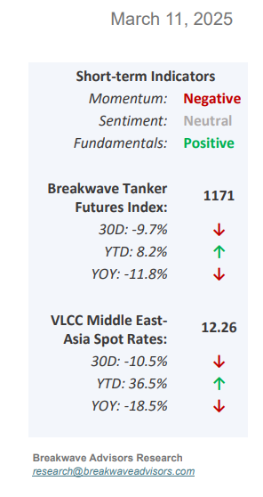
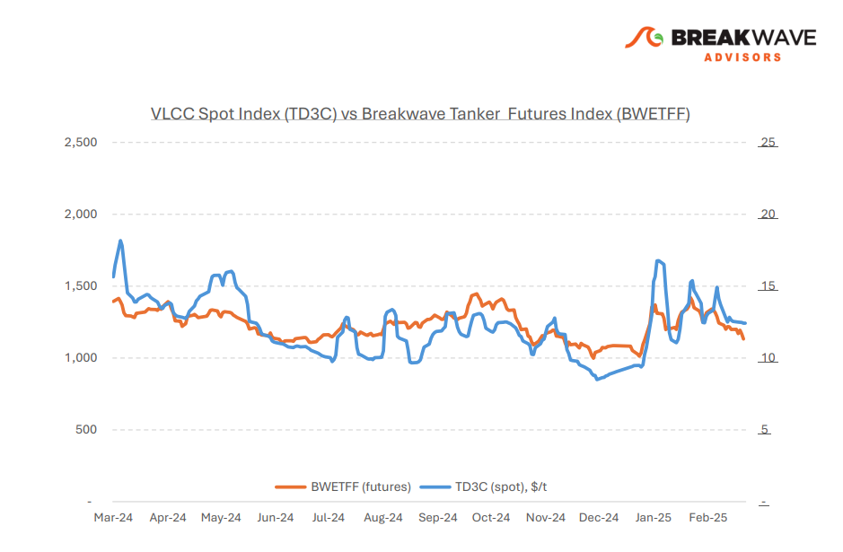
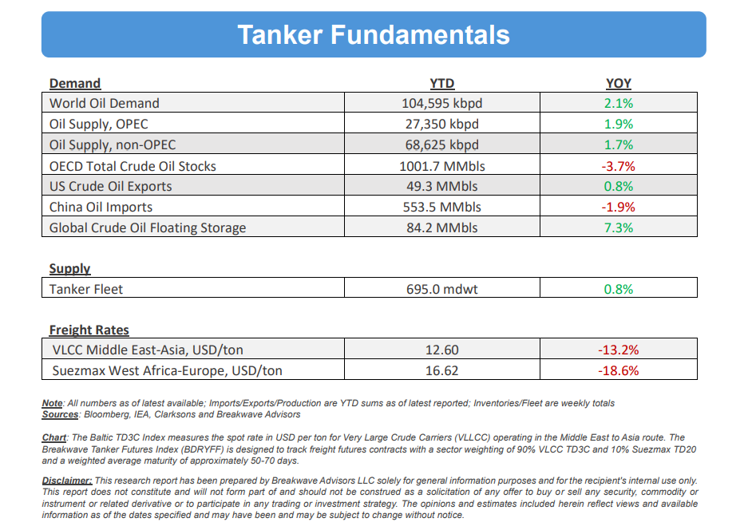

# Breakwave Bi-Weekly Tanker Report - March 11, 2025

**Date:** March 11, 2025  
**Publisher:** Breakwave Advisors | **Category:** Market Insights  
**Original URL:** [https://www.breakwaveadvisors.com/insights/2025113wetmmm856-33](https://www.breakwaveadvisors.com/insights/2025113wetmmm856-33)  

---

•**A Fragile Recovery in VLCCs Amid Macro Headwinds**– The VLCC market appeared to have found a**temporary floor**in early March, with shipowners showing renewed optimism for a potential recovery.**Activity**levels initially**picked**up as charterers sought to cover outstanding second-decade stems and advance bookings for the third-decade program. However, despite some resistance from owners, broader market weakness—particularly in other regions—has kept a**significant rebound in check.**In the East, market sentiment remains fragile as VLCC AG to China rates ended the first week of March with a slight decline. The softening reflects underlying concerns over**Chinese crude demand**, with recent import figures showing a**5% year-on-year****drop**for January and February. This has dampened confidence in sustained freight rate gains, as uncertainty over future crude demand growth weighs on long-haul tanker prospects. Overall, while**pockets of resilience exist,**prevailing macroeconomic headwinds and**soft demand**fundamentals remain key obstacles to a sustained rate recovery in both the East and West. The recent momentum in freight markets continues to be tested by**uncertainties**in the oil market, particularly growing concerns over**Chinese demand.**With China’s crude oil imports down year-on-year, fears of weakening demand for long-haul crude shipments persist. Nevertheless, shortterm market tightness and the**clearing of early-positioned tonnage**should provide some near-term support for VLCC rates.

> **Figure 1: Στιγμιότυπο Οθόνης 2025 03 10 194148**  
> [Local Asset](file:///C:/Users/Dell/Github/Shipping/corpus/03-breakwave/insights/2025/assets/2025-03-11_2025113wetmmm856-33_img_cea3cf84ceb9ceb3cebcceb9cf8ccf84cf85_736083d88553.png)

•**OPEC+ Confirms Production Increase Despite Demand Headwinds –**Despite a**lackluster outlook**for global oil demand, OPEC+ appears poised to gradually**increase production**in accordance with last year’s announced schedule. While the initial increase is relatively modest—approximately 140,000 barrels per day— the mere indication of rising production intentions was sufficient to trigger a significant**selloff in oil**prices. However, the pressure on prices is not solely due to the potential for additional supply.**Demand**growth remains**weak**, with few foreseeable catalysts that could alter this trajectory. Although recent stimulus measures from China might provide some support,**fundamental indicators**suggest a**structural shift**in the region’s oil consumption—an overall negative for future demand growth. Additionally, any supply shortfall resulting from tightened sanctions on Iran could be readily offset by the more than**5 million**barrels per day of**spare capacity**available among other OPEC+ members. Meanwhile, demand growth in developed markets appears to have plateaued. In summary, the likelihood of a significant upside surprise in crude demand this year—beyond gas-related growth—remains low. As a result, crude prices are expected to continue trending lower in line with underlying market fundamentals.

•**Our Long-term View**– The last few years have been characterized by increased geopolitical uncertainty. Going forward, we expect such events to continue to affect global trade and have a meaningful impact on effective vessel supply. Combined with the potential for a multi-year cyclical rebound in China’s economic activity following the recent economic turmoil, dry bulk shipping should experience higher volatility on top of a secular tightness driven by stable bulk commodity demand and a slower fleet growth owing to a relatively low orderbook.

> **Figure 2: Στιγμιότυπο Οθόνης 2025 03 11 084551**  
> [Local Asset](file:///C:/Users/Dell/Github/Shipping/corpus/03-breakwave/insights/2025/assets/2025-03-11_2025113wetmmm856-33_img_cea3cf84ceb9ceb3cebcceb9cf8ccf84cf85_8605fbecd623.png)

> **Figure 3: Στιγμιότυπο Οθόνης 2025 03 11 084608**  
> [Local Asset](file:///C:/Users/Dell/Github/Shipping/corpus/03-breakwave/insights/2025/assets/2025-03-11_2025113wetmmm856-33_img_cea3cf84ceb9ceb3cebcceb9cf8ccf84cf85_f949ee04c99a.png)

### Subscribe:
