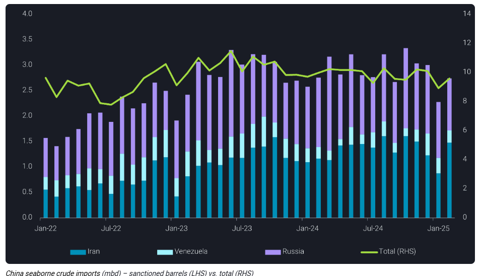
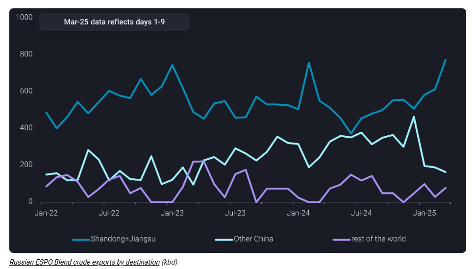
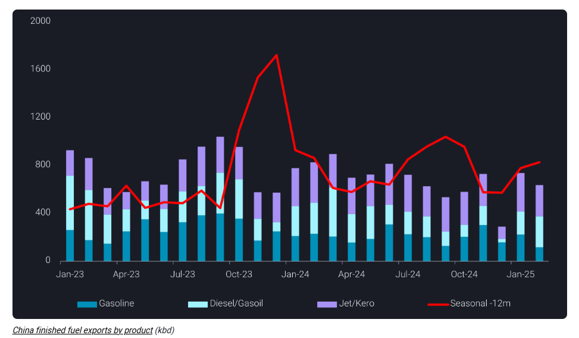

# China’s Iranian imports rebound, while Russian flows wane

**Date:** March 11, 2025  
**Publisher:** Breakwave Advisors | **Category:** Market Insights  
**Original URL:** [https://www.breakwaveadvisors.com/insights/2025/3/11/chinas-iranian-imports-rebound-while-russian-flows-wane](https://www.breakwaveadvisors.com/insights/2025/3/11/chinas-iranian-imports-rebound-while-russian-flows-wane)  

---

China’s crude imports rebounded in February, but Russian demand uncertainty persists.

*By*[*Emma Li*](https://www.linkedin.com/in/emma-li-73003443/)

China’s seaborne crude imports rebounded in February, recovering from January’s low as cargo discharges into Shandong resumed. This followed weeks of import disruptions caused by the Shandong Port Group’s shipping ban and OFAC sanctions recently applied to over 150 tankers involved in Russian and Iranian trades.

Total seaborne crude imports reached 9.6mbd in February, up 7% m-o-m but down 4% y-o-y, as continued weakness in Shandong’s teapot refiners weighed on demand.

China’s imports of Iranian crude were estimated at near 1.5mbd in February, the highest level since October 2024. This increase was largely driven by stranded cargoes finding alternative routes via STS transfers onto non-sanctioned tankers near Chinese waters.

However, Iranian crude flows are expected to decline in March amid subdued teapot demand.

> **Figure 1: Στιγμιότυπο Οθόνης 2025 03 11 120029**  
> **Interactive Data & Source:** [Analytics Vortexa](https://analytics.vortexa.com/Historical?dateRange=2025-01-01T00%3A00%3A00.000Z__2025-03-31T23%3A59%3A59.999Z&metric=t&movementEvent=unloading_start&page=Historical&tabId=0bbf96e8-e0ac-4e55-abb9-b77745cb51ab&v=3&vessels=%5B%225f898da6ead4d4933397ffdaaae7441f767facdc44b108b5b06a338409202a03%22%5D) | [Local Asset](file:///C:/Users/Dell/Github/Shipping/corpus/03-breakwave/insights/2025/assets/2025-03-11_chinas-iranian-imports-rebound-while-russian-flows-wane_img_cea3cf84ceb9ceb3cebcceb9cf8ccf84cf85_be72f148b7be.png)

## Chinese Oil Majors Scale Back Russian Crude Imports

While loadings of Russia’s Far East flagship ESPO Blend crude remained strong post- January OFAC sanctions, with a swift rebuilding of a non-sanctioned fleet, more February-loading cargoes were delivered to Shandong and Jiangsu provinces, primarily to teapot refiners. In January, these price-sensitive refiners opted to cut runs rather than seek alternative barrels amid uncertainties surrounding ESPO supply.

In contrast, Chinese oil majors have adopted a more cautious approach toward Russian grades following sanctions. Even when transported via non-sanctioned tankers, their ESPO Blend purchases were limited. Market sources indicate that some state-owned companies have completely halted Russian crude purchases in March after scaling back in February.

This conservative stance has also dampened demand for other Russian crude grades, including Urals and Arctic crude.

Notably, January-loading Far East Sokol cargoes—transferred onto[a non-sanctioned VLCC](https://analytics.vortexa.com/Historical?dateRange=2025-01-01T00%3A00%3A00.000Z__2025-03-31T23%3A59%3A59.999Z&metric=t&movementEvent=unloading_start&page=Historical&tabId=0bbf96e8-e0ac-4e55-abb9-b77745cb51ab&v=3&vessels=%5B%225f898da6ead4d4933397ffdaaae7441f767facdc44b108b5b06a338409202a03%22%5D)via STS in Russia Far East —remain floating offshore Shandong awaiting orders.

> **Figure 2: Στιγμιότυπο Οθόνης 2025 03 11 120044**  
> **Interactive Data & Source:** [Vortexa](https://www.vortexa.com//oil-gas-data-traders-analysts-data-scientists?gclid=Cj0KCQjw8_qRBhCXARIsAE2AtRZKOvMnbilZ_6_91d7huSFFy71pWLrnPwGwOHVzXsmsG-1a1mZnQw8aAt89EALw_wcB&hsa_acc=1782073842&hsa_ad=548425387665&hsa_cam=14746637662&hsa_grp=125038601902&hsa_kw=&hsa_mt=&hsa_net=adwords&hsa_src=g&hsa_tgt=dsa-1431852288425&hsa_ver=3&utm_campaign=%5BCD%5D%20-%20DSA%20-%20EMEA&utm_medium=cpc&utm_medium=ppc&utm_source=google&utm_source=adwords&utm_term=) | [Local Asset](file:///C:/Users/Dell/Github/Shipping/corpus/03-breakwave/insights/2025/assets/2025-03-11_chinas-iranian-imports-rebound-while-russian-flows-wane_img_cea3cf84ceb9ceb3cebcceb9cf8ccf84cf85_e1d6550cde17.png)

Chinese oil majors have imported an average of 230kbd of Russian Urals and Arctic crude in 2024. If they fully shift away from Russian crude, it could generate additional demand for 3-4 VLCCs from the Middle East or Atlantic Basin every month, though with limited impact on overall VLCC market dynamics.

## Product Exports Are Expected to Rebound Post-Festival Season, But Quotas Pose Constraints

China’s clean fuel exports are expected to rise from March, following the post-festival season, as refining margins improve amid softening benchmark prices and domestic demand eases after the holiday travel rush. However, the extent of this rebound will be constrained by tight export quotas, which limit potential growth.

> **Figure 3: Στιγμιότυπο Οθόνης 2025 03 11 123445**  
> **Interactive Data & Source:** [Vortexa](https://www.vortexa.com//oil-gas-data-traders-analysts-data-scientists?gclid=Cj0KCQjw8_qRBhCXARIsAE2AtRZKOvMnbilZ_6_91d7huSFFy71pWLrnPwGwOHVzXsmsG-1a1mZnQw8aAt89EALw_wcB&hsa_acc=1782073842&hsa_ad=548425387665&hsa_cam=14746637662&hsa_grp=125038601902&hsa_kw=&hsa_mt=&hsa_net=adwords&hsa_src=g&hsa_tgt=dsa-1431852288425&hsa_ver=3&utm_campaign=%5BCD%5D%20-%20DSA%20-%20EMEA&utm_medium=cpc&utm_medium=ppc&utm_source=google&utm_source=adwords&utm_term=) | [Local Asset](file:///C:/Users/Dell/Github/Shipping/corpus/03-breakwave/insights/2025/assets/2025-03-11_chinas-iranian-imports-rebound-while-russian-flows-wane_img_cea3cf84ceb9ceb3cebcceb9cf8ccf84cf85_d63a50971ef8.png)

Data Source:[Vortexa](https://www.vortexa.com//oil-gas-data-traders-analysts-data-scientists?gclid=Cj0KCQjw8_qRBhCXARIsAE2AtRZKOvMnbilZ_6_91d7huSFFy71pWLrnPwGwOHVzXsmsG-1a1mZnQw8aAt89EALw_wcB&hsa_acc=1782073842&hsa_ad=548425387665&hsa_cam=14746637662&hsa_grp=125038601902&hsa_kw=&hsa_mt=&hsa_net=adwords&hsa_src=g&hsa_tgt=dsa-1431852288425&hsa_ver=3&utm_campaign=%5BCD%5D%20-%20DSA%20-%20EMEA&utm_medium=cpc&utm_medium=ppc&utm_source=google&utm_source=adwords&utm_term=)

---

**Tags:** Crude, Shipping, Tankers  
