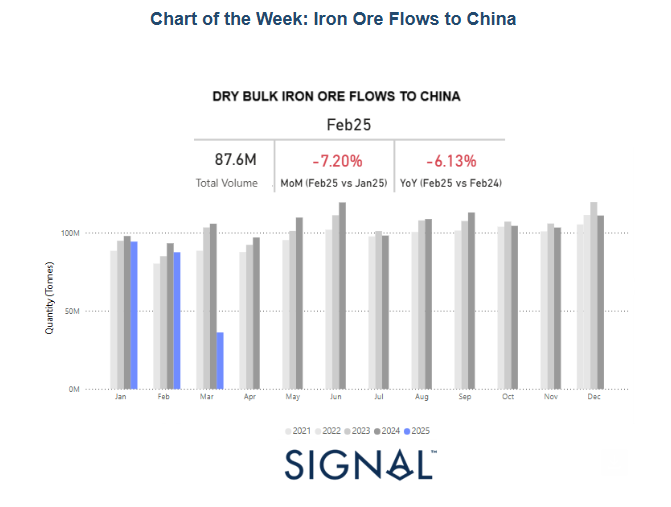
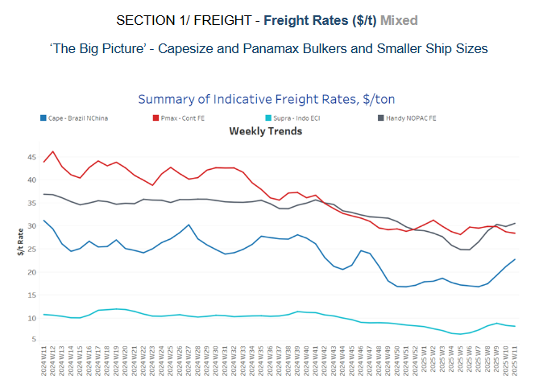
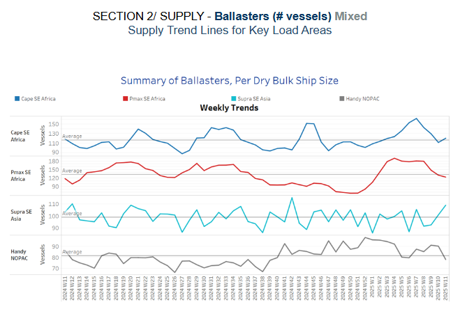
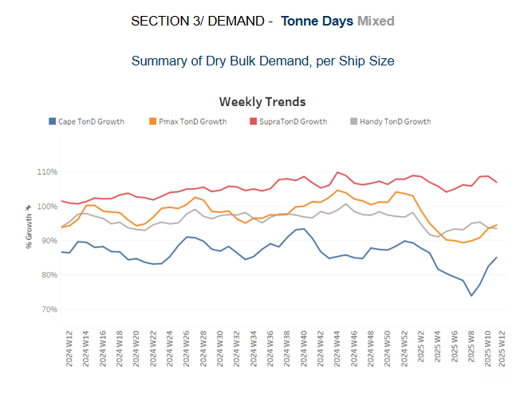
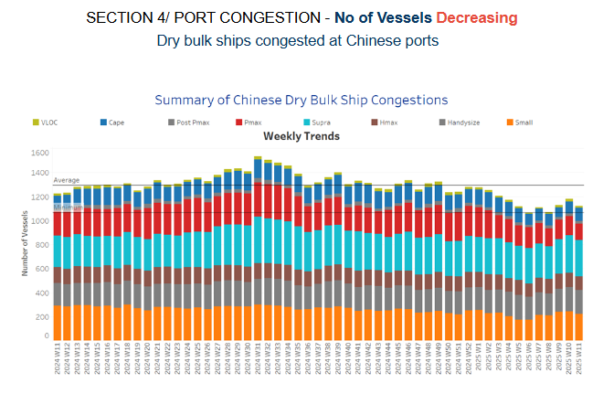

# Iron Ore Flows to China

**Date:** March 12, 2025  
**Publisher:** Breakwave Advisors | **Category:** Market Insights  
**Original URL:** [https://www.breakwaveadvisors.com/insights/2025/3/12/iron-ore-flows-to-china](https://www.breakwaveadvisors.com/insights/2025/3/12/iron-ore-flows-to-china)  

---

**Dry Weekly Market Monitor - Week 11, 2025**
Snapshot of Spot Freight Rates, Supply-Demand Trends, Port Congestions
March 12, 2025

> **Figure 1: Στιγμιότυπο Οθόνης 2025 03 12 124851**  
> **Interactive Data & Source:** [Signal Ocean Platform](https://www.thesignalgroup.com/signal-ocean-platform) | [Local Asset](file:///C:/Users/Dell/Github/Shipping/corpus/03-breakwave/insights/2025/assets/2025-03-12_iron-ore-flows-to-china_img_cea3cf84ceb9ceb3cebcceb9cf8ccf84cf85_d3d54763a5d0.png)

The second week of March confirmed signs of a firming sentiment in Capesize Brazil-to-North China rates, with the vessel count of ballasters continuing to hover at lower volumes compared to the peak levels observed in February. This recent rebound appears to be largely driven by a temporary release of oversupply burden rather than a significant surge in demand. A closer examination of the monthly volume of iron ore dry bulk flows to China reveals a weaker start to the year, with the first two months ending at lower levels compared to previous years. February, in particular, is estimated to have closed with a 6% year-over-year decline, reflecting subdued demand pressures and cautious market sentiment.

Adding to the uncertainty, concerns persist over the growth trajectory of the world’s second-largest economy, China. With global trade still adjusting to the lingering impact of US-imposed tariffs from the Trump administration, major commodity trading patterns remain in uncharted waters. The volatility in commodity prices, driven by geopolitical tensions and shifting trade policies, continues to influence the dry bulk shipping market, leaving freight rates susceptible to abrupt shifts in sentiment.

Looking ahead, the iron ore freight industry is likely to remain heavily influenced by Chinese demand dynamics, as well as broader macroeconomic factors. The pace of economic recovery and industrial activity in China will be key in determining market stability. Meanwhile, the gradual release of the oversupply burden will be a crucial factor in shaping freight market performance, as owners and operators navigate the ongoing challenges of balancing vessel capacity with fluctuating demand.

> **Figure 2: Στιγμιότυπο Οθόνης 2025 03 12 125007**  
> **Interactive Data & Source:** [Signal Ocean Platform](https://www.thesignalgroup.com/signal-ocean-platform) | [Local Asset](file:///C:/Users/Dell/Github/Shipping/corpus/03-breakwave/insights/2025/assets/2025-03-12_iron-ore-flows-to-china_img_cea3cf84ceb9ceb3cebcceb9cf8ccf84cf85_494113880286.png)

The rise in Capesize rates from Brazil to North China accelerated in the second week of March, fueled by a continued decline in the number of ballasters, which strengthened market conditions.

- **Capesize**vessel freight rates for shipments from Brazil to North China surpassed $20 per tonne, lifting market sentiment after dropping to approximately $16 per tonne in mid-February. This marked an 11% increase on a weekly basis.
- **Panamax**vessel freight rates from the Continent to the Far East remained at $29 per tonne, reflecting the same weekly market trend.
- **Supramax**vessel freight rates on the Indo-ECI route held firm levels around $8 per tonne, with a steady sentiment in the first half of March.
- **Handysize**freight rates for the NOPAC Far East route continued above nearly $30 per tonne from the end of February, marking a 23% monthly increase.

> **Figure 3: Στιγμιότυπο Οθόνης 2025 03 12 125101**  
> **Interactive Data & Source:** [Signal Ocean Platform](https://www.thesignalgroup.com/signal-ocean-platform) | [Local Asset](file:///C:/Users/Dell/Github/Shipping/corpus/03-breakwave/insights/2025/assets/2025-03-12_iron-ore-flows-to-china_img_cea3cf84ceb9ceb3cebcceb9cf8ccf84cf85_d5580f00bb4f.png)

The latest indicators from the ballasters' perspective suggest a mixed outlook, with a notable downward revision in the Capesize and Panamax segments in Southeast Africa.

- **Capesize, SE Africa**: The number of vessels hovered around the annual average of 110. Despite signs of a slight increase, it remained significantly lower than the peak of around 160 recorded in week 8.
- **Panamax SE Africa**: The vessel count continued to decline with levels dropping below the annual average of 130 — almost 10 fewer than the previous week.
- **Supramax SE Asia**: In the second week of March, levels continued to rise above the annual average of 98, with indications that the spike will persist in the coming days.
- **Handysize NOPAC**: The Handy NOPAC segment maintained its downward revision from late February, with levels now falling below the annual trend of 82.

> **Figure 4: Στιγμιότυπο Οθόνης 2025 03 12 125149**  
> **Interactive Data & Source:** [Signal Ocean Platform](https://www.thesignalgroup.com/signal-ocean-platform) | [Local Asset](file:///C:/Users/Dell/Github/Shipping/corpus/03-breakwave/insights/2025/assets/2025-03-12_iron-ore-flows-to-china_img_cea3cf84ceb9ceb3cebcceb9cf8ccf84cf85_58d48d6e041a.png)

The second week of March shows an increasing trend in the Capesize and Panamax vessel size segments after they hit a bottom low four weeks ago, while smaller vessel categories seem to still be under downward pressure.

- **Capesize**: The growth rate continued the upward trend of early March, fuelling expectations for a firmer freight market momentum in the second half of March.
- **Panamax**: Tonne-day growth maintained an upward trend, showing signs of surpassing the growth rate observed in the Handysize vessel segment. However, recent indications suggest that tonne-day growth remains below the peak recorded at the end of the previous year.
- **Supramax**: The growth rate remains the strongest among vessel size categories. However, early indications of a downward trend have emerged, with the second half of the month showing signs of a slower growth pace.
- **Handysize**: Its growth rate remains aligned with that of the Panamax segment; however, signs of a downward trend are emerging for the coming days of March.

> **Figure 5: Στιγμιότυπο Οθόνης 2025 03 12 125334**  
> **Interactive Data & Source:** [Signal Ocean Platform](https://www.thesignalgroup.com/signal-ocean-platform) | [Local Asset](file:///C:/Users/Dell/Github/Shipping/corpus/03-breakwave/insights/2025/assets/2025-03-12_iron-ore-flows-to-china_img_cea3cf84ceb9ceb3cebcceb9cf8ccf84cf85_0d592f4c3bab.png)

Congestion at Chinese dry bulk ports trended downward, with decreasing trends in the Panamax, Supramax and Handysize vessel segments.

- **Capesize**: Capesize vessel congestion rose 109, marking an increase of 10 compared to the end of the previous week.
- **Panamax**: Panamax vessel congestion fell below 140, defying expectations of higher congestion levels by early March, and now almost 20 lower than the end of the previous week.
- **Supramax**: Congestion levels, which showed signs of surpassing the 300 mark in early March, are now stabilizing around that level with no indications of further increase.
- **Handysize**: Congestion levels have dropped below 200 but remain nearly 20 higher than those recorded four weeks ago.

Data Source:[Signal Ocean Platform](https://www.thesignalgroup.com/signal-ocean-platform)

---

**Tags:** Shipping, Drybulk, Markets  
