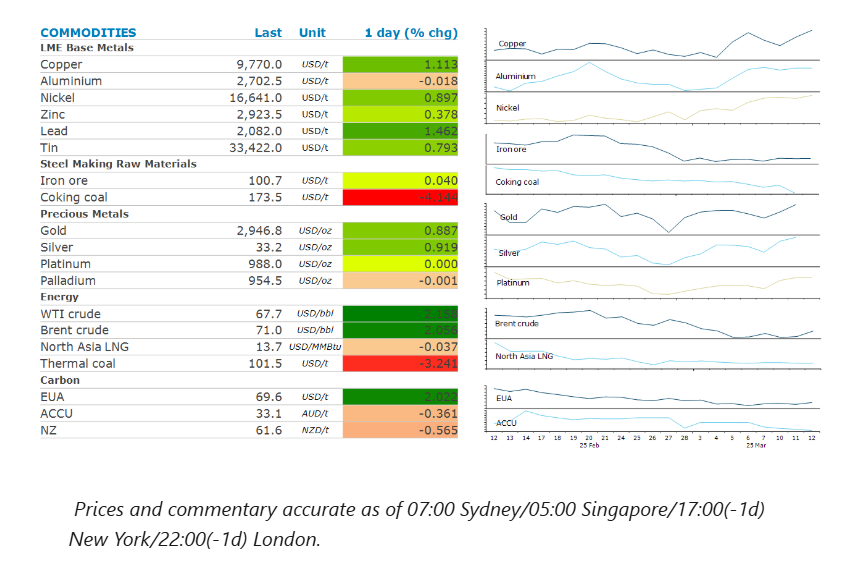
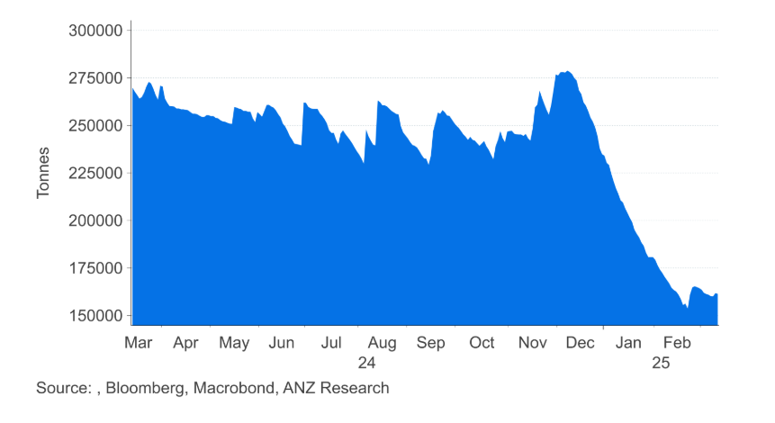

# Metals gain as supply side issues re-emerge

**Date:** March 13, 2025  
**Publisher:** Breakwave Advisors | **Category:** Market Insights  
**Original URL:** [https://www.breakwaveadvisors.com/insights/2025/3/13/metals-gain-as-supply-side-issues-re-emerge](https://www.breakwaveadvisors.com/insights/2025/3/13/metals-gain-as-supply-side-issues-re-emerge)  

---

Lower-than-expected consumer inflation sparked a risk-on tone across markets. Supply side issues in metal markets pushed that sector higher.

*By*[*Daniel Hynes*](https://www.linkedin.com/in/dahynes/)

> **Figure 1: Στιγμιότυπο Οθόνης 2025 03 13 102558**  
> **Interactive Data & Source:** [Linkedin](https://www.linkedin.com/newsletters/commodities-wrap-6692196755876012032/?fbclid=IwAR3kiXJqZdxmp9ZcRwBNI7FsBySI-XSC0pfPur1qzjt7OZp7PTE59Tsl1QI) | [Local Asset](file:///C:/Users/Dell/Github/Shipping/corpus/03-breakwave/insights/2025/assets/2025-03-13_metals-gain-as-supply-side-issues-re-emerge_img_cea3cf84ceb9ceb3cebcceb9cf8ccf84cf85_eec36d8baad3.png)

### Market Commentary

**Crude oil**rallied as bullish economic data triggered a risk-on tone across markets. US consumer prices rose at their lowest pace in four months, easing concerns of stagflation. Sentiment was supported by data showing a pickup in demand for oil products. Gasoline demand is up to 9.2mb/d in the US, the highest level since November. The build in inventories in the US was also lower than expected, with stockpiles rising only 1.5mbbls last week. Data from an industry group earlier this week had reported a build of 4.2mbbls. This helped offset stronger supply. OPEC+ crude oil production surged last month as Kazakhstan further breached its agreed limit. The alliance’s output climbed by 363kb/d to just over 41mb/d in February. Kazakhstan’s production soared by 198kb/d in February to 1.767mb/d. This was around 300kb/d above its ceiling set in the OPEC+ alliance supply agreement. Last week OPEC+ reaffirmed its commitment to phasing out the 2.2mb/d of voluntary cuts implemented by eight members of the alliance, led by Saudi Arabia. That plan entails lifting output by 138kb/d every month, starting in February. Undercompliance will complicate issues when members next meet to discuss their supply strategy.

**European gas**struggled to hold onto yesterday’s gains which were triggered by prospects of stronger demand. Forecasters are pointing to a bout of colder weather, which will test inventory levels. Instead, reports of a possible end to hostilities in the Russia-Ukraine war continues to weigh on sentiment. A report from Bloomberg suggested that Russian President Vladimir Putin will probably agree to eventual truce terms with Ukraine but wants his own conditions met beforehand. President Trump said that a US delegation is heading to Russia to discuss a ceasefire.**North Asia LNG**prices rose on signs of stronger demand. Stockpiles of LNG held by Japanese power generators dropped by 9.6% last week. This takes it to its lowest level in three months, prompting Japanese buyers to seek additional LNG cargoes.

**Copper**rose more than 1% amid the risk-on tone across markets.**Zinc**prices were also up sharply after Nystar said it will cut around 25% of output from its zinc smelter in Australia. The company, which is one of the world’s biggest zinc producers, said the cuts at its 280kt/y smelter will begin in April and will remain in place until further notice. It blamed worsening conditions in raw material markets, and increased costs. In a sign of tightness in the raw material market, spot deals for processing zinc concentrates are being set at negative levels, meaning smelters must pay to process ore. Annual supply contracts were set last year at USD165/t, a three-year low. Gains in zinc prices were also supported by data showing orders to remove zinc metal from LME warehouse rose sharply.

**Gold**gained after the lower-than-expected inflation numbers raised expectations of rate cuts by the Fed. This comes as the US tariffs on steel and aluminium came into effect. The wide use of these metals across the economy raises the prospect of higher costs for manufacturers. Fears of a broader global trade war were also supportive for safe haven assets such as gold. Canada struck back at Trump’s tariffs, setting a 25% levy on about CAD30bn of US made goods. The response was coordinated with the EU, which targeted about EUR26bn of American goods in retaliation.

### Chart of the Day

Inventories of zinc in LME warehouses are falling sharply due to supply tightness in the concentrate market.

> **Figure 2: Στιγμιότυπο Οθόνης 2025 03 13 102715**  
> **Interactive Data & Source:** [Linkedin](https://www.linkedin.com/newsletters/commodities-wrap-6692196755876012032/?fbclid=IwAR3kiXJqZdxmp9ZcRwBNI7FsBySI-XSC0pfPur1qzjt7OZp7PTE59Tsl1QI) | [Local Asset](file:///C:/Users/Dell/Github/Shipping/corpus/03-breakwave/insights/2025/assets/2025-03-13_metals-gain-as-supply-side-issues-re-emerge_img_cea3cf84ceb9ceb3cebcceb9cf8ccf84cf85_019eeeb1987f.png)

Data source:[Commodities Wrap](https://www.linkedin.com/newsletters/commodities-wrap-6692196755876012032/?fbclid=IwAR3kiXJqZdxmp9ZcRwBNI7FsBySI-XSC0pfPur1qzjt7OZp7PTE59Tsl1QI)

---

**Tags:** China, Commodities, Markets  
