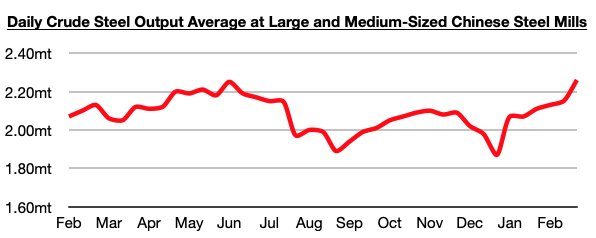

# China's Most Likely Steel Production Bear-Case Scenario Is Not That Bearish

**Date:** March 14, 2025  
**Publisher:** Breakwave Advisors | **Category:** Market Insights  
**Original URL:** [https://www.breakwaveadvisors.com/insights/2025/3/14/chinas-most-likely-steel-production-bear-case-scenario-is-not-that-bearish](https://www.breakwaveadvisors.com/insights/2025/3/14/chinas-most-likely-steel-production-bear-case-scenario-is-not-that-bearish)  

---

*By*[*Jeffrey Landsberg*](https://www.linkedin.com/in/jeffrey-landsberg-70ab957/)

As we have been discussing in client updates throughout this month, it remains to be seen if any drastic steel production cuts will ultimately be carried out by China's central government this year. Bloomberg and others are expecting that cuts could end up resulting in China's steel production falling by as much as 50 million tons this year — but, for now, no cuts have been announced, and overall we do not expect that China’s steel production will fall by 50 million tons this year. As we discussed for clients last week, China’s steel production has most recently climbed to the highest level since June 2023 and is at a level that is up year-on-year by 6%. More than anything, we believe China's central government will make sure to not do anything to jeopardize employment and stability.

> **Figure 1: Chart**  
> [Local Asset](file:///C:/Users/Dell/Github/Shipping/corpus/03-breakwave/insights/2025/assets/2025-03-14_chinas-most-likely-steel-production-bear-case-scenario-is-not-that-bearish_img_chart_a706d709752b.jpg)

For now, China’s steel output is actually on pace to grow this year by around 50 million tons. We believe that a 50 million ton decline is highly unlikely — and if anything, steel output ending flat and/or down very slightly this year is the most likely bear-case scenario.

---

**Tags:** China, Economy, Markets  
