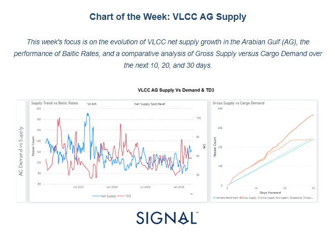
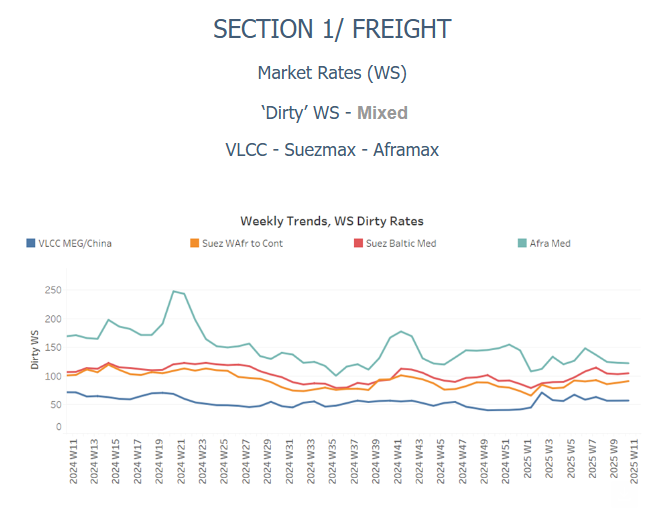
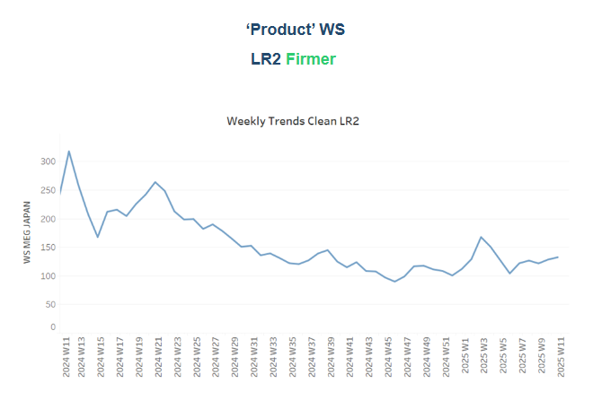
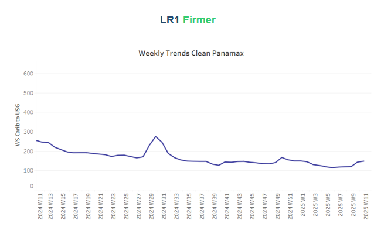
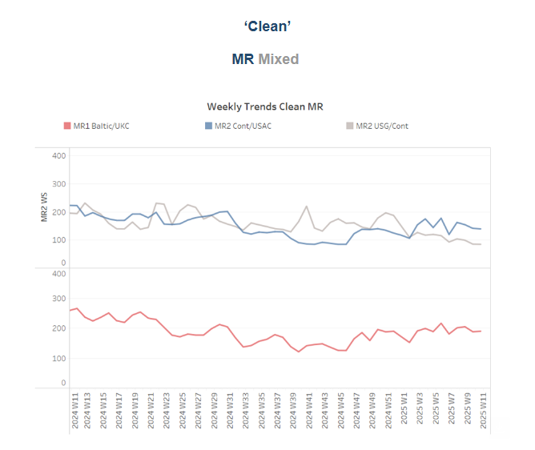
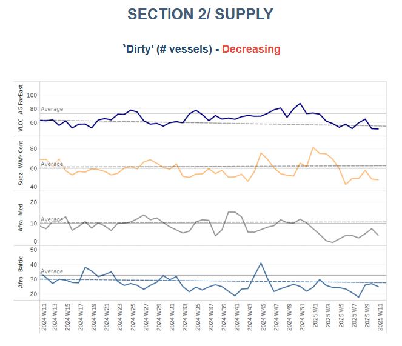
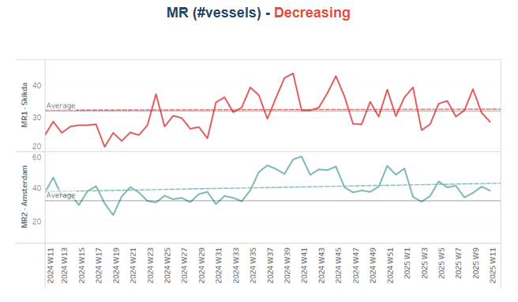
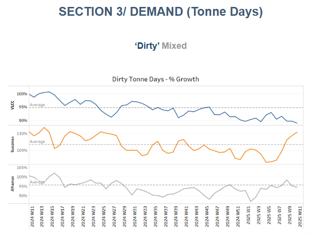
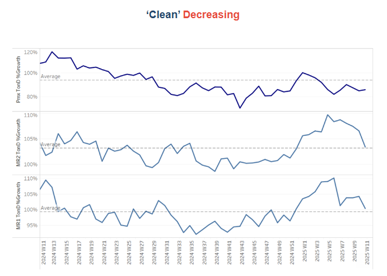

# VLCC AG Supply

**Date:** March 14, 2025  
**Publisher:** Breakwave Advisors | **Category:** Market Insights  
**Original URL:** [https://www.breakwaveadvisors.com/insights/2025/3/14/vlcc-ag-supply](https://www.breakwaveadvisors.com/insights/2025/3/14/vlcc-ag-supply)  

---

### Tanker - Weekly Market Monitor

Snapshot of Crude and Product Freight Rates, Supply-Demand

Week 11, 13 March, 2025

> **Figure 1: Στιγμιότυπο Οθόνης 2025 03 14 135631**  
> **Interactive Data & Source:** [Signal Ocean Platform](https://www.thesignalgroup.com/signal-ocean-platform) | [Local Asset](file:///C:/Users/Dell/Github/Shipping/corpus/03-breakwave/insights/2025/assets/2025-03-14_vlcc-ag-supply_img_cea3cf84ceb9ceb3cebcceb9cf8ccf84cf85_ec5921b4ceff.png)

### VLCC Net Supply Trends, Baltic Rates Performance & Cargo Demand Projections

This week, we examine the evolution of VLCC net supply growth in the Arabian Gulf (AG), the performance of Baltic Rates (TD3), and how gross supply compares to cargo demand over the next 10, 20, and 30 days. These insights tie into the latest macro projections for global crude oil demand—especially from China—and whether a tightening vessel supply situation could boost Baltic rates.

## VLCC Net Supply & Baltic Rates Performance

The first chart illustrates the historical trend of VLCC net supply in the AG (blue line) alongside the TD3 Baltic Rate index (red line). Notable fluctuations in supply levels appear correlated with periods of volatility in TD3, particularly during mid-2023 and early 2024. In early March, a sharp spike in net supply contributed to a softening momentum in TD3 rates. However, a recent downward adjustment in supply appears to be emerging. If this trend persists, it could set the stage for a supply-driven rebound in freight rates.

## Gross Supply vs. Cargo Demand – Forward Projections

The second chart illustrates the projected trajectory of gross supply relative to cargo demand over the next 30 days. Currently, gross supply is outpacing demand, reflecting a relatively loose market. This imbalance suggests that, unless demand increases significantly in the coming weeks, freight rates may face challenges in sustaining upward momentum. However, any unforeseen supply chain disruptions or shifts in demand dynamics could quickly alter this outlook, potentially tightening the market and supporting rate increases.

## China's Role & Crude Oil Demand Outlook

Given China's dominance in crude oil imports, any shifts in refinery throughput, strategic stockpiling, or economic stimulus measures will directly influence the VLCC freight market. Current macroeconomic forecasts suggest a moderate recovery in Chinese crude demand in Q2 2025, which could lead to increased cargo movements and, consequently, firmer freight rates—particularly if vessel availability tightens.

> **Figure 2: Στιγμιότυπο Οθόνης 2025 03 14 135728**  
> **Interactive Data & Source:** [Signal Ocean Platform](https://www.thesignalgroup.com/signal-ocean-platform) | [Local Asset](file:///C:/Users/Dell/Github/Shipping/corpus/03-breakwave/insights/2025/assets/2025-03-14_vlcc-ag-supply_img_cea3cf84ceb9ceb3cebcceb9cf8ccf84cf85_31df86b4b9b7.png)

VLCC MEG/China routes continue to face challenges in building momentum, while the Suezmax segment shows signs of strengthening as we enter the latter half of the month.

- **VLCC**freight rates for**MEG-China**routes remained below WS60, with market sentiment mirroring levels seen during the same period last year. Suezmax rates for**West Africa to continental**Europe rose WS100, reflecting an 11% monthly increase. Meanwhile, Suezmax rates on the Baltic-Mediterranean route rose above WS120, up 19% weekly.
- **Aframax**freight rates in the**Mediterranean**fell below WS125, extending their decline since late February. The latest trend reflects an 18% drop month-on-month.

> **Figure 3: Στιγμιότυπο Οθόνης 2025 03 14 135819**  
> **Interactive Data & Source:** [Signal Ocean Platform](https://www.thesignalgroup.com/signal-ocean-platform) | [Local Asset](file:///C:/Users/Dell/Github/Shipping/corpus/03-breakwave/insights/2025/assets/2025-03-14_vlcc-ag-supply_img_cea3cf84ceb9ceb3cebcceb9cf8ccf84cf85_db455e194626.png)

- **LR2**AG freight rates held firmer levels of the previous week at around WS140, reflecting a 14% monthly increase.

> **Figure 4: Στιγμιότυπο Οθόνης 2025 03 14 135902**  
> **Interactive Data & Source:** [Signal Ocean Platform](https://www.thesignalgroup.com/signal-ocean-platform) | [Local Asset](file:///C:/Users/Dell/Github/Shipping/corpus/03-breakwave/insights/2025/assets/2025-03-14_vlcc-ag-supply_img_cea3cf84ceb9ceb3cebcceb9cf8ccf84cf85_a7c0ac5d671d.png)

- **Panamax**Carib-to-USG remained at around 150 WS, which corresponds to an increase of 25 % compared to the previous month.

> **Figure 5: Στιγμιότυπο Οθόνης 2025 03 14 135944**  
> **Interactive Data & Source:** [Signal Ocean Platform](https://www.thesignalgroup.com/signal-ocean-platform) | [Local Asset](file:///C:/Users/Dell/Github/Shipping/corpus/03-breakwave/insights/2025/assets/2025-03-14_vlcc-ag-supply_img_cea3cf84ceb9ceb3cebcceb9cf8ccf84cf85_88e82d7ae6da.png)

- **MR1**freight rates for Baltic-to-Continent shipments hovered around WS190, reflecting a similar momentum of the previous week.

- **MR2**rates for shipments from the Continent to the US Atlantic Coast (USAC) remained steady at WS145, maintaining last week's sentiment and marking a 26% month-over-month increase. Meanwhile, MR2 rates on the US Gulf-to-Continent route declined to WS85, reflecting an 11% monthly drop.

> **Figure 6: Στιγμιότυπο Οθόνης 2025 03 14 140250**  
> **Interactive Data & Source:** [Signal Ocean Platform](https://www.thesignalgroup.com/signal-ocean-platform) | [Local Asset](file:///C:/Users/Dell/Github/Shipping/corpus/03-breakwave/insights/2025/assets/2025-03-14_vlcc-ag-supply_img_cea3cf84ceb9ceb3cebcceb9cf8ccf84cf85_23974a957b95.png)

​​​​​The availability of crude tankers remained relatively stable for VLCCs and Suezmax vessels but declined compared to the peaks seen earlier in the year. Meanwhile, recent estimates indicate a downward revision for Aframax vessels.

- **VLCC Ras Tanura**: The current ship count stands at approximately 50, marking a decline of over 30 vessels compared to the peak levels recorded at the end of last year.
- **Suezmax Wafr**: The current ship count is below 50, consistent with the weakening trend of the previous weeks and nearly ten below the annual average, signaling a further downward correction for the second half of March.
- **Aframax Med**: After showing an upward trend at the beginning of March, the number of ships began to fall below the annual benchmark of 10, reaching its final low point at the end of week three.
- **Aframax Baltic**: The number of ships remained below the annual average of 30 and was around 25 — almost eight more than the low at the end of the seventh week.

> **Figure 7: Στιγμιότυπο Οθόνης 2025 03 14 140843**  
> **Interactive Data & Source:** [Signal Ocean Platform](https://www.thesignalgroup.com/signal-ocean-platform) | [Local Asset](file:///C:/Users/Dell/Github/Shipping/corpus/03-breakwave/insights/2025/assets/2025-03-14_vlcc-ag-supply_img_cea3cf84ceb9ceb3cebcceb9cf8ccf84cf85_5778e021d26e.png)

- **Clean LR2 AG Jubail**: The downward trend persists, with the vessel count remaining below the annual average of 11 over the last five weeks.

- **Clean MR**: The number of ships at Algeria's Skikda port continued its downward trend from the previous week, with vessel activity at MR1 Skikda declining to 29—three fewer than the previous week. Meanwhile, MR2 activity in Amsterdam fell below 39, marking a decrease of 15 compared to the start of the year.

> **Figure 8: Στιγμιότυπο Οθόνης 2025 03 14 141001**  
> **Interactive Data & Source:** [Signal Ocean Platform](https://www.thesignalgroup.com/signal-ocean-platform) | [Local Asset](file:///C:/Users/Dell/Github/Shipping/corpus/03-breakwave/insights/2025/assets/2025-03-14_vlcc-ag-supply_img_cea3cf84ceb9ceb3cebcceb9cf8ccf84cf85_fce6889cb64a.png)

- **Dirty**tonne days: The growth rate of dirty tonne-days for VLCCs remained sluggish for another week, reaching its lowest level in the past year. In contrast, the Suezmax segment experienced a remarkable recovery starting in the first week of March, while Aframax activity has been gaining momentum since late February, though it continues to hover around the annual average growth trend.

> **Figure 9: Στιγμιότυπο Οθόνης 2025 03 14 141111**  
> **Interactive Data & Source:** [Signal Ocean Platform](https://www.thesignalgroup.com/signal-ocean-platform) | [Local Asset](file:///C:/Users/Dell/Github/Shipping/corpus/03-breakwave/insights/2025/assets/2025-03-14_vlcc-ag-supply_img_cea3cf84ceb9ceb3cebcceb9cf8ccf84cf85_67bcfb177185.png)

- **Panamax**tonne days: The growth rate remains below the weekly annual average recorded since the beginning of the year, although it has recovered from its low point recorded six weeks ago.

- **MR**tonne-days: The growth rate of the MR segment has continued to decline and is now close to the annual average. In the meantime, the peak observed in week 5 appears to be further away from the current momentum.

Data Source:[Signal Ocean Platform](https://www.thesignalgroup.com/signal-ocean-platform)

---

**Tags:** Tankers, Crude, Markets  
