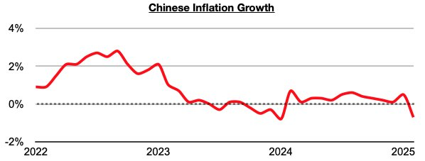
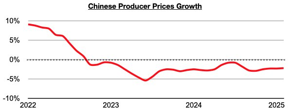

# China Remains Uniquely Positioned To Carry Out Stimulus

**Date:** March 17, 2025  
**Publisher:** Breakwave Advisors | **Category:** Market Insights  
**Original URL:** [https://www.breakwaveadvisors.com/insights/2025/3/17/china-remains-uniquely-positioned-to-carry-out-stimulus](https://www.breakwaveadvisors.com/insights/2025/3/17/china-remains-uniquely-positioned-to-carry-out-stimulus)  

---

*By*[*Jeffrey Landsberg*](https://www.linkedin.com/in/jeffrey-landsberg-70ab957/)

China’s inflation last month contracted year-on-year by 0.7%, which has marked the first time since January 2024 that a contraction has occurred. Overall, inflation has stayed low in China, and it has now entered deflationary territory. A major issue that we have been stressing in our Weekly Executive Reports and Weekly China Reports is that inflation staying relatively low in China (compared to much of the rest of the world), was continuing to provide China's central government a luxury of more safely being able to carry out inflationary stimulus measures (compared to other governments). Now with inflation turning negative, even more stimulus measures are likely to be rolled out.

> **Figure 1: Chart 1**  
> [Local Asset](file:///C:/Users/Dell/Github/Shipping/corpus/03-breakwave/insights/2025/assets/2025-03-17_china-remains-uniquely-positioned-to-carry-out-stimulus_img_chart1_7cbdce2d34e7.jpg)

Also remaining significant in China is that producer prices (PPI) remain weakest. China’s PPI last month contracted year-on-year by 2.2%. Weakness in producer prices remains beneficial to China (and shipping markets) as China remains a net importer (especially with commodities).

> **Figure 2: Chart 2**  
> [Local Asset](file:///C:/Users/Dell/Github/Shipping/corpus/03-breakwave/insights/2025/assets/2025-03-17_china-remains-uniquely-positioned-to-carry-out-stimulus_img_chart2_b374d8255723.jpg)

---

**Tags:** China, Economy, Markets  
