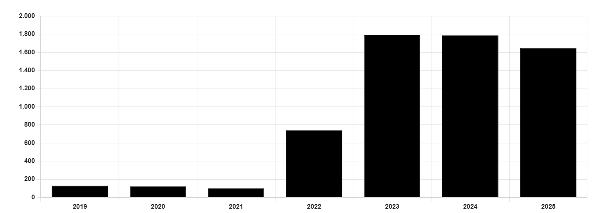

# Sailing the Sea of Sanctions

**Date:** March 17, 2025  
**Publisher:** Breakwave Advisors | **Category:** Market Insights  
**Original URL:** [https://www.breakwaveadvisors.com/insights/2025/3/17/sailing-the-sea-of-sanctions](https://www.breakwaveadvisors.com/insights/2025/3/17/sailing-the-sea-of-sanctions)  

---

> **Figure 1: Products Tanker**  
> **Interactive Data & Source:** [Gibsons Co](https://www.gibsons.co.uk/market-reports) | [Local Asset](file:///C:/Users/Dell/Github/Shipping/corpus/03-breakwave/insights/2025/assets/2025-03-17_sailing-the-sea-of-sanctions_img_products-tanker_432c58f603f3.jpg)

Just before the end of his presidency, the Biden administration gave a parting gift to the tanker markets as the Office of Foreign Assets Control (OFAC) sanctioned 155 mainly Russia affiliated tankers. In the same week, Shandong Port Group, home to refiners responsible for significant crude imports from countries under US embargo, banned sanctioned tankers from calling into its ports in eastern China. The following weeks saw some redirection of trade flows and rising freight rates especially for VLCCs, as buyers of Iranian and Russian crude attempted to diversify their import streams to safeguard supply.

Not long after Donald Trump came to power, he confirmed that the “maximum pressure” policy from his first administration would be reinstated, raising hopes that widespread sanctions and sanctions enforcement on the Iranian oil trade were forthcoming. Yet, after yesterday’s round of sanctions this brings the number of Iranian tankers sanctioned by OFAC since then to 23, and this hope seems to so far have been misplaced. Freight rates which soared in January have shrugged off any further sanctions announcements from the US, UK and EU, and have come back down to earth. This begs the question whether flows have also returned to normal, or whether any lasting impact of this renewed pressure on Iranian and Russian seaborne flows still prevails.

Russian crude imports to India, one of the main importers of Russian crude, initially dropped below its 2024 average by 200kbd in January, and 300kbd in February, which was compensated for by increased imports from West Africa and Latin America. However, imports of Russian crude into India have rebounded so far in March to above average post-Ukraine War levels, possibly supported by prices recently falling below the price cap threshold.

Chinese crude imports seem to have seen a stronger impact, as flows from Iran, Venezuela, and Russia were 800 and 900kbd lower in January and February than the 2024 average, respectively. These numbers need to be taken with a grain of salt, however, as Chinese crude imports from all sources were significantly lower in January, and not all barrels imported in February have been detailed yet. Similarly to India, so far in March imports from Iran, Venezuela, and Russia are back to above 2024 average levels. Run cuts by independent refineries in Shandong may also have contributed to reduced imports, as a change in tax regulations coming into force on January 1st heavily impacted refining margins.

It was reported that the Trump administration was considering an international accord to inspect Iranian oil tankers at sea, though details have been limited. Overall, this could indicate that increased sanctions had a temporary impact on seaborne flows which seem to be normalising again as workarounds have been found. An alternative explanation is that the full effect is yet to be felt. It was reported today that several Chinese state oil companies are halting purchases of Russian oil for March-loading, which would support this thesis. Thus, the effect of sanctions on the utilisation of the dark and sanctioned fleets remains unclear.

### India Imports of Russian Crude (Kbd)

> **Figure 2: Στιγμιότυπο Οθόνης 2025 03 17 100400**  
> **Interactive Data & Source:** [Gibsons Co](https://www.gibsons.co.uk/market-reports) | [Local Asset](file:///C:/Users/Dell/Github/Shipping/corpus/03-breakwave/insights/2025/assets/2025-03-17_sailing-the-sea-of-sanctions_img_cea3cf84ceb9ceb3cebcceb9cf8ccf84cf85_f0fce7b4a382.png)

Data source:[Gibson Shipbrokers](https://www.gibsons.co.uk/market-reports)

---

**Tags:** Shipping, Crude, Tankers  
