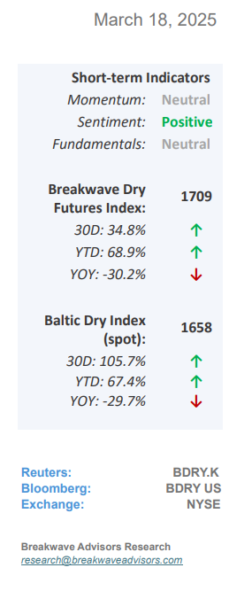
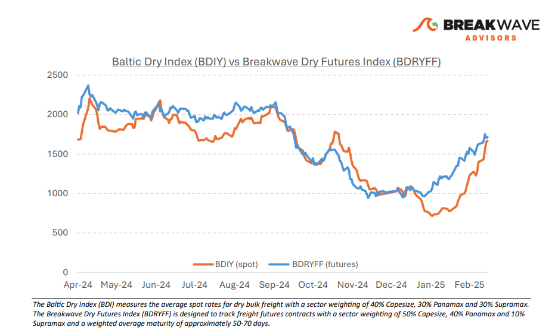
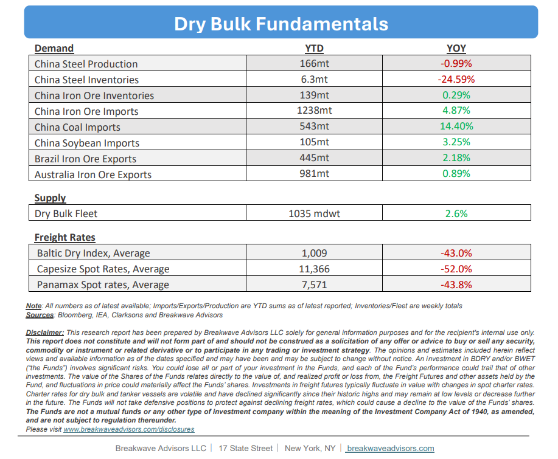

# Breakwave Bi-Weekly Dry Bulk Report - March 18, 2025

**Date:** March 18, 2025  
**Publisher:** Breakwave Advisors | **Category:** Market Insights  
**Original URL:** [https://www.breakwaveadvisors.com/insights/2025183-dry547-hhu5](https://www.breakwaveadvisors.com/insights/2025183-dry547-hhu5)  

---

•**Capesize Spot Rates Hit 4-month Highs as Seasonality Kicks In –**The past month has been**remarkably strong**for the dry bulk shipping market, with spot rates experiencing a significant resurgence. Capesize spot rates have surpassed the 20,000-mark, while Panamax rates have staged a notable recovery. Although the**underlying drivers**—such as congestion in West Africa and concerns over potential U.S. port fees and tariffs—may appear**isolated and specific**, market sentiment has definitely improved. The Capesize futures curve now indicates strong and sustained gains for the remainder of the year. Nevertheless, we remain**cautious****about the durability**of the telegraphed strength, as the broader macroeconomic environment does not justify such optimism—an outlook that is currently reflected across other markets as well. Given the challenges in accurately measuring disruptions, congestion, and diversions linked to existing geopolitical and potential weather-related factors, identifying a timely catalyst for renewed weakness remains difficult. As a result, and given the current tightness in the Atlantic, the**likelihood**of even**higher****spot**rates remains**real**. Yet, our base case calls for a consolidation**period**for spot rates in the**near term**while any further gains in the spot market will be only modestly reflected in futures prices, leading to a deeper backwardated curve. Furthermore, unlike last year, we**foresee increased volatility**in the months ahead, which should create numerous trading opportunities for those prepared to look beyond the stability currently reflected in the futures curve.

> **Figure 1: Στιγμιότυπο Οθόνης 2025 03 18 110906**  
> [Local Asset](file:///C:/Users/Dell/Github/Shipping/corpus/03-breakwave/insights/2025/assets/2025-03-18_2025183-dry547-hhu5_img_cea3cf84ceb9ceb3cebcceb9cf8ccf84cf85_d22abba0c9eb.png)

•**China Continues to Push for Consumer-Focused Reforms –**The**transition**of the Chinese economy from an**investment-driven**model to a**consumer-led framework**remains a key policy objective. Recently, the State Council announced a series of initiatives aimed at boosting consumer spending. While these measures may further help**confidence**in the short term, the broader and more challenging**structural shift**within the Chinese economy**remains****elusive**. Efforts to increase income levels face significant obstacles, particularly from mounting local debt, which will continue to weigh on such initiatives. Yet, a**rapid shift**from the traditional investment-led growth model to a consumer-led one would likely result in**a sharp decline in economic growth**—an outcome that China’s centrally planned government is keen to avoid. As a result, we anticipate that this adjustment process will be gradual and protracted, unfolding over the next decade. Consequently, we**do not expect a significant sharp revival**in Chinese commodity demand in the near term, absent the usual inventory-driven cycles. For the commodity shipping sector, this protracted adjustment represents a**considerable headwind.**As a result, it is the supply side of shipping that will need to adapt in order to provide any meaningful support for freight rates.

•**Our Long-term View**– The last few years have been characterized by increased geopolitical uncertainty. Going forward, we expect such events to continue to affect global trade and have a meaningful impact on effective vessel supply. Combined with the potential for a multi-year cyclical rebound in China’s economic activity following the recent economic turmoil, dry bulk shipping should experience higher volatility on top of a secular tightness driven by stable bulk commodity demand and a slower fleet growth owing to a relatively low orderbook.

> **Figure 2: Στιγμιότυπο Οθόνης 2025 03 18 091607**  
> [Local Asset](file:///C:/Users/Dell/Github/Shipping/corpus/03-breakwave/insights/2025/assets/2025-03-18_2025183-dry547-hhu5_img_cea3cf84ceb9ceb3cebcceb9cf8ccf84cf85_a6890e40f216.png)

> **Figure 3: Στιγμιότυπο Οθόνης 2025 03 18 110938**  
> [Local Asset](file:///C:/Users/Dell/Github/Shipping/corpus/03-breakwave/insights/2025/assets/2025-03-18_2025183-dry547-hhu5_img_cea3cf84ceb9ceb3cebcceb9cf8ccf84cf85_5b440fb08311.png)

### Subscribe:
