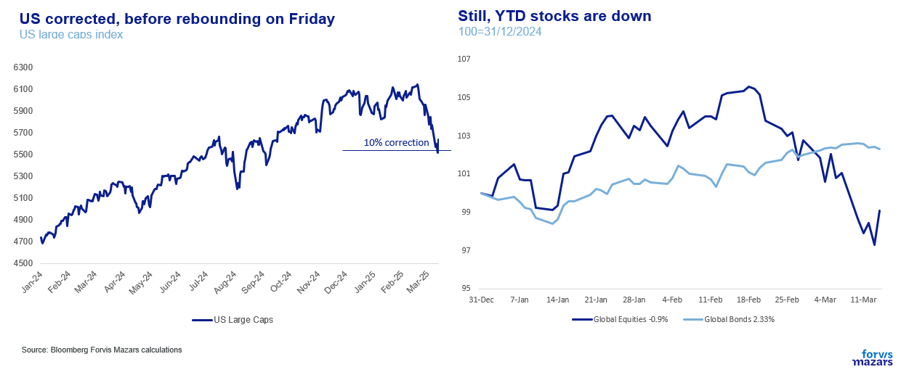
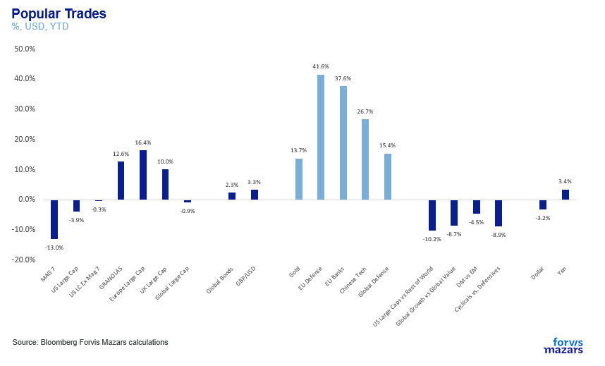
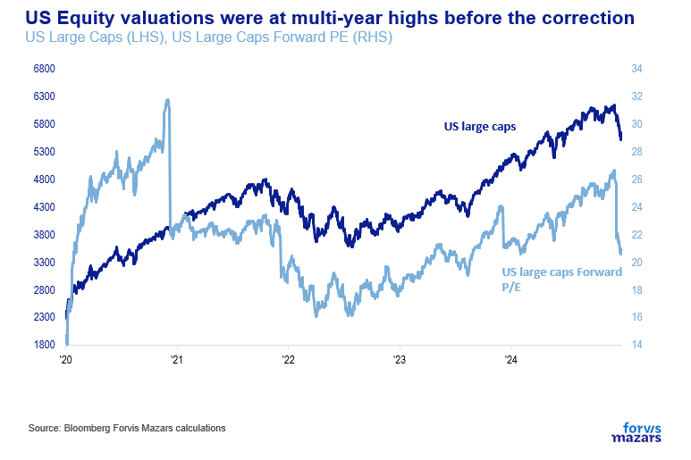
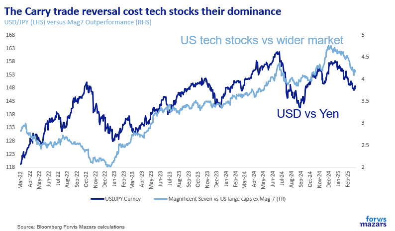
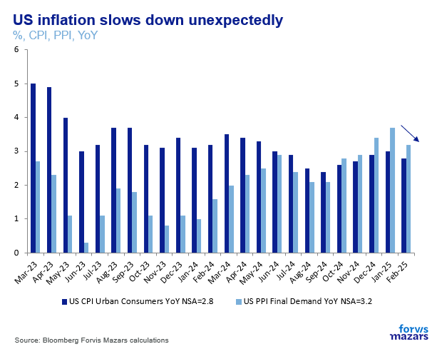
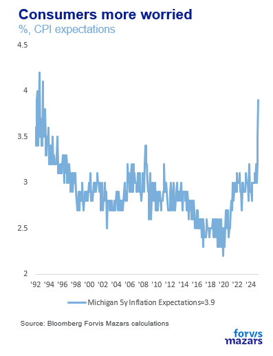
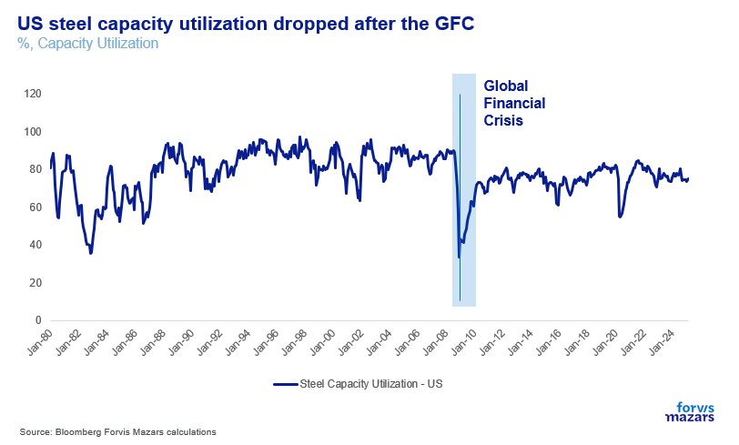

# This wasn’t about the economy. The next one could be

**Date:** March 18, 2025  
**Publisher:** Breakwave Advisors | **Category:** Market Insights  
**Original URL:** [https://www.breakwaveadvisors.com/insights/2025/3/18/this-wasnt-about-the-economy-the-next-one-could-be](https://www.breakwaveadvisors.com/insights/2025/3/18/this-wasnt-about-the-economy-the-next-one-could-be)  

---

The three things investors need to know this week

1. Last weeks’ correction was more about the frothy US equity market finally having a catalyst to take tech profit off the table, more so than it was about the economy.
2. **Nevertheless, we think that we could see increased macroeconomic volatility going forward, which could affect risk markets more and eat into real growth.**
3. Investors need to separate intentions and narratives from projected outcomes.

*By*[*George Lagarias*](https://www.linkedin.com/in/george-lagarias-mba-3baa769/)

Summary

US equities reached correction territory before rebounding on Friday. What we have been living is not investors pricing in a brand-new economic reality, as much as a healthy reaction to a very expensive US, tech-driven equity market.**However, the fact that the US and the global economy was not really the main protagonist of the correction does not mean that we should dismiss concerns over inflation and economic growth.****US trade policy spillovers may be inevitable.****While we believe that many of Washington’s strategies make sense on their own, it is the sum of the parts and the execution which make success questionable.**

**The larger picture, however, is that Washington is trying to solve a global growth problem by recasting it as a global competition problem**.**We believe that persistent lack of clarity and constant changes in direction, will force producers to increase stocks, reducing profits (stock maintenance costs money) and increasing inflation (which reduces real growth) as they compete for resources. There’s already evidence that consumers are becoming more reticent. Meanwhile, protectionism in the US could spread to avoid dumping of goods in other places, killing the very growth it seeks to protect.**

### Week Ahead

**All eyes are likely on the Fed this week, as investors wait for Jerome Powell to see if the US central bank will exercise its “Put”. It’s unlikely that a healthy correction would trigger intervention though, and such hopes may be quickly dashed. The White House’s reaction to no rate cuts might be more important going forward. The BoE will also very likely announce that it’s keeping rates steady. Instead of looking at the Fed investors should spend the week looking for clues on US consumers. Despite worrying surveys, the latest retail numbers suggest that there is no demand shock and that consumers are still happy to spend money.**

Another week of trade war back and forth and equity volatility is over. US equities reached correction (-10%) territory before rebounding sharply on Friday.

> **Figure 1: Market Chart 1**  
> **Interactive Data & Source:** [Youtube](https://www.youtube.com/watch?v=IGj24KHhMFw) | [Local Asset](file:///C:/Users/Dell/Github/Shipping/corpus/03-breakwave/insights/2025/assets/2025-03-18_this-wasnt-about-the-economy-the-next-one-could-be_img_image001_ec1a548e0388.png)

This confirms that what we have been living through is not investors pricing in a brand-new economic reality, as much as a healthy reaction to a very expensive US, tech-driven equity market and movement towards wider diversification.

> **Figure 2: Market Chart 2**  
> **Interactive Data & Source:** [Youtube](https://www.youtube.com/watch?v=IGj24KHhMFw) | [Local Asset](file:///C:/Users/Dell/Github/Shipping/corpus/03-breakwave/insights/2025/assets/2025-03-18_this-wasnt-about-the-economy-the-next-one-could-be_img_image002_af221907fede.png)

Certainly, European stocks would come in vogue after Germany decided to relax fiscal discipline and Chinese tech stocks would rise after Deepseek’s debut. But that could have only happened if we managed to take our eyes off the “Magnificent Seven”, a handful of stocks driving global equity performance for the past two years.

> **Figure 3: Market Chart 3**  
> **Interactive Data & Source:** [Youtube](https://www.youtube.com/watch?v=IGj24KHhMFw) | [Local Asset](file:///C:/Users/Dell/Github/Shipping/corpus/03-breakwave/insights/2025/assets/2025-03-18_this-wasnt-about-the-economy-the-next-one-could-be_img_image003_60b83917982f.png)

High valuations helped do that and so did the reversion of the carry trade (investors borrowing in cheap Japanese Yen to buy higher yielding US assets).

> **Figure 4: Market Chart 4**  
> **Interactive Data & Source:** [Youtube](https://www.youtube.com/watch?v=IGj24KHhMFw) | [Local Asset](file:///C:/Users/Dell/Github/Shipping/corpus/03-breakwave/insights/2025/assets/2025-03-18_this-wasnt-about-the-economy-the-next-one-could-be_img_image004_4cf2f0deda3f.png)

Economic worries were of course the trigger for the correction, but the market was looking to break free from monothematic US tech investing for some time. Hence the negative reaction of Thursday, even after the latest US inflation report came in better than anticipated

> **Figure 5: Market Chart 5**  
> **Interactive Data & Source:** [Youtube](https://www.youtube.com/watch?v=IGj24KHhMFw) | [Local Asset](file:///C:/Users/Dell/Github/Shipping/corpus/03-breakwave/insights/2025/assets/2025-03-18_this-wasnt-about-the-economy-the-next-one-could-be_img_image005_e4541e11fa8a.png)

.

### Our House View on the Global Economy

**However, the fact that the US and the global economy was not really the main protagonist of the correction does not mean that we should dismiss concerns over inflation and economic growth.**One of the conversations we have had about tariffs was whether the 2025 paradigm is similar to the Great Depression almost a century ago. Santiago Rossi, our Senior Economist, noted that in the 1930s, tariffs were launched from all countries against each other, which is distinctively different from the US alone putting up protectionist measures.

The argument made sense, but the counterpoint was made by Gareth Stace, Director General of UK Steel on Sky News, who warned that cheap Chinese steel that no longer goes to the US has to go somewhere. It is an incentive for Chinese producer to lower prices even more to sell to Europe, and an incentive for Europeans and other nations to put up their own tariffs against China to avoid “dumping” (an economic term signalling the sale of inventory at very low, even below-cost prices).**Thus, US trade policy spillovers may be inevitable.**

So, the question better put is:**will exponentially growing economic and policy uncertainty destabilise the global trading system even in trade relationships where the US is not directly involved? Are we in for a rough (economic) ride?**

No, we don’t have a definitive answer for these. We have opinions, strong even, but we don’t have answers. Right now the world is too much in flux. To come closer to an answering we must first answer two other questions:

Does Washington’s plan have a**feasible endgame**or is an interconnected global economy too unmanageable, in which case we are simply looking at increased macroeconomic and financial volatility without a clear exit strategy?Will the US Dollar remain the world’s dominant currency? And can it do so even if it is significantly debased? Will US Dollar debasement trigger a global currency race to the bottom, as other countries will seek to do the same? (Since these are relative, the value of Dollar and Gold will become a key gauge)

**While we believe that many of Washington’s strategies make sense on their own, it is the sum of the parts and the execution which make success questionable.**

Tariffs, for example, create income which can be spent on consumers. However, they are also a tax on US businesses and create inflation, which eats into real growth.

In case you missed it, last week was not just about the February inflation number. It was also about longer term consumer inflation expectations jumping to their highest point in over 30 years, a number that will likely raise eyebrows at the Fed, which cares a lot about these surveys

> **Figure 6: Market Chart 6**  
> **Interactive Data & Source:** [Youtube](https://www.youtube.com/watch?v=IGj24KHhMFw) | [Local Asset](file:///C:/Users/Dell/Github/Shipping/corpus/03-breakwave/insights/2025/assets/2025-03-18_this-wasnt-about-the-economy-the-next-one-could-be_img_image006_83f5401f19b2.png)

Take steel. Over the shorter term, local producers will try to cover extra demand, for, say, steel, but that assumes that they have been working well below capacity. This is true enough for the US steel industry which operates at[**74%-75%**](https://www.youtube.com/watch?v=IGj24KHhMFw)[**capacity**](https://www.steel.org/industry-data/). However, a[Fred Stlouisfed](https://fred.stlouisfed.org/series/CAPUTLG3311A2S)suggests that after 2008, the sector, which previously operated at 80% to 90%, hasn’t operated above 80% capacity.

> **Figure 7: Careful Examination**  
> **Interactive Data & Source:** [Cato](https://www.cato.org/regulation/fall-2024/what-should-become-us-steel) | [Local Asset](file:///C:/Users/Dell/Github/Shipping/corpus/03-breakwave/insights/2025/assets/2025-03-18_this-wasnt-about-the-economy-the-next-one-could-be_img_image007_e343ce6a959f.png)

What happened in 2008? It was not China expanding its steel industry. Rather, it was the Global Financial Crisis. It’s a decade of haphazard demand conditions, followed by the pandemic. We could re-iterate the point that a lot of what we are experiencing economically, financially and politically is still the wake of that crisis, which has defined the modern economy as much as the Great Depression defined much of the 20th century. But it’s a very large discussion and certainly beyond the scope of this document.

**The larger picture, however, is that Washington is trying to solve a global growth problem by recasting it as a global competition problem. This is what makes us concerned about its success. Steel producers in the US need upgrades to compete in a global environment. According to the**[**Cato Institute**](https://www.cato.org/regulation/fall-2024/what-should-become-us-steel)**, the answer is not in protectionism, but rather competitive investment in facilities, AI etc.**

**As for the execution? We believe that persistent lack of clarity and constant changes in direction, will force producers to increase stocks, reducing profits (stock maintenance costs money) and increasing inflation (which reduces real growth) as they compete for resources. There’s already evidence that consumers are becoming more reticent. Meanwhile, protectionism in the US could spread to avoid dumping of goods in other places, killing the very growth it seeks to protect.**

**We are separating intentions and narratives from likely outcomes. So while we are in no position to doubt intentions or validity of American plans to improve their economy, our House View is that it’s very difficult for execution to lead to great economic outcomes for any of the parties involved over the longer term.**

**As for the US Dollar, the answer is even simpler. The US can either strong-arm its trade partners into accepting a significant Dollar devaluation, or, at some point, face competitive devaluation from them. In 1985 it succeeded in convincing Japan and Germany to accept Dollar devaluation. Both of these countries were heavily dependent on the US for military protection. Additionally, Germany was given promises of eventual re-unification and Japan was given access to US companies it could buy with its revalued currency. They both had to reinvent themselves. Germany managed to take advantage of reunification and the Euro to find new buyers, but Japan failed and faced decades of lost growth. These lessons are not lost to America’s trading partners.**

**Meanwhile, devaluation took a decade to produce results for the US, and fifteen years after that manufacturing was still in decline.**

**China and EU 2025 are not Japan and West Germany 1985. So our House View is that while the US may attempt competitive devaluation, it is not likely to succeed over the longer term.**

**We thus think that the prevalent scenario going forward, is for the global economy to experience higher inflation than in the previous decade, and more economic uncertainty, which may eat into real growth and corporate margins.**

---

**Tags:** Macro, Economy, Markets  
