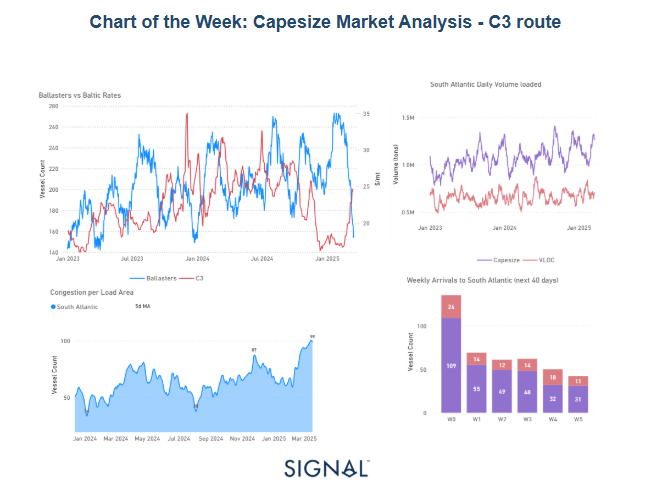
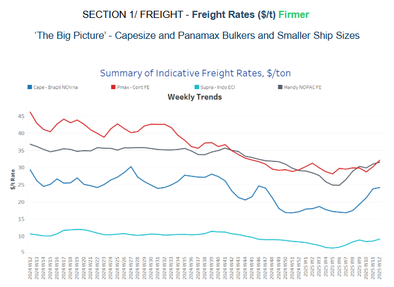
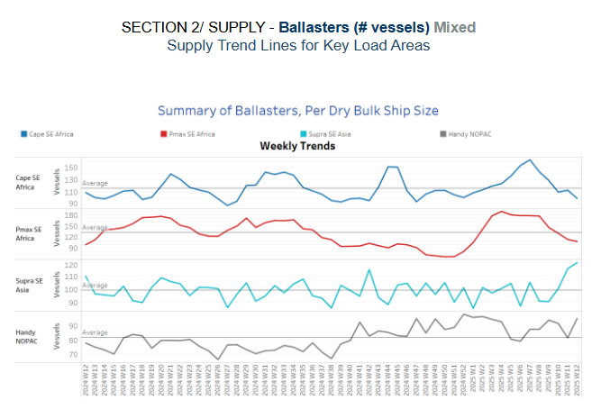
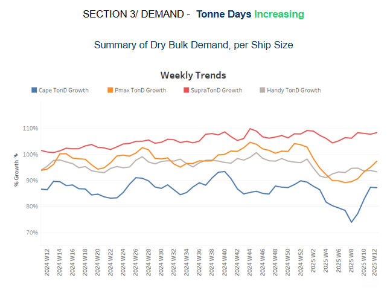
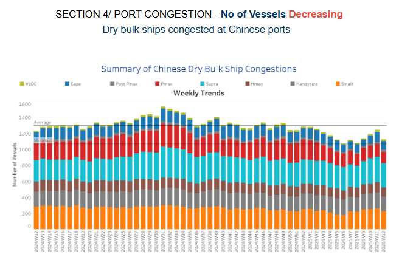

# Capesize Market Analysis

**Date:** March 19, 2025  
**Publisher:** Breakwave Advisors | **Category:** Market Insights  
**Original URL:** [https://www.breakwaveadvisors.com/insights/2025/3/19/capesize-market-analysis](https://www.breakwaveadvisors.com/insights/2025/3/19/capesize-market-analysis)  

---

**Dry Weekly Market Monitor - Week 12, 2025**
Snapshot of Spot Freight Rates, Supply-Demand Trends, Port Congestions
March 18, 2025

> **Figure 1: Στιγμιότυπο Οθόνης 2025 03 19 225910**  
> **Interactive Data & Source:** [Signal Ocean Platform](https://www.thesignalgroup.com/signal-ocean-platform) | [Local Asset](file:///C:/Users/Dell/Github/Shipping/corpus/03-breakwave/insights/2025/assets/2025-03-19_capesize-market-analysis_img_cea3cf84ceb9ceb3cebcceb9cf8ccf84cf85_704a663f6f9d.png)

The dry bulk freight market is currently experiencing a significant upswing, primarily fueled by a notable decrease in the number of ballasters on the C3 route. This has led to anticipation of a market undersupply in the coming weeks, fostering a bullish sentiment among market participants.

### Iron Ore Dynamics and China’s Strategic Positioning

China is preparing to significantly increase its iron ore imports in 2025, despite weakening steel demand. This move coincides with production increases by major suppliers in Australia and Brazil and the expected launch of the Simandou iron ore project. These supply-side changes are expected to reshape global iron ore trade flows and contribute to the ongoing decline in iron ore prices.

### Brazilian Iron Ore Shipments Surge

Chinese importers are strategically increasing their purchases of Brazilian iron ore during the dry season, leading to an expected surge in shipments in March and April. This seasonal pattern reflects China's proactive approach to securing raw materials at favorable prices and ensuring a stable supply amid potential market volatility.

### Congestion and Market Implications

The C3 Brazil-to-China market remains strong, as evidenced by the congestion of nearly 100 vessels in the South Atlantic, the highest level in the past year. This supply chain bottleneck is further exacerbated by strong activity in the region, with daily volume loaded consistently exceeding 1 million tonnes and approaching 1.3 million tonnes. This congestion could continue to put upward pressure on freight rates.

### Supply-Demand Disparity in the South Atlantic

Weekly arrivals of Capesize vessels to the South Atlantic are expected to decline over the next 40 days. With fewer incoming vessels, the gap between supply and demand is widening, providing additional support for elevated freight rates. This trend suggests that demand-side pressures may intensify, reinforcing the bullish outlook for the C3 route in the short term. The anticipated decline in Capesize vessel arrivals to the South Atlantic over the next 40 days will likely widen the gap between supply and demand. This will put additional upward pressure on freight rates and suggests that demand-side pressures may intensify, reinforcing the bullish outlook for the C3 route in the short term.

### Conclusion

The lack of available vessels and increased iron ore shipments from Brazil have tightened the supply side, creating a favorable environment for freight rates, particularly on the C3 route. This is further exacerbated by China's aggressive import strategy, which, combined with seasonal surges in Brazilian exports, is expected to continue market volatility. Traders and shipowners would be well advised to monitor congestion trends and vessel availability, as these will be key factors in determining future freight market dynamics.

> **Figure 2: Στιγμιότυπο Οθόνης 2025 03 19 230108**  
> **Interactive Data & Source:** [Signal Ocean Platform](https://www.thesignalgroup.com/signal-ocean-platform) | [Local Asset](file:///C:/Users/Dell/Github/Shipping/corpus/03-breakwave/insights/2025/assets/2025-03-19_capesize-market-analysis_img_cea3cf84ceb9ceb3cebcceb9cf8ccf84cf85_4a50a53a069a.png)

​​​​The diminishing number of ballasters continued to drive the accelerated rise in Capesize rates from Brazil to North China during the third week of March.

- **Capesize**vessel freight rates from Brazil to North China have climbed to over $24 per tonne. This surge follows a mid-February dip to roughly $16 per tonne and represents a weekly increase of 8%, significantly boosting market sentiment.
- **Panamax**vessel freight rates from the Continent to the Far East saw a 13% increase this week, climbing to over $30 per tonne.
- **Supramax**vessel freight rates on the Indo-ECI route saw a 13% increase week-over-week, holding firm above $9 per tonne.
- **Handysize**freight rates for the NOPAC Far East route saw a 10% increase over the month, remaining above almost $30 per tonne since the end of February.

> **Figure 3: Στιγμιότυπο Οθόνης 2025 03 19 230154**  
> **Interactive Data & Source:** [Signal Ocean Platform](https://www.thesignalgroup.com/signal-ocean-platform) | [Local Asset](file:///C:/Users/Dell/Github/Shipping/corpus/03-breakwave/insights/2025/assets/2025-03-19_capesize-market-analysis_img_cea3cf84ceb9ceb3cebcceb9cf8ccf84cf85_3e3a9e63f840.png)

The latest indicators from the ballasters' perspective maintain the mixed outlook of previous weeks, with a significant downward revision in the Capesize and Panamax segments in Southeast Africa, while smaller vessel size segments have seen an uptick.

- **Capesize, SE Africa**: The number of vessels was approximately 100, which is 10 below the yearly average and appears to be the lowest number observed over the past year.
- **Panamax SE Africa**: The vessel count continued to decline with levels dropping below 110 — almost 25 fewer than the annual average.
- **Supramax SE Asia**: The third week of March saw a continued rise in levels, surpassing the yearly average of 98. Current trends strongly suggest that this upward trajectory will persist in the upcoming days, potentially nearing recent highs around 120.
- **Handysize NOPAC**: The Handy NOPAC segment's levels have increased to 95, continuing an upward trend that began at the end of last week.

> **Figure 4: Στιγμιότυπο Οθόνης 2025 03 19 230246**  
> **Interactive Data & Source:** [Signal Ocean Platform](https://www.thesignalgroup.com/signal-ocean-platform) | [Local Asset](file:///C:/Users/Dell/Github/Shipping/corpus/03-breakwave/insights/2025/assets/2025-03-19_capesize-market-analysis_img_cea3cf84ceb9ceb3cebcceb9cf8ccf84cf85_b15304890501.png)

The third week of March continued the upward trend seen in the previous week for the Capesize and Panamax vessel segments, reinforcing market expectations for a strong close to the first quarter of the year.

- **Capesize**: The growth rate has established a steady momentum, surpassing the highs recorded at the end of last year.
- **Panamax**: Tonne-day growth maintained its upward trajectory, signaling a potential surpassing of the growth rate observed in the Handysize vessel segment. It remains to be seen whether this trend will ultimately exceed the peak recorded at the end of the previous year.
- **Supramax**: The growth rate remains the strongest among vessel size categories; however, no significant spikes have been observed yet, with the trend instead maintaining a steady momentum.
- **Handysize**: Its growth rate is no longer in line with that of the Panamax segment, and signs of a downward trend have been observed since the end of the second week of March.

> **Figure 5: Στιγμιότυπο Οθόνης 2025 03 19 230331**  
> **Interactive Data & Source:** [Signal Ocean Platform](https://www.thesignalgroup.com/signal-ocean-platform) | [Local Asset](file:///C:/Users/Dell/Github/Shipping/corpus/03-breakwave/insights/2025/assets/2025-03-19_capesize-market-analysis_img_cea3cf84ceb9ceb3cebcceb9cf8ccf84cf85_c7077f300770.png)

Congestion at Chinese dry bulk ports has declined since peaking in the second week of March, with a downward trend observed across all vessel size segments.

- **Capesize**: Capesize vessel congestion declined to 108, down by 17 compared to the previous week's end.
- **Panamax**: Panamax vessel congestion recorded lows around 140, 16 lower than the end of the previous week.
- **Supramax**: Congestion levels, which neared the 300 mark in early March, have now stabilized at that level over the past two weeks, showing no signs of further increase.
- **Handysize**: Congestion levels have fallen below 190, marking a decrease of 15 compared to the previous week.

Data Source:[Signal Ocean Platform](https://www.thesignalgroup.com/signal-ocean-platform)

---

**Tags:** Shipping, Drybulk, Markets  
