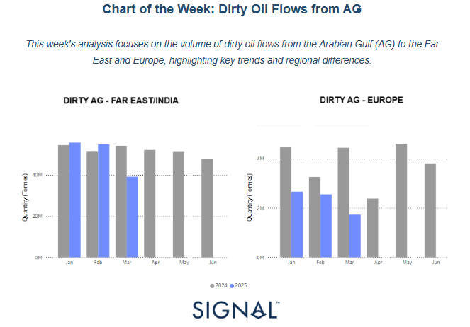
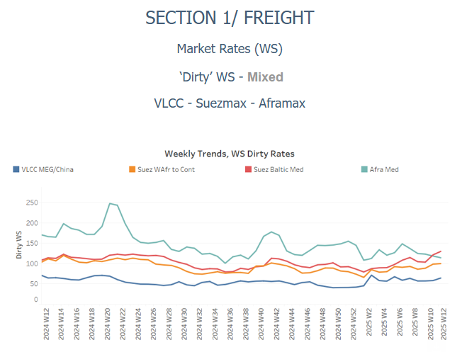
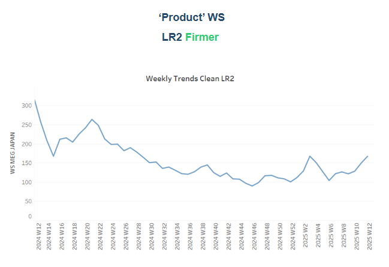
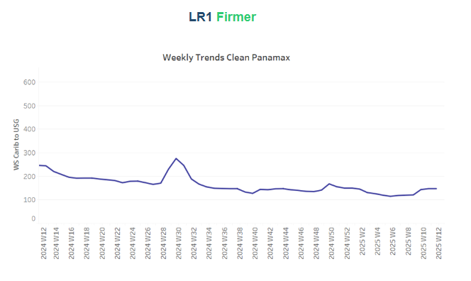
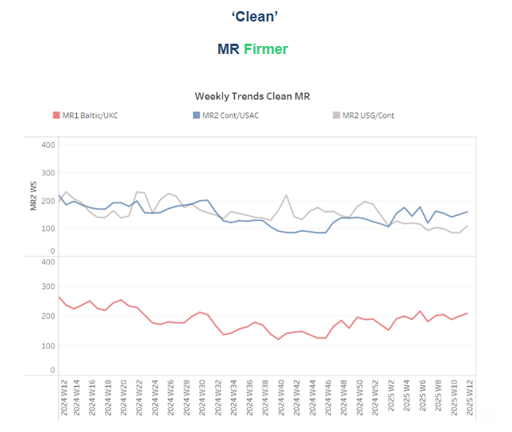
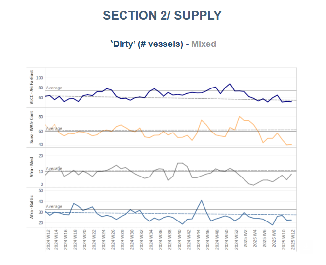
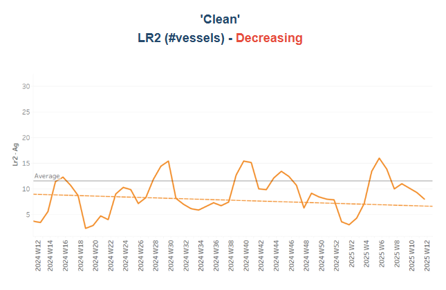
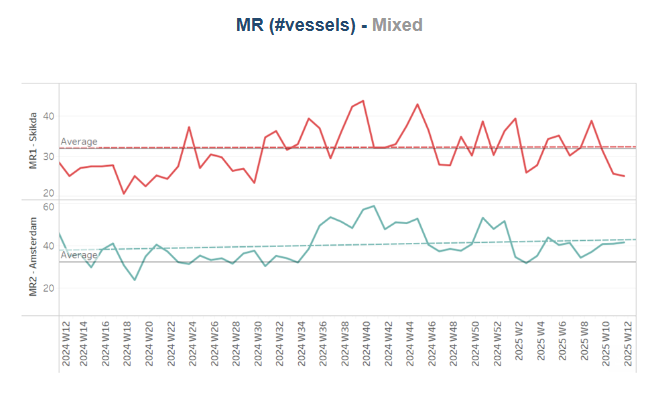
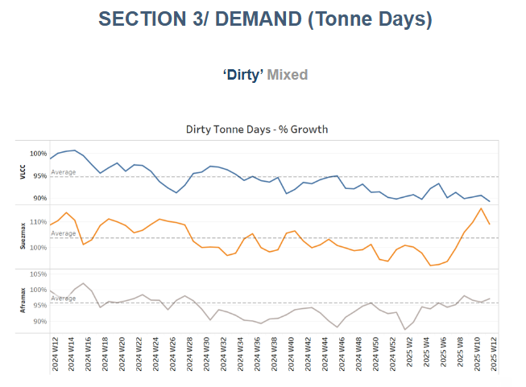
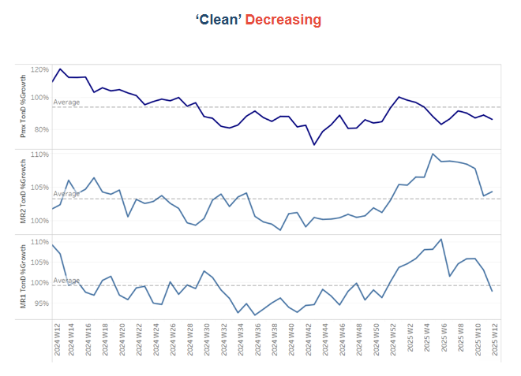

# Dirty Oil Flows from AG

**Date:** March 20, 2025  
**Publisher:** Breakwave Advisors | **Category:** Market Insights  
**Original URL:** [https://www.breakwaveadvisors.com/insights/2025/3/20/dirty-oil-flows-from-ag](https://www.breakwaveadvisors.com/insights/2025/3/20/dirty-oil-flows-from-ag)  

---

## Tanker - Weekly Market Monitor

Snapshot of Crude and Product Freight Rates, Supply-Demand

Week 12, 20 March, 2025

> **Figure 1: Στιγμιότυπο Οθόνης 2025 03 20 223526**  
> **Interactive Data & Source:** [Signal Ocean Platform](https://www.thesignalgroup.com/signal-ocean-platform) | [Local Asset](file:///C:/Users/Dell/Github/Shipping/corpus/03-breakwave/insights/2025/assets/2025-03-20_dirty-oil-flows-from-ag_img_cea3cf84ceb9ceb3cebcceb9cf8ccf84cf85_32972c176453.png)

In recent months, the global oil market has experienced notable shifts, particularly in the dynamics of dirty tanker flows from the Arabian Gulf (AG) to both Europe and the Far East/India. These changes are intricately linked to fluctuations in crude oil prices and projections of a tightening global oil supply.​

### Dirty Tanker Flows: AG to Far East/india vs. Europe

The chart above illustrates the dirty oil flow of the Arabian Gulf (AG) to the Far East/India and Europe, comparing data from 2024 (gray bars) and 2025 (blue bars). The trends indicate differences in demand and distribution patterns across these two key regions, with notable variations in early 2025.

In the Far East/India, oil flows in 2024 remained relatively stable, consistently maintaining high volumes throughout the year's first half. The 2025 data, however, shows a noticeable decline in March, suggesting a potential disruption or shift in market demand. Despite this, the overall trend suggests that the Far East/India remains a strong and stable market for AG crude.

In contrast, the European market displays a more pronounced downward trend. While 2024 saw healthy and relatively stable volumes, particularly in January, February, and May, the 2025 data show significantly lower volumes across all available months. The most notable declines appear in March and potentially in April, where the 2025 volumes are considerably weaker compared to the previous year. This could indicate a shift in European energy policies, greater reliance on alternative suppliers (such as the US or Africa), or changes in refinery preferences. Additionally, geopolitical factors, sanctions, or economic slowdowns could be contributing to this reduction in AG crude imports.

### Impact of Crude Oil Price Fluctuations

The crude oil market has been marked by volatility, influenced by geopolitical developments and supply-demand dynamics. As of March 19, 2025, Brent crude oil is trading at approximately $70.88 per barrel. This price point reflects a balance between supply concerns and demand projections.​

The U.S. Energy Information Administration (EIA) forecasts that global oil markets will remain relatively tight until mid-2025. This projection is based on anticipated declines in global oil inventories, driven partly by reduced crude oil production in countries like Iran and Venezuela. Consequently, the EIA expects Brent crude oil prices to rise to about $75 per barrel by the third quarter of 2025.

### Regional Strategies Amid Supply Uncertainty

In the face of potential supply constraints, the Far East, particularly China and India, has adopted a proactive approach. By increasing imports from the AG, these nations aim to bolster their reserves and mitigate risks associated with supply disruptions. This strategy underscores their intent to maintain economic momentum and energy security.​

Conversely, Europe's conservative posture reflects a wait-and-see approach. European markets appear to monitor the evolution of oil prices and supply conditions before making substantial procurement decisions. This cautious strategy may be influenced by economic growth concerns and the desire to avoid overcommitting in a volatile market.​

> **Figure 2: Στιγμιότυπο Οθόνης 2025 03 20 224615**  
> **Interactive Data & Source:** [Signal Ocean Platform](https://www.thesignalgroup.com/signal-ocean-platform) | [Local Asset](file:///C:/Users/Dell/Github/Shipping/corpus/03-breakwave/insights/2025/assets/2025-03-20_dirty-oil-flows-from-ag_img_cea3cf84ceb9ceb3cebcceb9cf8ccf84cf85_ca81c7cac2e3.png)

VLCC MEG/China rates are striving to maintain the firm sentiment of previous weeks, while the Suezmax segment continues to show signs of strengthening as the month comes to a close.

- **VLCC**freight rates for**MEG-China**routes climbed to WS68, marking a 17% weekly increase. Suezmax rates for West Africa to continental Europe maintained their momentum from the previous week at WS100, reflecting an 8% monthly gain. Meanwhile, Suezmax rates on the Baltic-Mediterranean route rose to WS130, up 16% month-on-month.
- **Aframax**freight rates in the**Mediterranean**slipped below WS115, extending their downward trend since late February, marking a 17% month-on-month decline.

> **Figure 3: Στιγμιότυπο Οθόνης 2025 03 20 224806**  
> **Interactive Data & Source:** [Signal Ocean Platform](https://www.thesignalgroup.com/signal-ocean-platform) | [Local Asset](file:///C:/Users/Dell/Github/Shipping/corpus/03-breakwave/insights/2025/assets/2025-03-20_dirty-oil-flows-from-ag_img_cea3cf84ceb9ceb3cebcceb9cf8ccf84cf85_fc5a2b58d3ff.png)

- **LR2**AG freight rates held firmer levels of the previous three weeks and rose to WS165, reflecting a 30% monthly increase.

> **Figure 4: Στιγμιότυπο Οθόνης 2025 03 20 224859**  
> **Interactive Data & Source:** [Signal Ocean Platform](https://www.thesignalgroup.com/signal-ocean-platform) | [Local Asset](file:///C:/Users/Dell/Github/Shipping/corpus/03-breakwave/insights/2025/assets/2025-03-20_dirty-oil-flows-from-ag_img_cea3cf84ceb9ceb3cebcceb9cf8ccf84cf85_54f7c58ebb47.png)

- **Panamax**Carib-to-USG remained at around 150 WS, which corresponds to an increase of 25 % compared to the previous month.

> **Figure 5: Στιγμιότυπο Οθόνης 2025 03 20 224947**  
> **Interactive Data & Source:** [Signal Ocean Platform](https://www.thesignalgroup.com/signal-ocean-platform) | [Local Asset](file:///C:/Users/Dell/Github/Shipping/corpus/03-breakwave/insights/2025/assets/2025-03-20_dirty-oil-flows-from-ag_img_cea3cf84ceb9ceb3cebcceb9cf8ccf84cf85_148d07f9751b.png)

- **MR1**freight rates for**Baltic-to-Continent**shipments hovered around WS210, rising 5% week-on-week and demonstrating firmer momentum than the previous week.

- **MR2**freight rates from the**Continent to the US Atlantic**Coast (USAC) shipments reached WS160, registering a 7% weekly rise. Meanwhile, MR2 rates on the US Gulf-to-Continent route climbed to WS120, marking a substantial 40% increase over the week.

> **Figure 6: Στιγμιότυπο Οθόνης 2025 03 20 225035**  
> **Interactive Data & Source:** [Signal Ocean Platform](https://www.thesignalgroup.com/signal-ocean-platform) | [Local Asset](file:///C:/Users/Dell/Github/Shipping/corpus/03-breakwave/insights/2025/assets/2025-03-20_dirty-oil-flows-from-ag_img_cea3cf84ceb9ceb3cebcceb9cf8ccf84cf85_408c67fdd562.png)

​​​​​The number of available crude tankers remains below the yearly average across all vessel sizes. However, there are signs of a potential increase in Aframax tankers on the Mediterranean route.

- **VLCC Ras Tanura:**The current ship count stands at approximately 52, marking a decline of 20 vessels compared to the annual average.
- **Suezmax Wafr**: The number of ships is currently around 40, which is the lowest it has been since the start of the year and 40 less than the peak at the end of last year.
- **Aframax Med**: The third week of March saw signs of an upward trend, despite indications that the number of ships was falling below the annual benchmark of 10.
- **Aframax Baltic**: The ship count stood at approximately 22, nearly 20 below the peak recorded at the end of week 45 and below the yearly average of 30

> **Figure 7: Στιγμιότυπο Οθόνης 2025 03 20 225120**  
> **Interactive Data & Source:** [Signal Ocean Platform](https://www.thesignalgroup.com/signal-ocean-platform) | [Local Asset](file:///C:/Users/Dell/Github/Shipping/corpus/03-breakwave/insights/2025/assets/2025-03-20_dirty-oil-flows-from-ag_img_cea3cf84ceb9ceb3cebcceb9cf8ccf84cf85_55eae63d9198.png)

> **Figure 8: Στιγμιότυπο Οθόνης 2025 03 20 225131**  
> **Interactive Data & Source:** [Signal Ocean Platform](https://www.thesignalgroup.com/signal-ocean-platform) | [Local Asset](file:///C:/Users/Dell/Github/Shipping/corpus/03-breakwave/insights/2025/assets/2025-03-20_dirty-oil-flows-from-ag_img_cea3cf84ceb9ceb3cebcceb9cf8ccf84cf85_5538eb35fe6d.png)

- **Clean LR2 AG Jubail**: The downward trend persists, with the vessel count remaining below the annual average of 11 over the last six weeks.

- **Clean MR**: The number of ships at Algeria's Skikda port has continued to decline over the past four weeks, with MR1 vessel activity dropping to 25—13 fewer than the peak recorded in week 8. Meanwhile, MR2 activity in Amsterdam has risen above the annual average, reaching 42, with an upward trend emerging toward the end of the month.

> **Figure 9: Στιγμιότυπο Οθόνης 2025 03 20 225243**  
> **Interactive Data & Source:** [Signal Ocean Platform](https://www.thesignalgroup.com/signal-ocean-platform) | [Local Asset](file:///C:/Users/Dell/Github/Shipping/corpus/03-breakwave/insights/2025/assets/2025-03-20_dirty-oil-flows-from-ag_img_cea3cf84ceb9ceb3cebcceb9cf8ccf84cf85_938717903495.png)

- **Dirty**tonne days: The remarkable surge in the Suezmax segment is raising hopes for a strong market recovery. Meanwhile, the VLCC and Aframax freight markets appear to be driven primarily by the number of prompt vessels, as demand growth remains sluggish in March.

> **Figure 10: Στιγμιότυπο Οθόνης 2025 03 20 225332**  
> **Interactive Data & Source:** [Signal Ocean Platform](https://www.thesignalgroup.com/signal-ocean-platform) | [Local Asset](file:///C:/Users/Dell/Github/Shipping/corpus/03-breakwave/insights/2025/assets/2025-03-20_dirty-oil-flows-from-ag_img_cea3cf84ceb9ceb3cebcceb9cf8ccf84cf85_370f1a5a4cc3.png)

- **Panamax**tonne days: The growth rate remains below this year's weekly average, but it seems to have bottomed out eight weeks ago. The pace is gradually approaching the annual average, particularly in the latter half of the month.

- **MR**tonne-days: The growth rate of the MR segment continues to decline, now falling below the annual average for MR1 vessels. Meanwhile, the MR2 vessel size segment remains near the annual average, though there are no signs of a rebound yet.

Data Source:[Signal Ocean Platform](https://www.thesignalgroup.com/signal-ocean-platform)

---

**Tags:** Tankers, Crude, Markets  
