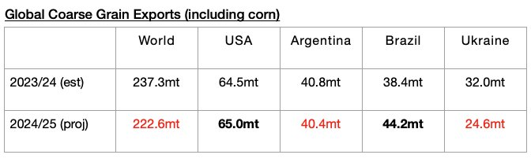

# Even Larger Global Grain Trade Contraction Expected

**Date:** March 24, 2025  
**Publisher:** Breakwave Advisors | **Category:** Market Insights  
**Original URL:** [https://www.breakwaveadvisors.com/insights/2025/3/24/even-larger-global-grain-trade-contraction-expected](https://www.breakwaveadvisors.com/insights/2025/3/24/even-larger-global-grain-trade-contraction-expected)  

---

*By*[*Jeffrey Landsberg*](https://www.linkedin.com/in/jeffrey-landsberg-70ab957/)

As we discussed in Commodore Research's most recent Weekly Executive Report, the United States Department of Agriculture (USDA) is now predicting that global coarse grain, wheat, soybean, and soymeal exports in 2024/25 will collectively total 690.6 million tons. This is 2.6 million tons less than was forecast a month ago and would mark a year-on-year decline of 19.9 million tons (-3%). Compared to the USDA’s final forecast released in 2024, this 690.6 million tons forecast is also now down by 12.3 million tons (-2%). Overall, global grain exports remaining in a year-on-year contraction (due primarily to lower harvests) has remained a large headwind for the dry bulk market, particularly for the non-capesize sectors. As we have discussed often, growth is needed considering that the entire dry bulk fleet this year remains very likely to grow by a net addition of at least 350 vessels.

The USDA is now forecasting that global coarse grain exports in 2024/25 will total 222.6 million tons. This is 3.3 million tons (-1%) less than was forecast a month ago and would mark a year-on-year decline of 14.7 million tons (-6%). Overall, coarse grain exports remain the grain market’s largest cargo by volume. A fairly large year-on-year decline in coarse grain exports from Ukraine is still expected, and a small decline is now expected from Argentina. A relatively large year-on-year increase in exports is still expected from Brazil, and a small increase is still expected from the United States.

> **Figure 1: 241**  
> [Local Asset](file:///C:/Users/Dell/Github/Shipping/corpus/03-breakwave/insights/2025/assets/2025-03-24_even-larger-global-grain-trade-contraction-expected_img_241_fc522a699d83.jpg)

---

**Tags:** Grains, Drybulk, Shipping  
