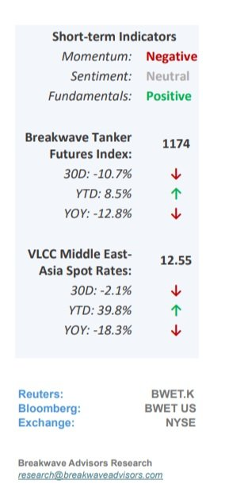
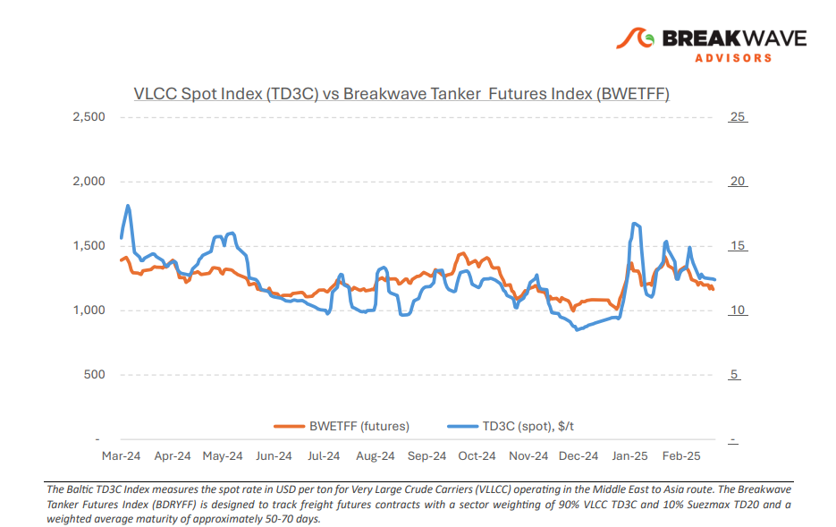
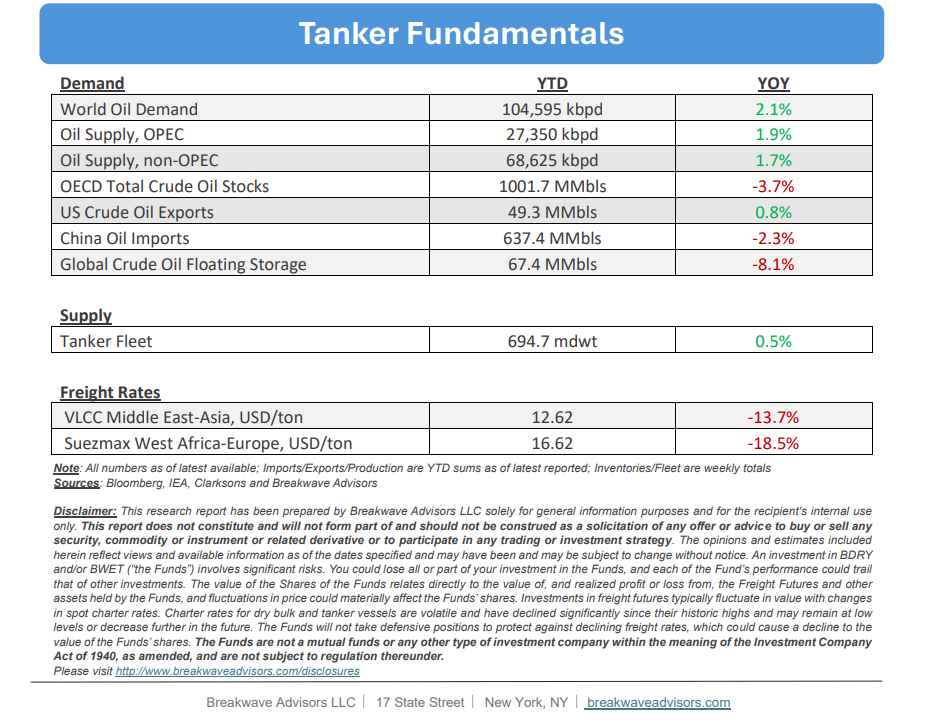

# Breakwave Bi-Weekly Tanker Report - March 25, 2025

**Date:** March 25, 2025  
**Publisher:** Breakwave Advisors | **Category:** Market Insights  
**Original URL:** [https://www.breakwaveadvisors.com/insights/2025253wetmmm85487](https://www.breakwaveadvisors.com/insights/2025253wetmmm85487)  

---

•**Positive Momentum Drives VLCC Spot Rates Higher as Tonnage Tightens**– A wave of**positive momentum**swept through the VLCC market in the Arabian Gulf, fueled by a**surge**in chartering activity for early April loadings. This spike in demand temporarily**tightened available tonnage**, allowing owners to push for higher rates. The current direction of the freight market has left**owners optimistic**, while charterers have adopted a wait-and-see approach, holding off on fresh inquiries to avoid contributing further to upward rate pressure. In**West Africa**, the VLCC market remained relatively subdued but showed signs of**bullish sentiment**, inspired by gains in the Arabian Gulf and a modest recovery in U.S. Gulf exports. Some owners opted to keep their vessels in the East, driven by uncertainty surrounding new U.S. tariffs and**potential increases in port charges**—factors that**diminished**the appeal of**repositioning**to the Atlantic basin. Looking ahead, the VLCC market is expected to remain sensitive to several macroeconomic and geopolitical drivers. Anticipated growth in China’s crude oil demand and restocking could tighten tonnage supply, potentially supporting further rate increases.**Iraq’s planned production**hike could also influence freight dynamics, depending on how this additional output is geographically distributed. Overall,**rising Chinese demand**and cautious owner strategies may continue to tighten supply, while in West Africa, a potential global supply surplus could be offset by regional dynamics and restored market confidence.

> **Figure 1: %Ce%a3%cf%84%ce%b9%ce%b3%ce%bc%ce%b9%cf%8c%cf%84%cf%85%cf%80%ce%bf+%ce%bf%ce%b8%cf%8c%ce%bd%ce%b7%cf%82+2025 03 25+082906+a**  
> [Local Asset](file:///C:/Users/Dell/Github/Shipping/corpus/03-breakwave/insights/2025/assets/2025-03-25_2025253wetmmm85487_img_25ce25a325cf258425ce25b925ce25b325ce_df22f96649ca.jpg)

•**Will the Saudis Pull Another 2015?**– With the new**Trump**administration prioritizing efforts to**lower oil**prices and thereby ease inflation from its currently elevated levels, OPEC+, and specifically Saudi Arabia, is in a**strategic position**to**reclaim market share**after an extended period of ceding ground to Western-based producers such as the United States, Guyana, Brazil, and Canada. While certain OPEC+ members continue to exceed production quotas and global oil demand projections indicate modest growth in 2025 (primarily driven by gas-derived products rather than crude oil) it is the**core OPEC producers**that stand to**lose**the most under the current market dynamics. Given the tacit approval from the new U.S. administration to drive oil prices lower, the likelihood of a scenario similar to 2015 should not be overlooked. However, this time, the**approach**may be more**discreet**, with planned increases in production targets serving as a**strategic façade**. Overall, we anticipate that Saudi Arabia will take the lead in this initiative, recognizing that its 260+ billion barrels of reserves represent its most**valuable asset.**Safeguarding these reserves and related revenues for the long term may necessitate accepting short-term price pressures, with the goal of pressuring production capacity among higher-cost Western producers.

•**Our Long-term View**– The tanker market is recovering from a long period of staggered rates as the growth in new vessel supply shrinks while oil demand remains elevated in line with the global economy. A historically low orderbook combined with favorable shifting trade patterns should continue to support increased spot rate volatility, which combined with the ongoing geopolitical turmoil, should sustain freight rates in the medium to long term.

> **Figure 2: Στιγμιότυπο Οθόνης 2025 03 25 082829**  
> [Local Asset](file:///C:/Users/Dell/Github/Shipping/corpus/03-breakwave/insights/2025/assets/2025-03-25_2025253wetmmm85487_img_cea3cf84ceb9ceb3cebcceb9cf8ccf84cf85_99d0ecfb43de.png)

> **Figure 3: Στιγμιότυπο Οθόνης 2025 03 25 082846**  
> [Local Asset](file:///C:/Users/Dell/Github/Shipping/corpus/03-breakwave/insights/2025/assets/2025-03-25_2025253wetmmm85487_img_cea3cf84ceb9ceb3cebcceb9cf8ccf84cf85_148bf81e1789.png)

### Subscribe:
