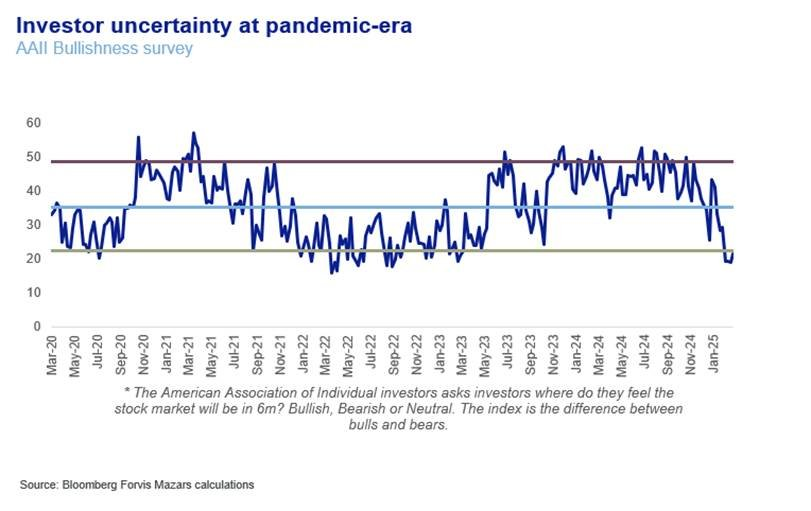
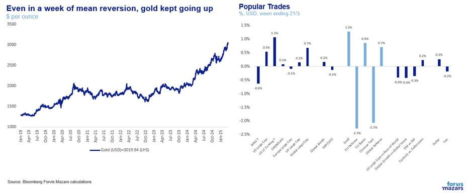
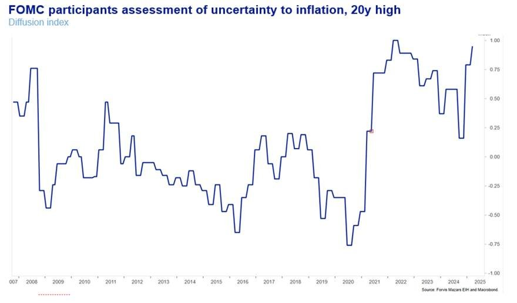
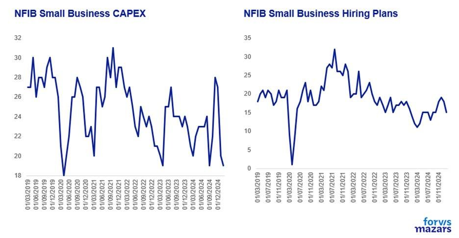
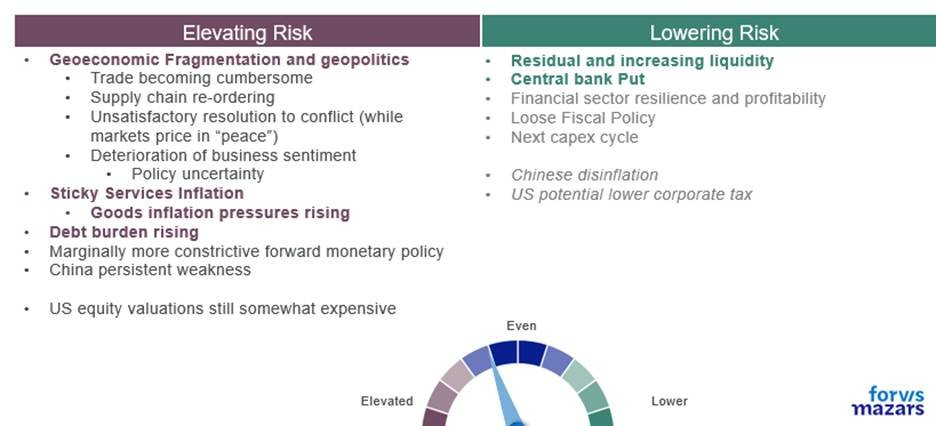

# Just how much should we be afraid?

**Date:** March 26, 2025  
**Publisher:** Breakwave Advisors | **Category:** Market Insights  
**Original URL:** [https://www.breakwaveadvisors.com/insights/2025/3/26/just-how-much-should-we-be-afraid](https://www.breakwaveadvisors.com/insights/2025/3/26/just-how-much-should-we-be-afraid)  

---

The three things investors should know about this week

1. Some risk asset mean reversion happened last week, but gold outperformance and Mag 7 underperformance suggest that investor uncertainty persists.
2. Looking at the market, investors, businesses and consumers are all increasingly uncertainty.
3. Weighing all the data, pros and cons, we do consider risks somewhat elevated, however we feel that, despite appearances, financial and economic risks for the time being remain manageable.

*By*[*George Lagarias*](https://www.linkedin.com/in/george-lagarias-mba-3baa769/)

### --------------------------------

### Summary

What is certain is that uncertainty is prevalent in consumers, businesses, investors and governments. British Businesses express more optimism in various surveys, but they're still at a cliff edge ahead of this week’s Spring Budget. The question you ask is “Am I right to be worried?”.

Increasing risk is

- Geoeconomic fragmentation, trade wars and policy uncertainty
- Sticky services inflation
- High debt burdens
- Growth concerns

However, we should not ignore factors decreasing risk either

- Central banks will likely continue to support markets in the event of a crash
- Economies and markets remain liquid
- The financial sector is resilient and may benefit from deregulation
- Capital expenditure will likely increase especially in Energy, AI, Defence.

### Next Week

Next week is really about two numbers out on Friday: Core Personal Consumption Expenditure (the Fed’s preferred gauge of inflation) and the University of Michigan longer term Inflation expectations which jumped last month to 30-year highs. Markets will be closely looking at these to see where the Fed’s rate risks lie, and whether the upcoming inflation bump will indeed be… transitory.

------------------

Continuing from where we left off two weeks ago ([what is the price of uncertainty](https://www.forvismazars.com/uk/en/insights/latest-economic-market-and-investment-news/what-s-the-price-of-uncertainty)), just how much should we be afraid? This seems to be the question on every investor’s, business owner’s and consumer’s lips. On an hourly basis, everyone in the globe with a smartphone is inundated with analyses which suggest how wrong (or right) all of what has been happening since President Trump’s inauguration on 21st of January can go.

The world is changing fast, to be sure, but just how much of this will affect businesses, portfolios and consumption? Are we looking at a complete overhaul of the global post-WWII order, or a particularly disorderly period of egg-breaking (without which it is universally known one can’t possibly make an omelette), with uncertain outcomes?

What is certain is that uncertainty is prevalent.

Investors are uncertain and pandemic-era bearish.

> **Figure 1: Market Chart 1**  
> [Local Asset](file:///C:/Users/Dell/Github/Shipping/corpus/03-breakwave/insights/2025/assets/2025-03-26_just-how-much-should-we-be-afraid_img_image006_58ab2ace5cc8.jpg)

Portfolio managers are increasing their cash allocations and decreasing their US equity exposure at the fastest pace in a long time.

It is interesting that a week which saw some mean reversion (equities bouncing, German Bund yields falling, Dollar rebounding, EU defence stocks losing some ground), Gold kept going up and the Magnificent 7 continued to lose ground versus the rest of the US equities. A rebound in US equities, otherwise the primary destination for international investors, didn’t happen, even as other markets mean-reverted. This suggests that investors are still on the fence.

> **Figure 2: Market Chart 2**  
> [Local Asset](file:///C:/Users/Dell/Github/Shipping/corpus/03-breakwave/insights/2025/assets/2025-03-26_just-how-much-should-we-be-afraid_img_image007_b6dcd326a0ee.jpg)

It’s not just investors that are uncertain. Policymakers and -subsequently- policy-watchers are also uncertain. Despite a well-received Fed communication this week (where markets largely focused away from the slower growth/higher inflation narrative), the US central bankers are very uncertain about inflation risks.

> **Figure 3: Market Chart 3**  
> [Local Asset](file:///C:/Users/Dell/Github/Shipping/corpus/03-breakwave/insights/2025/assets/2025-03-26_just-how-much-should-we-be-afraid_img_image008_17dd6fb66292.jpg)

Businesses are also uncertain, despite the optimism. US businesses suggest that they are not very willing to either expand or pay more for ever-harder-to-find labour.

> **Figure 4: Market Chart 4**  
> [Local Asset](file:///C:/Users/Dell/Github/Shipping/corpus/03-breakwave/insights/2025/assets/2025-03-26_just-how-much-should-we-be-afraid_img_image009_051b2663d9f1.jpg)

British Businesses express more optimism in various surveys, but they're still at a cliff edge ahead of this week’s Spring Budget.

And consumers of course are right to be worried. Despite the decent “hard data” on retail consumption across the board, “soft data” (consumer confidence surveys) suggest that they range from “reticent” to, well, scared.

But the question you ask a professional is now “Is everyone else worried”, or even “What is the marker reaction”. One can get those answers easily these days with the help of a simple AI.

The question you ask is “Am I right to be worried?”. Here, we’ll try to avoid both the panic which gets a newsletter read, and the optimism usually associated with asset management updates. Not because “the truth is always in the middle” (sometimes it’s just not), but rather because we think that we need to separate personal and political feelings from potential outcomes (not an easy task these days), to assign probabilities to risks and try to understand actual consequences.

Here is a simplified version of one of the frameworks we use to assess market and economic risks

> **Figure 5: Market Chart 5**  
> [Local Asset](file:///C:/Users/Dell/Github/Shipping/corpus/03-breakwave/insights/2025/assets/2025-03-26_just-how-much-should-we-be-afraid_img_image010_6dde9d267712.jpg)

### What Raises Risk

There are plenty of factors elevating risk. Geoeconomic fragmentation and geopolitics make trade cumbersome, require whole supply chains to be reordered, hurt business sentiment and, inescapably increase policy uncertainty. Central banks are now a bit more constrictive than they were a few months ago, and possibly more worried about macroeconomic instability and possible inflation than they say (coming from a policymaker, inflation expectations can become a self-fulfilling prophecy). The two major conflicts which further increase risk, may seem closer to a conclusion, but they have been drawn out for long enough to make the peace process very thorny.

Meanwhile, services inflation remains sticky, and goods inflation is possibly on the rise.

The Chinese economy, the world’s second-largest, has yet to show ample signs of recovery from its real estate crash and is probably slowing the world down more than it’s contributing to an economic acceleration.

And despite the correction, US equity valuations are still somewhat elevated, so no big buying opportunities that could uplift sentiment.

BUT…there are also mitigating factors which fear is easy to expunge from thought.

### What Reduces Risk

The most important is that the “Central Bank Put”, a promise of policy intervention of things begin to go South is very much alive. The last time markets needed the central bank “Bazooka” (a term for money printing) was in 2023, when US peripheral banks were threatened with bank runs. The Fed obliged and although it was reducing the size of its balance sheet (i.e. the money in circulation) and raising interest rates, it didn’t hesitate to print c. $300bn in a few days to make sure things didn’t get out of hand. Similarly, the European Central Bank, which bears the additional burden of supporting the common currency, doesn’t seem to be willing to let risks derail the Eurozone economy. Simply put, whatever the financial and economic risks, under the right circumstances central banks provide a safety net, even if some losses will be required to activate it. That “Put” has been a strong enough argument to almost solely carry the global economy towards a sustainable rebound in the years after the Global Financial Crisis.

And despite some policy reservations, the market, today, is very liquid. Money supply is on the rise across all fronts.

Additionally, the financial sector remains healthy and profitable (always a good sign for the economy) and deregulation could provide medium-term boosts.

China slowing down is bad for growth, but good for inflation, allowing policymakers some leeway to consider lowering rates despite their own fears of higher inflation. In terms of growth, Americans also have lower corporate taxes to look forward to.

Fiscal policy remains overall loose, and the next Capex (capital expenditure) cycle is still probably happening, possibly with a lower tilt towards sustainability and a higher tilt towards the AI and defence arms races.

### In Conclusion

There are plenty of reasons to worry, and a lot of potential bad outcomes are certainly possible. However, despite Washington’s rush towards monumental changes, there are plenty of backstops which prevent the collapse of risk asset markets and the global economy. Investors, businesses and consumers should make every effort to factor in everything and avoid the headline-grabbing panic.

---

**Tags:** Macro, Economy, Markets  
