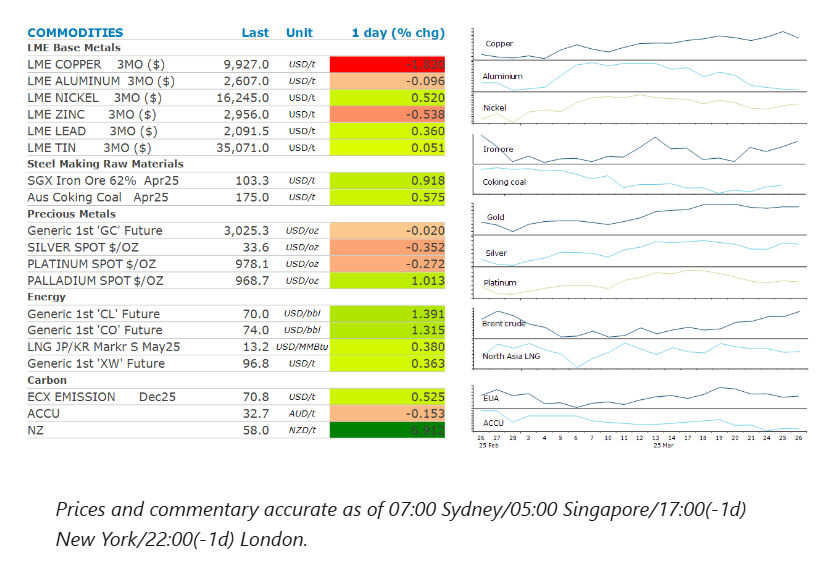
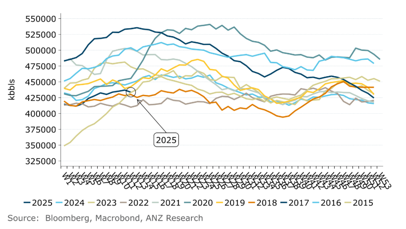

# Oil gains amid signs of stronger demand

**Date:** March 27, 2025  
**Publisher:** Breakwave Advisors | **Category:** Market Insights  
**Original URL:** [https://www.breakwaveadvisors.com/insights/2025/3/27/oil-gains-amid-signs-of-stronger-demand](https://www.breakwaveadvisors.com/insights/2025/3/27/oil-gains-amid-signs-of-stronger-demand)  

---

The changing geopolitical landscape continues to keep volatility high in commodity markets. Oil prices gained amid signs of stronger demand. Metals edged lower.

*By*[*Daniel Hynes*](https://www.linkedin.com/in/dahynes/)

> **Figure 1: Στιγμιότυπο Οθόνης 2025 03 27 124731**  
> **Interactive Data & Source:** [Linkedin](https://www.linkedin.com/newsletters/commodities-wrap-6692196755876012032/?fbclid=IwAR3kiXJqZdxmp9ZcRwBNI7FsBySI-XSC0pfPur1qzjt7OZp7PTE59Tsl1QI) | [Local Asset](file:///C:/Users/Dell/Github/Shipping/corpus/03-breakwave/insights/2025/assets/2025-03-27_oil-gains-amid-signs-of-stronger-demand_img_cea3cf84ceb9ceb3cebcceb9cf8ccf84cf85_0a4b2ddb09a1.png)

### Market Commentary

**Crude oil**prices gained amid signs of strong demand. US crude oil inventories fell by 3.34mbbls last week and now sit at the lowest levels in about a month. Moreover, product fuel inventories also fell. Distillate stockpiles dropped 421kbbls while gasoline was down 1446kbbls. This comes as traders become increasingly concerned about near term tightness in the physical market. The Trump administration has recently placed additional sanctions on Chinese buyers and shippers of Iranian oil. The White House also removed Chevron’s licence to operate and export oil from Venezuela. Trump warned that any nation purchasing oil and natural gas from Venezuela could be slapped with 25% tariffs. Even so, a sober mood at an industry conference suggested the risks aren’t all skewed one way. Rising supplies, particularly from outside the OPEC+ alliance would likely keep a lid on prices. The outlook is also likely to be impacted by trade tariffs and sanctions.

**European gas**extended losses due to ample supplies of LNG and warmer weather. Monthly imports of LNG into northwest Europe are set to jump more than 25% y/y, according to Bloomberg ship tracking data. Lower demand from China may be fuelling the increased availability of cargo. Chinese traders have been active in redirecting cargo into the European market in recent weeks. European prices found some support late in the session after Russia suggested the Sudzha cross-border gas point would require lengthy repairs.**North Asian LNG**prices managed to eke out a small gain despite Chinese buyers rapidly cutting back on seaborne imports. Buyers from smaller nations remain active in the spot market.

**Copper**prices in New York surged higher following reports that US tariffs on copper imports could be coming in several weeks, months earlier than the deadline for a decision. Earlier this month, Trump directed the Commerce Department to investigate dumping of copper in the US and report within 270 days. He has threatened to impose a duty of 25% on all copper imports. The planned levies are part of a broader effort to boost domestic production of critical minerals, following emergency measures introduced last week to fast-track the development of new mining projects. While US copper prices surged, London Metals Exchange contracts fell as a stronger USD weakened investor appetite. This saw the spread between Comex and LME prices widen. The market is also dealing with renewed supply side issues.

**Gold**steadied near a record high amid tariff uncertainty. This is despite easing geopolitical tensions. Earlier this week the US announced that Russia and Ukraine had reached a ceasefire deal in the Black Sea. However, the rapidly changing geopolitical landscape is likely to keep investors nervous.

### Chart of the Day

US crude oil inventories remain near seasonal lows amid strong demand and ongoing supply tightness. This should provide some support to prices in the near term.

> **Figure 2: Στιγμιότυπο Οθόνης 2025 03 27 124847**  
> **Interactive Data & Source:** [Linkedin](https://www.linkedin.com/newsletters/commodities-wrap-6692196755876012032/?fbclid=IwAR3kiXJqZdxmp9ZcRwBNI7FsBySI-XSC0pfPur1qzjt7OZp7PTE59Tsl1QI) | [Local Asset](file:///C:/Users/Dell/Github/Shipping/corpus/03-breakwave/insights/2025/assets/2025-03-27_oil-gains-amid-signs-of-stronger-demand_img_cea3cf84ceb9ceb3cebcceb9cf8ccf84cf85_2ba2eb417984.png)

Data source:[Commodities Wrap](https://www.linkedin.com/newsletters/commodities-wrap-6692196755876012032/?fbclid=IwAR3kiXJqZdxmp9ZcRwBNI7FsBySI-XSC0pfPur1qzjt7OZp7PTE59Tsl1QI)

---

**Tags:** Commodities, Markets, Shipping  
