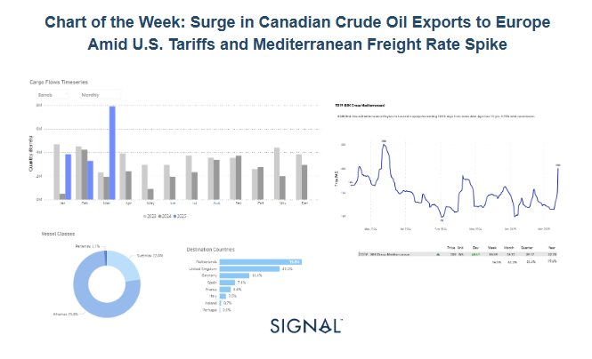
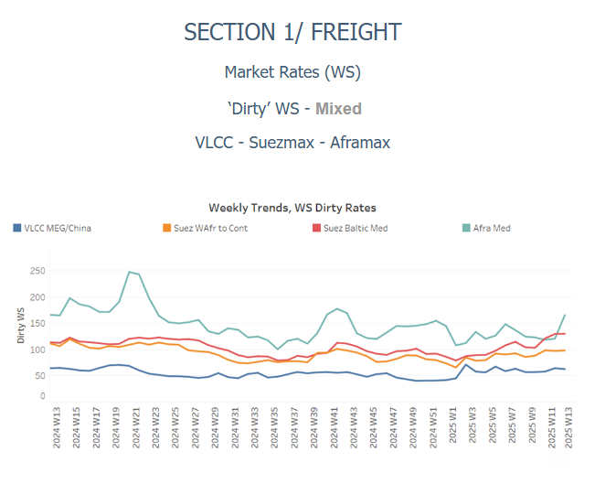
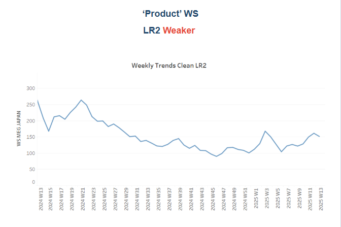
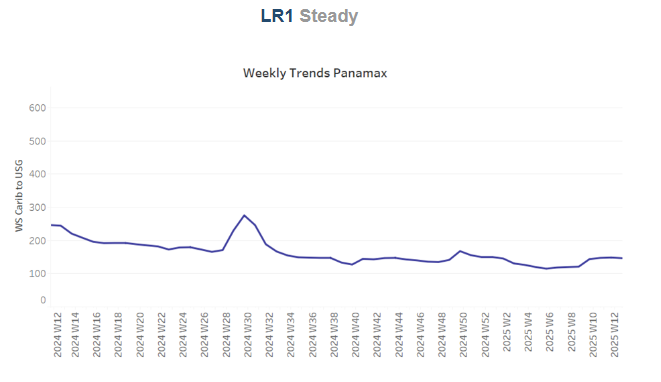
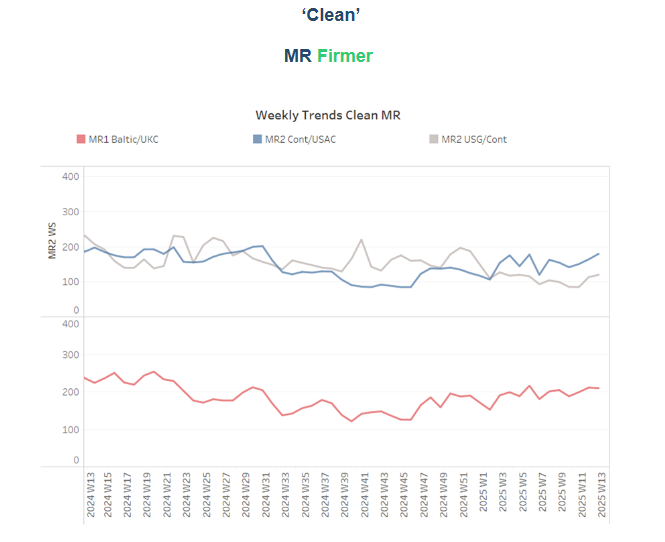
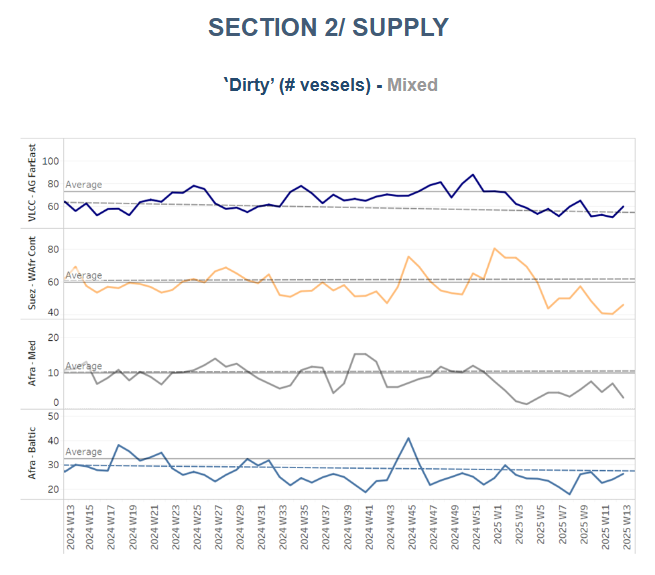
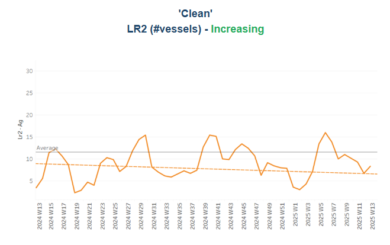
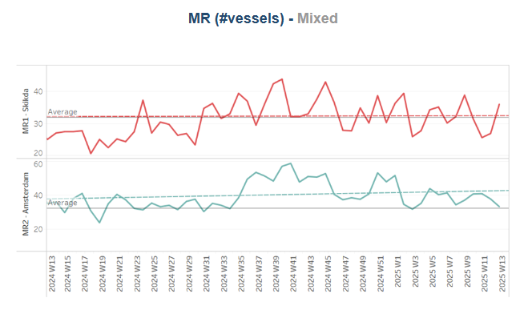
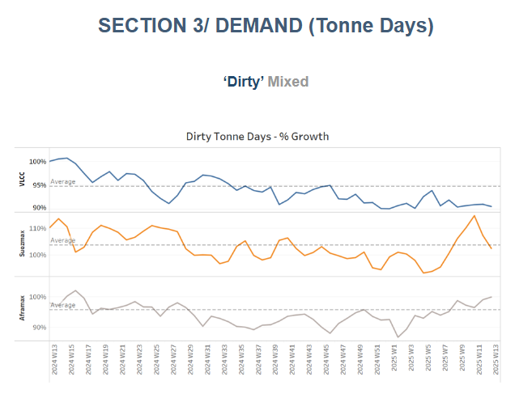
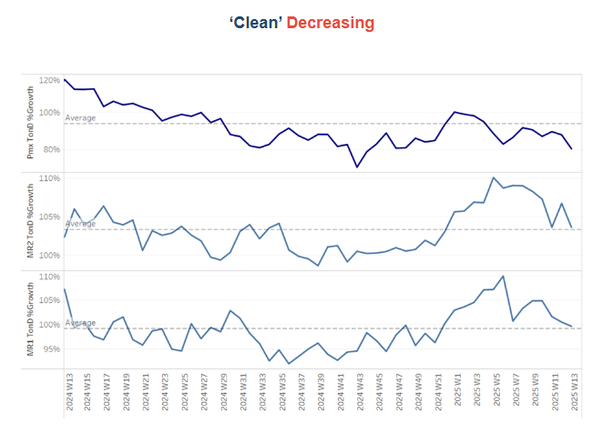

# Surge in Canadian Crude Oil Exports to Europe

**Date:** March 28, 2025  
**Publisher:** Breakwave Advisors | **Category:** Market Insights  
**Original URL:** [https://www.breakwaveadvisors.com/insights/2025/3/28/surge-in-canadian-crude-oil-exports-to-europe](https://www.breakwaveadvisors.com/insights/2025/3/28/surge-in-canadian-crude-oil-exports-to-europe)  

---

### Tanker - Weekly Market Monitor

Snapshot of Crude and Product Freight Rates, Supply-Demand

Week 13, 27 March, 2025

> **Figure 1: Στιγμιότυπο Οθόνης 2025 03 28 142039**  
> **Interactive Data & Source:** [Signal Ocean Platform](https://www.thesignalgroup.com/signal-ocean-platform) | [Local Asset](file:///C:/Users/Dell/Github/Shipping/corpus/03-breakwave/insights/2025/assets/2025-03-28_surge-in-canadian-crude-oil-exports-to-europe_img_cea3cf84ceb9ceb3cebcceb9cf8ccf84cf85_6e75421f5453.png)

**Following the recent imposition of U.S. tariffs on Canadian crude oil imports, trade flows have undergone a significant shift, with Canadian barrels increasingly redirected toward European markets. This trend is evident in the March 2025 data, which shows seaborne crude exports from Canada surging to nearly 8 million barrels—more than double the monthly average recorded in 2024.**

The new tariffs have severely eroded the competitiveness of Canadian crude in the U.S., compelling exporters to seek alternative outlets. European refiners—grappling with tight supply due to instability in traditional sourcing regions and a seasonal rise in demand—have stepped in to absorb the redirected volumes. Notably, the Netherlands and the United Kingdom together accounted for approximately 69% of European imports, reinforcing Northwest Europe’s role as a key receiving hub.

This realignment has not only reshaped transatlantic trade routes but has also had immediate repercussions in the tanker market, particularly in the Mediterranean. The TD19 route (80K Cross-Mediterranean) witnessed a sharp rate rebound, climbing from sub-150 WS levels in early March to 200 WS in the latest assessments. This translates to a daily jump of over 48 WS points and a weekly gain of 85.39 WS, fueled by tightening tonnage supply and heightened cross-Med activity.

Aframax tankers have emerged as the primary beneficiaries, accounting for 75.8% of the observed flows. Their operational flexibility and compatibility with European port infrastructure make them ideally suited for both transatlantic deliveries from Canada and subsequent intraregional redistribution across the continent.

Looking ahead, the continued enforcement of U.S. tariffs, coupled with Europe’s need for secure crude sources, suggests this trend could persist into Q2 2025. Mediterranean freight rates are also expected to remain elevated in the short term—particularly if Canadian barrels continue to displace volumes from West Africa or the Middle East.

**In summary, the interplay between geopolitical trade barriers and regional tanker market dynamics is reshaping global crude flows. As Canada reorients its exports toward Europe, the impact is rippling across cargo volumes, vessel deployment patterns, and rate structures—most notably within the Aframax segment.**

> **Figure 2: Στιγμιότυπο Οθόνης 2025 03 28 142055**  
> **Interactive Data & Source:** [Signal Ocean Platform](https://www.thesignalgroup.com/signal-ocean-platform) | [Local Asset](file:///C:/Users/Dell/Github/Shipping/corpus/03-breakwave/insights/2025/assets/2025-03-28_surge-in-canadian-crude-oil-exports-to-europe_img_cea3cf84ceb9ceb3cebcceb9cf8ccf84cf85_497a74fc0f00.png)

The final week of March brought positive momentum to the Aframax Mediterranean route, while downward pressure persisted on the VLCC front, and signs of recovery emerged on the Suezmax West Africa to Continent route.

- **VLCC**freight rates on the**MEG–China**route dropped to WS60, marking a 10% weekly decline. Suezmax rates from**West Africa**to continental Europe maintained their momentum above WS100, reflecting a 20% increase month-on-month. Meanwhile, Suezmax rates on the Baltic–Mediterranean route held steady at WS130, in line with the previous week and up 30% compared to last month.
- **Aframax**freight rates in the**Mediterranean**surged to WS200, continuing their recent upward trend and marking a 65% increase month-on-month.

> **Figure 3: Στιγμιότυπο Οθόνης 2025 03 28 142104**  
> **Interactive Data & Source:** [Signal Ocean Platform](https://www.thesignalgroup.com/signal-ocean-platform) | [Local Asset](file:///C:/Users/Dell/Github/Shipping/corpus/03-breakwave/insights/2025/assets/2025-03-28_surge-in-canadian-crude-oil-exports-to-europe_img_cea3cf84ceb9ceb3cebcceb9cf8ccf84cf85_b078237c48a6.png)

- **LR2**AG freight rates recorded a soft downward trend with rates at WS145, reflecting a 10% weekly decrease.

> **Figure 4: Στιγμιότυπο Οθόνης 2025 03 28 142113**  
> **Interactive Data & Source:** [Signal Ocean Platform](https://www.thesignalgroup.com/signal-ocean-platform) | [Local Asset](file:///C:/Users/Dell/Github/Shipping/corpus/03-breakwave/insights/2025/assets/2025-03-28_surge-in-canadian-crude-oil-exports-to-europe_img_cea3cf84ceb9ceb3cebcceb9cf8ccf84cf85_e50ac62152b5.png)

- **Panamax**Carib-to-USG settled at around 145 WS, which corresponds to an increase of 20 % compared to the previous month.

> **Figure 5: Στιγμιότυπο Οθόνης 2025 03 28 142121**  
> **Interactive Data & Source:** [Signal Ocean Platform](https://www.thesignalgroup.com/signal-ocean-platform) | [Local Asset](file:///C:/Users/Dell/Github/Shipping/corpus/03-breakwave/insights/2025/assets/2025-03-28_surge-in-canadian-crude-oil-exports-to-europe_img_cea3cf84ceb9ceb3cebcceb9cf8ccf84cf85_91f4649d2cf3.png)

- **MR1**freight rates for Baltic-to-Continent shipments hovered around WS210, holding the same firmness as the previous week.

- **MR2**freight rates for shipments from the**Continent to the US Atlantic Coast (USAC)**reached WS190, reflecting a 19% weekly increase. Meanwhile,**MR2**rates on the US Gulf–to–Continent route rose to WS130, marking a 20% gain month-on-month.

> **Figure 6: Στιγμιότυπο Οθόνης 2025 03 28 142132**  
> **Interactive Data & Source:** [Signal Ocean Platform](https://www.thesignalgroup.com/signal-ocean-platform) | [Local Asset](file:///C:/Users/Dell/Github/Shipping/corpus/03-breakwave/insights/2025/assets/2025-03-28_surge-in-canadian-crude-oil-exports-to-europe_img_cea3cf84ceb9ceb3cebcceb9cf8ccf84cf85_c3d86ee3e057.png)

​​​​​The number of available crude tankers remains below the yearly average, though signs of a modest increase are now emerging in the VLCC and Suezmax segments.

- **VLCC Ras Tanura**: The current number of ships is around 60. This is eight more than last week, but 12 less than the yearly average.
- **Suezmax Wafr**: The number of ships is currently around 46, 6 more than the previous week and 34 less than the peak at the end of last year.
- **Aframax Med**: The final days of March indicated a downward trend, as the number of ships remained below the annual benchmark of 10.
- **Aframax Baltic**: The ship count stood at approximately 26, nearly 15 below the peak recorded at the end of week 45 and below the yearly average of 30.

> **Figure 7: Στιγμιότυπο Οθόνης 2025 03 28 142142**  
> **Interactive Data & Source:** [Signal Ocean Platform](https://www.thesignalgroup.com/signal-ocean-platform) | [Local Asset](file:///C:/Users/Dell/Github/Shipping/corpus/03-breakwave/insights/2025/assets/2025-03-28_surge-in-canadian-crude-oil-exports-to-europe_img_cea3cf84ceb9ceb3cebcceb9cf8ccf84cf85_2e4eb7f4c1e7.png)

> **Figure 8: Στιγμιότυπο Οθόνης 2025 03 28 142149**  
> **Interactive Data & Source:** [Signal Ocean Platform](https://www.thesignalgroup.com/signal-ocean-platform) | [Local Asset](file:///C:/Users/Dell/Github/Shipping/corpus/03-breakwave/insights/2025/assets/2025-03-28_surge-in-canadian-crude-oil-exports-to-europe_img_cea3cf84ceb9ceb3cebcceb9cf8ccf84cf85_6967d450bf4c.png)

- **Clean LR2 AG Jubail**: The downward trend persists, with soft signs of an increase and the vessel count remaining below the annual average of 11 over the last seven weeks.

- **Clean MR**: Algeria’s Skikda port experienced a sudden uptick in ship activity, with MR1 vessel calls rising to 36—just three below the peak recorded in Week 8. Meanwhile, MR2 activity in Amsterdam declined to the annual average of 32, continuing a downward trend over the past three weeks.

> **Figure 9: Στιγμιότυπο Οθόνης 2025 03 28 142202**  
> **Interactive Data & Source:** [Signal Ocean Platform](https://www.thesignalgroup.com/signal-ocean-platform) | [Local Asset](file:///C:/Users/Dell/Github/Shipping/corpus/03-breakwave/insights/2025/assets/2025-03-28_surge-in-canadian-crude-oil-exports-to-europe_img_cea3cf84ceb9ceb3cebcceb9cf8ccf84cf85_8b1c37f72813.png)

- **Dirty**tonne days: The final week of March appears to shift the positive momentum from the Suezmax segment towards the Aframax. This marks the first recorded increase in the growth of Aframax tonne days since the year began, now surpassing the annual average. Meanwhile, in the VLCC segment, the decline in growth continues, and there is a notable downward revision in the growth of Suezmax tonne days.

> **Figure 10: Στιγμιότυπο Οθόνης 2025 03 28 142210**  
> **Interactive Data & Source:** [Signal Ocean Platform](https://www.thesignalgroup.com/signal-ocean-platform) | [Local Asset](file:///C:/Users/Dell/Github/Shipping/corpus/03-breakwave/insights/2025/assets/2025-03-28_surge-in-canadian-crude-oil-exports-to-europe_img_cea3cf84ceb9ceb3cebcceb9cf8ccf84cf85_66bfffd9b3d3.png)

- **Panamax**tonne days: The growth rate remains below this year's weekly average, with the downward trend persisting throughout March.

- **MR**tonne-days: The growth rate of the MR segment continues to decline, though it remains above the annual average, despite indications last week that it might dip below. The previous peak was observed at the end of Week 5.

Data Source:[Signal Ocean Platform](https://www.thesignalgroup.com/signal-ocean-platform)

---

**Tags:** Tankers, Crude, Markets  
