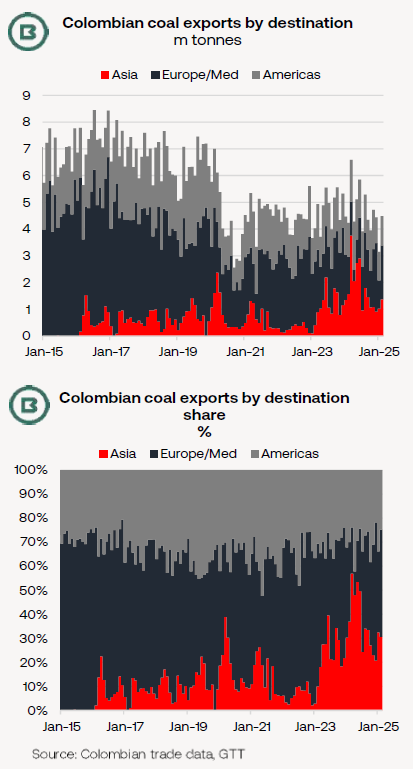
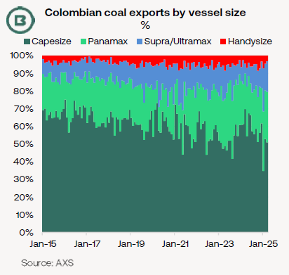

# The Big Picture: Colombian coal exports and the prospects for fronthaul trade

**Date:** March 28, 2025  
**Publisher:** Breakwave Advisors | **Category:** Market Insights  
**Original URL:** [https://www.breakwaveadvisors.com/insights/2025/3/28/the-big-picture-colombian-coal-exports-and-the-prospects-for-fronthaul-trade](https://www.breakwaveadvisors.com/insights/2025/3/28/the-big-picture-colombian-coal-exports-and-the-prospects-for-fronthaul-trade)  

---

·*Changes to Colombian coal export destinations tell us much about the evolving state of global demand for thermal coal.*

·*Following the reduction in European thermal coal buying, Asia’s emergence as a key market for Colombian coal exporters means the recent slide in Asian thermal coal prices has had a profound effect.*

·*Announced coal production cuts in Colombia seem likely to thin cargo volumes on one of the key Capesize fronthaul trades to Asia.*

The charts, below, outline increases in both volume and share of Colombian coal shipped into Asia.

The monthly flow into Asia has varied, determined by comparative cost advantages plus other factors, but the reduction in buying appetite from Europe resulted in the share into Asia exceeding 50% on several occasions last year.

Since then, thermal coal price declines in Asia (particularly noticeable over the last four months) have been less advantageous to Colombian exporters.

> **Figure 1: Bdbd Image 0 1743096197949**  
> [Local Asset](file:///C:/Users/Dell/Github/Shipping/corpus/03-breakwave/insights/2025/assets/2025-03-28_the-big-picture-colombian-coal-exports-and-the-prospects-for-fronthaul-trade_img_bdbd-image-0-1743096197949_91b888e7ae08.png)

A year ago, the Colombian 6,000kc thermal coal FOB price enjoyed a discount to its Australian equivalent of more than $30/t. This week that discount had been squeezed to around $5/t.

With Capesize freight from Colombia to North China at $34-35/t at time of writing, and the Newcastle to North China equivalent at $13.50/t, the current freight disadvantage for Colombian coal delivered into China is clear.

Against this background, coal production cuts were announced this week at one of Colombia’s two largest producers, Cerrejon. Judging by the company statement, annual coal output at Cerrejon will be cut by 5-10m tonnes, which would leave this year’s total at 11-16m tonnes.

For comparison, Colombia exported 57.5m tonnes of coal in 2024.

In addition, Colombia’s coal miners face a 1% tax on coal production, which has been extended until the end of 2025.

Bellow, we used vessel tracking data from AXS to construct a vessel size profile for Colombia’s coal trades.

As commented above, the trades to Asia have formed a significant fronthaul trade for Capesizes. Indeed, the surge in 2023-24 shown in the two charts on page 1 can be seen in the chart showing vessel sizes, below.

However, the 2023/24 surge in the Capesize share is less obvious on this chart due to the longer-term trend of decline since 2015.

As shipments into Europe in 2015-21 were 80-90% Capes, the weakening appetite for coal from the continent has helped lower Capesize involvement in Colombia’s coal trades.

> **Figure 2: F460 Image 1 1743096241411**  
> [Local Asset](file:///C:/Users/Dell/Github/Shipping/corpus/03-breakwave/insights/2025/assets/2025-03-28_the-big-picture-colombian-coal-exports-and-the-prospects-for-fronthaul-trade_img_f460-image-1-1743096241411_2417cceae33a.png)

---

**Tags:** Coal, Drybulk, Shipping  
